# Alert Troubleshooting with Netdata Assistant

**The Netdata Assistant leverages large language models and community knowledge** to simplify alert troubleshooting and root cause analysis.

This AI-powered tool helps you understand alerts quickly, **especially during critical situations**.

| Feature                   | Benefit                                                                                                               |
|---------------------------|-----------------------------------------------------------------------------------------------------------------------|
| **Follows Your Workflow** | The Assistant window stays with you as you navigate through Netdata dashboards during your troubleshooting process.   |
| **Works at Any Hour**     | Especially valuable during after-hours emergencies when you might not have team support available.                    |
| **Contextual Knowledge**  | Combines Netdata's community expertise with the power of large language models to provide relevant advice.            |
| **Time-Saving**           | Eliminates the need for searches across multiple documentation sources or community forums.                           |
| **Non-Intrusive**         | Provides helpful guidance without taking control away from you - you remain in charge of the troubleshooting process. |

## Using Netdata Assistant

<strong>Accessing the Assistant</strong>
 

1. Navigate to the **Alerts** tab.
2. If there are active alerts, the **Actions** column will have an **Assistant** button.

   

3. Click the **Assistant** button to open a floating window with tailored troubleshooting insights.

4. If there are no active alerts, you can still access the Assistant from the **Alert Configuration** view.

<strong>Understanding Assistant Information</strong>
 

When you open the Assistant, you'll see:

1. **Alert Context**: Explanation of what the alert means and why it's occurring

   

2. **Troubleshooting Steps**: Recommended actions to address the issue

3. **Importance Level**: Context on how critical this alert is for your system

4. **Resource Links**: Curated documentation and external resources for further investigation

   

## How Netdata Assistant Helps You

:::tip

Netdata Assistant is designed to reduce your troubleshooting time by providing contextual information exactly when you need it.

:::

<strong>🔍 Immediate Alert Context</strong> - Get explanations of what alerts mean without searching online

<strong>⚠️ Impact Assessment</strong> - Understand why the alert matters to your system's health

<strong>🛠️ Guided Troubleshooting</strong> - Receive customized steps for your specific situation

<strong>📚 Curated Resources</strong> - Access relevant documentation for deeper investigation

<strong>🔄 Persistent Assistance</strong> - Keep the Assistant window with you throughout your troubleshooting journey

## Practical Example

Here's how Netdata Assistant can help in a real-world scenario:

```mermaid
flowchart LR
    %% Node styling
    classDef neutral fill:#f9f9f9,stroke:#000000,color:#000000,stroke-width:2px
    classDef success fill:#4caf50,stroke:#000000,color:#000000,stroke-width:2px
    classDef warning fill:#ffeb3b,stroke:#000000,color:#000000,stroke-width:2px
    classDef danger fill:#f44336,stroke:#000000,color:#000000,stroke-width:2px
    
    A["🕒 3 AM Alert<br/>load average 15"] --> B["Without Assistant:<br/>🔍 Google searches"]
    A --> C["With Assistant:<br/>🤖 Click Assistant button"]
    
    B --> D["🕰️ Time wasted<br/>Stress increased"]
    
    subgraph AssistantProcess ["Assistant Process"]
        direction LR
        E["📊 Explanation of<br/>system load cause"] --> F["🛠️ Specific troubleshooting<br/>steps provided"] --> G["🔄 Assistant follows as<br/>you check metrics"] --> H["📚 Quick access to<br/>additional resources"] --> I["⚡ Issue resolved faster<br/>with confidence"]
    end
    
    C --> E
    
    %% Apply styles
    class A,B,D danger
    class C,E,F,G,H,I success
```

By using Netdata Assistant, you can resolve issues faster and with more confidence, even during stressful situations.
