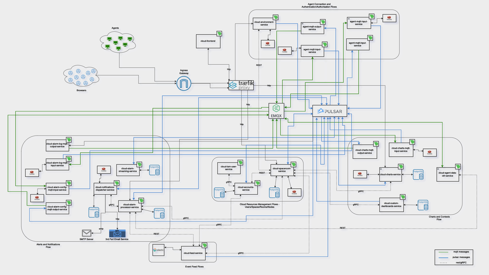

# Getting started with Netdata Cloud On-Prem
Helm charts are designed for Kubernetes to run as the local equivalent of the Netdata Cloud public offering. This means that no data is sent outside of your cluster. By default, On-Prem installation is trying to reach outside resources only when pulling the container images.
There are 2 helm charts in total:
- netdata-cloud-onprem - installs onprem itself.
- netdata-cloud-dependency - installs all necessary dependency applications. Not for production use, PoC only.

## Requirements
#### Install host:
- [AWS CLI](https://docs.aws.amazon.com/cli/latest/userguide/getting-started-install.html)
- [Helm](https://helm.sh/docs/intro/install/) version 3.12+ with OCI Configuration (explained in the installation section)
- [Kubectl](https://kubernetes.io/docs/tasks/tools/)

#### Kubernetes requirements:
- Kubernetes cluster version 1.23+
- Kubernetes metrics server (For autoscaling)
- TLS certificate for Netdata Cloud On-Prem. A single endpoint is required but there is an option to split the frontend, api, and mqtt endpoints. The certificate must be trusted by all entities connecting to the On-Prem installation by any means.
- Ingress controller to support HTTPS `*`
- PostgreSQL version 13.7 `*` (Main persistent data app)
- EMQX version 5.11 `*` (MQTT Broker that allows Agents to send messages to the On-Prem Cloud)
- Apache Pulsar version 2.10+ `*` (Central communication hub. Applications exchange messages through Pulsar)
- Traefik version 2.7.x `*` (Internal communication - API Gateway)
- Elasticsearch version 8.8.x `*` (Holds Feed)
- Redis version 6.2 `*` (Cache)
- Some form of generating imagePullSecret `*` (Our ECR repos are secured)
- Default storage class configured and working (Persistent volumes based on SSDs are preferred)
`*` - available in dependencies helm chart for PoC applications.

#### Hardware requirements:
##### How we tested it:
- Several VMs on the AWS EC2, the size of the instance was c6a.32xlarge (128CPUs / 256GiB memory).
- Host system - Ubuntu 22.04.
- Each VM hosts 200 Agent nodes as docker containers.
- Agents are connected directly to the Netdata Cloud On-Prem (no Parent-Child relationships). This is the worst option for the cloud.
- Cloud hosted on 1 Kubernetes node c6a.8xlarge (32CPUs / 64GiB memory).
- Dependencies were also installed on the same node.
The maximum of nodes connected was ~2000.

##### Results
There was no point in trying to connect more nodes as we are covering the PoC purposes.
- In a peak connection phase - All nodes startup were triggered in ~15 minutes:
  - Up to 60% (20 cores) CPU usage of the Kubernetes node. Top usage came from:
    - Ingress controller (we used haproxy ingress controller)
    - Postgres
    - Pulsar
    - EMQX
  Combined they were responsible for ~30-35% of CPU usage of the node.
- When all nodes connected and synchronized their state CPU usage floated between 30% and 40% - depending on what we did on the Cloud. Here top offenders were:
  - Pulsar
  - Postgres
  Combined they were responsible for ~15-20% of CPU usage of the node.
- Memory usage - 45GiB in a peak. Most of it (~20GiB) was consumed by:
  - Postgres
  - Elasticsearch
  - Pulsar

For a comparison - Netdata Cloud On-prem installation with just 100 nodes connected, without dependencies is going to consume ~2CPUs and ~2GiB of memory (REAL usage, not requests on a Kubernetes).

## Pulling the helm chart
The helm chart for the Netdata Cloud On-Prem installation on Kubernetes is available in the ECR registry.
The ECR registry is private, so you need to log in first. Credentials are sent by our Product Team. If you do not have them, please contact our Product Team - info@netdata.cloud.

#### Configure AWS CLI
The machine used for helm chart installation will also need [AWS CLI installed](https://docs.aws.amazon.com/cli/latest/userguide/getting-started-install.html).
There are 2 options for configuring `aws cli` to work with the provided credentials. The first one is to set the environment variables:
```bash
export AWS_ACCESS_KEY_ID=<your_secret_id>
export AWS_SECRET_ACCESS_KEY=<your_secret_key>
```

The second one is to use an interactive shell:
```bash
aws configure
```

#### Configure helm to use secured ECR repository
Using `aws` command we will generate a token for helm to access the secured ECR repository:
```bash
aws ecr get-login-password --region us-east-1 | helm registry login --username AWS --password-stdin 362923047827.dkr.ecr.us-east-1.amazonaws.com/netdata-cloud-onprem
```

After this step you should be able to add the repository to your helm or just pull the helm chart:
```bash
helm pull oci://362923047827.dkr.ecr.us-east-1.amazonaws.com/netdata-cloud-dependency --untar #optional
helm pull oci://362923047827.dkr.ecr.us-east-1.amazonaws.com/netdata-cloud-onprem --untar
```

Local folders with the newest versions of helm charts should appear on your working dir.

## Installation

Netdata provides access to two helm charts:
1. netdata-cloud-dependency - required applications for netdata-cloud-onprem. Not for production use.
2. netdata-cloud-onprem - the application itself + provisioning

### netdata-cloud-dependency
The entire helm chart is designed around the idea that it allows the installation of the necessary applications:
- Redis
- Elasticsearch
- EMQX
- Apache Pulsar
- PostgreSQL
- Traefik
- Mailcatcher
- k8s-ecr-login-renew
- kubernetes-ingress

Every configuration option is available through `values.yaml` in the folder that contains your netdata-cloud-dependency helm chart. All configuration options are described in README.md which is a part of the helm chart. It is enough to mention here that each component can be enabled/disabled individually. It is done by true/false switches in `values.yaml`. In this way, it is easier for the user to migrate to production-grade components gradually.

Unless you prefer a different solution to the problem, `k8s-ecr-login-renew` is responsible for calling out the `AWS API` for token regeneration. This token is then injected into the secret that every node is using for authentication with secured ECR when pulling the images.
The default setting in `values.yaml` of `netdata-cloud-onprem` - `.global.imagePullSecrets` is configured to work out of the box with the dependency helm chart.

For helm chart installation - save your changes in `values.yaml` and execute:
```shell
cd [your helm chart location]
helm upgrade --wait --install netdata-cloud-dependency -n netdata-cloud --create-namespace -f values.yaml .
```

### netdata-cloud-onprem

Every configuration option is available through `values.yaml` in the folder that contains your netdata-cloud-onprem helm chart. All configuration options are described in README.md which is a part of the helm chart.

#### Installing Netdata Cloud On-Prem
```shell
cd [your helm chart location]
helm upgrade --wait --install netdata-cloud-onprem -n netdata-cloud --create-namespace -f values.yaml .
```

##### Important notes
1. Installation takes care of provisioning the resources with migration services.
1. During the first installation, a secret called the `netdata-cloud-common` is created. It contains several randomly generated entries. Deleting helm chart is not going to delete this secret, nor reinstalling the whole On-Prem, unless manually deleted by kubernetes administrator. The content of this secret is extremely relevant - strings that are contained there are essential parts of encryption. Losing or changing the data that it contains will result in data loss.

## Short description of services
#### cloud-accounts-service
Responsible for user registration & authentication. Manages user account information.
#### cloud-agent-data-ctrl-service
Forwards request from the cloud to the relevant agents. 
The requests include:
* Fetching chart metadata from the agent
* Fetching chart data from the agent
* Fetching function data from the agent
#### cloud-agent-mqtt-input-service
Forwards MQTT messages emitted by the agent related to the agent entities to the internal Pulsar broker. These include agent connection state updates.
#### cloud-agent-mqtt-output-service
Forwards Pulsar messages emitted in the cloud related to the agent entities to the MQTT broker. From there, the messages reach the relevant agent.
#### cloud-alarm-config-mqtt-input-service
Forwards MQTT messages emitted by the agent related to the alarm-config entities to the internal Pulsar broker.  These include the data for the alarm configuration as seen by the agent.
#### cloud-alarm-log-mqtt-input-service
Forwards MQTT messages emitted by the agent related to the alarm-log entities to the internal Pulsar broker. These contain data about the alarm transitions that occurred in an agent.
#### cloud-alarm-mqtt-output-service
Forwards Pulsar messages emitted in the cloud related to the alarm entities to the MQTT broker. From there, the messages reach the relevant agent.
#### cloud-alarm-processor-service
Persists latest alert statuses received from the agent in the cloud.
Aggregates alert statuses from relevant node instances.
Exposes API endpoints to fetch alert data for visualization on the cloud.
Determines if notifications need to be sent when alert statuses change and emits relevant messages to Pulsar.
Exposes API endpoints to store and return notification-silencing data.
#### cloud-alarm-streaming-service
Responsible for starting the alert stream between the agent and the cloud.
Ensures that messages are processed in the correct order, and starts a reconciliation process between the cloud and the agent if out-of-order processing occurs.
#### cloud-charts-mqtt-input-service
Forwards MQTT messages emitted by the agent related to the chart entities to the internal Pulsar broker. These include the chart metadata that is used to display relevant charts on the cloud.
#### cloud-charts-mqtt-output-service
Forwards Pulsar messages emitted in the cloud related to the charts entities to the MQTT broker. From there, the messages reach the relevant agent.
#### cloud-charts-service
Exposes API endpoints to fetch the chart metadata.
Forwards data requests via the `cloud-agent-data-ctrl-service` to the relevant agents to fetch chart data points. 
Exposes API endpoints to call various other endpoints on the agent, for instance, functions.
#### cloud-custom-dashboard-service
Exposes API endpoints to fetch and store custom dashboard data.
#### cloud-environment-service
Serves as the first contact point between the agent and the cloud. 
Returns authentication and MQTT endpoints to connecting agents.
#### cloud-feed-service
Processes incoming feed events and stores them in Elasticsearch.
Exposes API endpoints to fetch feed events from Elasticsearch.
#### cloud-frontend
Contains the on-prem cloud website. Serves static content.
#### cloud-iam-user-service
Acts as a middleware for authentication on most of the API endpoints. Validates incoming token headers, injects the relevant ones, and forwards the requests.
#### cloud-metrics-exporter
Exports various metrics from an On-Prem Cloud installation. Uses the Prometheus metric exposition format.
#### cloud-netdata-assistant
Exposes API endpoints to fetch a human-friendly explanation of various netdata configuration options, namely the alerts.
#### cloud-node-mqtt-input-service
Forwards MQTT messages emitted by the agent related to the node entities to the internal Pulsar broker. These include the node metadata as well as their connectivity state, either direct or via parents. 
#### cloud-node-mqtt-output-service
Forwards Pulsar messages emitted in the cloud related to the charts entities to the MQTT broker. From there, the messages reach the relevant agent.
#### cloud-notifications-dispatcher-service
Exposes API endpoints to handle integrations.
Handles incoming notification messages and uses the relevant channels(email, slack...) to notify relevant users.
#### cloud-spaceroom-service
Exposes API endpoints to fetch and store relations between agents, nodes, spaces, users, and rooms.
Acts as a provider of authorization for other cloud endpoints.
Exposes API endpoints to authenticate agents connecting to the cloud.

## Infrastructure Diagram



### If you have any questions or suggestions please contact the Netdata team.