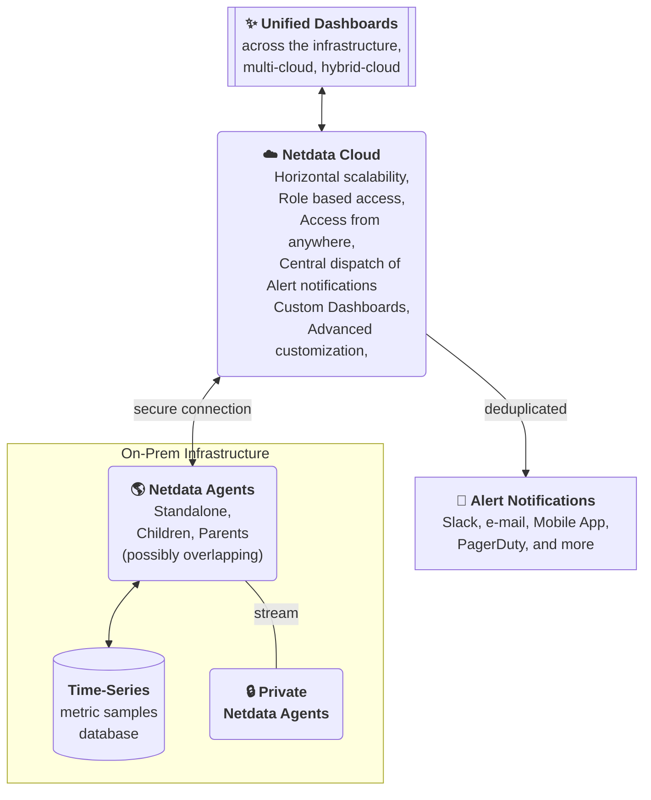

# Netdata Cloud

Netdata Cloud is a service that complements Agent installations. It is a key part in achieving optimal cost structure for large scale observability.

Technically, Netdata Cloud is a thin control plane that allows the Netdata ecosystem to virtually be an unlimited scalable and flexible observability pipeline. It can span multiple teams, cloud providers, data centers and services, while remaining a uniform and highly integrated infrastructure, providing real-time and high-fidelity insights.

The Cloud provides the following features, on top of what the Agents already provide:

| feature                                                                                                                 | description                                                                                                                                                                                                                                                                                               |
|:------------------------------------------------------------------------------------------------------------------------|:----------------------------------------------------------------------------------------------------------------------------------------------------------------------------------------------------------------------------------------------------------------------------------------------------------|
| **Horizontal scalability**                                                                                              | Your observability infrastructure can be scaled horizontally, by adding more [Parents and Children](/docs/observability-centralization-points/README.md). All can be accessed from the same [Space](/docs/netdata-cloud/organize-your-infrastructure-invite-your-team.md#spaces).                         |
| [**Role-Based Access Control (RBAC)**](/docs/netdata-cloud/authentication-and-authorization/role-based-access-model.md) | You can manage the access privileges of your team members across your Space.                                                                                                                                                                                                                              |
| **Access from anywhere**                                                                                                | The Agents are installed locally on your premises, and this is where all your data is always stored. Using the Cloud you can access these dashboards from anywhere, without setting up VPNs in order to connect to your various local dashboards.                                                         |
| **Central dispatch of Alert notifications**                                                                             | Alerts produced by Agents are centrally dispatched from the Cloud. Netdata Cloud also produces it's own Alerts and utilizes the [**Netdata Mobile App**](/integrations/cloud-notifications/integrations/netdata_mobile_app.md) in order to provide mobile push notifications for all users in paid plans. |
| [**Custom Dashboards**](/docs/dashboards-and-charts/dashboards-tab.md)                                                  | The Cloud enables creating, storing and sharing custom dashboards                                                                                                                                                                                                                                         |
| **Advanced customization**                                                                                              | Each user in a Space can customize various visualization settings, to better tailor the dashboard to their needs.                                                                                                                                                                                         |

## Stored metadata

The Cloud does not receive collected metrics, or the logs that Agents maintain.

Netdata's design deliberately avoids centralizing raw data. This prevents the common constraints of traditional observability solutions like reduced metric resolution, forced data filtering, and higher costs.

Instead, the Cloud only stores metadata such as:

- Node information and labels
- Metric names, labels, and retention periods
- Active collectors and modules
- Alert configurations and state changes

This information is a small fraction of the total information maintained by the Agents, allowing the Cloud to remain high-resolution, high-fidelity and real-time, while being able to centrally dispatch alerts and to know which Agents to query when users view the dashboards.

Metric samples and logs are transferred via the Cloud to your web browser only when you view them. Even then, no information is stored. The responses of multiple Agents are aggregated to a single response for your web browser to visualize.

## Fidelity and Resolution

As the Cloud queries the Agents, it receives exactly the same fidelity and resolution metrics that the Agents provide. Dashboards have the same resolution, the same number of metrics and exactly the same data.

## FAQ

details

### Does the Cloud require Observability Centralization Points?

No. Any or all Agents can be connected directly to the Cloud.

We recommend creating [Observability Centralization Points](/docs/observability-centralization-points/README.md), as required for operational efficiency (ephemeral nodes, teams or services isolation, central control of alerts, production systems performance), security policies (internet isolation), or cost optimization (use existing capacities before allocating new ones).

### When I have Parents, do I need to connect the Children to the Cloud too?

No, it is not necessary, but it provides high availability.

When Parents are connected to the Cloud, all their Children are available via them.

When multiple Parents store data from the same Children (in clusters or multi-level hierarchies), the Cloud queries each unique node once through a single available Parent.

The Cloud prefers:

- The most distant (from the Child) Parent that is available when doing metrics visualization queries (since usually these Parents have been added for this purpose).

- The closest (to the Child) Parent available for [Top Monitoring](/docs/top-monitoring-netdata-functions.md). The streaming protocol of Parents and Children is able to forward such requests to the leaf child, via the Parents, to respond with live and accurate data.

Children may be connected to the Cloud for high-availability, in cases where their Parents become unreachable.

