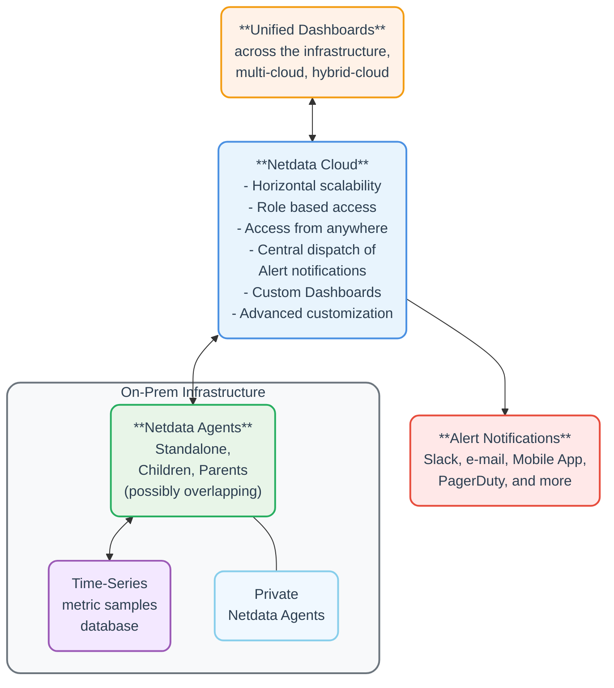

# Netdata Cloud

Netdata Cloud is a powerful service that transforms your standalone Netdata Agent installations into a unified, scalable observability solution. It achieves this without centralizing metric storage, ensuring optimal performance and cost-effectiveness even at enterprise scale.

:::info

By serving as a lightweight control plane, Netdata Cloud provides you with:

- **Seamless coordination** across multiple teams and environments
- **Unified visibility** across cloud providers and data centers
- **Real-time, high-fidelity** monitoring at any scale
- **Flexible observability** pipelines that grow with your infrastructure

:::

<strong>Click to see visual representation of the architecture</strong>
 

 

Netdata Cloud provides you with the following features, on top of what the Agents already provide:

| Feature                                                                                                                 | Description                                                                                                                                                                                                                                                               |
|:------------------------------------------------------------------------------------------------------------------------|:--------------------------------------------------------------------------------------------------------------------------------------------------------------------------------------------------------------------------------------------------------------------------|
| **Horizontal Scalability**                                                                                              | • Scale your observability infrastructure effortlessly • Add [Parents and Children](/docs/observability-centralization-points/README.md) as needed • Manage all nodes from a single [Space](/docs/netdata-cloud/organize-your-infrastructure-invite-your-team.md) |
| [**Role-Based Access Control (RBAC)**](/docs/netdata-cloud/authentication-and-authorization/role-based-access-model.md) | • Fine-grained access management • Control team member privileges across your Space • Secure, role-appropriate access to monitoring data                                                                                                                          |
| **Global Remote Access**                                                                                                | • Access your monitoring from anywhere • No VPN configuration required • Secure access to local dashboards while data stays on premises                                                                                                                           |
| **Centralized Alert Management**                                                                                        | • Unified alert dispatch from a central location • Cloud-specific alerts and monitoring • Mobile push notifications via [Netdata Mobile App](/integrations/cloud-notifications/integrations/netdata_mobile_app.md) (paid plans)                                   |
| [**Custom Dashboards**](/docs/dashboards-and-charts/dashboards-tab.md)                                                  | • Create and save custom views • Share dashboards across teams • Build focused views for specific needs                                                                                                                                                           |
| **Personal Customization**                                                                                              | • Individual user visualization preferences • Tailored dashboard experiences • Flexible viewing options for different roles                                                                                                                                       |

## Stored Metadata

Netdata Cloud doesn't store your metrics or logs.

:::info

**What Netdata Cloud Does Store:**

- Node information and labels
- Metric names, labels, and retention periods
- Active collectors
- Alert configurations and state changes

**How Data Flows:**

1. Metadata (listed above) is synchronized between Agents and Cloud
2. Metric data and logs remain stored locally on your Agents
3. When you view dashboards:
    - Data is transferred directly from Agents to your browser via Cloud
    - Cloud aggregates responses from multiple Agents into a unified view
    - No metric or log data is stored in the Cloud during this process

:::

## Fidelity and Resolution

Netdata Cloud delivers the exact same high-quality data that Agents collect. When you view dashboards through the Cloud:

- No reduction in metric resolution
- No loss of data fidelity
- No compromise in data granularity

The data you see is identical to what you would get by accessing Agents directly.

## FAQ

<strong>Does the Cloud require Observability Centralization Points?</strong>
 

No. You can connect any or all Agents directly to the Cloud.

We recommend creating [Observability Centralization Points](/docs/observability-centralization-points/README.md), as required for operational efficiency (ephemeral nodes, teams or services isolation, central control of alerts, production systems performance), security policies (internet isolation), or cost optimization (use existing capacities before allocating new ones).

 

<strong>When I have Parents, do I need to connect the Children to the Cloud too?</strong>
 

No, it is not necessary, but it provides high availability.

When Parents are connected to the Cloud, all their Children are available via them.

When multiple Parents store data from the same Children (in clusters or multi-level hierarchies), the Cloud queries each unique node once through a single available Parent.

The Cloud prefers:

- The most distant (from the Child) Parent that is available when doing metrics visualization queries (since usually these Parents have been added for this purpose).

- The closest (to the Child) Parent available for [Top Monitoring](/docs/top-monitoring-netdata-functions.md). The streaming protocol of Parents and Children is able to forward such requests to the leaf child, via the Parents, to respond with live and accurate data.

You may connect Children to the Cloud for high-availability, in cases where their Parents become unreachable.

