# Netdata Cloud

Netdata Cloud is a service that complements Netdata installations. It is a key component in achieving optimal cost structure for large scale observability.

Technically, Netdata Cloud is a thin control plane that allows the Netdata ecosystem to be a virtually unlimited scalable and flexible observability pipeline. With Netdata Cloud, this observability pipeline can span multiple teams, cloud providers, data centers and services, while remaining a uniform and highly integrated infrastructure, providing real-time and high-fidelity insights.

```mermaid
flowchart TB
    NC("<b>☁️ Netdata Cloud</b>
          access from anywhere,
          horizontal scalability,
          role based access,
          custom dashboards,
          central notifications")
    Users[["<b>✨ Unified Dashboards</b>
            across the infrastructure,
            multi-cloud, hybrid-cloud"]]
    Notifications["<b>🔔 Alert Notifications</b>
                    Slack, e-mail, Mobile App,
                    PagerDuty, and more"]
    Users <--> NC
    NC -->|deduplicated| Notifications
    subgraph On-Prem Infrastructure
        direction TB
        Agents("<b>🌎 Netdata Agents</b>
                Standalone,
                Children, Parents
                (possibly overlapping)")
        TimeSeries[("<b>Time-Series</b>
                    metric samples
                    database")]
        PrivateAgents("<b>🔒 Private
                        Netdata Agents</b>")
        Agents <--> TimeSeries
        Agents ---|stream| PrivateAgents
    end
    NC <-->|secure connection| Agents
```

Netdata Cloud provides the following features, on top of what the Netdata agents already provide:

1. **Horizontal scalability**: Netdata Cloud allows scaling the observability infrastructure horizontally, by adding more independent Netdata Parents and Children. It can aggregate such, otherwise independent, observability islands into one uniform and integrated infrastructure.

   Netdata Cloud is a fundamental component for achieving an optimal cost structure and flexibility, in structuring observability the way that is best suited for each case.

2. **Role Based Access Control (RBAC)**: Netdata Cloud has all the mechanisms for user-management and access control. It allows assigning all users a role, segmenting the infrastructure into rooms, and associating rooms with roles and users.

3. **Access from anywhere**: Netdata agents are installed on-prem and this is where all your data are always stored. Netdata Cloud allows querying all the Netdata agents (Standalone, Children and Parents) in real-time when dashboards are accessed via Netdata Cloud.

   This enables a much simpler access control, eliminating the complexities of setting up VPNs to access observability, and the bandwidth costs for centralizing all metrics to one place.

4. **Central dispatch of alert notifications**: Netdata Cloud allows controlling the dispatch of alert notifications centrally. By default, all Netdata agents (Standalone, Children and Parents) send their own notifications. This becomes increasingly complex as the infrastructure grows. So, Netdata Cloud steps in to simplify this process and provide central control of all notifications.

   Netdata Cloud also enables the use of the **Netdata Mobile App** offering mobile push notifications for all users in commercial plans.

5. **Custom Dashboards**: Netdata Cloud enables the creation, storage and sharing custom dashboards.

   Custom dashboards are created directly from the UI, without the need for learning a query language. Netdata Cloud provides all the APIs to the Netdata dashboards to store, browse and retrieve custom dashboards created by all users.

6. **Advanced Customization**: Netdata Cloud provides all the APIs for the dashboard to have different default settings per space, per room and per user, allowing administrators and users to customize the Netdata dashboards and charts the way they see fit.

## Data Exposed to Netdata Cloud

Netdata is thin layer of top of Netdata agents. It does not receive the samples collected, or the logs Netdata agents maintain.

This is a key design decision for Netdata. If we were centralizing metric samples and logs, Netdata would have the same constrains and cost structure other observability solutions have, and we would be forced to lower metrics resolution, filter out metrics and eventually increase significantly the cost of observability.

Instead, Netdata Cloud receives and stores only metadata related to the metrics collected, such as the nodes collecting metrics and their labels, the metric names, their labels and their retention, the data collection plugins and modules running, the configured alerts and their transitions.

This information is a small fraction of the total information maintained by Netdata agents, allowing Netdata Cloud to remain high-resolution, high-fidelity and real-time, while being able to:

- dispatch alerts centrally for all alert transitions.
- know which Netdata agents to query when users view the dashboards.

Metric samples and logs are transferred via Netdata Cloud to your Web Browser, only when you view them via Netdata Cloud. And even then, Netdata Cloud does not store this information. It only aggregates the responses of multiple Netdata agents to a single response for your web browser to visualize.

## High-Availability

You can subscribe to Netdata Cloud updates at the [Netdata Cloud Status](https://status.netdata.cloud/) page.

Netdata Cloud is a highly available, auto-scalable solution, however being a monitoring solution, we need to ensure dashboards are accessible during crisis.

Netdata agents provide the same dashboard Netdata Cloud provides, with the following limitations:

1. Netdata agents (Children and Parents) dashboards are limited to their databases, while on Netdata Cloud the dashboard presents the entire infrastructure, from all Netdata agents connected to it.

2. When you are not logged-in or the agent is not connected to Netdata Cloud, certain features of the Netdata agent dashboard will not be available.

   When you are logged-in and the agent is connected to Netdata Cloud, the agent dashboard has the same functionality as Netdata Cloud.

To ensure dashboard high availability, Netdata agent dashboards are available by directly accessing them, even when the connectivity between Children and Parents or Netdata Cloud faces issues. This allows the use of the individual Netdata agents' dashboards during crisis, at different levels of aggregation.

## Fidelity and Insights

Netdata Cloud queries Netdata agents, so it provides exactly the same fidelity and insights Netdata agents provide. Dashboards have the same resolution, the same number of metrics, exactly the same data.

## Performance

The Netdata agent and Netdata Cloud have similar query performance, but there are additional network latencies involved when the dashboards are viewed via Netdata Cloud.

Accessing Netdata agents on the same LAN has marginal network latency and their response time is only affected by the queries. However, accessing the same Netdata agents via Netdata Cloud has a bigger network round-trip time, that looks like this:

1. Your web browser makes a request to Netdata Cloud.
2. Netdata Cloud sends the request to your Netdata agents. If multiple Netdata agents are involved, they are queried in parallel.
3. Netdata Cloud receives their responses and aggregates them into a single response.
4. Netdata Cloud replies to your web browser.

If you are sitting on the same LAN as the Netdata agents, the latency will be 2 times the round-trip network latency between this LAN and Netdata Cloud.

However, when there are multiple Netdata agents involved, the queries will be faster compared to a monitoring solution that has one centralization point. Netdata Cloud splits each query into multiple parts and each of the Netdata agents involved will only perform a small part of the original query. So, when querying a large infrastructure, you enjoy the performance of the combined power of all your Netdata agents, which is usually quite higher than any single-centralization-point monitoring solution.

## Does Netdata Cloud require Observability Centralization Points?

No. Any or all Netdata agents can be connected to Netdata Cloud.

We recommend to create [observability centralization points](https://github.com/netdata/netdata/blob/master/docs/observability-centralization-points/README.md), as required for operational efficiency (ephemeral nodes, teams or services isolation, central control of alerts, production systems performance), security policies (internet isolation), or cost optimization (use existing capacities before allocating new ones).

We suggest to review the [Best Practices for Observability Centralization Points](https://github.com/netdata/netdata/blob/master/docs/observability-centralization-points/best-practices.md).

## When I have Netdata Parents, do I need to connect Netdata Children to Netdata Cloud too?

No, it is not needed, but it provides high-availability.

When Netdata Parents are connected to Netdata Cloud, all their Netdata Children are available, via these Parents.

When multiple Netdata Parents maintain a database for the same Netdata Children (e.g. clustered Parents, or Parents and Grandparents), Netdata Cloud is able to detect the unique nodes in an infrastructure and query each node only once, using one of the available Parents.

Netdata Cloud prefers:

- The most distant (from the Child) Parent available, when doing metrics visualization queries (since usually these Parents have been added for this purpose).

- The closest (to the Child) Parent available, for [Top Monitoring](https://github.com/netdata/netdata/blob/master/docs/top-monitoring-netdata-functions.md) (since top-monitoring provides live data, like the processes running, the list of sockets open, etc). The streaming protocol of Netdata Parents and Children is able to forward such requests to the right child, via the Parents, to respond with live and accurate data.

Netdata Children may be connected to Netdata Cloud for high-availability, in case the Netdata Parents are unreachable.
