# Netdata Cloud On-Prem

Netdata Cloud is built as microservices and is orchestrated by a Kubernetes cluster, providing a highly available and auto-scaled observability platform.

The overall architecture looks like this:

```mermaid
flowchart TD
    Agents("🌍 <b>Netdata Agents</b><br/>Users' infrastructure<br/>Netdata Children & Parents")
    users[["🔥 <b>Unified Dashboards</b><br/>Integrated Infrastructure<br/>Dashboards"]]
    ingress("🛡️ <b>Ingress Gateway</b><br/>TLS termination")
    traefik((("🔒 <b>Traefik</b><br/>Authentication &<br/>Authorization")))
    emqx(("📤 <b>EMQX</b><br/>Agents Communication<br/>Message Bus<br/>MQTT"))
    pulsar(("⚡ <b>Pulsar</b><br/>Internal Microservices<br/>Message Bus"))
    frontend("🌐 <b>Front-End</b><br/>Static Web Files")
    auth("👨‍💼 <b>Users &amp; Agents</b><br/>Authorization<br/>Microservices")
    spaceroom("🏡 <b>Spaces, Rooms,<br/>Nodes, Settings</b><br/>Microservices for<br/>managing Spaces,<br/>Rooms, Nodes and<br/>related settings")
    charts("📈 <b>Metrics & Queries</b><br/>Microservices for<br/>dispatching queries<br/>to Netdata Agents")
    alerts("🔔 <b>Alerts & Notifications</b><br/>Microservices for<br/>tracking alert<br/>transitions and<br/>deduplicating alerts")
    sql[("✨ <b>PostgreSQL</b><br/>Users, Spaces, Rooms,<br/>Agents, Nodes, Metric<br/>Names, Metrics Retention,<br/>Custom Dashboards,<br/>Settings")]
    redis[("🗒️ <b>Redis</b><br/>Caches needed<br/>by Microservices")]
    elk[("🗞️ <b>Elasticsearch</b><br/>Feed Events Database")]
    bridges("🤝 <b>Input & Output</b><br/>Microservices bridging<br/>agents to internal<br/>components")
    notifications("📢 <b>Notifications Integrations</b><br/>Dispatch alert<br/>notifications to<br/>3rd party services")
    feed("📝 <b>Feed & Events</b><br/>Microservices for<br/>managing the events feed")
    users --> ingress
    agents --> ingress
    ingress --> traefik
    ingress ==>|agents<br/>websockets| emqx
    traefik -.- auth
    traefik ==>|http| spaceroom
    traefik ==>|http| frontend
    traefik ==>|http| charts
    traefik ==>|http| alerts
    spaceroom o-...-o pulsar
    spaceroom -.- redis
    spaceroom x-..-x sql
    spaceroom -.-> feed
    charts o-.-o pulsar
    charts -.- redis
    charts x-.-x sql
    charts -..-> feed
    alerts o-.-o pulsar
    alerts -.- redis
    alerts x-.-x sql
    alerts -..-> feed
    auth o-.-o pulsar
    auth -.- redis
    auth x-.-x sql
    auth -.-> feed
    feed <--> elk
    alerts ----> notifications
    %% auth ~~~ spaceroom
    emqx <.-> bridges o-..-o pulsar
```

## Requirements

The following components are required to run Netdata Cloud On-Prem:

- **Kubernetes cluster** version 1.23+
- **Kubernetes metrics server** (for autoscaling)
- **TLS certificate** for secure connections. A single endpoint is required but there is an option to split the frontend, api, and MQTT endpoints. The certificate must be trusted by all entities connecting to it.
- Default **storage class configured and working** (persistent volumes based on SSDs are preferred)

The following 3rd party components are used, which can be pulled with the `netdata-cloud-dependency` package we provide:

- **Ingress controller** supporting HTTPS
- **PostgreSQL** version 13.7 (main database for all metadata Netdata Cloud maintains)
- **EMQX** version 5.11 (MQTT Broker that allows Agents to send messages to the On-Prem Cloud)
- **Apache Pulsar** version 2.10+ (message broken for inter-container communication)
- **Traefik** version 2.7.x (internal API Gateway)
- **Elasticsearch** version 8.8.x (stores the feed of events)
- **Redis** version 6.2 (caching)
- imagePullSecret (our ECR repos are secured)

Keep in mind though that the pulled versions are not configured properly for production use. Customers of Netdata Cloud On-Prem are expected to configure these applications according to their needs and policies for production use. Netdata Cloud On-Prem can be configured to use all these applications as a shared resource from other existing production installations.
