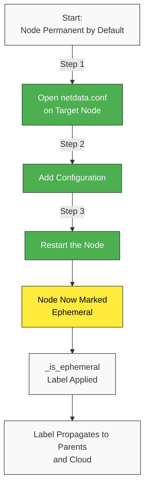
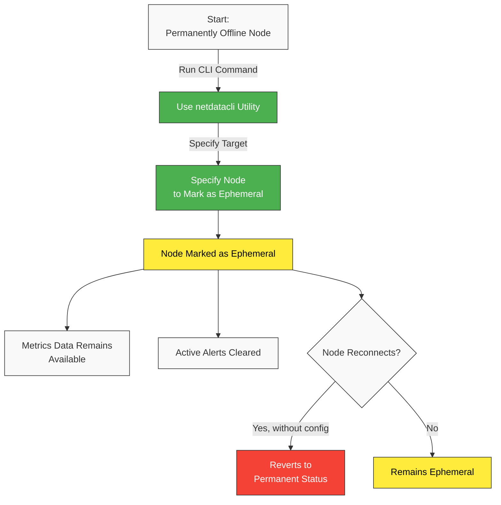
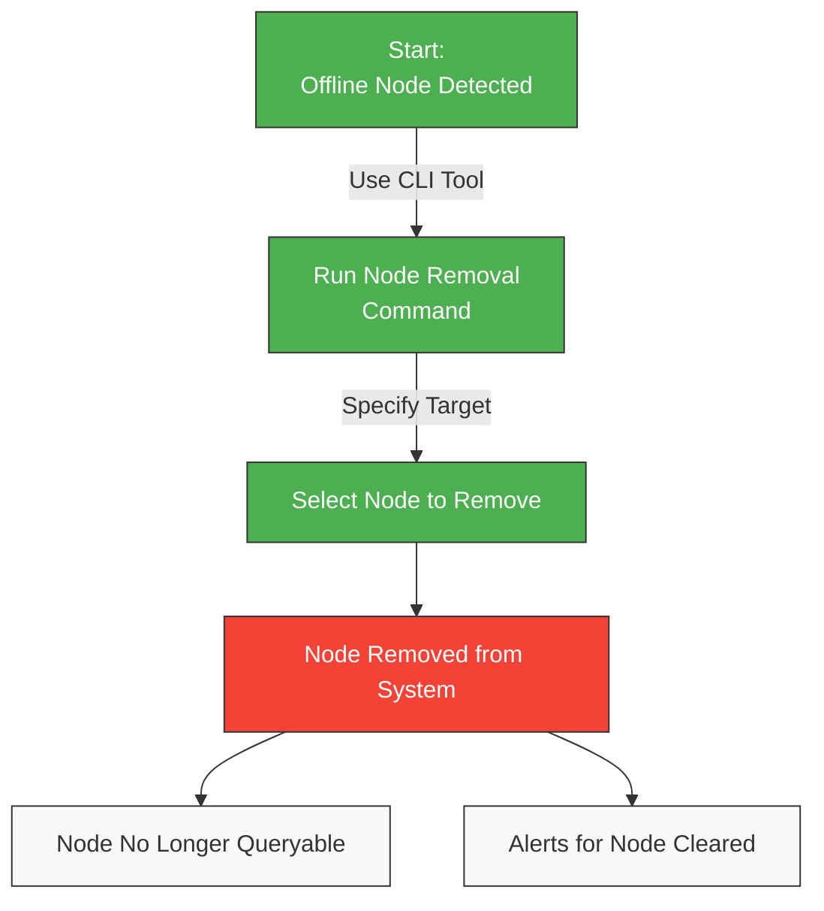
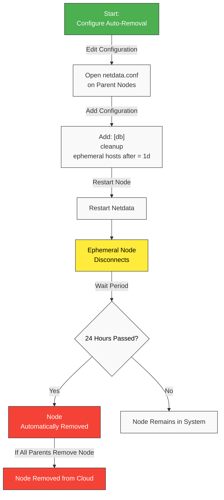

# Nodes Ephemerality in Netdata

## Node Types

Netdata categorizes nodes into two types:

| Type          | Description                                    | Common Use Cases                                                                                                                                                               |
|---------------|------------------------------------------------|--------------------------------------------------------------------------------------------------------------------------------------------------------------------------------|
| **Ephemeral** | Expected to disconnect or reconnect frequently | • Auto-scaling cloud instances<br />• Dynamic containers and VMs<br />• IoT devices with intermittent connectivity<br />• Development/test environments with frequent restarts |
| **Permanent** | Expected to maintain continuous connectivity   | • Production servers<br />• Core infrastructure nodes<br />• Critical monitoring systems<br />• Stable database servers                                                        |

:::note

Disconnections in permanent nodes indicate potential system failures and require immediate attention.

:::

### Key Benefits

1. **Reduced Alert Noise**: Disconnection alerts now apply only to permanent nodes, helping you focus on actual issues.
2. **Improved Dynamic Infrastructure Support**: You can designate auto-scaling cloud instances, containers, and other temporary resources as ephemeral to prevent unnecessary alerts.
3. **Automated Node Cleanup**: You can configure ephemeral nodes to be automatically removed based on your preferred retention periods, keeping your dashboards relevant and uncluttered.

## Configuring Ephemeral Nodes



By default, Netdata treats all nodes as permanent. To mark a node as ephemeral:

1. Open the `netdata.conf` file on the target node.
2. Add the following configuration:
   ```ini
   [global]
     is ephemeral node = yes
   ```
3. Restart the node.

This setting applies the `_is_ephemeral` host label, which propagates to your Netdata Parents and Netdata Cloud.

## Alerts for Parent Nodes

Netdata v2.3.0 introduces two new alerts specifically for permanent nodes:

| Alert                       | Trigger Condition                                         |
|-----------------------------|-----------------------------------------------------------|
| `streaming_never_connected` | A permanent node has never connected to a Netdata Parent. |
| `streaming_disconnected`    | A previously connected permanent node has disconnected.   |

## Monitoring Child Node Status



To mark permanently offline nodes, including virtual nodes, as ephemeral:

```bash
netdatacli mark-stale-nodes-ephemeral <node_id | machine_guid | hostname | ALL_NODES>
```

This keeps the previously collected metrics data available for querying and clears any active alerts.

:::note

Nodes will revert to permanent status if they reconnect unless explicitly configured as ephemeral in `netdata.conf`.

:::

### remove-stale-node



To fully remove permanently offline nodes:

```bash
netdatacli remove-stale-node <node_id | machine_guid | hostname | ALL_NODES>
```

This is like the `mark-stale-nodes-ephemeral` subcommand, but it also removes the nodes so they are no longer available for querying.

## Cloud Integration

In Netdata Cloud, ephemeral nodes remain visible but marked as 'stale' as long as at least one Agent reports having queryable metrics data for that node. Once all Agents report the node as offline, ephemeral nodes are automatically removed from the Cloud.

From v2.3.0 onward, Netdata Cloud sends unreachable-node notifications **only for permanent nodes**, reducing unnecessary alerts.

## Automatically Removing Ephemeral Nodes



By default, Netdata does not automatically remove disconnected ephemeral nodes. **To enable automatic cleanup**:

1. Open the `netdata.conf` file on Netdata Parent nodes.
2. Add the following configuration:
   ```ini
   [db]
     cleanup ephemeral hosts after = 1d
   ```
3. Restart the node.

This setting removes ephemeral nodes from queries after 24 hours of disconnection. Once all parent nodes remove a node, Netdata Cloud automatically deletes it as well.


