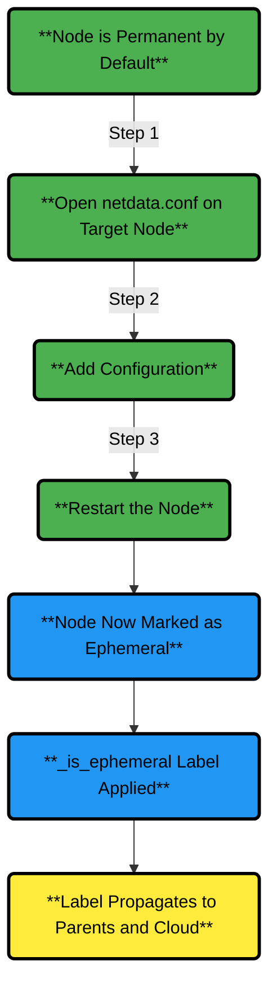
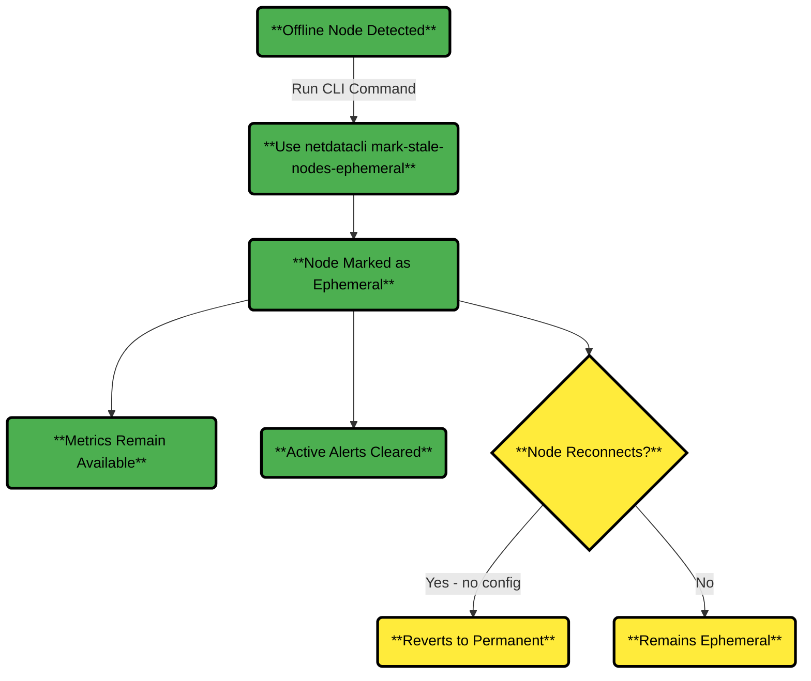
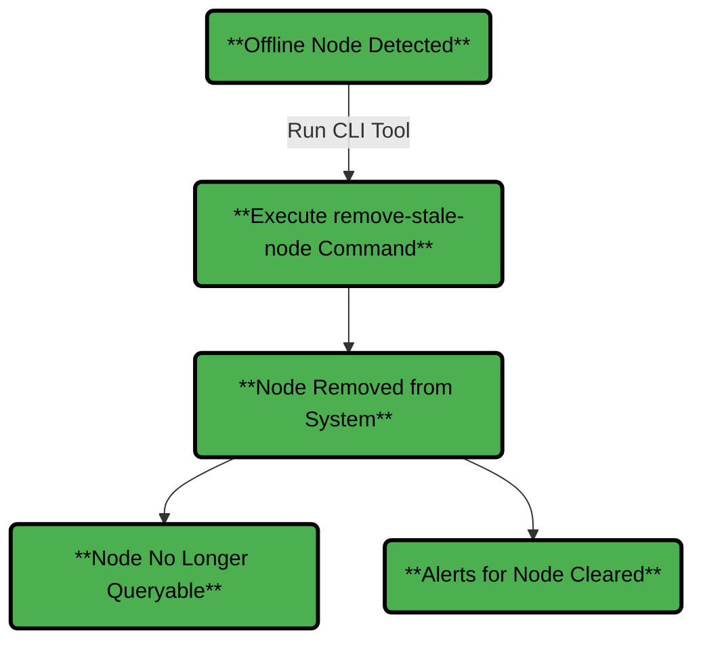
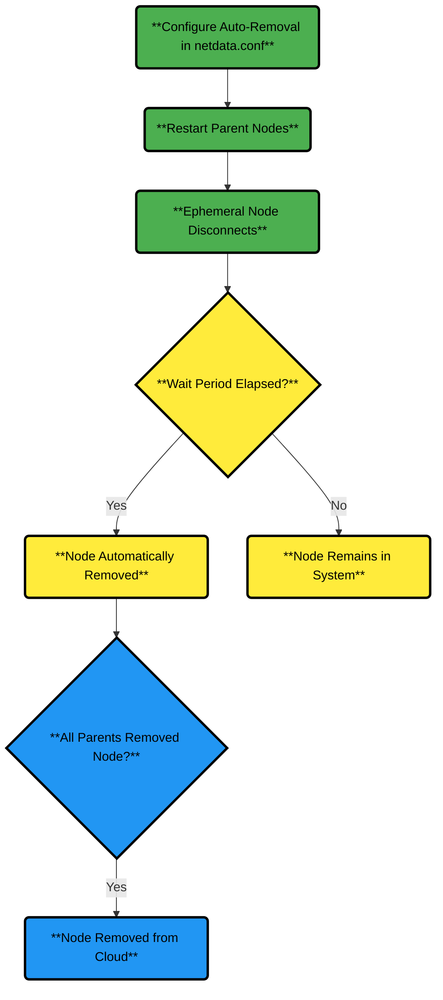

# Node Types and Lifecycle Strategies

Netdata categorizes nodes as **ephemeral** or **permanent** to help you tailor alerting, cleanup, and monitoring strategies for dynamic or static infrastructures.

## Node Types

| Type          | Description                                    | Common Use Cases                                                                                                                            |
|---------------|------------------------------------------------|---------------------------------------------------------------------------------------------------------------------------------------------|
| **Ephemeral** | Expected to disconnect or reconnect frequently | • Auto-scaling cloud instances<br />• Dynamic containers and VMs<br />• IoT devices with intermittent connectivity<br />• Test environments |
| **Permanent** | Expected to maintain continuous connectivity   | • Production servers<br />• Core infrastructure nodes<br />• Critical monitoring systems<br />• Stable database servers                     |

:::note

Disconnections in **permanent nodes** may indicate system failures and require immediate attention.

:::

### Key Benefits of Ephemeral Nodes

1. **Reduced Alert Noise**: Disconnection alerts apply only to permanent nodes.
2. **Support for Dynamic Infrastructure**: Designate temporary resources as ephemeral to avoid false alarms.
3. **Automated Cleanup**: Configure retention policies for ephemeral nodes to keep dashboards uncluttered.

## Configuring Ephemeral Nodes

By default, Netdata treats all nodes as permanent. To mark a node as ephemeral:

1. Open the `netdata.conf` file on the target node.
2. Add the following configuration:

   ```ini
   [global]
   is ephemeral node = yes
   ```

3. Restart the Netdata Agent.

This applies the `_is_ephemeral` host label, which propagates to your Parents and Netdata Cloud.



## Alerts for Parent Nodes

Netdata v2.3.0 introduces two alerts specific to permanent nodes:

| Alert                       | Trigger Condition                                       |
|-----------------------------|---------------------------------------------------------|
| `streaming_never_connected` | A permanent node has never connected to a Parent.       |
| `streaming_disconnected`    | A previously connected permanent node has disconnected. |

## Automatic Node Instance Cleanup in Netdata Cloud

Netdata Cloud automatically removes offline child node instances (nodes connected through a Parent with hops > 0) to prevent clutter and maintain dashboard clarity.

:::warning

**Child node instances** (nodes streaming through Parents) are automatically deleted from Netdata Cloud after **48 hours** of being offline. This applies regardless of whether:
- The child node itself went offline
- The Parent node(s) went offline (causing child nodes to appear offline)

If **all instances** of a node are deleted, the node itself is removed from Netdata Cloud entirely.

:::

### Current Behavior

- **Child nodes (hops > 0)**: Deleted after 48 hours offline
- **Directly claimed nodes (hops = 0)**: Retained for 60 days offline
- **Ephemeral nodes**: Can be configured for custom cleanup periods (see below)

### What Happens When Nodes Reconnect

If a deleted child node reconnects (or its Parent comes back online), the node instance is automatically recreated in Netdata Cloud. Historical data remains available if retained on the Parent node.

## Monitoring and Managing Node Status

### Mark Permanently Offline Nodes as Ephemeral

To mark nodes (including virtual ones) as ephemeral:

```bash
netdatacli mark-stale-nodes-ephemeral <node_id | machine_guid | hostname | ALL_NODES>
```

This keeps historical data queryable and clears active alerts.



### Removing Offline Nodes

To fully remove permanently offline nodes:

```bash
netdatacli remove-stale-node <node_id | machine_guid | hostname | ALL_NODES>
```

:::note

For detailed instructions on removing nodes from Netdata Cloud (including **offline** and **stale** nodes, bulk operations, and UI-based removal), see the [Remove Node Guide](https://github.com/netdata/netdata/edit/master/docs/learn/remove-node.md). This covers scenarios where UI removal is disabled due to parent-child configured relationships.

:::



## Automatically Removing Ephemeral Nodes

To enable automatic cleanup of ephemeral nodes:

1. Open the `netdata.conf` file on Netdata Parent nodes.
2. Add the following configuration:

   ```ini
   [db]
   cleanup ephemeral hosts after = 1d
   ```

3. Restart the Netdata Agent.

This removes ephemeral nodes after 24 hours of disconnection. Once all Parents purge the node, it is automatically removed from Netdata Cloud.


