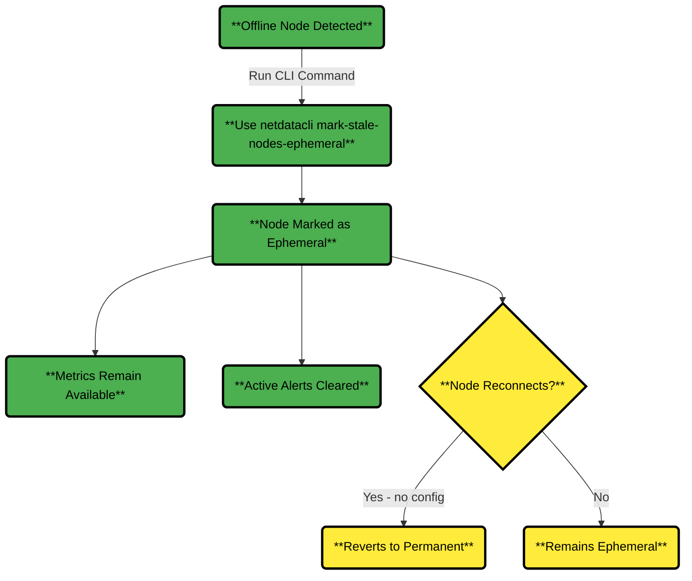
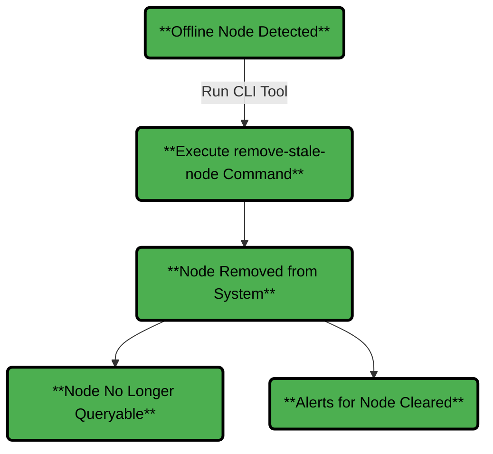
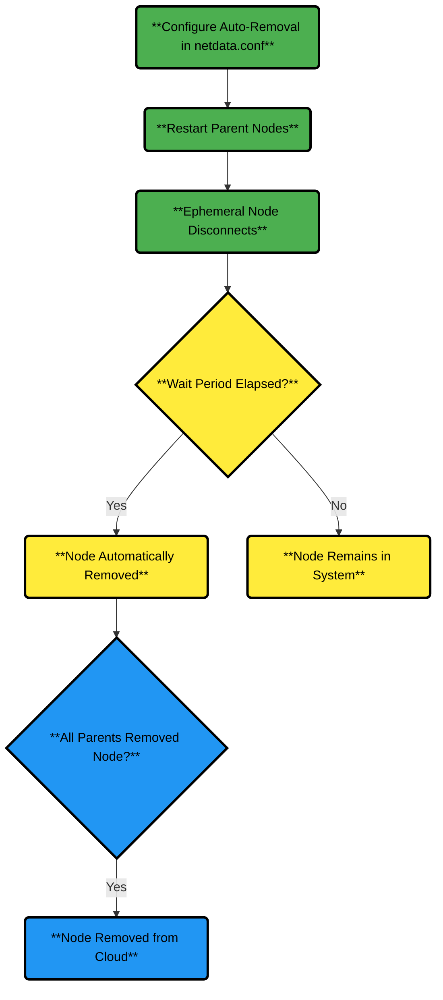

# Node Types and Lifecycle Strategies

Netdata categorizes nodes as **ephemeral** or **permanent** to help you tailor alerting, cleanup, and monitoring strategies for dynamic or static infrastructures.

## Node Types

| Type          | Description                                    | Common Use Cases                                                                                                                            |
|---------------|------------------------------------------------|---------------------------------------------------------------------------------------------------------------------------------------------|
| **Ephemeral** | Expected to disconnect or reconnect frequently | • Auto-scaling cloud instances<br />• Dynamic containers and VMs<br />• IoT devices with intermittent connectivity<br />• Test environments |
| **Permanent** | Expected to maintain continuous connectivity   | • Production servers<br />• Core infrastructure nodes<br />• Critical monitoring systems<br />• Stable database servers                     |

:::note

Disconnections in **permanent nodes** may indicate system failures and require immediate attention.

:::

### Key Benefits of Ephemeral Nodes

1. **Reduced Alert Noise**: Disconnection alerts apply only to permanent nodes.
2. **Support for Dynamic Infrastructure**: Designate temporary resources as ephemeral to avoid false alarms.
3. **Automated Cleanup**: Configure retention policies for ephemeral nodes to keep dashboards uncluttered.

## Configuring Ephemeral Nodes

By default, Netdata treats all nodes as permanent. To mark a node as ephemeral:

1. Open the `netdata.conf` file on the target node.
2. Add the following configuration:
   ```ini
   [global]
       is ephemeral node = yes
   ```
3. Restart the Netdata Agent.

Once restarted, Netdata automatically applies the `_is_ephemeral` host label to the node. This label propagates to your Parent nodes and appears in Netdata Cloud, allowing the system to identify and handle the node as ephemeral.

## Alerts for Parent Nodes

Netdata v2.3.0 introduces two alerts specific to permanent nodes:

| Alert                       | Trigger Condition                                       |
|-----------------------------|---------------------------------------------------------|
| `streaming_never_connected` | A permanent node has never connected to a Parent.       |
| `streaming_disconnected`    | A previously connected permanent node has disconnected. |

### Enable Webhook Notifications for Streaming Alerts

By default, streaming alerts are configured with `to: silent`, meaning they appear in the dashboard but do not send notifications. To receive webhook notifications when permanent child nodes disconnect or never connect, follow these steps:

#### Step 1: Enable the Streaming Alerts

Create a custom override of the streaming alerts configuration:

```bash
cd /etc/netdata 2>/dev/null || cd /opt/netdata/etc/netdata
sudo ./edit-config health.d/streaming.conf
```

Change `to: silent` to `to: sysadmin` (or another role like `dba`, `webmaster`) for both alerts:

```yaml
template: streaming_never_connected
      on: netdata.streaming_inbound
# ... other settings ...
    to: sysadmin    # Changed from: silent

template: streaming_disconnected
      on: netdata.streaming_inbound
# ... other settings ...
    to: sysadmin    # Changed from: silent
```

#### Step 2: Configure Webhook Endpoint

Edit the notification configuration file:

```bash
cd /etc/netdata 2>/dev/null || cd /opt/netdata/etc/netdata
sudo ./edit-config health_alarm_notify.conf
```

Add the custom webhook configuration:

```bash
SEND_CUSTOM="YES"
DEFAULT_RECIPIENT_CUSTOM="webhook"

custom_sender() {
    local payload=$(cat <<EOF
{
  "host": "${host}",
  "alert": "${name}",
  "status": "${status}",
  "severity": "${severity}",
  "message": "${host} ${status_message}: ${alarm} ${raised_for}",
  "chart": "${chart}",
  "value": "${value}",
  "timestamp": "${when}",
  "url": "${goto_url}"
}
EOF
)

    to="${1}"
    for endpoint in ${to}; do
        httpcode=$(docurl -X POST \
            -H "Content-Type: application/json" \
            -d "${payload}" \
            "https://your-webhook-endpoint.com/notify")

        if [ "${httpcode}" = "200" ]; then
            info "sent custom webhook notification to ${endpoint}"
            sent=$((sent + 1))
        else
            error "failed to send webhook notification to ${endpoint} with HTTP code ${httpcode}"
        fi
    done
}
```

Replace `https://your-webhook-endpoint.com/notify` with your actual webhook URL.

#### Step 3: Test and Apply

Test the notification configuration:

```bash
sudo /usr/libexec/netdata/plugins.d/alarm-notify.sh test
```

Reload the health configuration to apply changes:

```bash
sudo netdatacli reload-health
```

:::tip

You can use pre-built webhook integrations for popular services by setting variables like `SLACK_WEBHOOK_URL`, `DISCORD_WEBHOOK_URL`, or `MSTEAMS_WEBHOOK_URL` in `health_alarm_notify.conf` instead of configuring a custom sender.

:::

For more details on custom notifications and available variables, see the [Custom Notifications documentation](/src/health/notifications/custom/README.md).

## Automatic Node Instance Cleanup in Netdata Cloud

Netdata Cloud automatically removes inactive nodes to keep your dashboards clean and organized.

### Cleanup Rules

| Node Type                    | Offline Duration | Description                                                                                                                        |
|------------------------------|------------------|------------------------------------------------------------------------------------------------------------------------------------|
| **Child nodes**              | 48 hours         | Nodes that connect through a Parent node. Deleted when:<br />• The child node goes offline, OR<br />• The Parent node goes offline |
| **Directly connected nodes** | 7 days           | Nodes claimed directly to Netdata Cloud without going through a Parent.                                                            |
| **Ephemeral nodes**          | Custom           | Temporary nodes (containers, auto-scaling VMs) with configurable cleanup periods. See configuration below.                         |
| **Unseen nodes**             | 48 hours         | Nodes that were claimed but have never connected to Netdata Cloud.                                                                 |

:::tip

**Stale nodes are NOT automatically deleted.** Only Offline and Unseen nodes are subject to automatic cleanup. A Stale node has historical data available via a Parent, so it's preserved until the Parent goes offline or the data expires.

:::

:::info Important

If a child node is deleted and later reconnects, it's automatically recreated in Netdata Cloud. Any historical data retained on the Parent node remains accessible.

:::

## Monitoring and Managing Node Status

### Mark Permanently Offline Nodes as Ephemeral

To mark nodes (including virtual ones) as ephemeral:

```bash
netdatacli mark-stale-nodes-ephemeral <node_id | machine_guid | hostname | ALL_NODES>
```

This keeps historical data queryable and clears active alerts.


```mermaid
flowchart TD
    A("**Offline Node Detected**") -->|Run CLI Command| B("**Use netdatacli mark-stale-nodes-ephemeral**")
    B --> C("**Node Marked as Ephemeral**")
    C --> D("**Metrics Remain Available**")
    C --> E("**Active Alerts Cleared**")
    C --> F{"**Node Reconnects?**"}
    F -->|Yes - no config| G("**Reverts to Permanent**")
    F -->|No| H("**Remains Ephemeral**")
    classDef step fill: #4caf50, stroke: #000000, stroke-width: 3px, color: #000000, font-size: 16px
    classDef alert fill: #ffeb3b, stroke: #000000, stroke-width: 3px, color: #000000, font-size: 16px
    class A step
    class B step
    class C step
    class D step
    class E step
    class F alert
    class G alert
    class H alert
```

### Removing Offline Nodes

To fully remove permanently offline nodes:

```bash
netdatacli remove-stale-node <node_id | machine_guid | hostname | ALL_NODES>
```

:::note

For detailed instructions on removing nodes from Netdata Cloud (including **offline** and **stale** nodes, bulk operations, and UI-based removal), see the [Remove Node Guide](https://github.com/netdata/netdata/edit/master/docs/learn/remove-node.md). This covers scenarios where UI removal is disabled due to parent-child configured relationships.

:::


```mermaid
flowchart TD
    A("**Offline Node Detected**") -->|Run CLI Tool| B("**Execute remove-stale-node Command**")
    B --> C("**Node Removed from System**")
    C --> D("**Node No Longer Queryable**")
    C --> E("**Alerts for Node Cleared**")
    classDef step fill: #4caf50, stroke: #000000, stroke-width: 3px, color: #000000, font-size: 16px
    class A step
    class B step
    class C step
    class D step
    class E step
```

## Automatically Removing Ephemeral Nodes

To enable automatic cleanup of ephemeral nodes:

1. Open the `netdata.conf` file on Netdata Parent nodes.
2. Add the following configuration:

   ```ini
   [db]
   cleanup ephemeral hosts after = 1d
   ```

3. Restart the Netdata Agent.

This removes ephemeral nodes after 24 hours of disconnection. Once all Parents purge the node, it is automatically removed from Netdata Cloud.


```mermaid
flowchart TD
    A("**Configure Auto-Removal in netdata.conf**") --> B("**Restart Parent Nodes**")
    B --> C("**Ephemeral Node Disconnects**")
    C --> D{"**Wait Period Elapsed?**"}
    D -->|Yes| E("**Node Automatically Removed**")
    D -->|No| F("**Node Remains in System**")
    E --> G{"**All Parents Removed Node?**"}
    G -->|Yes| H("**Node Removed from Cloud**")
    classDef step fill: #4caf50, stroke: #000000, stroke-width: 3px, color: #000000, font-size: 16px
    classDef alert fill: #ffeb3b, stroke: #000000, stroke-width: 3px, color: #000000, font-size: 16px
    classDef database fill: #2196F3, stroke: #000000, stroke-width: 3px, color: #000000, font-size: 16px
    class A step
    class B step
    class C step
    class D alert
    class E alert
    class F alert
    class G database
     class H database
```

## See Also

- [Node States and Transitions](/docs/netdata-cloud/node-states-and-transitions.md) - Comprehensive reference for node states (Live, Stale, Offline, Unseen) and transition triggers
- [Node Identities](/docs/learn/node-identities.md) - Understand how node identity works alongside ephemerality
- [VM Templates](/docs/learn/vm-templates.md) - Configure ephemerality in VM templates for auto-scaling groups
