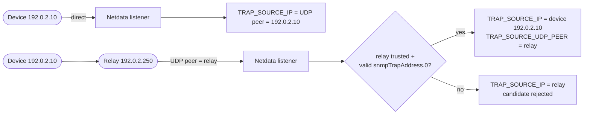

<!--startmeta
custom_edit_url: "https://github.com/netdata/netdata/edit/master/docs/npm/snmp-traps/enrichment.md"
sidebar_label: "Enrichment"
learn_status: "Published"
learn_rel_path: "SNMP Traps"
keywords: ['snmp traps', 'enrichment', 'source identity', 'trusted relays', 'reverse dns', 'topology']
endmeta-->

<!-- markdownlint-disable-file -->

# Enrichment

Netdata adds source identity and an audit trail to accepted SNMP Trap and INFORM events, and can add device identity, topology context, interface names, neighbors, and reverse DNS when that local context is available.

The first fields to inspect are `TRAP_SOURCE_IP`, `TRAP_SOURCE_UDP_PEER`, `_HOSTNAME`, `TRAP_REVERSE_DNS`, `TRAP_DEVICE_VENDOR`, `TRAP_INTERFACE`, `TRAP_NEIGHBORS`, `ND_NIDL_NODE`, and `TRAP_ENRICHMENT`.

Use this page to understand what those fields mean and how much trust to place in them.

## Source identity model

Every accepted trap has a selected source identity. How it is chosen depends on whether the device sent the trap directly or through a relay:

| Field | Meaning |
|---|---|
| `TRAP_SOURCE_IP` | The selected source identity for the trap. This is the address Netdata uses for source attribution and enrichment lookups. |
| `TRAP_SOURCE_UDP_PEER` | The normalized IP address of the host that sent the UDP packet to the Netdata listener. |
| `TRAP_ENRICHMENT.source.udp_peer` | The UDP peer recorded in the audit trail. It should match `TRAP_SOURCE_UDP_PEER` when the packet source was available. |
| `TRAP_ENRICHMENT.source.snmp_trap_address` | The usable relay-supplied `snmpTrapAddress.0` candidate, when the trap carried one. Invalid candidates are recorded in `rejected_candidates` instead. |
| `TRAP_ENRICHMENT.source.selected` | The selected source recorded in the audit trail. It should match `TRAP_SOURCE_IP`. |
| `TRAP_ENRICHMENT.source.method` | How Netdata selected the source. Normal production values are `udp_peer` for direct delivery and `trusted_relay_snmpTrapAddress.0` for trusted relay override. |

For direct device-to-Netdata delivery, `TRAP_SOURCE_IP` and `TRAP_SOURCE_UDP_PEER` are normally the same value.

For relayed delivery, they can be different:

- `TRAP_SOURCE_UDP_PEER` remains the relay that sent the UDP packet to Netdata.
- `TRAP_SOURCE_IP` becomes the original device address only when Netdata treats the sender path as trusted and the trap carries a valid original source address.

Do not treat a relayed original source as trustworthy unless the UDP peer is explicitly configured as a trusted relay.

## Direct senders vs trusted relays

By default, the UDP peer is authoritative. This is the safest model for direct device-to-Netdata delivery.

`allowlist.source_cidrs` is also evaluated against the UDP peer before the packet is parsed. It controls which packets may enter the receiver, not whether a relayed `snmpTrapAddress.0` value is trusted as the original device identity. The default allowlist is open (`0.0.0.0/0` and `::/0`); restrict it for production listeners in [Configuration](/docs/npm/snmp-traps/configuration.md).

A relay can override source identity only when all of these are true:

- The UDP peer matches `source.trusted_relays`.
- The trap includes a usable `snmpTrapAddress.0` value.
- The `snmpTrapAddress.0` value is a valid, non-unspecified, non-multicast IP address.

When these conditions are met:

- `TRAP_SOURCE_IP` is the `snmpTrapAddress.0` value.
- `TRAP_SOURCE_UDP_PEER` is the relay address.
- `TRAP_ENRICHMENT.source.method` is `trusted_relay_snmpTrapAddress.0`.
- `TRAP_ENRICHMENT.source.trusted_relay` is `true`.

When the relay is not trusted, Netdata keeps the UDP peer as the selected source and records the rejected candidate in `TRAP_ENRICHMENT.source.rejected_candidates`.

Because a catch-all trusted-relay range lets any sender on that path influence source attribution through `snmpTrapAddress.0`, keep the list narrow. Configure `source.trusted_relays` in [Configuration](/docs/npm/snmp-traps/configuration.md#trust-relays-carefully).

## Reverse DNS

Reverse DNS is optional annotation. It is disabled by default.

When enabled, Netdata can add `TRAP_REVERSE_DNS` after a PTR lookup result is available for the selected source IP.

Important trust rules:

- `TRAP_REVERSE_DNS` never replaces `TRAP_SOURCE_IP`.
- Reverse DNS is not authoritative device identity.
- Absence of `TRAP_REVERSE_DNS` does not mean the trap is invalid.
- If the reverse-DNS cache is cold when the trap is processed, `TRAP_REVERSE_DNS` is empty for that row and is not backfilled later. Later traps from the same source may include the PTR name after the lookup result is cached.

Enable it only when PTR names help operators read logs faster. Keep source trust decisions based on `TRAP_SOURCE_IP`, `TRAP_SOURCE_UDP_PEER`, and `TRAP_ENRICHMENT.source`.

See the reverse DNS option in [Configuration](/docs/npm/snmp-traps/configuration.md).

## SNMP device registry enrichment

Trap receiving does not require SNMP polling. Netdata can receive, decode, store, and forward traps with only the listener job.

When the same Netdata Agent is also running SNMP collector jobs for the trap-sending devices, those jobs populate the local Netdata device registry. Trap enrichment looks up the selected trap source in that registry.

Registry enrichment applies only when the selected trap source has exactly one local device match. If there are zero matches or multiple matches, Netdata leaves the trap accepted and records the lookup result in `TRAP_ENRICHMENT.registry`.

When registry enrichment matches, Netdata can add:

| Field | Meaning |
|---|---|
| `_HOSTNAME` | Device hostname from the local SNMP device identity, when available. |
| `TRAP_DEVICE_VENDOR` | Device vendor from the local SNMP device identity, when available. |
| `ND_NIDL_NODE` | Virtual-node identity for the trap source, when the SNMP device has one. |

The match is local to the Agent receiving the trap. Running an SNMP collector for the same device on a different Agent does not enrich traps received by this Agent.

If registry enrichment does not provide `_HOSTNAME`, topology enrichment can still fill it from the local topology cache. If neither enrichment source provides a hostname, `_HOSTNAME` falls back to `TRAP_SOURCE_IP`, then `TRAP_SOURCE_UDP_PEER`, so every row still carries a source label. Check `TRAP_ENRICHMENT.applied` when you need to know whether enrichment populated `_HOSTNAME`.

## Topology, interface, and neighbor enrichment

Topology enrichment is local and cache-backed.

Netdata can enrich a trap with topology context only when:

- The same Agent runs an `snmp_topology` job.
- The topology job has completed a successful refresh for the relevant SNMP-polled device.
- The selected trap source matches exactly one device in that local topology cache.

Source-device topology can add device hostname, `TRAP_DEVICE_VENDOR`, or `ND_NIDL_NODE` when those values were not already set by the SNMP device registry.

Topology enrichment is rejected when the SNMP device registry and topology cache assign different `ND_NIDL_NODE` values to the same source. In that case, `TRAP_ENRICHMENT.topology.status` is `conflict` and `TRAP_ENRICHMENT.topology.reason` is `vnode_mismatch`.

Interface and neighbor context needs interface identity:

- If the trap carries `ifName` or `ifDescr`, Netdata can use that value for `TRAP_INTERFACE`.
- If the trap carries `ifIndex` and topology has a matching interface, Netdata can use the topology interface name for `TRAP_INTERFACE`.
- If the trap carries `ifIndex` and topology has LLDP or CDP neighbors for that interface, Netdata can add `TRAP_NEIGHBORS`.

`TRAP_NEIGHBORS` is a comma-separated list of neighbor names known from the local topology cache.

If topology data, a unique source match, or interface identity is unavailable, the trap is still accepted. Inspect `TRAP_ENRICHMENT.topology`, `TRAP_ENRICHMENT.interface`, and `TRAP_ENRICHMENT.neighbors` to see what happened.

Treat topology fields as context labels. They help you read the event, but they do not prove why the event happened.

## Enrichment audit

`TRAP_ENRICHMENT` is a JSON audit record attached to the trap log entry. Use it when a field is missing, surprising, or security-sensitive.

Common top-level keys:

| Key | What it audits |
|---|---|
| `source` | Source selection: UDP peer, `snmpTrapAddress.0`, selected source, method, trusted-relay decision, and rejected candidates. |
| `registry` | SNMP device registry lookup for the selected source. |
| `topology` | Local topology device lookup for the selected source. |
| `interface` | Interface lookup from trap varbinds or topology `ifIndex`. |
| `neighbors` | LLDP/CDP neighbor lookup from topology `ifIndex`. |
| `reverse_dns` | Reverse DNS lookup state and value. |
| `applied` | Fields Netdata populated during enrichment. |

Lookup records can include:

| Audit field | Meaning |
|---|---|
| `key` | Lookup key, such as selected source IP or interface index. |
| `status` | Result such as `matched`, `no_match`, `ambiguous`, `skipped`, `pending`, or `conflict`. |
| `method` | Lookup method for that audit record. |
| `matches` | Number of matching local records, when applicable. |
| `reason` | Why a lookup did not apply, when Netdata can report one. |
| `fields` | Output fields populated by that lookup. |
| `value` | Lookup value, used for reverse DNS when a name is available. |

Common `method` values by audit record:

| Audit record | Common method values |
|---|---|
| `registry` | `hostname_or_ip` |
| `topology` | `management_ip`, `management_address`, `local_interface_ip` |
| `interface` | `trap_varbind`, `topology_ifindex` |
| `neighbors` | `topology_ifindex` |
| `reverse_dns` | `reverse_dns` |

The audit is the best place to distinguish "not configured", "no match", "ambiguous match", "waiting for reverse DNS", and "source identity intentionally rejected".

## How to validate source identity

Use this checklist when you need to trust the source of a trap:

1. Compare `TRAP_SOURCE_IP` and `TRAP_SOURCE_UDP_PEER`.
   - Same value: Netdata selected the UDP peer.
   - Different values: Netdata selected a relayed original source.
2. If the values differ, inspect `TRAP_ENRICHMENT.source`.
   - `method` should be `trusted_relay_snmpTrapAddress.0`.
   - `trusted_relay` should be `true`.
   - `udp_peer` should be one of your configured relays.
   - `selected` should match `TRAP_SOURCE_IP`.
3. Check `source.trusted_relays` in [Configuration](/docs/npm/snmp-traps/configuration.md).
   - The list should contain relay IPs or narrow relay CIDRs.
   - It should not contain device subnets unless those devices are actual relays.
   - Avoid catch-all ranges unless every sender on that path is trusted.
4. Check `TRAP_ENRICHMENT.source.rejected_candidates`.
   - A rejected `snmpTrapAddress.0` means Netdata saw a candidate original source but did not trust or accept it.
   - Rejected candidate entries use the form `snmpTrapAddress.0:<reason>`.
   - Common reasons include `untrusted_relay_uses_udp_peer`, `missing_udp_peer`, `unspecified_ip`, `multicast_ip`, `invalid_ip`, and `invalid_type`.
5. Treat `TRAP_REVERSE_DNS` as a label only.
   - Do not use PTR names as proof of device identity.
6. Validate device enrichment separately.
   - `TRAP_ENRICHMENT.registry.status` should be `matched` when you expect SNMP device registry identity.
   - `TRAP_ENRICHMENT.topology.status` should be `matched` when you expect topology identity.
   - `ambiguous`, `no_match`, `skipped`, or `conflict` explain why enrichment did not apply.
7. Validate interface and neighbor fields only when the trap contains interface identity.
   - `TRAP_INTERFACE` can come from `ifName`, `ifDescr`, or topology `ifIndex`.
   - `TRAP_NEIGHBORS` requires topology data and a trap `ifIndex`.

## Next steps

- Use [Field Reference](/docs/npm/snmp-traps/field-reference.md) for the complete list of trap fields.
- Use [Validation and Data Quality](/docs/npm/snmp-traps/validation-and-data-quality.md) to validate receiver health, source controls, and enrichment quality.
- Use [Configuration](/docs/npm/snmp-traps/configuration.md) to configure source allowlists, trusted relays, reverse DNS, and outputs.
