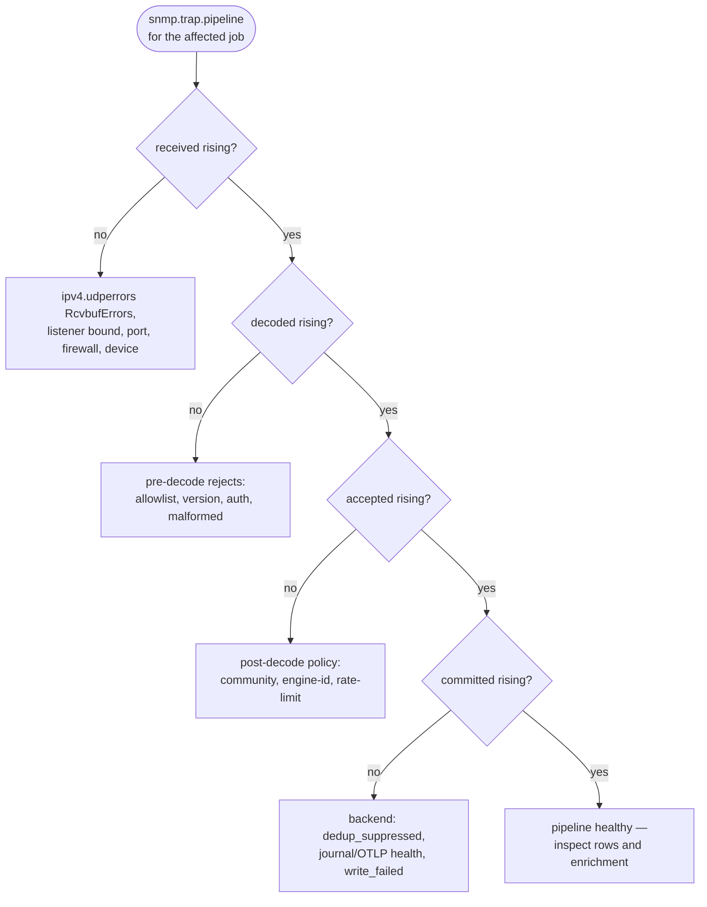

<!-- markdownlint-disable-file -->

# Troubleshooting

Use this page when traps do not appear, appear with unexpected fields, or stop reaching the backend you rely on. Jump straight to the section that matches what you see:

- [No traps arriving / `received` flatlined](#no-traps-arriving)
- [Thousands of identical traps, or fewer rows than packets](#rate-limiting-or-deduplication-surprise)
- [v3 silent but v2c works](#snmpv3-auth-privacy-usm-or-engine-id-mismatch)
- [Numeric OIDs / `unknown` category](#unknown-oids-profile-load-failures-or-template-issues)
- [No local rows, or backend write failures](#journal-write-failures-or-no-local-trap-log-source)

Start with receiver metrics, then inspect rows, configuration, and packet delivery. Deep packet or device debugging comes last, because the receiver pipeline usually tells you where the packet stopped.

## First decision: where did the pipeline stop?

Open Netdata Metrics or Charts and search for **SNMP trap receiver pipeline** or `snmp.trap.pipeline`. Select the affected listener job, then walk the funnel from the top — the first dimension that stops rising is where to look:



The table below details each branch:

| If this is happening | First place to look | Likely area |
|---|---|---|
| `received` is flat or flatlined under load | `ipv4.udperrors` (`RcvbufErrors`) **first**, then listener job, bind address, port, device destination, network path | No packets are entering the trap handler. |
| `received` rises but `decoded` is flat | `snmp.trap.errors`, decode-error rows, SNMP version, community, SNMPv3 settings | Packets arrived but did not decode as allowed traps. |
| `decoded` rises but `accepted` is flat | `dropped_allowlist`, `rate_limited`, `unknown_engine_id`, source policy, SNMP version/community, SNMPv3 engine ID, rate-limit settings | Packets decoded but did not become accepted trap entries. |
| `accepted` rises but `committed` is flat | `dedup_suppressed`, `write_failed`, `journal_write_failed`, `otlp_export_failed`, deduplication settings, output backend health | Entries were accepted but not written or exported as normal rows. |
| `dedup_suppressed` rises | Deduplication summary rows and `dedup` configuration | Repeated traps are intentionally summarized. |
| `write_failed` rises | Direct journal or OTLP backend health | The configured output backend is failing. |

Use the **SNMP trap processing errors** chart, `snmp.trap.errors`, next. For the full dimension list and what each one means, see [Metrics](/docs/npm/snmp-traps/metrics.md#processing-errors).

Some dimensions are diagnostic, not pipeline blockers. `inform_response_failed` means Netdata could not send an INFORM acknowledgement, but the trap can still continue through the receiver. `binary_encoded` means journal fields were encoded safely for storage; it does not by itself mean packet loss. `listener_read_failed` means the listener socket returned a read error.

## Reading trap rows with journalctl {#reading-rows}

Every per-symptom check below reads the affected job's journal. The canonical command is the same each time — only the filter changes:

```bash
sudo journalctl --directory=/var/log/netdata/traps/<job>/$(tr -d '-' < /etc/machine-id) \
  --since "2 hours ago" --no-pager
```

Replace `<job>` with your listener job name (examples below use `edge-traps`). To narrow to a row type or field, add a `FIELD=value` match before the flags — for example `TRAP_REPORT_TYPE=decode_error` — and optionally `--output=json-pretty --output-fields=...` to project specific fields. The sections below show only the filter to add.

## No traps arriving / no rows visible {#no-traps-arriving}

You expected trap rows and see none.

1. Confirm the expected output backend. Direct-journal jobs create local files and appear in the `snmp:traps` Function; OTLP-only jobs do not — query the OTLP receiver instead.
2. Check the pipeline. If `received` is flat, go to [Listener or job not active](#listener-or-job-not-active) and [UDP packets are not reaching Netdata](#udp-packets-are-not-reaching-netdata). If `received` rises, check `snmp.trap.errors` before changing device configuration.
3. Check whether rows exist for the job using the [canonical command](#reading-rows). Add `TRAP_REPORT_TYPE=trap` to see only normal traps, or `TRAP_REPORT_TYPE=decode_error` (with the decode-error field projection below) to see packets that arrived but could not be decoded:

```bash
... TRAP_REPORT_TYPE=decode_error --since "2 hours ago" --output=json-pretty \
  --output-fields=__REALTIME_TIMESTAMP,MESSAGE,TRAP_JOB,TRAP_DECODE_ERROR_KIND,TRAP_DECODE_ERROR,TRAP_VERSION,TRAP_SOURCE_IP,TRAP_SOURCE_UDP_PEER,TRAP_PACKET_SIZE,TRAP_PACKET_SHA256,TRAP_LISTENER,TRAP_ENGINE_ID,TRAP_JSON --no-pager
```

See [Journal and Querying](/docs/npm/snmp-traps/journal-and-querying.md) and [Field Reference](/docs/npm/snmp-traps/field-reference.md).

## Listener or job not active

SNMP trap collection is explicit. The stock file is a commented template, so a listener is not active until an enabled `jobs:` entry exists in:

```text
/etc/netdata/go.d/snmp_traps.conf
```

Depending on installation type, paths may be prefixed with `/opt/netdata`.

Check:

- The job exists under `jobs:`.
- The job name is stable and valid.
- `listen.endpoints` contains the local address and UDP port the devices send to.
- At least one output backend is enabled: `journal.enabled: true`, `otlp.enabled: true`, or both.
- Netdata was restarted after listener endpoint changes.

Conservative checks:

```bash
sudo systemctl status netdata --no-pager
```

```bash
sudo journalctl -u netdata \
  --since "30 minutes ago" \
  --no-pager
```

If the listener port is below `1024`, such as UDP `162`, the process needs permission to bind it. Netdata packages grant the needed capability to `go.d.plugin`. For listener configuration details, see [Configuration](/docs/npm/snmp-traps/configuration.md).

## UDP packets are not reaching Netdata

This is the likely path when `received` is flat for the job.

**Check `ipv4.udperrors` first.** The collector's `received` counter counts packets *after* the kernel UDP receive buffer, so datagrams the kernel drops never appear in the trap pipeline — traps can flatline while the device is still sending. Netdata's system-level `ipv4.udperrors` chart records these on its `RcvbufErrors` dimension (the `1m_ipv4_udp_receive_buffer_errors` alert watches it). If `RcvbufErrors` is climbing, the kernel buffer is your bottleneck, not the network; tune it as described in [Sizing and Capacity](/docs/npm/snmp-traps/sizing-and-capacity.md#kernel-udp-buffer-drops).

Then check the receiving side:

- The job is active.
- The configured address exists on the host.
- The configured port matches the device destination.
- Another process is not already bound to the same UDP address and port.
- Host firewall, network ACLs, routing, and NAT allow UDP delivery to the listener.

Check local UDP listeners:

```bash
sudo ss -ulnp | grep ':162'
```

If the job listens on a non-privileged test port, replace `162` with that port.

Then check the sending side:

- The device sends traps or informs to the Netdata host address.
- The device sends to the configured UDP port.
- Any relay forwards to the Netdata listener, not only to another trap receiver.
- Network devices between sender and receiver allow UDP in that direction.

Do not start by changing communities or SNMPv3 keys when `received` is flat. Credential mismatches usually require packets to reach the receiver first.

## Source allowlist drops

`allowlist.source_cidrs` is checked against the UDP peer before the packet is parsed. If a relay forwards traps, the allowlist must include the relay UDP peer, not only the original device address carried inside the trap.

Evidence:

- `snmp.trap.errors` dimension `dropped_allowlist`
- `snmp.trap.pipeline` dimension `dropped`
- Job configuration under `allowlist.source_cidrs`

Common causes:

- The device or relay source IP is outside the configured CIDRs.
- A relay is expected, but only the original device subnet is allowlisted.
- NAT changes the UDP peer seen by Netdata.
- IPv4 and IPv6 source ranges are not both represented when needed.

Fix the allowlist with the narrowest CIDRs that match the actual UDP peers:

```yaml
allowlist:
  source_cidrs:
    - 192.0.2.0/24
    - 198.51.100.0/24
```

For source controls, see [Configuration](/docs/npm/snmp-traps/configuration.md).

## SNMP version or community mismatch

For SNMPv1 and SNMPv2c, check the configured versions and community allowlist without exposing the real community value.

Evidence:

- `received` rises while `decoded` is flat when Netdata can identify a disallowed version before full decode.
- `decoded` rises while `accepted` is flat when a decoded v1/v2c trap uses a version or community that the job does not allow.
- `snmp.trap.errors` has `dropped_allowlist`.
- Decode-error rows can include `TRAP_VERSION` when Netdata can safely read it from malformed or otherwise undecodable packets.

Check:

- `versions` includes the version the device sends, such as `v2c`.
- `communities` uses secret references or placeholders, not inline real values.
- An empty `communities: []` accepts all SNMPv1/v2c communities and should be used only when that is intentional.
- Device-side trap settings use the same version as the listener job.

Safe example:

```yaml
versions:
  - v2c
communities:
  - "${file:/run/secrets/snmp-trap-community}"
```

Do not paste real community strings into tickets, docs, shell history, or examples.

## SNMPv3 auth, privacy, USM, or engine ID mismatch

**Common cue: v3 is silent but v2c from the same device works.** When v2c traps arrive and v3 traps do not, the listener is reachable, so the problem is almost always SNMPv3-specific: a USM credential mismatch (username, auth/privacy protocol, or key) or an engine-ID mismatch. Read the receiver's own signals first — the `usm_failures` and `unknown_engine_id` error dimensions on `snmp.trap.errors`, and the decode-error rows (`TRAP_REPORT_TYPE=decode_error`) with `TRAP_DECODE_ERROR_KIND`, `TRAP_DECODE_ERROR`, and `TRAP_ENGINE_ID` — rather than reaching for external SNMP tools.

**After a device reboot, v3 can reject for a while.** A reboot resets the sender's engine boots/time. If the receiver still has the pre-reboot engine time cached for that engine ID, time-window checks can reject otherwise-valid messages until the new engine state is learned, showing up as `usm_failures`. If v3 was working and started failing right after a known device restart, correlate with a `coldStart`/`warmStart` trap from the same source and allow the engine state to resynchronize before assuming a credential change.

SNMPv3 failures usually show up as one of these error dimensions:

- `auth_failures`
- `usm_failures`
- `unknown_engine_id`
- `decode_failed`

Query decode errors for the affected job with the [canonical command](#reading-rows):

```bash
... TRAP_REPORT_TYPE=decode_error --since "2 hours ago" --output=json-pretty \
  --output-fields=__REALTIME_TIMESTAMP,MESSAGE,TRAP_DECODE_ERROR_KIND,TRAP_VERSION,TRAP_SOURCE_IP,TRAP_SOURCE_UDP_PEER,TRAP_ENGINE_ID,TRAP_JSON --no-pager
```

Check:

- `versions` includes `v3`.
- `usm_users[].username` matches the device.
- `auth_proto` and `priv_proto` match the device.
- `auth_key` and `priv_key` resolve from secret references and are not pasted inline.
- Static v3 jobs include the sender engine ID in `engine_id_whitelist`.
- Dynamic engine ID discovery has `dynamic_engine_id_discovery: true` and an empty `engine_id_whitelist`.
- Dynamic discovery cap, `dynamic_engine_id_max_pairs`, has not rejected new `(engineID, username)` pairs.
- SNMPv3 INFORM senders use the receiver-local engine ID expected by the device.

`TRAP_ENGINE_ID` is not a password, but it is inventory data. Treat it as sensitive operational context.

For SNMPv3 configuration, see [Configuration](/docs/npm/snmp-traps/configuration.md).

## Malformed or decode failures

Malformed packets reached the listener but could not become normal trap rows.

Evidence:

- `snmp.trap.errors` dimensions `malformed_pdu` or `decode_failed`
- `TRAP_REPORT_TYPE=decode_error`
- `TRAP_DECODE_ERROR_KIND`
- `TRAP_PACKET_SIZE`
- `TRAP_PACKET_SHA256`
- `TRAP_LISTENER`

Use the packet hash (`TRAP_PACKET_SHA256`) to group repeated bad packets without storing raw bytes. With the [canonical command](#reading-rows):

```bash
... TRAP_REPORT_TYPE=decode_error --since "2 hours ago" --output=json-pretty \
  --output-fields=__REALTIME_TIMESTAMP,TRAP_DECODE_ERROR_KIND,TRAP_PACKET_SIZE,TRAP_PACKET_SHA256,TRAP_LISTENER,TRAP_SOURCE_IP,TRAP_SOURCE_UDP_PEER,TRAP_JSON --no-pager
```

Check:

- The sender is using SNMP Trap or INFORM, not another UDP protocol.
- The trap version is one the job accepts.
- The sender firmware or relay is not truncating or corrupting packets.
- The packet source is expected and allowed.

Raw packet captures can contain communities, engine IDs, hostnames, interface names, and device payload. Use them only under your local security process and do not share raw captures in public issues.

## Unknown OIDs, profile load failures, or template issues

Unknown OIDs are coverage signals, not always ingestion failures. A trap can be accepted and committed while still using `TRAP_CATEGORY=unknown`.

Evidence:

- `snmp.trap.errors` dimension `unknown_oid`
- Normal rows with `TRAP_OID` but missing or unexpected `TRAP_NAME`
- `TRAP_CATEGORY=unknown`
- `snmp.trap.errors` dimensions `profile_load_failed` or `template_unresolved`

Check profile locations:

```text
/etc/netdata/go.d/snmp.trap-profiles/
/usr/lib/netdata/conf.d/go.d/snmp.trap-profiles/default/
```

Depending on installation type, paths may be prefixed with `/opt/netdata`.

Common causes:

- The vendor trap OID is not covered by loaded profiles.
- A custom profile YAML file is invalid.
- A profile template references a varbind that is not present in the trap.
- An operator profile overrides a stock profile file unexpectedly.
- The job has not been recreated since stock profile updates were installed.

For custom profile behavior and safe profile changes, see [Trap Profiles](/docs/npm/snmp-traps/trap-profiles.md) and [Validation and Data Quality](/docs/npm/snmp-traps/validation-and-data-quality.md).

## Rate limiting or deduplication surprise

Thousands of identical traps, or fewer rows than packets sent: rate limiting and deduplication intentionally change what appears as rows.

- **Rate limiting evidence:** `snmp.trap.errors` `rate_limited`, `snmp.trap.pipeline` `dropped`, and job `rate_limit` config.
- **Deduplication evidence:** `snmp.trap.pipeline` `dedup_suppressed`, `snmp.trap.dedup_suppressed` `suppressed`, rows with `TRAP_REPORT_TYPE=deduplication_summary`, and fields `TRAP_SUPPRESSED_COUNT`, `TRAP_SUPPRESSED_FINGERPRINTS`, `TRAP_REPORT_PERIOD_SEC`.

Query dedup summaries with the [canonical command](#reading-rows):

```bash
... TRAP_REPORT_TYPE=deduplication_summary --since "2 hours ago" --output=json-pretty \
  --output-fields=__REALTIME_TIMESTAMP,MESSAGE,TRAP_JOB,TRAP_SUPPRESSED_COUNT,TRAP_SUPPRESSED_FINGERPRINTS,TRAP_REPORT_PERIOD_SEC,TRAP_JSON --no-pager
```

Check:

- `rate_limit.enabled`
- `rate_limit.mode`, especially `drop` versus `sample`
- `dedup.enabled`
- `dedup.window_sec`
- `dedup.key_varbinds`

If operators expect every repeated PDU to appear as an individual row, deduplication is the first setting to check. Dedup-suppressed traps do not update profile-defined metrics.

## Journal write failures or no local trap log source

No local rows for a direct-journal job, or `write_failed` rising. Committed rows are written under the per-job root `/var/log/netdata/traps/<job>/` (or `${NETDATA_LOG_DIR}/traps/<job>/`); `journalctl --directory` reads the machine-id child of that root.

**Evidence:** `snmp.trap.pipeline` `write_failed`, `snmp.trap.errors` `journal_write_failed`, a missing/unreadable journal directory, or no local trap log source for a direct-journal job.

Check the job output mode first:

- `journal.enabled: true` means local files should exist.
- `journal.enabled: false` with `otlp.enabled: true` means OTLP-only; no local source is expected.
- Disabling journal without enabling OTLP fails validation.

Conservative checks — list the directory (`sudo ls -lh /var/log/netdata/traps/edge-traps`), read it with the [canonical command](#reading-rows), and confirm disk space (`df -h /var/log/netdata`).

Common causes:

- Disk is full or nearly full.
- The Netdata process cannot write the per-job directory.
- The configured log directory is on a read-only or unavailable filesystem.
- Retention or rotation removed older rows.
- The job is OTLP-only, so local journal files are intentionally absent.

For journal querying and local source behavior, see [Journal and Querying](/docs/npm/snmp-traps/journal-and-querying.md).

## OTLP export failures

OTLP export is optional and disabled by default. When enabled, failures show as:

- `snmp.trap.errors` dimension `otlp_export_failed`
- `snmp.trap.pipeline` dimension `write_failed` when OTLP is the failing authoritative write path
- Missing records in the downstream OTLP receiver or log system

In journal+OTLP jobs, secondary OTLP export failures raise `otlp_export_failed` but do not remove rows already accepted by the journal backend. In OTLP-only jobs, terminal OTLP failures raise `write_failed` with `otlp_export_failed`.

Check:

- `otlp.enabled` and `otlp.endpoint`
- TLS scheme: `https://` for TLS, `http://` or bare `host:port` for plaintext gRPC
- Secret references for `otlp.headers`
- The transport knobs (`request_timeout`, `flush_interval`, `batch_size`, `queue_capacity`) — see [Configuration](/docs/npm/snmp-traps/configuration.md#otlpgrpc-export)
- Network path from the Netdata host to the collector, and downstream receiver logs and storage

Safe example:

```yaml
otlp:
  enabled: true
  endpoint: "https://otel-collector.example.net:4317"
  headers:
    authorization: "${file:/run/secrets/snmp-trap-otlp-authorization}"
```

If the job is OTLP-only, do not expect local trap rows in the `snmp:traps` Function. Query the downstream system.

## Missing or surprising enrichment and source identity

Use row fields before changing enrichment configuration.

Start with `TRAP_SOURCE_IP`, `TRAP_SOURCE_UDP_PEER`, `_HOSTNAME`, `TRAP_DEVICE_VENDOR`, `TRAP_INTERFACE`, `TRAP_NEIGHBORS`, `TRAP_REVERSE_DNS`, `TRAP_ENRICHMENT`, and `ND_NIDL_NODE`.

Compare selected source and UDP peer with the [canonical command](#reading-rows):

```bash
... TRAP_SOURCE_IP=192.0.2.10 --since "2 hours ago" --output=json-pretty \
  --output-fields=__REALTIME_TIMESTAMP,MESSAGE,TRAP_SOURCE_IP,TRAP_SOURCE_UDP_PEER,_HOSTNAME,TRAP_DEVICE_VENDOR,TRAP_INTERFACE,TRAP_NEIGHBORS,TRAP_REVERSE_DNS,TRAP_ENRICHMENT --no-pager
```

Check:

- Direct senders usually have the same `TRAP_SOURCE_IP` and `TRAP_SOURCE_UDP_PEER`.
- Relayed traps should show the relay as `TRAP_SOURCE_UDP_PEER`.
- Only peers in `source.trusted_relays` may make `snmpTrapAddress.0` become the selected source.
- `TRAP_REVERSE_DNS` is annotation only. It is not authoritative identity.
- `TRAP_ENRICHMENT` explains selected, rejected, missing, ambiguous, or skipped enrichment decisions.
- Source attribution metrics can show `ambiguous`, `failed`, `overflow_dropped`, and `source_transitions`.

Keep `source.trusted_relays` narrow. A broad trusted-relay range lets senders on that path influence source attribution.

For field meanings, see [Field Reference](/docs/npm/snmp-traps/field-reference.md). For source validation workflow, see [Validation and Data Quality](/docs/npm/snmp-traps/validation-and-data-quality.md).

## Retention or disk pressure

Retention applies only when `journal.enabled` is `true`.

Check:

- `retention.max_size`
- `retention.max_duration`
- `retention.rotation_size`
- `retention.rotation_duration`
- Disk free space for the Netdata log directory
- `journal_write_failed`
- Whether the time window you are querying is older than retained local files

Conservative checks — confirm disk space (`df -h /var/log/netdata`), measure the job's footprint (`sudo du -sh /var/log/netdata/traps/edge-traps`), and read the window with the [canonical command](#reading-rows).

Common causes:

- Local retention evicted older trap files.
- Storm volume filled the retention budget faster than expected.
- Disk pressure caused direct journal writes to fail.
- The job was changed to OTLP-only, so local history is no longer written.

Choose retention based on how long operators need local forensic access. If an external backend is the system of record, validate that backend before reducing local retention.

## Safe troubleshooting rules

- Do not paste real community strings, SNMPv3 auth keys, SNMPv3 privacy keys, OTLP headers, organization names, or public IPs that identify your environment into tickets or examples.
- Use placeholders for secrets.
- Use RFC 5737 example IPs such as `192.0.2.10`, `198.51.100.20`, and `203.0.113.5`.
- Review `TRAP_JSON`, `TRAP_ENRICHMENT`, `TRAP_VAR_*`, `TRAP_ENGINE_ID`, interface names, neighbor names, and hostnames before sharing output.
- Keep packet captures private and minimal. Raw packets can contain credentials or sensitive device payload.
- Prefer receiver counters and decoded fields before packet captures.

## Related pages

- [Configuration](/docs/npm/snmp-traps/configuration.md) - Configure jobs, listeners, allowlists, SNMP versions, SNMPv3, outputs, retention, rate limiting, and deduplication.
- [Journal and Querying](/docs/npm/snmp-traps/journal-and-querying.md) - Query direct-journal trap rows, decode errors, and dedup summaries.
- [Field Reference](/docs/npm/snmp-traps/field-reference.md) - Check every emitted field and OTLP mapping.
- [Metrics](/docs/npm/snmp-traps/metrics.md) - Interpret receiver pipeline, processing errors, dedup counters, and source metrics.
- [Alerts](/docs/npm/snmp-traps/alerts.md) - Understand the default health alerts and how to route or silence them.
- [Validation and Data Quality](/docs/npm/snmp-traps/validation-and-data-quality.md) - Validate source identity, profile coverage, output backends, and data handling.
- [Trap Profiles](/docs/npm/snmp-traps/trap-profiles.md) - Understand unknown OIDs, profile reloads, template failures, overrides, and profile-derived fields.
