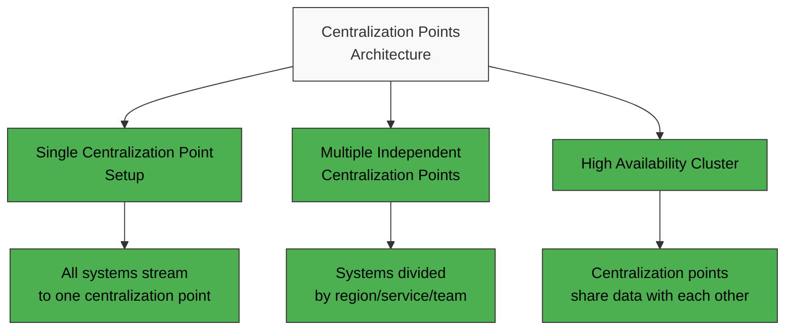
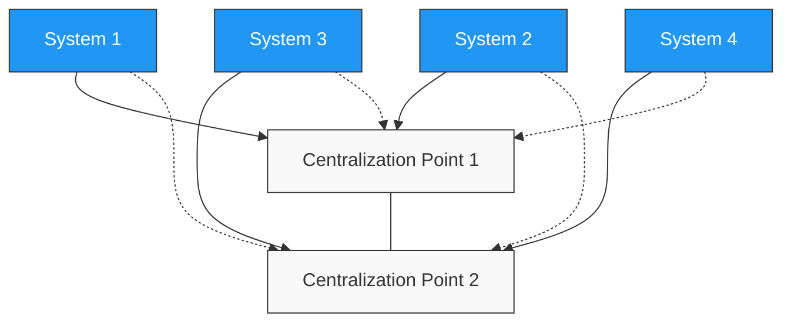

# Observability Centralization Points

## What Are Centralization Points?

Observability Centralization Points are specialized Netdata installations that you can configure to **receive, store, and process** observability data (metrics and logs) from multiple other systems in your infrastructure.

These centralization points give you several core functions:

* **Receiving and storing** metrics and logs from multiple systems
* **Processing and analyzing** your collected data
* **Running health checks and alerts**
* Providing **unified dashboards** across all your systems
* **Replicating data** for your historical analysis

This **distributed yet centralized** approach gives you the benefits of both decentralized collection and centralized analysis.

## Why Use Centralization Points?

| Use Case                                        | Description                                                                                    | Benefits                                                                                      |
|-------------------------------------------------|------------------------------------------------------------------------------------------------|-----------------------------------------------------------------------------------------------| 
| **Ephemeral Systems**                           | Ideal for your Kubernetes nodes or temporary VMs that frequently go offline                    | You retain metrics and logs for analysis and troubleshooting even after node termination      |
| **Limited Resources**                           | Offloads observability tasks from your systems with low disk space, CPU, RAM, or I/O bandwidth | Your production systems run efficiently without performance trade-offs                        |
| **Multi-Node Dashboards Without Netdata Cloud** | Aggregates data from all your nodes for centralized dashboards                                 | You get Cloud-like functionality in environments that prefer or require on-premises solutions |
| **Restricted Netdata Cloud Access**             | Acts as a bridge when your monitored systems can't connect to Netdata Cloud                    | You can still use Cloud features despite firewall restrictions or security policies           |

## How Multiple Centralization Points Work

| Scenario                    | Operation                                                                | Advantages                                                               |
|-----------------------------|--------------------------------------------------------------------------|--------------------------------------------------------------------------|
| **With Netdata Cloud**      | Queries all your centralization points in parallel for a unified view    | You get a seamless experience regardless of your underlying architecture |
| **Without Netdata Cloud**   | Your centralization points consolidate data from connected systems       | You have a local view of metrics and logs without external dependencies  |
| **High Availability Setup** | Your centralization points share data with each other, forming a cluster | You won't lose data if one centralization point fails                    |

## Technical Implementation

Observability Centralization Points consist of two major components you can deploy:

1. **Metrics Centralization** - Uses Netdata's streaming and replication features to centralize your metrics data
2. **Logs Centralization** - Uses systemd-journald methodologies to centralize your log data

You can configure your systems to connect to **multiple centralization points** for redundancy. If a connection fails, they automatically switch to an available alternative.

In a **high-availability setup**, your centralization points can form a cluster by sharing data with each other, ensuring all points have a complete copy of all your metrics and logs.

