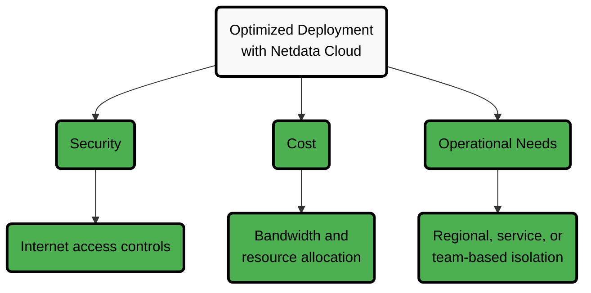
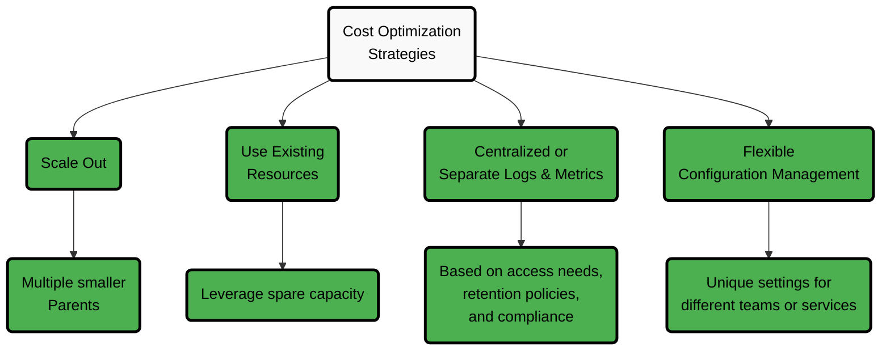

# Parent Configuration Best Practices

A Parent node is a Netdata Agent configured to receive metrics from multiple Child nodes. It acts as the central long-term storage layer, providing a unified view, longer retention, and high availability when used with replication.

## Critical Factors to Consider

When setting up Parents, consider the following:

| Factor                                      | Description                          | Impact                                                                                        |
|---------------------------------------------|--------------------------------------|-----------------------------------------------------------------------------------------------|
| **System Volume**                           | The number of monitored systems      | Larger infrastructures may need multiple Parents to maintain performance                      |
| **Data Transfer Costs**                     | Bandwidth usage between environments | Strategic placement reduces egress bandwidth costs in multi-cloud or hybrid environments      |
| **Usability Without Netdata Cloud**         | Standalone operation considerations  | Fewer Parents simplifies access and management                                                |
| **Optimized Deployment with Netdata Cloud** | Cloud integration benefits           | Provides complete infrastructure view with optimized security, cost, and operational controls |
| **Data Retention & Metric Volume**          | Disk planning for Parent nodes       | Estimate disk needs based on total metrics streamed from children and configured retention tiers |

## Deployment Optimization Factors

## Estimating Disk Retention by Metric Volume on Parent Nodes

Parent nodes are the central long-term storage layer in a Netdata infrastructure. They receive all metrics streamed from children and store them according to tiered retention settings.

| Tier   | Sample Resolution                  | Typical Compressed Size per Sample |
| ------ | ---------------------------------- | ---------------------------------- |
| Tier 0 | per second (native)                | ~0.6 B / sample                   |
| Tier 1 | per minute (60× aggregate)         | ~6 B / sample                     |
| Tier 2 | per hour (60× aggregate of Tier 1) | ~18 B / sample                    |

### Example Calculation

Assume a Parent configured with:

* **Tier 0:** 30 days retention (per-second resolution)
* **Tier 1:** 6 months retention (per-minute resolution)
* **Tier 2:** 5 years retention (per-hour resolution)

One metric would consume approximately **3.7 MB** across tiers.
For **1,000,000 metrics streamed to the Parent**, this equals **≈ 3.7 TB**.

Adding 5–15% overhead for replication buffers, indexes, and metadata, plan for **≈ 4 TB per million metrics** under this retention policy.

### Key Parameters to Adjust

* Total metrics streamed from all Children
* Retention window per tier (`dbengine tier x retention time`)
* Sampling interval per tier (`update every`)
* Metadata & replication overhead (5–15 % recommended buffer)

## Cost Optimization Strategies

Netdata helps you keep observability efficient and cost-effective:

| Strategy                                   | Description                            | Benefit                                                                                         |
| ------------------------------------------ | -------------------------------------- | ----------------------------------------------------------------------------------------------- |
| **Scale Out**                              | Use multiple smaller Parents           | Improves efficiency and performance across distributed systems                                  |
| **Use Existing Resources**                 | Leverage spare capacity                | Minimize additional hardware costs by using available resources                                 |
| **Centralized or Separate Logs & Metrics** | Choose storage approach based on needs | Optimize based on access patterns, retention policies, and compliance requirements              |
| **Flexible Configuration Management**      | Customize each Parent                  | Control costs with unique retention and alert settings tailored for different teams or services |
| **Right-size Retention Based on Metrics**  | Tune tier retention and sampling       | Directly control disk cost by shortening or lengthening retention tiers where appropriate       |

## Advantages of Netdata's Approach

Netdata provides several benefits over other observability solutions:

| Advantage                         | Description                                | Value                                                                 |
| --------------------------------- | ------------------------------------------ | --------------------------------------------------------------------- |
| **Scalability & Flexibility**     | Multiple independent Parents               | Customized observability by region, service, or team                  |
| **Resilience & Reliability**      | Built-in replication                       | Observability continues even if a Parent fails                        |
| **Optimized Cost & Performance**  | Distributed workloads                      | Prevents bottlenecks and improves resource efficiency                 |
| **Ease of Use**                   | Minimal setup and maintenance              | Reduces complexity and operational overhead                           |
| **On-Prem Control**               | Data remains within your infrastructure    | Enhanced security and compliance, even when using Netdata Cloud       |
| **Comprehensive Observability**   | Segmented infrastructure with unified view | Deep visibility with tailored retention, alerts, and machine learning |
| **Predictable Capacity Planning** | Published per-metric storage cost          | Allows accurate disk and hardware sizing for Parents                  |

:::tip

Following these best practices helps you maintain a **cost-effective**, **high-performance** observability setup with Netdata.

:::
