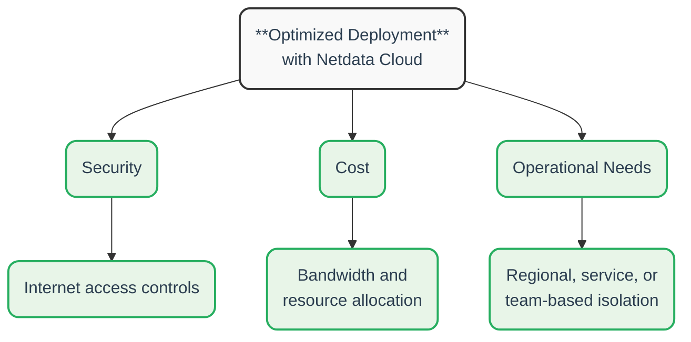
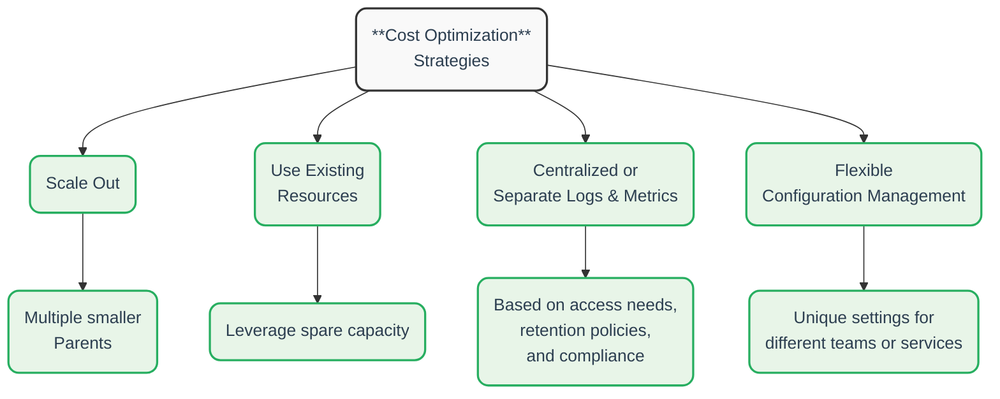

# Parent Configuration Best Practices

## Critical Factors to Consider

When setting up Parents, consider the following:

| Factor                                      | Description                          | Impact                                                                                        |
|---------------------------------------------|--------------------------------------|-----------------------------------------------------------------------------------------------|
| **System Volume**                           | The number of monitored systems      | Larger infrastructures may need multiple Parents to maintain performance                      |
| **Data Transfer Costs**                     | Bandwidth usage between environments | Strategic placement reduces egress bandwidth costs in multi-cloud or hybrid environments      |
| **Usability Without Netdata Cloud**         | Standalone operation considerations  | Fewer Parents simplifies access and management                                                |
| **Optimized Deployment with Netdata Cloud** | Cloud integration benefits           | Provides complete infrastructure view with optimized security, cost, and operational controls |

<strong>Click to see deployment optimization factors</strong>
 

 

## Cost Optimization Strategies

Netdata helps you keep observability efficient and cost-effective:

| Strategy                                   | Description                            | Benefit                                                                                         |
|--------------------------------------------|----------------------------------------|-------------------------------------------------------------------------------------------------|
| **Scale Out**                              | Use multiple smaller Parents           | Improves efficiency and performance across distributed systems                                  |
| **Use Existing Resources**                 | Leverage spare capacity                | Minimize additional hardware costs by using available resources                                 |
| **Centralized or Separate Logs & Metrics** | Choose storage approach based on needs | Optimize based on access patterns, retention policies, and compliance requirements              |
| **Flexible Configuration Management**      | Customize each Parent                  | Control costs with unique retention and alert settings tailored for different teams or services |

<strong>Click to see cost optimization strategies</strong>
 

 

## Advantages of Netdata's Approach

Netdata provides several benefits over other observability solutions:

| Advantage                        | Description                                | Value                                                                 |
|----------------------------------|--------------------------------------------|-----------------------------------------------------------------------|
| **Scalability & Flexibility**    | Multiple independent Parents               | Customized observability by region, service, or team                  |
| **Resilience & Reliability**     | Built-in replication                       | Observability continues even if a Parent fails                        |
| **Optimized Cost & Performance** | Distributed workloads                      | Prevents bottlenecks and improves resource efficiency                 |
| **Ease of Use**                  | Minimal setup and maintenance              | Reduces complexity and operational overhead                           |
| **On-Prem Control**              | Data remains within your infrastructure    | Enhanced security and compliance, even when using Netdata Cloud       |
| **Comprehensive Observability**  | Segmented infrastructure with unified view | Deep visibility with tailored retention, alerts, and machine learning |

:::tip

Following these best practices helps you maintain a **cost-effective**, **high-performance** observability setup with Netdata.

:::
