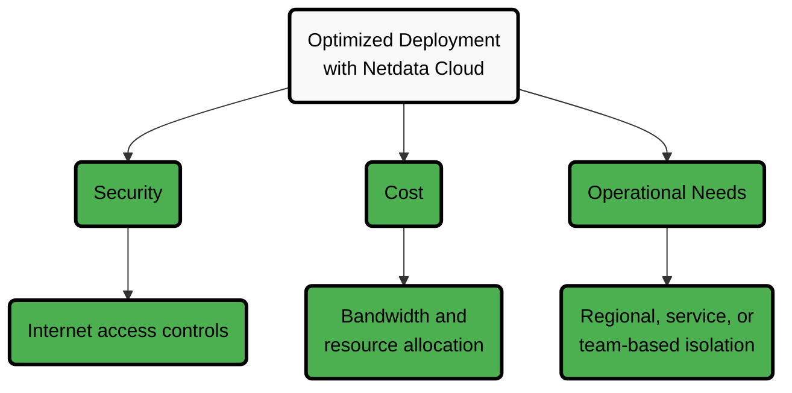
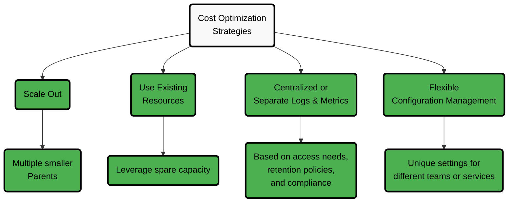

# Parent Configuration Best Practices

A Parent node is a Netdata Agent configured to receive metrics from multiple Child nodes. It acts as the central long-term storage layer, providing a unified view, longer retention, and high availability when used with replication.

## Critical Factors to Consider

When setting up Parents, consider the following:

| Factor                                      | Description                          | Impact                                                                                           |
|---------------------------------------------|--------------------------------------|--------------------------------------------------------------------------------------------------|
| **System Volume**                           | The number of monitored systems      | Larger infrastructures may need multiple Parents to maintain performance                         |
| **Data Transfer Costs**                     | Bandwidth usage between environments | Strategic placement reduces egress bandwidth costs in multi-cloud or hybrid environments         |
| **Usability Without Netdata Cloud**         | Standalone operation considerations  | Fewer Parents simplifies access and management                                                   |
| **Optimized Deployment with Netdata Cloud** | Cloud integration benefits           | Provides complete infrastructure view with optimized security, cost, and operational controls    |
| **Data Retention & Metric Volume**          | Disk planning for Parent nodes       | Estimate disk needs based on total metrics streamed from children and configured retention tiers |

## Deployment Optimization Factors



## Critical Retention Configuration

:::warning

**Default retention settings will not work for production.** Netdata defaults to 1GB space limit per tier with combined time/space retention. You'll hit the 1GB limit within hours or days, causing data loss much sooner than your configured time limits.

**You must configure retention properly before deployment.**

:::

### Choosing Your Retention Strategy

Netdata supports three retention strategies. Choose the one that best fits your environment:

1. **Time-based retention** (recommended for predictable retention periods):

   Guarantees data is kept for a fixed time, regardless of disk usage (assuming you have enough disk space)
   ```ini
   [db]
   dbengine tier 0 retention time = 30d
   dbengine tier 0 retention size = 0
   dbengine tier 1 retention time = 6mo
   dbengine tier 1 retention size = 0
   dbengine tier 2 retention time = 5y
   dbengine tier 2 retention size = 0
   ```

2. **Space-based retention** (recommended for predictable disk usage):

   Guarantees storage usage stays within defined limits, at the cost of variable retention duration.
   ```ini
   [db]
   dbengine tier 0 retention size = 500GB
   dbengine tier 0 retention time = 0
   dbengine tier 1 retention size = 200GB
   dbengine tier 1 retention time = 0
   dbengine tier 2 retention size = 100GB
   dbengine tier 2 retention time = 0
   ```

3. **Combined retention** (use with caution):

   Uses both time and space limits. Data is dropped as soon as either limit is reached.
   ```ini
   [db]
   dbengine tier 0 retention time = 30d
   dbengine tier 0 retention size = 500GB  # Must be large enough to hold 30 days of data!
   dbengine tier 1 retention time = 6mo
   dbengine tier 1 retention size = 200GB  # Must be large enough to hold 6 months of data!
   dbengine tier 2 retention time = 5y
   dbengine tier 2 retention size = 100GB  # Must be large enough to hold 5 years of data!
   ```

:::tip

- For Parent nodes with millions of metrics, expect to allocate 100GB-1TB+ per tier.
- Setting `retention size = 0` means unlimited space (not zero space). This works well with time-based retention if you have sufficient disk capacity.
- Always validate retention sizing in staging before production to avoid premature data loss.

:::

## Estimating Disk Retention by Metric Volume on Parent Nodes

Parent nodes are the central long-term storage layer in a Netdata infrastructure. They receive all metrics streamed from children and store them according to tiered retention settings.

| Tier   | Sample Resolution                  | Typical Compressed Size per Sample |
|--------|------------------------------------|------------------------------------|
| Tier 0 | per second (native)                | ~0.6 B / sample                    |
| Tier 1 | per minute (60× aggregate)         | ~6 B / sample                      |
| Tier 2 | per hour (60× aggregate of Tier 1) | ~18 B / sample                     |

### Example Calculation

Assume a Parent configured with:

* **Tier 0:** 30 days retention (per-second resolution)
* **Tier 1:** 6 months retention (per-minute resolution)
* **Tier 2:** 5 years retention (per-hour resolution)

One metric would consume approximately **3.7 MB** across tiers.
For **1,000,000 metrics streamed to the Parent**, this equals **≈ 3.7 TB**.

Adding 5–15% overhead for replication buffers, indexes, and metadata, plan for **≈ 4 TB per million metrics** under this retention policy.

### Configuration Example for Production Deployments

```ini
[db]
    mode = dbengine
    update every = 1
    storage tiers = 3

    # Tier 0: per-second data for 30 days
    dbengine tier 0 retention time = 30d
    # No size limit - let time control retention

    # Tier 1: per-minute data for 6 months  
    dbengine tier 1 update every iterations = 60
    dbengine tier 1 retention time = 6mo

    # Tier 2: per-hour data for 5 years
    dbengine tier 2 update every iterations = 60
    dbengine tier 2 retention time = 5y
```

## Cost Optimization Strategies

Netdata helps you keep observability efficient and cost-effective:

| Strategy                                   | Description                            | Benefit                                                                                         |
|--------------------------------------------|----------------------------------------|-------------------------------------------------------------------------------------------------|
| **Scale Out**                              | Use multiple smaller Parents           | Improves efficiency and performance across distributed systems                                  |
| **Use Existing Resources**                 | Leverage spare capacity                | Minimize additional hardware costs by using available resources                                 |
| **Centralized or Separate Logs & Metrics** | Choose storage approach based on needs | Optimize based on access patterns, retention policies, and compliance requirements              |
| **Flexible Configuration Management**      | Customize each Parent                  | Control costs with unique retention and alert settings tailored for different teams or services |
| **Right-size Retention Based on Metrics**  | Tune tier retention and sampling       | Directly control disk cost by shortening or lengthening retention tiers where appropriate       |



## Advantages of Netdata's Approach

Netdata provides several benefits over other observability solutions:

| Advantage                         | Description                                | Value                                                                 |
|-----------------------------------|--------------------------------------------|-----------------------------------------------------------------------|
| **Scalability & Flexibility**     | Multiple independent Parents               | Customized observability by region, service, or team                  |
| **Resilience & Reliability**      | Built-in replication                       | Observability continues even if a Parent fails                        |
| **Optimized Cost & Performance**  | Distributed workloads                      | Prevents bottlenecks and improves resource efficiency                 |
| **Ease of Use**                   | Minimal setup and maintenance              | Reduces complexity and operational overhead                           |
| **On-Prem Control**               | Data remains within your infrastructure    | Enhanced security and compliance, even when using Netdata Cloud       |
| **Comprehensive Observability**   | Segmented infrastructure with unified view | Deep visibility with tailored retention, alerts, and machine learning |
| **Predictable Capacity Planning** | Published per-metric storage cost          | Allows accurate disk and hardware sizing for Parents                  |

:::tip

Following these best practices helps you maintain a **cost-effective**, **high-performance** observability setup with Netdata.

:::
