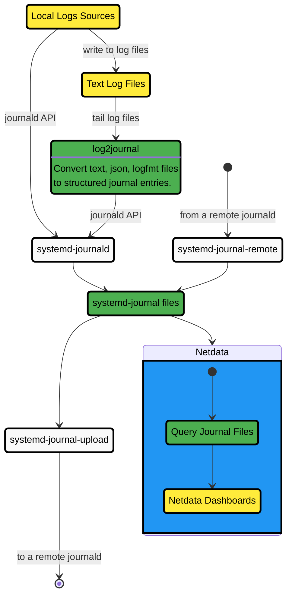

# Logs Centralization Points with systemd-journald

A logs centralization point stores journals from multiple systems on one Linux host so operators can search them together.
Netdata reads the journal files already present on that host; systemd's own remote-journal components transport and store the
logs.

```mermaid
stateDiagram-v2
    classDef alert fill:#ffeb3b,stroke:#000000,stroke-width:3px,color:#000000
    classDef neutral fill:#f9f9f9,stroke:#000000,stroke-width:3px,color:#000000  
    classDef complete fill:#4caf50,stroke:#000000,stroke-width:3px,color:#000000
    classDef database fill:#2196F3,stroke:#000000,stroke-width:3px,color:#000000

    journalRemote: systemd-journal-remote
    journalUpload: systemd-journal-upload
    journalFiles: systemd-journal files
    journald: systemd-journald
    logSources: Local Logs Sources
    log2journal: log2journal
    log2journal: Convert text, json, logfmt files
    log2journal: to structured journal entries.
    logsDashboard: Netdata Dashboards
    logsQuery: Query Journal Files
    textFiles: Text Log Files

    logSources --> journald: journald API
    logSources --> textFiles: write to log files
    textFiles --> log2journal: tail log files
    log2journal --> journald: journald API
    journald --> journalFiles

    journalFiles --> Netdata
    journalFiles --> journalUpload

    journalRemote --> journalFiles
    journalUpload --> [*]: to a remote journald
    [*] --> journalRemote: from a remote journald

    state Netdata {
        [*] --> logsQuery
        logsQuery --> logsDashboard
    }

    class logSources,textFiles,logsDashboard alert
    class journald,journalRemote,journalUpload neutral
    class log2journal,journalFiles,logsQuery complete
    class Netdata database
```

Logs centralization points can be built using the `systemd-journald` methodologies, by configuring `systemd-journal-remote` (on the centralization point) and `systemd-journal-upload` (on the production system).

## Component responsibilities

- `systemd-journald` receives local structured journal entries and writes journal files.
- `systemd-journal-upload` runs on a source system and pushes journal entries to the receiver.
- `systemd-journal-remote` runs on the centralization point and writes received entries into journal files.
- [`log2journal`](/src/collectors/log2journal/README.md) converts text, JSON, or logfmt files into structured journal entries
  when an application cannot write to the journal directly.
- Netdata's systemd-journal collector queries local journal files and presents the combined logs in the Logs view.

This separation matters during troubleshooting. If remote entries never reach disk, inspect the systemd upload and remote
services, their network path, and their authentication. If entries are present in the central journal but absent from the
Netdata UI, inspect the Netdata collector, permissions, and query filters instead.

:::note

The logs centralization points and the metrics centralization points do not need to be the same. For clarity and simplicity, however, when not otherwise required for operational or regulatory reasons, we recommend to have unified centralization points for both metrics and logs.

:::

A Netdata running at the logs centralization point will automatically detect and present the logs of all servers aggregated to it in a unified way (i.e., logs from all servers multiplexed in the same view). This Netdata may or may not be a Netdata Parent for metrics.

## Choose a forwarding model

The recommended passive model has source systems push logs with `systemd-journal-upload` to a listening
`systemd-journal-remote`. The guides in this section cover both an unencrypted setup for controlled test networks and an
encrypted setup using self-signed certificates. Use encryption and mutual identity validation whenever logs cross an
untrusted or shared network.

- [Passive centralization without encryption](passive-journal-centralization-without-encryption.md)
- [Passive centralization with self-signed certificates](passive-journal-centralization-with-encryption-using-self-signed-certificates.md)
- [Centralize journal namespaces](centralizing-journal-namespaces.md)

An active pull model using `systemd-journal-gatewayd` also exists, but it cannot guarantee gap-free replication after an
interruption. Prefer the passive upload model when continuity matters.

## Plan the centralization point

Size storage and retention for the combined write rate of every source, not only for the local host. Preserve fields that
identify the original system so operators can filter multiplexed results by host, service, unit, priority, or other journal
metadata. Confirm that time synchronization is working across sources; timestamps from unsynchronized systems make a shared
incident timeline harder to interpret.

The logs and metrics centralization roles are independent. One host can perform both roles for operational simplicity, or
you can separate them for capacity, security, network, or regulatory reasons. If they are separate, make the relationship
clear in inventories and dashboards so an operator can move from a metric anomaly to the correct centralized logs.

## Validate end to end

After configuration, send a recognizable test entry on one source. Verify it in the source journal, then in the receiver's
journal files, and finally in Netdata's Logs view. Repeat the test after restarting the upload service and after a controlled
network interruption. This checks the complete path and exposes transport or retention gaps before the centralization point
is needed during an incident.
