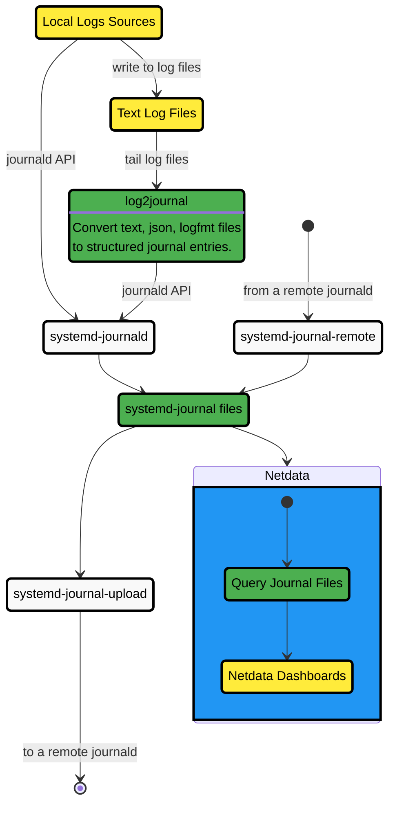

# Logs Centralization Points

A logs centralization point is a machine that receives logs from other machines, so you can explore many systems' logs in one place. Netdata imposes no specific centralization model: you can centralize everything, centralize only some systems, run many independent centralization points, or stay fully distributed — and mix all of these.

## Centralization transports

Each platform centralizes logs with its own native mechanism, and Netdata works identically on the receiving side:

| Transport | Platform | Result on the aggregation point |
|:----------|:---------|:-------------------------------|
| `systemd-journal-remote` / `systemd-journal-upload` | Linux | Native journal files per sender, explorable under the `systemd-journal` source |
| Windows Event Forwarding (WEF) | Windows | Native event channels with events from all forwarders, explorable under the `windows-events` source |
| OpenTelemetry (OTLP/gRPC) | Any | Netdata's indexed log store with per-tenant retention and optional `fs`/`s3` archiving, explorable under the `otel-logs` source |

Because the first two transports keep logs in the OS-native format, the aggregated data remains readable by the platform's own tools (`journalctl`, Event Viewer) and by SIEM agents on the aggregation point.

## Journal centralization with systemd-journald

```mermaid
stateDiagram-v2
    classDef alert fill:#ffeb3b,stroke:#000000,stroke-width:3px,color:#000000
    classDef neutral fill:#f9f9f9,stroke:#000000,stroke-width:3px,color:#000000  
    classDef complete fill:#4caf50,stroke:#000000,stroke-width:3px,color:#000000
    classDef database fill:#2196F3,stroke:#000000,stroke-width:3px,color:#000000

    journalRemote: systemd-journal-remote
    journalUpload: systemd-journal-upload
    journalFiles: systemd-journal files
    journald: systemd-journald
    logSources: Local Logs Sources
    log2journal: log2journal
    log2journal: Convert text, json, logfmt files
    log2journal: to structured journal entries.
    logsDashboard: Netdata Dashboards
    logsQuery: Query Journal Files
    textFiles: Text Log Files

    logSources --> journald: journald API
    logSources --> textFiles: write to log files
    textFiles --> log2journal: tail log files
    log2journal --> journald: journald API
    journald --> journalFiles

    journalFiles --> Netdata
    journalFiles --> journalUpload

    journalRemote --> journalFiles
    journalUpload --> [*]: to a remote journald
    [*] --> journalRemote: from a remote journald

    state Netdata {
        [*] --> logsQuery
        logsQuery --> logsDashboard
    }

    class logSources,textFiles,logsDashboard alert
    class journald,journalRemote,journalUpload neutral
    class log2journal,journalFiles,logsQuery complete
    class Netdata database
```

Journal centralization points are built with `systemd-journal-remote` (on the centralization point) and `systemd-journal-upload` (on the production systems):

- [Passive journal centralization without encryption](/docs/observability-centralization-points/logs-centralization-points-with-systemd-journald/passive-journal-centralization-without-encryption.md) — senders push their journals to the central point.
- [Passive journal centralization with encryption using self-signed certificates](/docs/observability-centralization-points/logs-centralization-points-with-systemd-journald/passive-journal-centralization-with-encryption-using-self-signed-certificates.md) — the same, over TLS.
- [Active journal source without encryption](/src/collectors/systemd-journal.plugin/active_journal_centralization_guide_no_encryption.md) — the central point fetches journals from the senders.
- To isolate streams per project or service on the senders, use journal namespaces — see [Centralizing Journal Namespaces](/docs/observability-centralization-points/logs-centralization-points-with-systemd-journald/centralizing-journal-namespaces.md).
- For tamper-evident journals on the senders, see [Forward Secure Sealing (FSS)](/src/collectors/systemd-journal.plugin/forward_secure_sealing.md).

A Netdata running at the logs centralization point will automatically detect and present the logs of all servers aggregated to it in a unified way (i.e., logs from all servers multiplexed in the same view). This Netdata may or may not be a Netdata Parent for metrics.

:::note

The logs centralization points and the metrics centralization points do not need to be the same. For clarity and simplicity, however, when not otherwise required for operational or regulatory reasons, we recommend to have unified centralization points for both metrics and logs.

:::

## Centralization does not have to be infrastructure-wide

A centralization point can cover any slice of your estate, and different slices can use different technologies:

- **Per environment, team, or datacenter** — one aggregation point each, sized for its own volume and retention needs.
- **Mixed distributed and aggregated nodes** — sensitive systems keep logs only locally; the rest forward to a shared point.
- **Mixed transports** — Linux servers push journals to a journal aggregation point, Windows servers forward events with WEF to a Windows aggregation point, and applications ship OpenTelemetry logs to a Netdata OTLP endpoint.

Every node and every aggregation point is a first-class citizen in Netdata Cloud: one dashboard, one role-based access model, one place to pick what to explore.

### How logs are unified across points today

Netdata Cloud unifies *access*, not the log streams: you open the Logs tab and select which node or aggregation point to explore, and the query runs on that machine's data. A query always returns entries from the selected point — an aggregation point already multiplexes its senders into one view, and distributed nodes answer for themselves.

This means the operator's model is "decide where each system's logs converge, then select that point" — each point serves only its own slice, so every point stays small and simple to operate.

## Choosing between journal centralization and OpenTelemetry

- Use **journal/WEF centralization** when you want the aggregated data to stay in the OS-native format — for SIEM ingestion, compliance tooling, or minimal new moving parts.
- Use **[OpenTelemetry](/docs/opentelemetry/otlp-ingestion.md)** when you want per-tenant retention policies, object-storage archiving, or a pipeline that also serves other backends — or for platforms and sources the OS mechanisms do not cover (macOS, network device syslog, application pipelines).

Both can feed the same Netdata Agent and appear side by side in the Logs tab.
