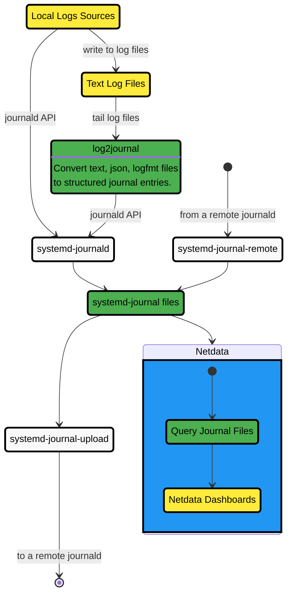

# Logs Centralization Points with systemd-journald

Logs centralization points can be built using the `systemd-journald` methodologies, by configuring `systemd-journal-remote` (on the centralization point) and `systemd-journal-upload` (on the production system).

:::note

The logs centralization points and the metrics centralization points do not need to be the same. For clarity and simplicity, however, when not otherwise required for operational or regulatory reasons, we recommend to have unified centralization points for both metrics and logs.

:::

A Netdata running at the logs centralization point will automatically detect and present the logs of all servers aggregated to it in a unified way (i.e., logs from all servers multiplexed in the same view). This Netdata may or may not be a Netdata Parent for metrics.
