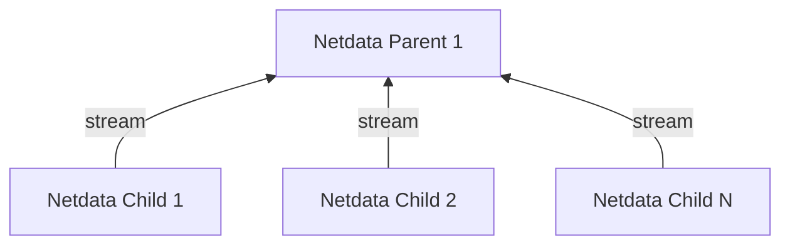

# Metrics Centralization Points (Netdata Parents)

Netdata **Streaming and Replication** copies the recent past samples (replication) and in real-time all new samples collected (streaming) from production systems (Netdata Children) to metrics centralization points (Netdata Parents). The Netdata Parents then maintain the database for these metrics, according to their retention settings.

Each production system (Netdata Child) can stream to **only one** Netdata Parent at a time. The configuration allows configuring multiple Netdata Parents for high availability, but only the first found working will be used.

Netdata Parents receive metric samples **from multiple** production systems (Netdata Children) and can re-stream them to another Netdata Parent. This allows building an infinite hierarchy of Netdata Parents. It also enables the configuration of Netdata Parents Clusters, for high availability.

|           Feature           |                                                         Netdata Child (production system)                                                          |                      Netdata Parent (centralization point)                      |
|:---------------------------:|:--------------------------------------------------------------------------------------------------------------------------------------------------:|:-------------------------------------------------------------------------------:|
|      Metrics Retention      | Can be minimized, or switched to mode `ram` or `alloc` to save resources. Some retention is required in case network errors introduce disconnects. |           Common retention settings for all systems aggregated to it.           |
|      Machine Learning       |                                                       Can be disabled (enabled by default).                                                        |            Runs Anomaly Detection for all systems aggregated to it.             |
|   Alerts & Notifications    |                                                       Can be disabled (enabled by default).                                                        |  Runs health checks and sends notifications for all systems aggregated to it.   |
|      API and Dashboard      |                                                       Can be disabled (enabled by default).                                                        | Serves the dashboard for all systems aggregated to it, using its own retention. |
|      Exporting Metrics      |                                                         Not required (enabled by default).                                                         |  Exports the samples of all metrics collected by the systems aggregated to it.  |
|      Netdata Functions      |                                                           Netdata Child must be online.                                                            |          Forwards Functions requests to the Children connected to it.           |
| Connection to Netdata Cloud |                                                                   Not required.                                                                    |  Each Netdata Parent registers to Netdata Cloud all systems aggregated to it.   |

## Supported Configurations

For Netdata Children:

1. **Full**: Full Netdata functionality is available at the Children. This means running machine learning, alerts, notifications, having the local dashboard available, and generally all Netdata features enabled. This is the default.
2. **Thin**: The Children are only collecting and forwarding metrics to a Parent. Some local retention may exist to avoid missing samples in case of network issues or Parent maintenance, but everything else is disabled.

For Netdata Parents:

1. **Standalone**: The Parent is standalone, either the only Parent available in the infrastructure, or the top-most of a hierarchy of Parents.
2. **Cluster**: The Parent is part of a cluster of Parents, all having the same data from the same Children. A Cluster of Parents offers high-availability.
3. **Proxy**: The Parent receives metrics and stores them locally, but it also forwards them to a Grand Parent.

A Cluster consists of nodes configured as circular **Proxies**, where each node acts as a Parent to all others. When using multiple levels of centralization, only the top level can be configured as a cluster.

## Best Practices

Refer to [Best Practices for Observability Centralization Points](/docs/observability-centralization-points/best-practices.md).
