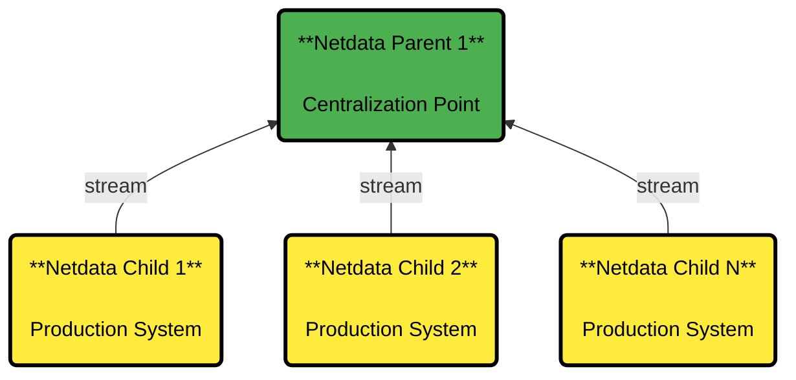

# Configure Netdata Parents to centralize metrics

## How Metrics Centralization Works

## Key Features

:::important

**Netdata Streaming and Replication**

Copies **recent past samples** (replication) and **real-time new samples** (streaming) from production systems (**Netdata Children**) to **metrics centralization points** (**Netdata Parents**). **Netdata Parents** store the database for these metrics based on **retention settings**.

:::

### How Your Systems Connect

<strong>Netdata Child Behavior</strong>
 

- Each **Netdata Child** can stream to **only one** Netdata Parent at a time.
- Multiple **Netdata Parents** can be configured for **high availability**, but only the **first working one** will be used.

 

<strong>Netdata Parent Capabilities</strong>
 

- Receives metric samples **from multiple Netdata Children**.
- Can **re-stream** received metrics to another **Netdata Parent**, forming an **infinite hierarchy** of Parents.
- Supports **Netdata Parents Clusters** for **high availability**.

 

## Feature Comparison

| Feature                    | Netdata Child (Production System)                 | Netdata Parent (Centralization Point)                 |
|----------------------------|---------------------------------------------------|-------------------------------------------------------|
| **Metrics Retention**      | Minimal retention; can use `ram` or `alloc` mode. | Stores metrics for all connected systems.             |
| **Machine Learning**       | Can be disabled (default: enabled).               | Runs anomaly detection for all connected systems.     |
| **Alerts & Notifications** | Can be disabled (default: enabled).               | Monitors health and sends alerts for all systems.     |
| **API & Dashboard**        | Can be disabled (default: enabled).               | Hosts the dashboard using its own retention settings. |
| **Exporting Metrics**      | Optional (default: enabled).                      | Exports all collected metrics.                        |
| **Netdata Functions**      | Child must be online to function.                 | Forwards function requests to connected Children.     |
| **Netdata Cloud**          | Not required.                                     | Registers all connected systems to Netdata Cloud.     |

## **Supported Configurations**

### **For Netdata Children**

- **Full Mode (Default)**:
    - All Netdata features are enabled (machine learning, alerts, notifications, dashboard, etc.).
- **Thin Mode**:
    - Only collects and forwards metrics to a Parent.
    - Some local retention is kept to handle network issues, but all other features are disabled.

### **For Netdata Parents**

- **Standalone**:
    - A single Parent in the infrastructure or the top-most Parent in a hierarchy.
- **Cluster**:
    - A group of Parents that share the same data from the same Children.
    - Provides **high availability**.
- **Proxy**:
    - Stores received metrics locally and **forwards them** to a higher-level Parent (Grand Parent).

### **Cluster Configuration**

- A Cluster consists of **circular Proxy nodes**, where each Parent acts as a Parent to the others.
- Only the **top level** of a multi-level hierarchy can be configured as a cluster.

## **Best Practices**

For detailed guidelines, check [Best Practices for Observability Centralization Points](/docs/observability-centralization-points/best-practices.md).
