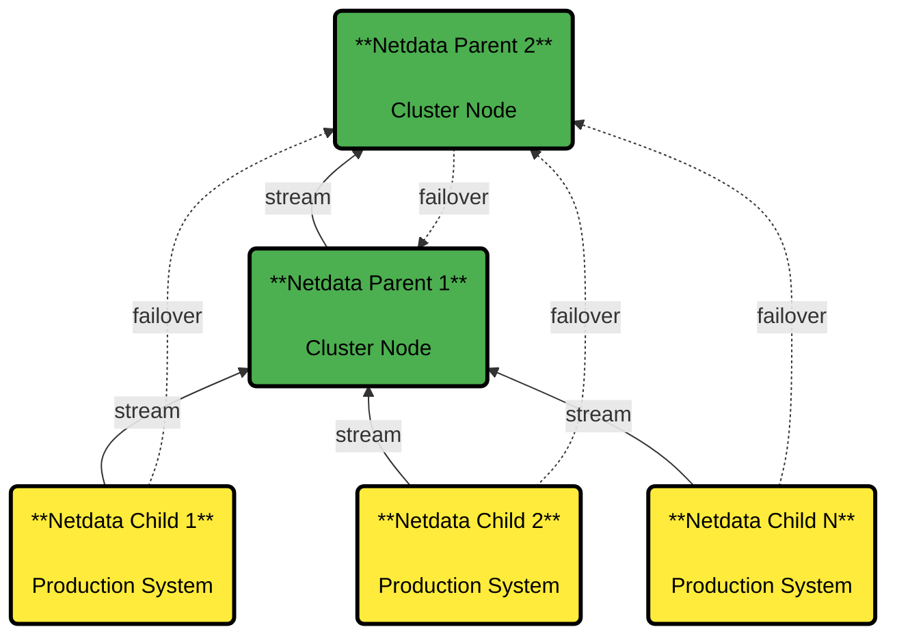

# Clustering and High Availability of Netdata Parents

:::tip

**What You'll Learn**

How to set up clustered Netdata Parents for high availability, including failover mechanisms, maintenance procedures, and parent duplication strategies.

:::

## How Clustering Works

Netdata supports building Parent clusters of 2+ nodes. Clustering and high availability work like this:

## Cluster Architecture

:::important

**How Failover Works**

1. **Configure your Children to connect to all Parents**.
Each Child will use the first working Parent it finds, and automatically switch to backup Parents if the connection fails.

2. **Configure your Parents to sync with each other**.
Each Parent connects to other Parents in the cluster, using the first working connection and failing over to others when needed.

:::

:::note

### Data Distribution

**When you set up a cluster, every Parent receives all metrics from every Child**, no matter which Parent the Child is connected to. Parents also share their data with each other, so you never lose visibility into your infrastructure.

**When a Parent goes down, your Children automatically reconnect to another available Parent**. That Parent then shares the metrics with all other Parents in your cluster, keeping everything in sync.

### Netdata Cloud Visibility

Your cluster ensures continuous visibility in Netdata Cloud. All Parents register your Children with the Cloud, so as long as at least one Parent is online, you'll see all your systems in Netdata Cloud.

### Smart Data Retention

Children only need to keep data long enough to handle Parent switchovers. When a Child connects to a Parent, they work together to fill in any missing data gaps, ensuring complete historical visibility.

:::

## Maintenance Procedures

<strong>Bringing a Parent back online after maintenance</strong>
 

When you bring a Parent back online after extended maintenance, you need to be careful about data gaps. Check the [replication limitations](/docs/observability-centralization-points/metrics-centralization-points/replication-of-past-samples.md#replication-limitations) to understand the constraints.

If your Children don't have enough historical data to fill gaps on the restored Parent, temporarily block Children from connecting to it until it syncs with other Parents in your cluster.

### Temporarily Blocking Children

You have two options to block Children while allowing Parent-to-Parent sync:

1. **Use firewall rules**.
Block port 19999 access from your Children's IP ranges to the restored Parent
2. **Use separate API keys**.
Configure different streaming keys in `stream.conf` for Children vs Parents, then disable the Children's key until sync completes

 

<strong>Creating a new Parent from an existing one</strong>
 

The fastest way to add a new Parent to your cluster is copying data from an existing Parent using `rsync` to transfer `/var/cache/netdata`.

:::warning

**Configure Before Starting**

Don't start your new Parent with default settings because it might delete the copied data to apply default size limits. Set your retention configuration first, then start the service.

:::

### Setting Up Retention

Before starting your new Parent, configure these settings in `netdata.conf` to match your existing Parent:

- `[db].dbengine tier 0 retention size` - Maximum disk space for high-resolution data (default: 1GiB)
- `[db].dbengine tier 1 retention size` - Maximum disk space for medium-resolution data (default: 1GiB)  
- `[db].dbengine tier 2 retention size` - Maximum disk space for low-resolution data (default: 1GiB)

 

