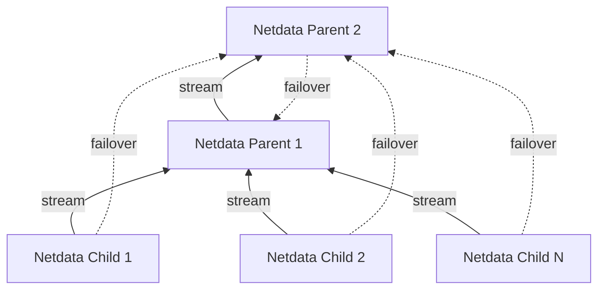

# Clustering and High Availability of Netdata Parents

Netdata supports building Parent clusters of 2+ nodes. Clustering and high availability work like this:

1. All Netdata Children are configured to stream to all Netdata Parents. The first one found working will be used by each Netdata Child, and the others will be automatically used if and when this connection is interrupted.
2. The Netdata Parents are configured to stream to all other Netdata Parents. For each of them, the first-found working will be used and the others will be automatically used if and when this connection is interrupted.

All the Netdata Parents in such a cluster will receive all the metrics of all Netdata Children connected to any of them. They will also receive the metrics all the other Netdata Parents have.

If a Parent node fails, its Child nodes automatically connect to another available Parent node, which then re-streams metrics to all other Parent nodes.

Netdata Cloud will receive registrations for all Netdata Children from all the Netdata Parents. As long as at least one of the Netdata Parents is connected to Netdata Cloud, all the Netdata Children will be available on Netdata Cloud.

Netdata Children need to maintain retention only for the time required to switch Netdata Parents. When Netdata Children connect to a Netdata Parent, they negotiate the available retention and any missing data on the Netdata Parent are replicated from the Netdata Children.

## Restoring a Netdata Parent after maintenance

Given the [replication limitations](/docs/observability-centralization-points/metrics-centralization-points/replication-of-past-samples.md#replication-limitations), special care is needed when restoring a Netdata Parent after some long maintenance work on it.

If the Netdata Children do not have enough retention to replicate the missing data on this Netdata Parent, it is preferable to block access to this Netdata Parent from the Netdata Children, until it replicates the missing data from the other Netdata Parents.

To block access from Netdata Children, and still allow access from other Netdata Parent siblings:

1. Use `iptables` to block access to port 19999 from Netdata Children to the restored Netdata Parent, or
2. Use separate streaming API keys (in `stream.conf`) for Netdata Children and Netdata Parents, and disable the API key used by Netdata Children, until the restored Netdata Parent has been synchronized.

## Duplicating a Parent

The easiest way is to `rsync` the directory `/var/cache/netdata` from the existing Netdata Parent to the new Netdata Parent.

> Important: Starting the new Netdata Parent with default settings, may delete the new files in `/var/cache/netdata` to apply the default disk size constraints. Therefore, it is important to set the right retention settings in the new Netdata Parent before starting it up with the copied files.

To configure retention at the new Netdata Parent, set in `netdata.conf` the following to at least the values the old Netdata Parent has:

- `[db].dbengine tier 0 retention size`, this is the max disk size for `tier0`. The default is 1GiB.
- `[db].dbengine tier 1 retention size`, this is the max disk space for `tier1`. The default is 1GiB.
- `[db].dbengine tier 2 retention size`, this is the max disk space for `tier2`. The default is 1GiB.
