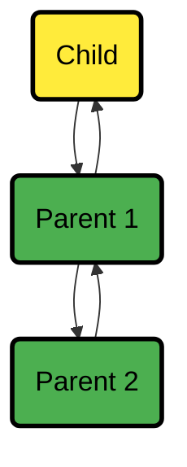

# Replication of Past Samples

:::tip

**What You'll Learn**

How Netdata automatically fills data gaps when Children reconnect to Parents, including replication limitations, configuration options, and monitoring progress.

:::

When your Netdata Child reconnects to a Parent after being offline, replication automatically kicks in. Your Parent gets the metric samples it missed while the Child was disconnected, ensuring you don't see gaps in your charts.

:::note

This same process works between Parents too. When Parents sync with each other, one acts as the sender and the other as the receiver.

:::

## How Replication Works

When multiple Netdata Parents are available, the replication happens in sequence, like in the following diagram:

### Replication Process

As shown in the diagram:

1. **Connections establish immediately** after a Netdata child connects to any of the Netdata Parents.
2. **Each connection pair completes replication** (Child→Parent1, Parent1→Parent2) on the receiving side and then initiates replication on the sending side.
3. **Replication fills gaps up to now**, and the sending side immediately enters streaming mode, without leaving any gaps on the samples of the receiving side.
4. **Each connection negotiates retention** to back-fill as much data as necessary.

## Understanding Limitations

:::important

**Key Replication Constraints**

The current implementation is optimized to replicate small durations and have minimal impact during reconnecting. Understanding these limitations helps you plan your monitoring setup effectively.

:::

<strong>What Can and Can’t Be Replicated</strong>
 

1. **Append-only replication**.
   Replication can only append samples to metrics. Only missing samples at the end of each time-series are replicated.

2. **Tier0 samples only**.
   Only `tier0` samples are replicated. Samples of higher tiers in Netdata are derived from `tier0` samples, and therefore there is no mechanism for ingesting them directly. This means that the maximum retention that can be replicated across Netdata is limited by the samples available in `tier0` of the sending Netdata.

3. **Active metrics only**.
   Only samples of metrics that are currently being collected are replicated. Archived metrics (or even archived nodes) will be replicated when and if they are collected again.

:::note

Netdata archives metrics 1 hour after they stop being collected, so Netdata Parents may miss data only if Netdata Children are disconnected for more than an hour from their Parents.

:::

 

## Configuration Options

Configure these options in `netdata.conf` on the respective systems.

<strong>Receiving Side Configuration (Netdata Parent)</strong>
 

| Setting                   | Description                                                                                                                      | Default |
|---------------------------|----------------------------------------------------------------------------------------------------------------------------------|---------|
| `[db].replication period` | Sets the maximum time window for replication. Remember, you're also limited by how much tier0 data your Child systems have kept. | 1 day   |

<strong>Sending Side Configuration (Netdata Children or clustered Parents)</strong>
 

| Setting                              | Description                                                                                                                                                                                                                                                                                                         | Default                   |
|--------------------------------------|---------------------------------------------------------------------------------------------------------------------------------------------------------------------------------------------------------------------------------------------------------------------------------------------------------------------|---------------------------|
| `[db].replication threads`           | Controls how many parallel threads handle replication. Each thread can handle about two million samples per second, so more threads can speed up replication between Parents with lots of data.                                                                                                                     | 1 thread                  |
| `[db].cleanup obsolete charts after` | Controls how long metrics remain available for replication after collection stops. If you expect Parent maintenance to last longer than 1 hour, increase this setting. Just be aware that in dynamic environments with lots of short-lived metrics, this can increase RAM usage since metrics stay "active" longer. | 1 hour (3600 seconds) |

## Monitoring Replication Progress

:::note

**Where to Check Replication Status**

You can monitor how replication is progressing through both your dashboard and API endpoints to make sure your data synchronization is working correctly.

:::

### Dashboard Monitoring

Check your replication progress right in your dashboard using the Netdata Function `Netdata-streaming`, under the `Top` tab.

### API Monitoring

You can also get the same information via the API endpoint `http://agent-ip:19999/api/v2/node_instances` on both your Parents and Children.
