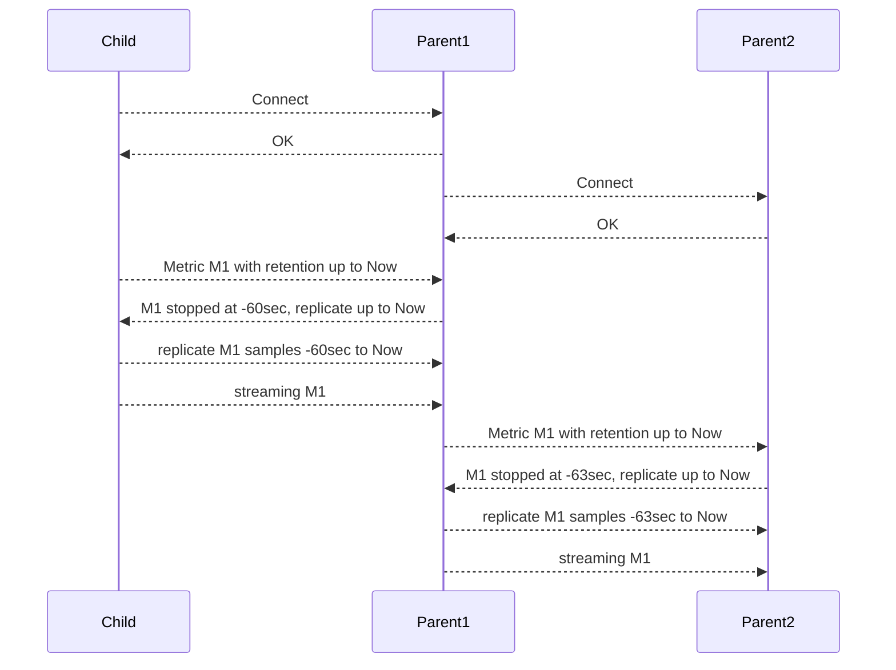

# Replication of Past Samples

Replication is triggered when a Netdata Child connects to a Netdata Parent. It replicates the latest samples of collected metrics a Netdata Parent may be missing. The goal of replication is to back-fill samples that were collected between disconnects and reconnects, so that the Netdata Parent does not have gaps on the charts for the time Netdata Children were disconnected.

The same replication mechanism is used between Netdata Parents (the sending Netdata is treated as a Child and the receiving Netdata as a Parent).

## Replication Limitations

The current implementation is optimized to replicate small durations and have minimal impact during reconnecting. As a result, it has the following limitations:

1. Replication can only append samples to metrics. Only missing samples at the end of each time-series are replicated.

2. Only `tier0` samples are replicated. Samples of higher tiers in Netdata are derived from `tier0` samples, and therefore there is no mechanism for ingesting them directly. This means that the maximum retention that can be replicated across Netdata is limited by the samples available in `tier0` of the sending Netdata.

3. Only samples of metrics that are currently being collected are replicated. Archived metrics (or even archived nodes) will be replicated when and if they are collected again. Netdata archives metrics 1 hour after they stop being collected, so Netdata Parents may miss data only if Netdata Children are disconnected for more than an hour from their Parents.

When multiple Netdata Parents are available, the replication happens in sequence, like in the following diagram.

As shown in the diagram:

1. All connections are established immediately after a Netdata child connects to any of the Netdata Parents.
2. Each pair of connections (Child->Parent1, Parent1->Parent2) complete replication on the receiving side and then initiate replication on the sending side.
3. Replication pushes data up to Now, and the sending side immediately enters streaming mode, without leaving any gaps on the samples of the receiving side.
4. On every pair of connections, replication negotiates the retention of the receiving party to back-fill as much data as necessary.

## Configuration options for Replication

The following `netdata.conf` configuration parameters affect replication.

On the receiving side (Netdata Parent):

- `[db].replication period` limits the maximum time to be replicated. The default is 1 day. Keep in mind that replication is also limited by the `tier0` retention the sending side has.

On the sending side (Netdata Children, or Netdata Parent when parents are clustered):

- `[db].replication threads` controls how many concurrent threads will be replicating metrics. The default is 1. Usually the performance is about two million samples per second per thread, so increasing this number may allow replication to progress faster between Netdata Parents.

- `[db].cleanup obsolete charts after` controls for how much time after metrics stop being collected will not be available for replication. The default is 1 hour (3600 seconds). If you plan to have scheduled maintenance on Netdata Parents of more than 1 hour, we recommend increasing this setting. Keep in mind, however, that increasing this duration in highly ephemeral environments can have an impact on RAM utilization, since metrics will be considered as collected for longer durations.

## Monitoring Replication Progress

Inbound and outbound replication progress is reported at the dashboard using the Netdata Function `Streaming`, under the `Top` tab.

The same information is exposed via the API endpoint `http://agent-ip:19999/api/v2/node_instances` of both Netdata Parents and Children.
