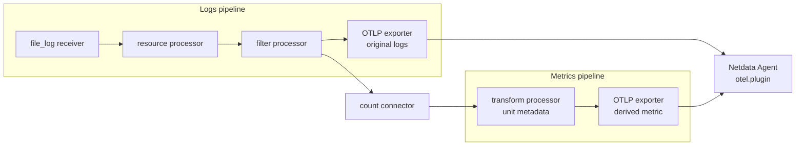

# Create Metrics from OpenTelemetry Logs

An OpenTelemetry Collector can count matching log records and export the result to Netdata as a metric while it continues forwarding the original logs. This example drops health-check noise and charts warning and error records per second.

Use this for operational trend monitoring, not durable audit counts. The count connector emits monotonic delta sums, which Netdata rate-normalizes over the chart interval. Collector restarts and pipeline delivery failures can affect the result.

:::caution

The count connector and filter processor have alpha stability in OpenTelemetry Collector Contrib `0.157.0`, the version used to validate this example. Review their upstream stability before upgrading the Collector.

:::

Before you begin, complete the prerequisites and local exporter setup in [Ingest OpenTelemetry Metrics and Logs](/docs/opentelemetry/otlp-ingestion.md), including the Netdata Cloud sign-in required to verify `otel-logs`.

The count connector bridges the logs and metrics pipelines:



## Configure the pipeline

Create `/tmp/netdata-otel-logs-to-metrics-example.log`, then run this Collector configuration on the same host as the Netdata Agent:

```yaml
receivers:
  file_log/netdata_example:
    include: [/tmp/netdata-otel-logs-to-metrics-example.log]
    start_at: beginning

processors:
  resource/netdata_example:
    attributes:
      - key: service.name
        value: netdata-otel-logs-to-metrics-example
        action: upsert
  filter/drop_health_checks:
    error_mode: ignore
    log_conditions:
      - 'IsMatch(log.body, "(?i)health.?check")'
  transform/count_unit:
    error_mode: ignore
    metric_statements:
      - context: metric
        statements:
          - 'set(metric.unit, "{record}") where metric.name == "application.warning.log.count"'

connectors:
  count/warnings:
    logs:
      application.warning.log.count:
        description: Warning and error log records.
        conditions:
          - 'IsMatch(log.body, "(?i)\\b(warn|error)\\b")'

exporters:
  otlp_grpc/netdata:
    endpoint: "127.0.0.1:4317"
    tls:
      insecure: true

service:
  pipelines:
    logs:
      receivers: [file_log/netdata_example]
      processors: [resource/netdata_example, filter/drop_health_checks]
      exporters: [count/warnings, otlp_grpc/netdata]
    metrics:
      receivers: [count/warnings]
      processors: [transform/count_unit]
      exporters: [otlp_grpc/netdata]
```

The logs pipeline sends records through the resource and filter processors, then to both the count connector and Netdata. The metrics pipeline receives the connector's delta sum, adds the `{record}` unit, and sends it to Netdata. The configuration is validated with the Collector version stated above.

## Verify logs and the derived metric

After the Collector starts, append representative records:

```bash
printf '%s\n' \
  'INFO health-check ready' \
  'INFO request completed' \
  'WARN response latency is high' \
  'ERROR request failed' \
  >> /tmp/netdata-otel-logs-to-metrics-example.log
```

Expected results:

- The health-check record is dropped and does not reach Netdata or the counter.
- The other three records appear under the `otel-logs` source after you choose `netdata-otel-logs-to-metrics-example` with the **Services** selector.
- The warning and error records contribute to the metric named `application.warning.log.count`.
- Netdata creates the `otel.application.warning.log.count` chart context and displays the rate in `{record}/s`.

The exact rate depends on the Collector batch and Netdata chart intervals, so do not expect the chart to show the literal value `2`.

If the chart is absent:

1. Confirm that `count/warnings` is an exporter in the logs pipeline and a receiver in the metrics pipeline.
2. Inspect the Collector for connector, OTTL, and export errors, then inspect the Agent journal for OTLP ingestion errors.
3. Temporarily add a `debug` exporter with `verbosity: detailed` to the logs pipeline and verify that the body matches the connector condition. Remove the exporter after diagnosis because detailed log output can expose sensitive record content.

To alert on the derived chart, use the standard [Netdata alert configuration reference](/src/health/REFERENCE.md). For the shared endpoint, security, and basic metrics/logs workflows, see [Ingest OpenTelemetry Metrics and Logs](/docs/opentelemetry/otlp-ingestion.md).
