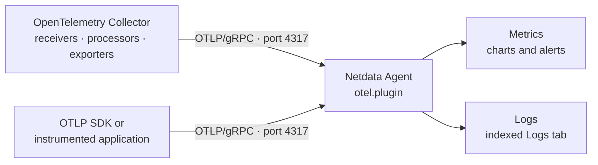

# Ingest OpenTelemetry Metrics and Logs

Use Netdata's OTLP/gRPC endpoint when an application already emits OpenTelemetry data or an OpenTelemetry Collector is already part of your observability pipeline. For host and application metrics that Netdata can collect directly, the native collector is usually simpler and exposes purpose-built charts and alerts.

## Choose the collection path

| Situation                                                                           | Recommended path                                                                             |
|:------------------------------------------------------------------------------------|:---------------------------------------------------------------------------------------------|
| Netdata is the only consumer of host or application metrics                         | Use Netdata's [native collectors](/src/collectors/COLLECTORS.md)                             |
| An application already emits OTLP, or a Collector fans data out to several backends | Export OTLP/gRPC to Netdata with this guide                                                  |
| Network devices send syslog                                                         | Use the dedicated [OpenTelemetry Collector syslog setup](/docs/npm/syslog/otel-collector.md) |

The Netdata Agent receives OTLP metrics and logs. It does not currently expose a public trace-ingestion workflow.

## How data flows



## What you need

- A Netdata Agent on Linux or macOS with `otel.plugin` available. Official builds include it. Linux source installs using `netdata-installer.sh` require a compatible Rust toolchain and `--enable-plugin-otel`; on macOS, the installer enables the plugin automatically when it finds a compatible Rust toolchain.
- An OTLP/gRPC source. The examples use [OpenTelemetry Collector Contrib](https://github.com/open-telemetry/opentelemetry-collector-releases) because the `host_metrics` and `file_log` receivers are Contrib components.
- Network access from the sender to the Agent's endpoint.
- For log verification, a Netdata Cloud account and sign-in. The `otel-logs` view is access-gated.

The maintained examples are validated with OpenTelemetry Collector Contrib `0.157.0`. If you run an older release, check that release's component identifiers before copying the configuration.

For production pipelines beyond these smoke tests, continue with [Metrics Collection](/docs/opentelemetry/metrics-collection.md), [Logs Collection](/docs/opentelemetry/logs-collection.md), and [Transformations](/docs/opentelemetry/transformations.md). Each page links its pinned examples to the complete upstream Collector documentation.

The plugin starts automatically and listens on the IPv4 loopback endpoint `127.0.0.1:4317`. The examples below put the Collector and Agent on the same host and intentionally disable TLS only for that loopback connection.

## Export to the local Agent

Add this exporter to the Collector configuration:

```yaml
exporters:
  otlp_grpc/netdata:
    endpoint: "127.0.0.1:4317"
    tls:
      insecure: true
```

Use the `otlp_grpc` exporter and port `4317`. Netdata does not accept the `otlp_http` exporter or OTLP/HTTP port `4318`. Use `127.0.0.1` rather than `localhost` if the latter resolves to IPv6.

## Smoke-test Host Metrics

If you already use native Netdata host collectors, this pipeline duplicates some host metrics. Use it as a smoke test or when hostmetrics is already part of a shared OpenTelemetry pipeline.

```yaml
receivers:
  host_metrics:
    collection_interval: 10s
    scrapers:
      cpu: {}
      memory: {}
      network: {}

exporters:
  otlp_grpc/netdata:
    endpoint: "127.0.0.1:4317"
    tls:
      insecure: true

service:
  pipelines:
    metrics:
      receivers: [host_metrics]
      exporters: [otlp_grpc/netdata]
```

Save the configuration and start or reload the Collector using the service controls for your installation.

In Netdata, open the node's Metrics tab and search for contexts such as `otel.system.cpu.time` or `otel.system.memory.usage`. A successful TCP connection alone is not proof of ingestion; verify an actual chart.

## Smoke-test logs with `file_log`

Create a readable input file before starting this pipeline:

```bash
printf '%s\n' 'INFO netdata OpenTelemetry filelog smoke test' >> /tmp/netdata-otel-example.log
```

Then run this Collector configuration:

```yaml
receivers:
  file_log/netdata_example:
    include: [/tmp/netdata-otel-example.log]
    start_at: beginning

processors:
  resource/netdata_example:
    attributes:
      - key: service.name
        value: netdata-otel-filelog-example
        action: upsert

exporters:
  otlp_grpc/netdata:
    endpoint: "127.0.0.1:4317"
    tls:
      insecure: true

service:
  pipelines:
    logs:
      receivers: [file_log/netdata_example]
      processors: [resource/netdata_example]
      exporters: [otlp_grpc/netdata]
```

In Netdata, open the node's Logs tab, select the `otel-logs` source, and choose `netdata-otel-filelog-example` with the **Services** selector. To filter by the stored field instead, use `resource.attributes.service.name = netdata-otel-filelog-example`. The `service.namespace` and `service.name` resource attributes identify log streams, so set them consistently in production pipelines.

## Accept remote senders securely

The default loopback endpoint is the safe choice for a same-host Collector. To receive remote OTLP traffic:

1. Open `otel.yaml` with [`edit-config`](/docs/netdata-agent/configuration/README.md#edit-configuration-files) and bind `endpoint.path` to an address reachable by the sender.
2. Configure a server certificate and key. Add `endpoint.tls_ca_cert_path` to require client certificates.
3. Restrict port `4317` with network access controls.
4. Restart the Netdata Agent to apply the `otel.yaml` changes.
5. Configure matching CA and, for mutual TLS, client certificate settings in the sender.

Do not expose a plaintext `0.0.0.0:4317` listener. The optional `auth.enabled` setting requires an `X-Scope-OrgID` header for log tenant selection, but it does not authenticate the sender. See the [OpenTelemetry plugin reference](/src/crates/otel-plugin/README.md) for the full public endpoint, tenant, retention, mapping, and remote-storage configuration.

## Troubleshoot the pipeline

- **The plugin is absent:** official builds include it. For a source install, confirm that a compatible Rust toolchain is available; Linux installs using `netdata-installer.sh` also require `--enable-plugin-otel`.
- **The plugin does not start:** check the Agent journal for strict `otel.yaml` or `NETDATA_OTEL_CFG_*` validation errors.
- **The Collector or SDK connects but data is absent:** confirm that it uses OTLP/gRPC on `4317`; SDKs commonly select it with `OTEL_EXPORTER_OTLP_PROTOCOL=grpc`. Then check both sender and Agent logs for rejected exports. On a systemd-based Agent host, query recent plugin messages with `journalctl SYSLOG_IDENTIFIER=otel-plugin SYSLOG_IDENTIFIER=otel-plugin/ingestor --since "-10 min"`.
- **A metric is absent:** exponential histograms are not currently ingested. For other metrics, inspect mapping errors and search for the `otel.<metric-name>` context.
- **Some logs are absent:** by default, Netdata accepts log timestamps from up to 24 hours in the past through 10 minutes in the future. Records outside this window are rejected. Netdata reports rejected records through OTLP `partial_success`; whether that message is visible depends on the sender.

For plugin-specific diagnosis, use the [OpenTelemetry plugin reference](/src/crates/otel-plugin/README.md). To derive a metric from matching log records, continue with [Create metrics from OpenTelemetry logs](/docs/opentelemetry/logs-to-metrics.md).
