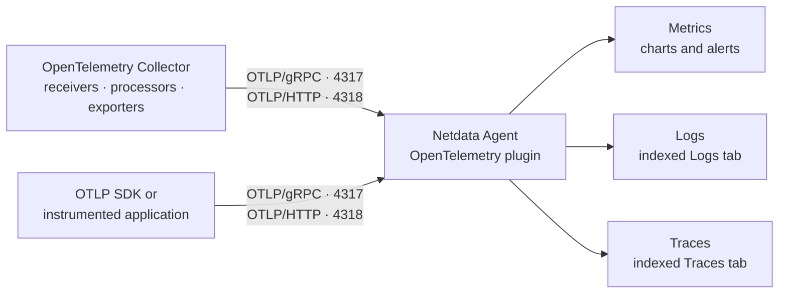

# Ingest OpenTelemetry Metrics, Logs, and Traces

Use Netdata's OTLP endpoints — OTLP/gRPC and OTLP/HTTP — when an application already emits OpenTelemetry data or an OpenTelemetry Collector is already part of your observability pipeline. For host and application metrics that Netdata can collect directly, the native collector is usually simpler and exposes purpose-built charts and alerts.

## Choose the collection path

| Situation                                                                           | Recommended path                                                                             |
|:------------------------------------------------------------------------------------|:---------------------------------------------------------------------------------------------|
| Netdata is the only consumer of host or application metrics                         | Use Netdata's [native collectors](/src/collectors/COLLECTORS.md)                             |
| An application already emits OTLP, or a Collector fans data out to several backends | Export OTLP to Netdata over gRPC or HTTP, as described below                                 |
| Network devices send syslog                                                         | Use the dedicated [OpenTelemetry Collector syslog setup](/docs/npm/syslog/otel-collector.md) |

The Netdata Agent receives OTLP metrics, logs, and traces. Traces are stored on the receiving Agent under their own retention settings, the `traces` section of `otel.yaml`, and explored in the Traces tab; see [Send traces](/docs/opentelemetry/otlp-ingestion.md#send-traces) below and [Trace Storage and Retention](/docs/opentelemetry/trace-storage-and-retention.md).

## How data flows


```mermaid
flowchart LR
    collector["OpenTelemetry Collector<br/>receivers · processors · exporters"] -->|"OTLP/gRPC · 4317<br/>OTLP/HTTP · 4318"| plugin["Netdata Agent<br/>OpenTelemetry plugin"]
    sdk["OTLP SDK or<br/>instrumented application"] -->|"OTLP/gRPC · 4317<br/>OTLP/HTTP · 4318"| plugin
    plugin --> metrics["Metrics<br/>charts and alerts"]
    plugin --> logs["Logs<br/>indexed Logs tab"]
    plugin --> traces["Traces<br/>indexed Traces tab"]
```

## What you need

- A Netdata Agent with the OpenTelemetry plugin. Linux native DEB and RPM packages install it as a dependency of `netdata`, static builds bundle it (except the 32-bit ARMv6 build), and all Docker images include it. macOS kickstart installs provision a Rust toolchain and build it; if no adequate toolchain ends up available, the install continues with a warning and without the plugin. Linux source builds need `--enable-plugin-otel`. It is not available on Windows or FreeBSD. Wherever it is present, Netdata starts it automatically.
- An OTLP source — gRPC or HTTP. The examples use [OpenTelemetry Collector Contrib](https://github.com/open-telemetry/opentelemetry-collector-releases) because the `host_metrics` and `file_log` receivers are Contrib components.
- Network access from the sender to the Agent's endpoint.
- For log and trace verification, a Netdata Cloud account and sign-in. The `otel-logs` and `otel-traces` views are access-gated.

The maintained examples are validated with OpenTelemetry Collector Contrib `0.157.0`. Upstream documentation links on these pages follow upstream's latest version, which may be newer than the validated examples; if you run an older release, check that release's component identifiers before copying the configuration.

For production pipelines beyond these smoke tests, continue with [Metrics Collection](/docs/opentelemetry/metrics-collection.md), [Logs Collection](/docs/opentelemetry/logs-collection.md), and [Transformations](/docs/opentelemetry/transformations.md). Each page links its examples to the complete upstream Collector documentation.

The plugin starts automatically and listens on two IPv4 loopback endpoints: `127.0.0.1:4317` for OTLP/gRPC and `127.0.0.1:4318` for OTLP/HTTP. The examples below put the Collector and Agent on the same host and intentionally disable TLS only for that loopback connection.

## Export to the local Agent

Add one of these exporters to the Collector configuration:

```yaml
exporters:
  otlp_grpc/netdata:
    endpoint: "127.0.0.1:4317"
    tls:
      insecure: true
```

```yaml
exporters:
  otlphttp/netdata:
    endpoint: "http://127.0.0.1:4318"
    tls:
      insecure: true
```

Both transports work: `otlp_grpc` sends to port `4317`; `otlphttp` sends OTLP/HTTP to port `4318`, where the `endpoint` is a full URL. The HTTP receiver serves `POST /v1/logs`, `POST /v1/traces`, and `POST /v1/metrics` and accepts `application/x-protobuf` or `application/json` bodies. Use `127.0.0.1` rather than `localhost` if the latter resolves to IPv6.

An SDK exporting directly can keep its OTLP/HTTP default: set `OTEL_EXPORTER_OTLP_ENDPOINT=http://127.0.0.1:4318` with `OTEL_EXPORTER_OTLP_PROTOCOL=http/protobuf` (or `http/json`). For gRPC, use `http://127.0.0.1:4317` with `OTEL_EXPORTER_OTLP_PROTOCOL=grpc`. Because the HTTP receiver is plain HTTP POST, it is also easy to probe with `curl` — post an OTLP JSON body to `/v1/logs` with `Content-Type: application/json`.

## Smoke-test Host Metrics

If you already use native Netdata host collectors, this pipeline duplicates some host metrics. Use it as a smoke test or when hostmetrics is already part of a shared OpenTelemetry pipeline.

```yaml
receivers:
  host_metrics:
    collection_interval: 10s
    scrapers:
      cpu: {}
      memory: {}
      network: {}

exporters:
  otlp_grpc/netdata:
    endpoint: "127.0.0.1:4317"
    tls:
      insecure: true

service:
  pipelines:
    metrics:
      receivers: [host_metrics]
      exporters: [otlp_grpc/netdata]
```

Save the configuration and start or reload the Collector using the service controls for your installation.

In Netdata, open the node's Metrics tab and search for contexts such as `otel.system.cpu.time` or `otel.system.memory.usage`. A successful TCP connection alone is not proof of ingestion; verify an actual chart.

## Smoke-test logs with `file_log`

Create a readable input file before starting this pipeline:

```bash
printf '%s\n' 'INFO netdata OpenTelemetry filelog smoke test' >> /tmp/netdata-otel-example.log
```

Then run this Collector configuration:

```yaml
receivers:
  file_log/netdata_example:
    include: [/tmp/netdata-otel-example.log]
    start_at: beginning

processors:
  resource/netdata_example:
    attributes:
      - key: service.name
        value: netdata-otel-filelog-example
        action: upsert

exporters:
  otlp_grpc/netdata:
    endpoint: "127.0.0.1:4317"
    tls:
      insecure: true

service:
  pipelines:
    logs:
      receivers: [file_log/netdata_example]
      processors: [resource/netdata_example]
      exporters: [otlp_grpc/netdata]
```

In Netdata, open the node's Logs tab, select the `otel-logs` source, and choose `netdata-otel-filelog-example` with the **Services** selector. To filter by the stored field instead, use `resource.attributes.service.name = netdata-otel-filelog-example`. The `service.namespace` and `service.name` resource attributes identify log streams, so set them consistently in production pipelines.

## Send traces

Traces come from instrumented applications. Export them to the Agent directly from the OpenTelemetry SDK, or through a Collector that forwards them.

- **SDK:** set `OTEL_EXPORTER_OTLP_ENDPOINT=http://127.0.0.1:4317` and `OTEL_EXPORTER_OTLP_PROTOCOL=grpc` in the application's environment, or point it at the HTTP receiver with `OTEL_EXPORTER_OTLP_ENDPOINT=http://127.0.0.1:4318` and `OTEL_EXPORTER_OTLP_PROTOCOL=http/protobuf` (or `http/json`). Many SDKs default to OTLP/HTTP; the Agent accepts both transports.
- **Collector:** add the exporter above to a `traces` pipeline. A Collector on the Agent's host cannot listen on the addresses the Agent already uses (`127.0.0.1:4317` and `127.0.0.1:4318` by default), so give its `otlp` receiver another port and point the applications at it:

  ```yaml
  exporters:
    otlp_grpc/netdata:
      endpoint: "127.0.0.1:4317"
      tls:
        insecure: true

  receivers:
    otlp:
      protocols:
        grpc:
          endpoint: "127.0.0.1:4319"

  service:
    pipelines:
      traces:
        receivers: [otlp]
        exporters: [otlp_grpc/netdata]
  ```

Set the `service.name` resource attribute in every application; it names the service each span belongs to. The spans appear in the Traces tab. How they are stored and kept is in [Trace Storage and Retention](/docs/opentelemetry/trace-storage-and-retention.md).

## Accept remote senders securely

The default loopback endpoints are the safe choice for a same-host Collector. To receive remote OTLP traffic, bind
beyond loopback with TLS or mutual TLS and restrict ports `4317` and `4318` with network controls — the procedure and certificate
rotation are in [Securing the OTLP Endpoint](/docs/opentelemetry/securing-the-otlp-endpoint.md). See
the [OpenTelemetry plugin reference](/src/crates/otel-plugin/README.md) for every option.

## Troubleshoot the pipeline

- **The plugin is absent:** on Linux native packages, confirm the `netdata-plugin-otel` package is installed; on ARMv6 static builds, Windows, and FreeBSD the plugin is not available.
- **The plugin does not start:** check the Agent journal for strict `otel.yaml` or `NETDATA_OTEL_CFG_*` validation errors.
- **The Collector or SDK connects but data is absent:** confirm which transport it uses — OTLP/gRPC on `4317`, or OTLP/HTTP on `4318` targeting `/v1/logs`, `/v1/traces`, or `/v1/metrics` with a `application/x-protobuf` or `application/json` Content-Type. Then check both sender and Agent logs for rejected exports. On a systemd-based Agent host, query recent plugin messages with `journalctl SYSLOG_IDENTIFIER=otel-plugin SYSLOG_IDENTIFIER=otel-plugin/ingestor --since "-10 min"`.
- **A metric is absent:** exponential histograms are not currently ingested. For other metrics, inspect mapping errors and search for the `otel.<metric-name>` context.
- **Some logs are absent:** by default, Netdata accepts log timestamps from up to 24 hours in the past through 10 minutes in the future. Records outside this window are rejected. Netdata reports rejected records through OTLP `partial_success`; whether that message is visible depends on the sender.
- **Some spans are absent:** by default, Netdata accepts a span only if it started no more than 24 hours ago and ends no more than 10 minutes in the future; a span without an end time is judged by its start. Netdata reports rejected spans through OTLP `partial_success`, whose visibility depends on the sender, and logs a warning in the Agent journal.

For plugin-specific diagnosis, use the [OpenTelemetry plugin reference](/src/crates/otel-plugin/README.md). To derive a metric from matching log records, continue with [Create metrics from OpenTelemetry logs](/docs/opentelemetry/logs-to-metrics.md).
