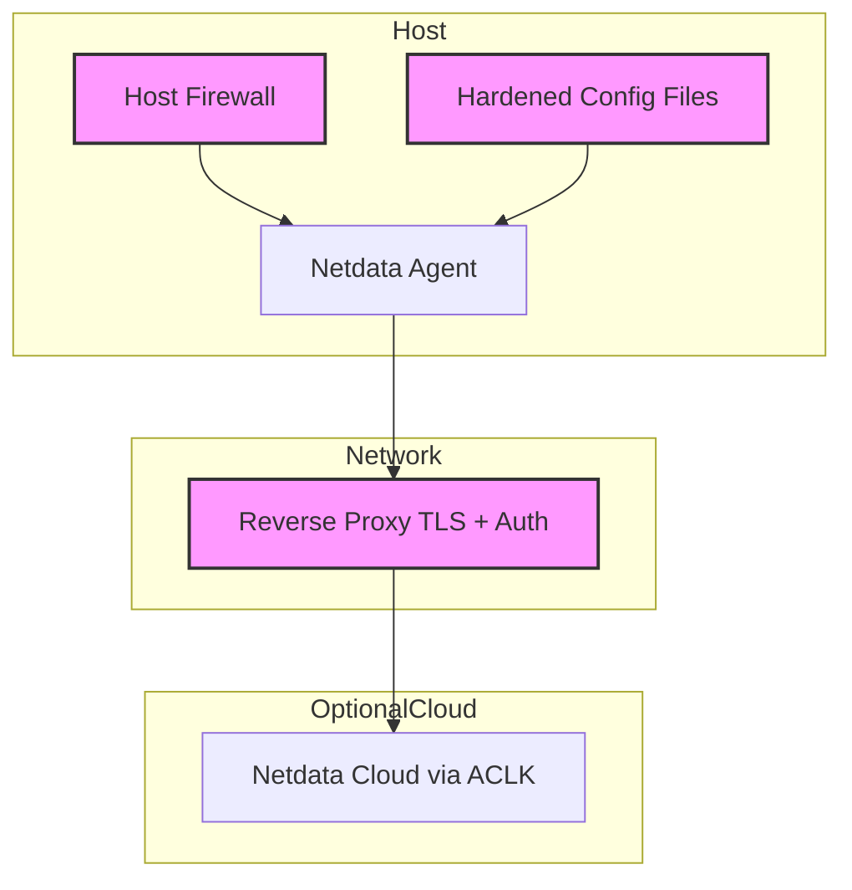

# Netdata Agent Hardening Guide

This document outlines verified security best practices for deploying and operating the **Netdata Agent** in production and sensitive environments. It applies to bare-metal, virtual machine, container, and Kubernetes deployments.

All recommendations in this guide are based on officially maintained Netdata documentation and configurations. They reflect features and deployment patterns supported by the Netdata engineering team, as published in [Netdata Learn](https://learn.netdata.cloud) and [Netdata GitHub](https://github.com/netdata/netdata) repository.

## Table of Contents

- [Audience](#audience)
- [Scope](#scope)
- [Threat Model and Risk Assessment](#threat-model-and-risk-assessment)
- [Secure Deployment Architecture](#secure-deployment-architecture)
- [Security Hardening Areas](#security-hardening-areas)
- [Installation Security](#installation-security)
- [Container Security](#container-security)
- [Network Security and TLS](#network-security-and-tls)
- [File and Directory Permissions](#file-and-directory-permissions)
- [Plugin and Collector Security](#plugin-and-collector-security)
- [Updates and Patch Management](#updates-and-patch-management)
- [Kubernetes Considerations](#kubernetes-considerations)
- [Compliance Mapping](#compliance-mapping)
- [Final Notes](#final-notes)

## Audience

This guide is intended for DevOps engineers, SREs, and system administrators deploying the Netdata Agent in production or security-sensitive environments.

## Scope

| Deployment Target                | Included |
|----------------------------------|----------|
| Linux / macOS / FreeBSD hosts    | ✓        |
| Docker and Podman containers     | ✓        |
| Kubernetes clusters              | ✓        |
| Netdata Cloud                    | ✗        |

## Threat Model and Risk Assessment

| Threat Vector               | Risk Level | Mitigation Summary                                  |
|----------------------------|------------|-----------------------------------------------------|
| Open dashboard (port 19999)| Critical   | TLS, firewall, reverse proxy + auth                 |
| Privilege escalation       | High       | Run as `netdata` user; use service hardening        |
| Network eavesdropping      | High       | TLS for web and streaming                          |
| Plugin misuse              | Medium     | Disable unused plugins, control access              |
| Metadata exposure          | Medium     | Sanitize hostnames, disable unneeded labels         |
| Update compromise          | Medium     | Use official repos, verify sources, restrict sudo   |

## Secure Deployment Architecture



## Security Hardening Areas

| Area                     | Description                                                                 |
|--------------------------|-----------------------------------------------------------------------------|
| Installation Security    | Use official installer, verify source                                       |
| Container Hardening      | Limit privileges, isolate volumes, verify image                             |
| TLS and Network Access   | Encrypt traffic, restrict port 19999 access                                 |
| File Permissions         | Secure `/etc/netdata`, `/var/lib/netdata`, logs                             |
| Plugin Control           | Disable unused collectors and plugins                                       |
| Patch Management         | Apply updates regularly, validate before rollout                            |
| Kubernetes Settings      | Apply pod security policies, RBAC, network policies                         |

## Installation Security

:::tip Use the official Netdata installer
Run the one-line installer from https://my-netdata.io/kickstart.sh and inspect it first.
:::

```bash
wget https://my-netdata.io/kickstart.sh -O netdata-kickstart.sh
less netdata-kickstart.sh
bash netdata-kickstart.sh --dont-wait --disable-telemetry
```

## Container Security

Use the official `netdata/netdata` image. Apply the following flags for Docker:

```bash
docker run -d --name=netdata \
  --cap-drop=ALL \
  --cap-add=SYS_PTRACE \
  --read-only \
  --security-opt no-new-privileges \
  -v netdatalib:/var/lib/netdata \
  -v /proc:/host/proc:ro \
  -v /sys:/host/sys:ro \
  -v /etc/os-release:/host/etc/os-release:ro \
  -e NETDATA_CLAIM_TOKEN=... \
  netdata/netdata:latest
```

## Network Security and TLS

1. Use a reverse proxy (nginx, Caddy) with HTTPS and auth.
2. Or enable native TLS in `netdata.conf`:

```ini
[web]
  ssl certificate = /etc/netdata/ssl/cert.pem
  ssl key = /etc/netdata/ssl/key.pem
  enable gzip compression = yes
```

3. Restrict access to port `19999`:

```bash
ufw allow from 192.168.0.0/16 to any port 19999
```

## File and Directory Permissions

| Path                     | Ownership         | Permissions |
|--------------------------|-------------------|-------------|
| `/etc/netdata/`          | `root:netdata`    | `0750`      |
| `/var/lib/netdata`       | `netdata:netdata` | `0750`      |
| `/var/log/netdata`       | `netdata:netdata` | `0640`      |

Use:

```bash
chown -R root:netdata /etc/netdata
chmod -R 0750 /etc/netdata
```

## Plugin and Collector Security

1. Disable unused collectors:

```bash
# Edit /etc/netdata/go.d.conf
enabled: no
modules:
  mysql: yes
```

2. Disable Python plugins if unneeded:

```ini
[plugins]
  python.d = no
```

3. Use sudo wrappers with care, and only for specific plugins.

## Updates and Patch Management

- Subscribe to [Netdata GitHub releases](https://github.com/netdata/netdata/releases)
- Enable auto-updates only if testing pipeline exists.

```bash
/usr/libexec/netdata/netdata-updater.sh --not-running-from-cron
```

:::tip

Back up `/etc/netdata` before upgrades.

:::

## Kubernetes Considerations

- Use the [official Netdata Helm chart](https://learn.netdata.cloud/docs/installation/install-on-specific-environments/kubernetes/)
- Apply:

```yaml
securityContext:
  runAsUser: 201
  readOnlyRootFilesystem: true
  allowPrivilegeEscalation: false
```

- Set `resources`, `networkPolicy`, and `RBAC` minimally.

## Compliance Mapping

| Control Area          | Supported Frameworks                     |
|-----------------------|-------------------------------------------|
| Access Controls       | SOC 2, ISO 27001, HIPAA                   |
| TLS Encryption        | PCI-DSS, GDPR, ISO 27001                 |
| Logging & Monitoring  | SOC 2, NIS2                              |
| Least Privilege       | SOC 2, ISO 27001                         |
| Secure Configuration  | All major frameworks                     |

## Final Notes

- Do not expose dashboards to the public internet without authentication.
- Periodically audit users, plugins, and network exposure.
- For full Netdata security, also review the [Cloud Hardening Guide](/docs/netdata-cloud/security/cloud-hardening.md).

For updates:
- [Netdata Learn](https://learn.netdata.cloud)
- [Netdata GitHub](https://github.com/netdata/netdata)
- [Security Advisories](https://github.com/netdata/netdata/security/advisories)