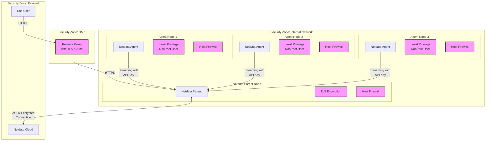
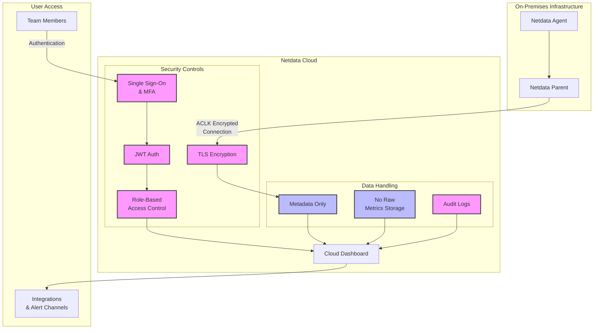

# Netdata Cloud Hardening Guide

This document outlines security best practices for deploying and operating **Netdata Cloud** securely. It focuses on protecting sensitive telemetry metadata, user identity, configuration access, and the interaction between Netdata Cloud and the Netdata Agents connected to it.

All recommendations in this guide are based on official Netdata documentation, supported configurations, and real-world deployment patterns. It does not include hardening practices for the Netdata Agent itself. For agent-level security, refer to the [Netdata Agent Hardening Guide](/docs/netdata-agent/security/agent-hardening.md).

## Table of Contents

- [Audience](#audience)
- [Scope](#scope)
- [Threat Model and Risk Assessment](#threat-model-and-risk-assessment)
- [Secure Architecture Overview](#secure-architecture-overview)
- [Security Hardening Areas](#security-hardening-areas)
- [TL;DR: Hardening Checklist](#tldr-hardening-checklist)
- [Netdata Cloud Security Controls](#netdata-cloud-security-controls)
- [Authentication and RBAC](#authentication-and-rbac)
- [Alert Notification Security](#alert-notification-security)
- [Metadata and Privacy Considerations](#metadata-and-privacy-considerations)
- [Change Management and Auditing](#change-management-and-auditing)
- [Compliance Mapping](#compliance-mapping)
- [Final Notes](#final-notes)

## Audience

Intended for infrastructure engineers, platform security teams, and IT administrators responsible for securely deploying, integrating, and managing Netdata Cloud within production or compliance-driven environments.

## Scope

This document applies to:

| Environment | Included |
|-------------|----------|
| [Netdata Cloud (SaaS)](https://app.netdata.cloud) and its web dashboard | ✓ |
| Cloud-to-Agent interactions (including Netdata Parents) | ✓ |
| Optional on-premises or private-hosted Netdata Cloud setups | ✓ |
| Netdata Agent security (covered in separate guide) | ✗ |

## Threat Model and Risk Assessment

:::tip

These threat vectors are validated against current Netdata Cloud features and documentation.

:::

| Threat Vector | Description | Risk Level | Primary Mitigations |
|---------------|-------------|------------|---------------------|
| Unauthorized Dashboard Access | Unauthenticated access to Netdata Cloud UI | **High** | SSO, MFA, RBAC |
| Man-in-the-Middle Attacks | Interception of ACLK connections | **High** | TLS encryption (ACLK) |
| Credential Theft | Compromised login credentials | **High** | MFA, SSO, short session duration |
| Excessive Permission Grants | Users with unnecessary privileges | **Medium** | RBAC, Room-level access segregation |
| Alert Channel Compromise | Misconfigured webhooks or leaked tokens | **Medium** | HTTPS, token rotation |
| Metadata Exposure | Internal system names exposed via Cloud | **Medium** | Custom node naming, label sanitization |

## Secure Architecture Overview

:::tip 

Diagram
This architecture ensures secure communication paths while protecting internal systems.

:::



## Security Hardening Areas

| Section | Purpose | Risk Level |
|--------|---------|------------|
| **1. Secure Agent-to-Cloud Connection** | Enforce encrypted streaming and access control policies between Agents/Parents and Cloud. | **Critical** |
| **2. Authentication and SSO** | Use identity providers and enable SSO or MFA to restrict access. | **Critical** |
| **3. Role-Based Access Control (RBAC)** | Assign least-privilege roles to team members within Netdata Cloud Rooms. | **High** |
| **4. Cloud Configuration Management** | Review change history for dashboards, alerts, and spaces. | **Medium** |
| **5. Alert Notification Security** | Secure all alert endpoints and notification channels. | **High** |
| **6. External Access Protection** | Secure the Cloud UI with SSO, enforce session expiration policies. | **Critical** |
| **7. Integration Security** | Secure third-party endpoints (e.g., Slack, PagerDuty) with proper tokens. | **Medium** |
| **8. Metadata Privacy** | Limit what metadata is collected by Agents and uploaded to Cloud. | **Medium** |
| **9. Telemetry and Analytics Opt-Out** | Disable usage telemetry if needed for compliance. | **Low** |
| **10. Compliance Mapping** | Align usage of Netdata Cloud with frameworks such as SOC 2, ISO 27001, GDPR, etc. | **Medium** |

## TL;DR: Hardening Checklist

| Area | Recommendation | Risk Level | Notes |
|--------------------------|-------------------------------------------------------------------------------------------------------|----------|-------|
| Connection Security | Ensure all connected Netdata Parents stream over TLS. | **Critical** | TLS is enforced by default |
| Dashboard Access | Use SSO or SAML integration. Require MFA if supported. | **Critical** | |
| RBAC | Create distinct Rooms and assign only the roles needed. | **High** | |
| Notification Channels | Use HTTPS endpoints and secure tokens. | **High** | |
| Cloud Settings Reviews | Regularly audit alert rules and custom dashboards. | **Medium** | |
| Agent Discovery Control | Disable automatic Cloud registration unless needed. | **Medium** | |
| Custom Dashboards | Avoid exposing sensitive identifiers in shared dashboards. | **Medium** | |
| Account Protection | Use strong passwords and enforce idle timeouts. | **Critical** | |
| Audit Events | Review audit logs available on Netdata Cloud. | **High** | Business tier only |
| Data Sovereignty | Use on-prem Cloud or avoid transmitting sensitive metadata. | **High** | |

## Netdata Cloud Security Controls

:::tip Diagram

This diagram illustrates the authentication flow and Netdata Cloud security controls.

:::



## Authentication and RBAC

:::tip

Use identity providers (Google, GitHub, SAML) with MFA enforcement. Limit roles to the minimum required for each user.

:::

| Role Type | Access Level |
|-----------|--------------|
| Viewer | Read-only access to dashboards |
| Manager | Can edit dashboards and alerts |
| Admin | Full control, including Room settings |

- Enable SSO and MFA via Netdata Cloud settings.
- Assign users to Rooms based on environment or team.
- Regularly review user access and roles.

To verify:

```bash
# View current organization members
curl -H "Authorization: Bearer YOUR_TOKEN" \
  https://app.netdata.cloud/api/v2/orgs/YOUR_ORG_ID/members
```

Use the UI to enforce short session timeouts and remove inactive accounts.

For more information, see: https://learn.netdata.cloud/docs/cloud/spaces-and-rooms

## Alert Notification Security

:::tip

Always validate your alert channels and rotate secrets regularly.

:::

- Use HTTPS endpoints for all integrations.
- Configure tokens or keys with the minimum required permissions.
- Review webhook payloads and enable signing/verification where supported.
- Rotate API tokens and webhook secrets on a regular schedule.

## Metadata and Privacy Considerations

:::tip

Netdata Cloud receives only metadata, not raw metrics. Still, naming and labels can expose sensitive details.

:::

- Avoid using sensitive identifiers in node names (e.g., client or location data).
- Review dashboard layouts and alert labels for hardcoded IPs or internal URLs.
- Use `/etc/netdata/netdata.conf` to customize labels and hostnames.

## Change Management and Auditing

:::tip

Audit trails and configuration versioning improve traceability and reduce misconfigurations.

:::

- Use the Netdata Cloud UI to review changes to dashboards and alerts.
- Export and archive configurations regularly.
- Review audit logs available on Business plans.

## Compliance Mapping

:::tip

Netdata Cloud supports many best practices aligned with modern compliance frameworks.

:::

| Framework | Alignment |
|-----------|-----------|
| SOC 2 | Role-based access control, audit logs |
| ISO 27001 | SSO, MFA, asset tagging |
| GDPR | No raw metrics, customizable metadata exposure |
| NIS2 | Visibility, alerting, incident monitoring |

## Final Notes

- Metrics remain local; Cloud handles metadata and visualization.
- Avoid exposing dashboard URLs and node identities.
- Contact Netdata for on-premises Cloud deployments.
- Regularly audit users, dashboards, and alert settings.

For more information:
- [Netdata Learn](https://learn.netdata.cloud)
- [Netdata Cloud Security & Privacy Design](https://learn.netdata.cloud/docs/netdata-cloud/security-design)
- [Netdata GitHub](https://github.com/netdata/netdata)
- [Contact Netdata](https://www.netdata.cloud/contact/)