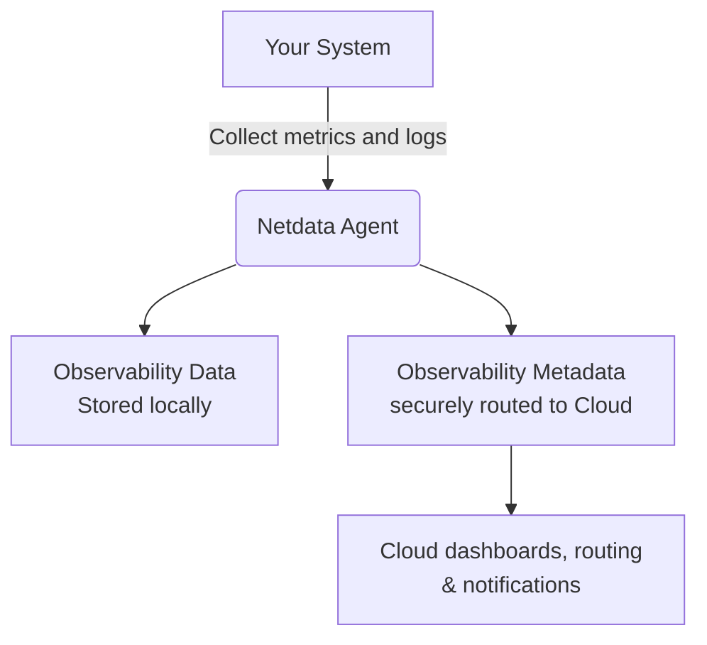

# Security and Privacy Design

:::tip

**Executive Summary**

- Netdata is built with security-first principles to protect user data across all systems.
- Observability data remains local, while minimal metadata travels securely to Netdata Cloud.
- We follow best practices to support GDPR, CCPA, PCI DSS, SOC 2, and HIPAA compliance.

:::

## Introduction

This page explains how Netdata designs and operates secure, privacy-respecting services across the Netdata Agent and Netdata Cloud.

Netdata builds security into every layer. You retain control over your observability data while benefiting from powerful real-time monitoring and insights.

---

## Netdata's Security Principles

### Security by Design

Netdata separates your system information into two categories:

| **Type**               | **Description**                 | **Where It Lives**                                                |
|:-----------------------|:--------------------------------|:------------------------------------------------------------------|
| Observability Data     | Metrics and logs                | Stored locally, fully under your control                          |
| Observability Metadata | Hostnames, metric names, alerts | Routed securely to Netdata Cloud for dashboards and notifications |

This ensures that your critical system insights remain private, and only minimal metadata flows to the cloud.

### Observability Data and Metadata Flow

Here is how your data flows through Netdata:

:::tip

Observability data (metrics and logs) never leaves your system. Only essential metadata flows securely to Netdata Cloud.

:::

### Compliance with Open Source Security Foundation (OSSF) Best Practices

Netdata follows [OSSF best practices](https://bestpractices.coreinfrastructure.org/en/projects/2231), including:

- Automated testing across the UI, backend, and Agent
- Static and security code analysis with GitHub CodeQL, Dependabot, linters, and [Coverity](https://scan.coverity.com/projects/netdata-netdata?tab=overview)
- Two senior engineer reviews per pull request
- Continuous stress testing in production-like environments

### Third-Party Testing and Isolation

Netdata Agents undergo regular external security audits.  
All reports are prioritized for quick investigation and resolution.

Netdata Cloud operates in isolated environments with Infrastructure as Code (IaC). No manual production access exists, and monitoring is fully automated.

### Security Vulnerability Response

Netdata handles vulnerabilities with a clear process:

- Full investigation of reported issues
- Mitigation typically within one week
- Immediate patch releases when necessary

:::tip

Stay updated by subscribing to [Netdata’s GitHub releases](https://github.com/netdata/netdata/security/policy).

:::

---

## Compliance with Regulations

Netdata complies with major data privacy laws, including GDPR and CCPA.

### GDPR and CCPA Compliance

Netdata conducts internal audits to ensure compliance and offers Data Processing Agreements (DPAs) upon request.

:::tip

Contact Netdata Support to request a DPA.

:::

### Data Transfers

| **Type**               | **Handling**                                                                 |
|:-----------------------|:-----------------------------------------------------------------------------|
| Observability Data     | Remains on your infrastructure                                               |
| Observability Metadata | Securely transferred and stored in US-based data centers (Google Cloud, AWS) |

Data is tunneled securely in real-time without being stored on Netdata Cloud servers.

Data processing complies with GDPR and CCPA requirements.

### Privacy Rights

You can manage your privacy rights easily:

| **Right**                              | **How to Access**                                                                                |
|:---------------------------------------|:-------------------------------------------------------------------------------------------------|
| Access, correct, or delete your data   | Use the Netdata Cloud UI                                                                         |
| Fully delete your account and all data | Log in to [app.netdata.cloud](https://app.netdata.cloud), go to Profile, and delete your account |

:::tip

Deleting your account removes all associated personal data, including email and activity records.

:::

### Regular Reviews and Updates

Netdata continuously updates its policies and technical controls to stay aligned with evolving regulations.

---

## Anonymous Statistics

Netdata collects anonymous installation and telemetry statistics to improve its services.

| **Collected**                                                 | **Used For**                                          |
|:--------------------------------------------------------------|:------------------------------------------------------|
| Installation info (plugins, operating systems, feature usage) | Guide product development and prioritize improvements |
| Telemetry events (errors, performance metrics)                | Identify issues and enhance stability                 |

- Observability data (metrics and logs) is never collected.
- Metadata is anonymized before storage.

### Opting Out

You can disable anonymous telemetry:

- During installation
- Anytime after, by removing the telemetry opt-in file

:::tip

See [installation documentation](https://learn.netdata.cloud/docs/netdata-agent/anonymous-telemetry-events#opt-out) for detailed opt-out steps.

:::

Netdata does not sell or share anonymous statistics with any third parties.

---

## Internal Security Measures

Netdata enforces layered security controls:

| **Area**                  | **Control**                                     |
|:--------------------------|:------------------------------------------------|
| Infrastructure Management | Infrastructure as Code (Terraform)              |
| Authentication            | GitHub SSO, Google SSO, email validation        |
| Data Handling             | TLS encryption, session tracking                |
| Access Control            | Role-based access, multi-factor authentication  |
| Threat Defense            | DDoS protection, vulnerability scanning         |
| Developer Process         | Static analyzers, mandatory senior code reviews |
| Production Isolation      | No direct access to production environments     |

:::tip

Need additional security configurations? Contact Netdata Support.

:::

---

## Standards Alignment

### PCI DSS Alignment

Netdata applies practices that align with PCI DSS security principles:

- Secure infrastructure
- Access control
- Encryption practices

However, Netdata is **not officially PCI DSS certified**.  
Entities needing full PCI DSS compliance must perform additional assessments.

:::tip

Consult a PCI DSS compliance expert if you use Netdata as part of your PCI environment.

:::

---

### HIPAA Alignment

Netdata aligns with HIPAA security practices:

- Minimized data handling
- Secure authentication and encryption

Netdata provides **Business Associate Agreements (BAAs)** for healthcare organizations but is **not HIPAA-certified**.

:::tip

Request a BAA through Netdata Support if required.

:::

---

### SOC 2 Compliance

Netdata achieved SOC2 Type 1 compliance on May 14, 2025 for these Service Criteria:

| **Principle**        | **Practices**                            |
|:---------------------|:-----------------------------------------|
| Security             | TLS encryption, strict access controls   |
| Availability         | Resilient systems, continuous monitoring |
| Confidentiality      | Metadata isolation, role-based access    |

---

## Conclusion

Netdata gives you a secure and transparent way to monitor your systems.

With clear separation of observability data and metadata, strong encryption, secure authentication, and compliance with international standards, you retain full ownership and control of your system insights.

:::tip

**You** are always in control of your data with Netdata.

:::

Netdata’s commitment to **security, privacy, and transparency** ensures that your monitoring environment stays **protected** and **trusted** at every step.
