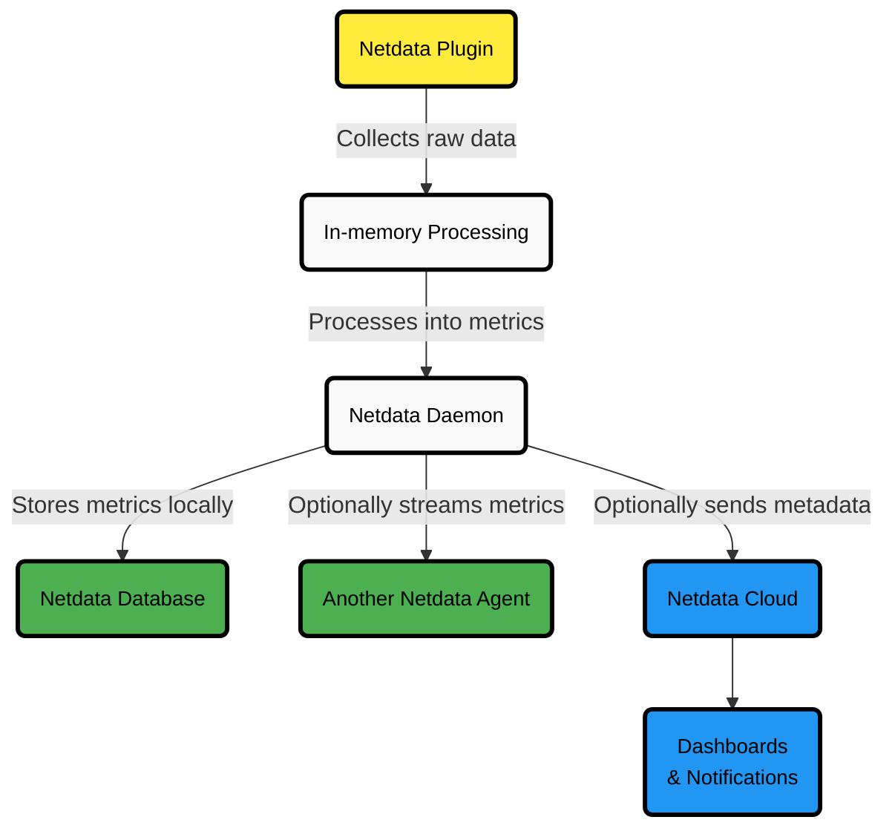

# Netdata Agent Security and Privacy Design

:::tip

**Executive Summary**

- Netdata Agent is designed with a security-first approach to protect system data.
- Raw data never leaves the system where Netdata is installed.
- Only processed metrics and minimal metadata are stored, streamed, or archived.
- Communications are secured with TLS, authentication uses API keys and cryptographic validation, and Agent architecture enforces isolation and resilience.
- Netdata Agent follows best practices supporting PCI DSS, HIPAA, GDPR, and CCPA compliance, and is continuously audited and improved for security.

:::

## Introduction

Netdata Agent uses a security-first design.  
It protects data by exposing only chart metadata and metric values, never raw system or application data.

This design allows Netdata to operate in high-security environments, including PCI Level 1 compliance.

When plugins collect data from databases or logs, only **processed metrics** are:

- Stored in Netdata databases
- Sent to upstream Netdata servers
- Archived to external time-series databases

Raw data remains local and is never transmitted.

## User Data Protection

Netdata Agent safeguards your data at every stage.

| **Aspect**        | **Protection Mechanism**                                                              |
|:------------------|:--------------------------------------------------------------------------------------|
| Raw Data          | Stays on your system                                                                  |
| Plugins           | Hard-coded for collection only, reject external commands                              |
| Functions Feature | Predefined plugin functions, UI only calls these                                      |
| Privileges        | Most plugins run without escalated privileges; the main process does not require them |

Plugins needing escalated privileges are isolated:

- Perform only predefined collection tasks
- Keep raw data inside the local process
- Never save, transfer, or expose raw data to the Netdata daemon

:::tip

Netdata's decentralized design keeps all data local.  
**You are responsible for backing up and managing your system data.**

:::

## Communication and Data Encryption

Netdata secures all internal and external communications:

| **Communication** | **Protection**                                                      |
|:------------------|:--------------------------------------------------------------------|
| Plugins to Daemon | Ephemeral in-memory pipes, isolated from other processes            |
| Streaming Metrics | Requires API keys, optional TLS encryption                          |
| Web API           | Supports TLS if configured                                          |
| Cloud Connection  | MQTT over WebSockets over TLS with public/private key authorization |

Public and private keys are exchanged securely during Cloud provisioning.

### Netdata Agent Security Flow

## Authentication

Netdata supports multiple authentication methods depending on the connection type:

| **Connection**           | **Authentication Method**                                               |
|:-------------------------|:------------------------------------------------------------------------|
| Direct Agent Access      | Typically unauthenticated, relies on LAN isolation or firewall policies |
| Streaming Between Agents | Requires API key authentication, optional TLS                           |
| Agent-to-Cloud           | Public/private key cryptography with mandatory TLS                      |

:::tip

For additional access control, place Netdata Agents behind an authenticating web proxy.

:::

## Security Vulnerability Response

Netdata follows a structured vulnerability response process:

- Acknowledges reports within three business days
- Initiates a Security Release Process for verified issues
- Releases patches promptly
- Handles vulnerability information confidentially
- Keeps reporters updated throughout the process

:::tip

Learn more in [Netdata's GitHub Security Policy](https://github.com/netdata/netdata/security/policy).

:::

## Protection Against Common Security Threats

Netdata Agent is resilient against major security threats:

| **Threat**                 | **Defense Mechanism**                                                      |
|:---------------------------|:---------------------------------------------------------------------------|
| DDoS Attacks               | Fixed thread counts, automatic memory management, resource prioritization  |
| SQL Injections             | No UI data passed back to database-accessing plugins                       |
| System Resource Starvation | Nice priority protects production apps, early termination in OS-OOM events |

Additional protections include:

- Running as an unprivileged user by default
- Isolating escalated privileges to specific collectors
- Proactive CPU and memory management

## User-Customizable Security Settings

You can tailor the Agent's security settings:

| **Setting**                 | **Options Available**                            |
|:----------------------------|:-------------------------------------------------|
| TLS Encryption              | Configurable for web API and streaming           |
| Access Control Lists (ACLs) | Limit endpoint access by IP address              |
| CPU/Memory Priority         | Adjust scheduling priority and memory thresholds |

:::tip

Use Netdata configuration files to apply custom security settings.

:::
