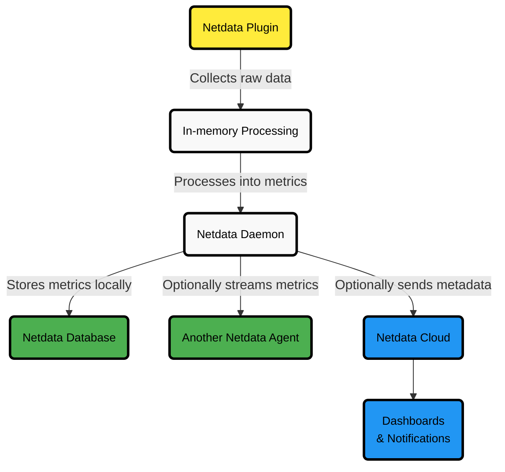

# Netdata Agent Security and Privacy Design

:::tip

**Executive Summary**

- Netdata Agent is designed with a security-first approach to protect system data.
- Raw data never leaves the system where Netdata is installed.
- Only processed metrics and minimal metadata are stored, streamed, or archived.
- Communications are secured with TLS, authentication uses API keys and cryptographic validation, and Agent architecture enforces isolation and resilience.
- Netdata Agent follows best practices supporting PCI DSS, HIPAA, GDPR, and CCPA compliance, and is continuously audited and improved for security.

:::

## Introduction

Netdata Agent uses a security-first design.  
It protects data by exposing only chart metadata and metric values, never raw system or application data.

This design allows Netdata to operate in high-security environments, including PCI Level 1 compliance.

When plugins collect data from databases or logs, only **processed metrics** are:

- Stored in Netdata databases
- Sent to upstream Netdata servers
- Archived to external time-series databases

Raw data remains local and is never transmitted.

## User Data Protection

Netdata Agent safeguards your data at every stage.

| **Aspect**        | **Protection Mechanism**                                                              |
|:------------------|:--------------------------------------------------------------------------------------|
| Raw Data          | Stays on your system                                                                  |
| Plugins           | Hard-coded for collection only, reject external commands                              |
| Functions Feature | Predefined plugin functions, UI only calls these                                      |
| Privileges        | Most plugins run without escalated privileges; the main process does not require them |

Plugins needing escalated privileges are isolated:

- Perform only predefined collection tasks
- Keep raw data inside the local process
- Never save, transfer, or expose raw data to the Netdata daemon

:::tip

Netdata's decentralized design keeps all data local.  
**You are responsible for backing up and managing your system data.**

:::

## Communication and Data Encryption

Netdata secures all internal and external communications:

| **Communication** | **Protection**                                                      |
|:------------------|:--------------------------------------------------------------------|
| Plugins to Daemon | Ephemeral in-memory pipes, isolated from other processes            |
| Streaming Metrics | Requires API keys, optional TLS encryption                          |
| Web API           | Supports TLS if configured                                          |
| Cloud Connection  | MQTT over WebSockets over TLS with public/private key authorization |

Public and private keys are exchanged securely during Cloud provisioning.

### Netdata Agent Security Flow

```mermaid
flowchart TD
    A("Netdata Plugin") -->|"Collects raw data"| B("In-memory Processing")
    B -->|"Processes into metrics"| C("Netdata Daemon")
    C -->|"Stores metrics locally"| D("Netdata Database")
    C -->|"Optionally streams metrics"| E("Another Netdata Agent")
    C -->|"Optionally sends metadata"| F("Netdata Cloud")
    F --> G("Dashboards<br/>& Notifications")

    %% Style definitions
    classDef alert fill:#ffeb3b,stroke:#000000,stroke-width:3px,color:#000000,font-size:14px
    classDef neutral fill:#f9f9f9,stroke:#000000,stroke-width:3px,color:#000000,font-size:14px
    classDef complete fill:#4caf50,stroke:#000000,stroke-width:3px,color:#000000,font-size:14px
    classDef database fill:#2196F3,stroke:#000000,stroke-width:3px,color:#000000,font-size:14px

    %% Apply styles
    class A alert
    class B,C neutral
    class D,E complete
    class F,G database
```

## Outbound Network Communication

An on-prem Netdata Agent initiates outbound network connections only through a small number of well-defined paths. For Cloud communication the Agent is never an inbound server — all Cloud traffic is **outbound and initiated by the Agent**.

Understanding each path, its default state, and how to disable it is essential when deploying the Agent in restricted or air-gapped networks. The paths below are the only default outbound connections a stock Agent makes.

### Anonymous telemetry

By default, Netdata collects anonymous usage information through two channels:

- **Agent backend**: On start, clean stop, and fatal crash, the `netdata` daemon executes the `anonymous-statistics.sh` script, which sends anonymized system and version information to a Netdata telemetry cloud function hosted in GCP over HTTPS.
- **Agent dashboard**: When you view the local dashboard (`http://NODE:19999`), PostHog JavaScript sends anonymized page-view events. Sensitive attributes (such as IP and hostname) are overwritten with constant values before any event is sent.

Telemetry is **on by default** and carries only anonymized metadata — never raw metrics. See [Anonymous telemetry events](/docs/netdata-agent/configuration/anonymous-telemetry-events.md) for exactly what is collected and the opt-out methods.

### Agent-Cloud Link (ACLK)

The [ACLK](/src/aclk/README.md) is the channel the Agent uses to communicate with Netdata Cloud. It:

- Uses an **outgoing** secure WebSocket (WSS) connection on port `443`.
- Activates **only after you claim/connect a node** to a Netdata Cloud Space.
- Requires outbound access to `app.netdata.cloud`, `api.netdata.cloud`, and `mqtt.netdata.cloud`.
- Transmits only the metadata needed for coordination and access control — **raw metrics never leave your infrastructure**.

For the complete firewall allowlist with ports, see [Configure Netdata for cybersecurity platforms](/docs/netdata-agent/configure-netdata-for-cybersecurity-platforms.md#required-endpoints-and-ports).

ACLK is **off until you claim the Agent**. An unclaimed Agent never opens this connection.

### Installation and updates

These connections occur at install or update time, not as continuous Agent runtime traffic:

- The `kickstart.sh` installer script is downloaded from `get.netdata.cloud`.
- Packages are fetched from `repository.netdata.cloud/repos/stable` (stable channel) or `repository.netdata.cloud/repos/edge` (nightly channel).
- **Automatic updates are enabled by default for online installations** (they are disabled automatically for offline installations). When enabled, the separate `netdata-updater.sh` script runs on a schedule (systemd timer, cron, or interval) and connects to the package repository to check for and install newer versions.

Disable automatic updates with the `--no-updates` flag at install time, or by disabling the updater on an existing install. For a fully disconnected deployment, see [Install Netdata on Offline Systems](/packaging/installer/methods/offline.md).

### Fully autonomous operation

When all three of the following are true, the running Agent daemon makes **no outbound internet connections** and operates fully autonomously:

1. The Agent is **not claimed** to Netdata Cloud (ACLK stays inactive).
2. **Anonymous telemetry is disabled**.
3. **Automatic updates are disabled** (or the host has no route to the package repository).

In this state the Agent continues to collect, store, and serve metrics locally. User-configured collectors (for example, an HTTP-based collector pointed at an external endpoint) may open their own outbound connections — those are driven by your configuration, not by default Agent behavior.

### Summary

| **Communication Path**              | **Default State**      | **Trigger**                           | **Destination**                                                           | **How to Disable**                                                                                                             |
|:------------------------------------|:-----------------------|:--------------------------------------|:--------------------------------------------------------------------------|:-------------------------------------------------------------------------------------------------------------------------------|
| Anonymous telemetry (backend)       | On                     | Agent start, stop, or fatal crash     | Netdata telemetry cloud function (GCP) over HTTPS                         | Create `.opt-out-from-anonymous-statistics`, set `DISABLE_TELEMETRY=1`/`DO_NOT_TRACK=1`, or install with `--disable-telemetry` |
| Anonymous telemetry (dashboard)     | On                     | Viewing the local Agent dashboard     | PostHog (anonymized page-view events)                                     | Same opt-out mechanism as backend telemetry                                                                                    |
| Agent-Cloud Link (ACLK)             | Off until claimed      | Claiming/connecting a node to a Space | `app.netdata.cloud`, `api.netdata.cloud`, `mqtt.netdata.cloud` (WSS, 443) | Do not claim the Agent to Netdata Cloud                                                                                        |
| Installer script download           | n/a (install time)     | Running `kickstart.sh`                | `get.netdata.cloud`                                                       | Pre-download the script for an offline install                                                                                 |
| Package download / automatic update | On for online installs | Install, or scheduled auto-update     | `repository.netdata.cloud`                                                | `--no-updates` at install, or disable `netdata-updater.sh`                                                                     |

:::tip

For air-gapped or strictly firewalled environments, the recommended baseline is: disable telemetry, do not claim the Agent, and disable automatic updates. With those three in place the Agent runs with no outbound internet dependencies. See [Install Netdata on Offline Systems](/packaging/installer/methods/offline.md) for a fully disconnected installation procedure.

:::

## Authentication

Netdata supports multiple authentication methods depending on the connection type:

| **Connection**           | **Authentication Method**                                               |
|:-------------------------|:------------------------------------------------------------------------|
| Direct Agent Access      | Typically unauthenticated, relies on LAN isolation or firewall policies |
| Streaming Between Agents | Requires API key authentication, optional TLS                           |
| Agent-to-Cloud           | Public/private key cryptography with mandatory TLS                      |

:::tip

For additional access control, place Netdata Agents behind an authenticating web proxy.

:::

## Security Vulnerability Response

Netdata follows a structured vulnerability response process:

- Acknowledges reports within three business days
- Initiates a Security Release Process for verified issues
- Releases patches promptly
- Handles vulnerability information confidentially
- Keeps reporters updated throughout the process

:::tip

Learn more in [Netdata's GitHub Security Policy](https://github.com/netdata/netdata/security/policy).

:::

## Protection Against Common Security Threats

Netdata Agent is resilient against major security threats:

| **Threat**                 | **Defense Mechanism**                                                      |
|:---------------------------|:---------------------------------------------------------------------------|
| DDoS Attacks               | Fixed thread counts, automatic memory management, resource prioritization  |
| SQL Injections             | No UI data passed back to database-accessing plugins                       |
| System Resource Starvation | Nice priority protects production apps, early termination in OS-OOM events |

Additional protections include:

- Running as an unprivileged user by default
- Isolating escalated privileges to specific collectors
- Proactive CPU and memory management

## User-Customizable Security Settings

You can tailor the Agent's security settings:

| **Setting**                 | **Options Available**                            |
|:----------------------------|:-------------------------------------------------|
| TLS Encryption              | Configurable for web API and streaming           |
| Access Control Lists (ACLs) | Limit endpoint access by IP address              |
| CPU/Memory Priority         | Adjust scheduling priority and memory thresholds |

:::tip

Use Netdata configuration files to apply custom security settings.

:::
