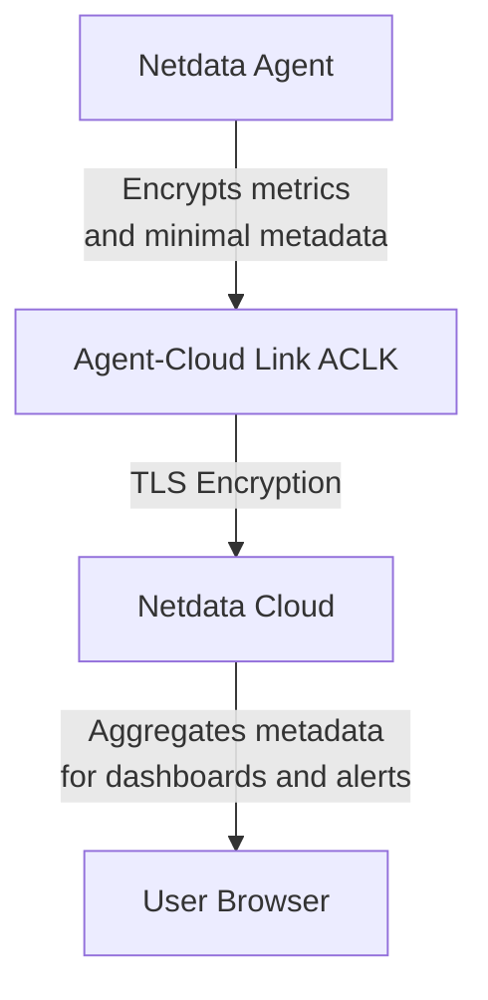

# Netdata Cloud Security and Privacy Design

:::tip

**Executive Summary**  
Netdata Cloud offers secure real-time monitoring without storing raw metrics.  
Only minimal metadata passes securely through Netdata Cloud.  
Users retain full control of their data.  
Infrastructure is protected wioth strong encryption, access control, and compliance with GDPR, CCPA, PCI DSS, SOC 2, and HIPAA standards.  
Netdata Cloud continuously evolves its security and privacy practices to meet the highest industry standards.

:::

## Introduction

Netdata Cloud enables secure real-time system insights without storing raw metrics.  

Data passes through Netdata Cloud securely but isn't retained. Metric views and alerts from multiple Agents display as a unified dashboard in your browser.

## User Identification and Authorization

Netdata Cloud requires only an email address for accounts.

| **Method** | **Details** |
|:-----------|:------------|
| Identification | Email via Google, GitHub, or short-lived tokens |
| Credentials | No passwords stored |
| Storage | Secure AWS storage; used for product and marketing |

Authentication uses third-party integrations or secure tokens. Netdata Cloud never stores credentials.

## Data Storage and Transfer

Netdata Cloud stores no raw metrics, only essential metadata:

| **Metadata Stored** | **Source** |
|:--------------------|:-----------|
| Hostname | `/api/v1/info` endpoint |
| Metric Metadata | `/api/v1/contexts` endpoint |
| Alerts Configuration | `/api/v1/alarms` endpoint |

All metadata is stored in AWS and copied to Google BigQuery for analytics.

Metric data travels via secure Agent-Cloud Link (ACLK):
- ACLK encrypts data and activates only for claimed nodes
- All user-Cloud communication uses TLS encryption

### ACLK Secure Data Flow

## Data Retention and Erasure

| **Process** | **Details** |
|:------------|:------------|
| Retention | Deleted content kept 90 days |
| Self-Service | Modify/delete personal data via Cloud UI |
| Manual Requests | Written deletion requests processed under data laws |

:::tip

Users can delete accounts and data directly from their Netdata Cloud profile.

:::

## Infrastructure and Authentication

Netdata Cloud uses Infrastructure as Code (IaC).

| **Feature** | **Implementation** |
|:------------|:-------------------|
| Infrastructure Changes | Managed via Terraform |
| Authentication | JWT tokens at TLS termination points |
| Microservices Isolation | Complete environment separation |

Netdata Cloud never stores user credentials.

## Security Features and Incident Response

Built-in security protections include:

| **Feature** | **Details** |
|:------------|:------------|
| Infrastructure Dashboards | Centralized monitoring/alerting |
| Audit Logs | Role-based access tracking |
| DDoS Protection | Rate-limiting and blacklisting |
| Secure Development | Static analyzers and secure coding |

Security vulnerabilities follow a structured process:
- Acknowledge within three business days
- Analyze and fix promptly
- Maintain communication with reporters

:::tip

See [Netdata's GitHub Security Policy](https://github.com/netdata/netdata/security/policy) for details.

:::

## User Customization

Netdata Cloud uses maximum security defaults without out-of-box customization.

Per-contract customization options include:
- Custom SSO
- Custom retention policies
- Advanced access controls
- Tailored audit logs
- Third-party security tool integration

Contact Netdata Sales for enterprise solutions.

## Deleting Personal Data

Users can delete personal data by:
- Logging into Netdata Cloud
- Accessing Profile settings
- Initiating account deletion

If self-service isn't available, submit written requests processed under applicable laws.

## User Privacy and Data Protection

Netdata Cloud prioritizes privacy and data protection.

### Data Collection

Minimal personal information collected:

| **Data** | **Purpose** |
|:---------|:------------|
| Email Address | Account, communication, analytics |
| IP Address | Web proxy access logs |

### Data Usage

Collected data is:
- Stored in AWS databases
- Copied to BigQuery for analytics
- Used for product improvement

With consent to analytical cookies, tracking occurs via:
- Google Analytics
- Posthog
- Gainsight PX

Stripe securely handles payments.

### Data Sharing

Netdata Cloud doesn't sell or share personal data.  
Third-party services supporting operations:
- Google Cloud/AWS (infrastructure)
- Stripe (payments)
- Analytics services (product improvement)

### Data Protection

All infrastructure data uses encrypted ACLK.  
All user-Cloud communication uses TLS encryption.

### User Control Over Data

Users can:
- Access their data
- Correct inaccuracies
- Retrieve personal data
- Delete accounts

Temporary maintenance may limit access, but Netdata ensures legal compliance.

### Compliance with Data Protection Laws

Netdata Cloud complies fully with:
- GDPR
- CCPA

### Data Transfer

All transfers use secure, encrypted WebSocket (WSS) connections.

### Use of Tracking Technologies

With consent, Netdata Cloud uses analytical cookies tracked via:
- Google Analytics
- Posthog
- Gainsight PX

### Data Breach Notification

For data breaches:
- Netdata follows DPA guidelines and industry timelines
- Users receive notifications per data protection laws

Netdata continuously reviews and updates privacy and security practices.