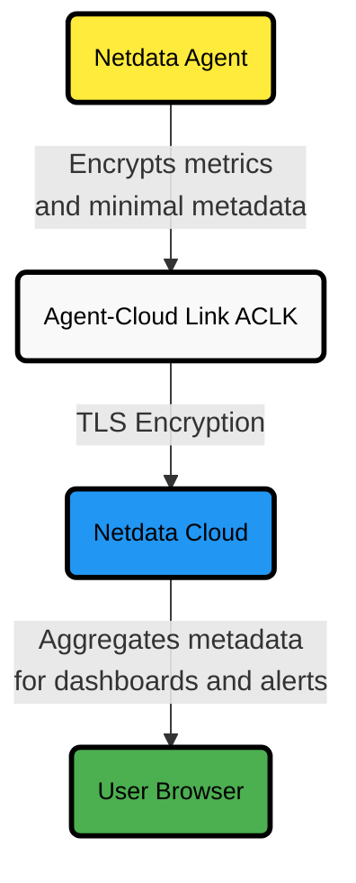

# Netdata Cloud Security and Privacy Design

:::tip

**Executive Summary**

- Netdata Cloud offers secure real-time monitoring without storing raw metrics.
- Only minimal metadata passes securely through Netdata Cloud.  
  Users retain full control of their data.
- Infrastructure is protected with strong encryption, access control, and compliance with GDPR, CCPA, PCI DSS, SOC 2, and HIPAA standards.
- Netdata Cloud continuously evolves its security and privacy practices to meet the highest industry standards.

:::

:::info

Netdata achieves SOC 2 [Type 1](https://www.netdata.cloud/blog/soc2-type1/) & [Type 2](https://www.netdata.cloud/blog/soc2-type-2-compliance/) attestations, reinforcing its dedication to robust security practices for user data.

:::

## Introduction

Netdata Cloud enables secure real-time system insights without storing raw metrics.

Data passes through Netdata Cloud securely but isn't retained. Metric views and alerts from multiple Agents display as a unified dashboard in your browser.

## User Identification and Authorization

Netdata Cloud requires only an email address for accounts.

| **Method**     | **Details**                                        |
|:---------------|:---------------------------------------------------|
| Identification | Email via Google, GitHub, or short-lived tokens    |
| Credentials    | No passwords stored                                |
| Storage        | Secure AWS storage; used for product and marketing |

Authentication uses third-party integrations or secure tokens. Netdata Cloud never stores credentials.

## Data Storage and Transfer

Netdata Cloud stores no raw metrics, only essential metadata:

| **Metadata Stored**  | **Source**                  |
|:---------------------|:----------------------------|
| Hostname             | `/api/v1/info` endpoint     |
| Metric Metadata      | `/api/v1/contexts` endpoint |
| Alerts Configuration | `/api/v1/alarms` endpoint   |

All metadata is stored in AWS and copied to Google BigQuery for analytics.

Metric data travels via secure Agent-Cloud Link (ACLK):

- ACLK encrypts data and activates only for claimed nodes
- All user-Cloud communication uses TLS encryption

### ACLK Secure Data Flow

## Data Retention and Erasure

| **Process**     | **Details**                                         |
|:----------------|:----------------------------------------------------|
| Retention       | Deleted content kept 90 days                        |
| Self-Service    | Modify/delete personal data via Cloud UI            |
| Manual Requests | Written deletion requests processed under data laws |

:::tip

Users can delete accounts and data directly from their Netdata Cloud profile.

:::

## Infrastructure and Authentication

Netdata Cloud uses Infrastructure as Code (IaC).

| **Feature**             | **Implementation**                   |
|:------------------------|:-------------------------------------|
| Infrastructure Changes  | Managed via Terraform                |
| Authentication          | JWT tokens at TLS termination points |
| Microservices Isolation | Complete environment separation      |

Netdata Cloud never stores user credentials.

## Security Features and Incident Response

Built-in security protections include:

| **Feature**               | **Details**                        |
|:--------------------------|:-----------------------------------|
| Infrastructure Dashboards | Centralized monitoring/alerting    |
| Audit Logs                | Role-based access tracking         |
| DDoS Protection           | Rate-limiting and blacklisting     |
| Secure Development        | Static analyzers and secure coding |

Security vulnerabilities follow a structured process:

- Acknowledge within three business days
- Analyze and fix promptly
- Maintain communication with reporters

:::tip

See [Netdata's GitHub Security Policy](https://github.com/netdata/netdata/security/policy) for details.

:::

## User Customization

Netdata Cloud uses maximum security defaults without out-of-box customization.

Per-contract customization options include:

- Custom SSO
- Custom retention policies
- Advanced access controls
- Tailored audit logs
- Third-party security tool integration

Contact Netdata Sales for enterprise solutions.

## Deleting Personal Data

Users can delete personal data by:

- Logging into Netdata Cloud
- Accessing Profile settings
- Initiating account deletion

If self-service isn't available, submit written requests processed under applicable laws.

## User Privacy and Data Protection

Netdata Cloud prioritizes privacy and data protection, continuously reviewing and updating privacy and security practices.

| **Category**              | **Details**                                                                                                                                                                                                               |
|:--------------------------|:--------------------------------------------------------------------------------------------------------------------------------------------------------------------------------------------------------------------------|
| **Data Collection**       | • Email Address (account, communication, analytics) • IP Address (web proxy access logs)                                                                                                                              |
| **Data Usage**            | • Stored in AWS databases • Copied to BigQuery for analytics • Used for product improvement • With consent, tracking via Google Analytics, Posthog, and Gainsight PX • Stripe for secure payment handling |
| **Data Sharing**          | • No selling or sharing of personal data • Third-party services: Google Cloud/AWS (infrastructure), Stripe (payments), Analytics services                                                                             |
| **Data Protection**       | • Encrypted ACLK for all infrastructure data • TLS encryption for all user-Cloud communication                                                                                                                        |
| **User Control**          | • Access personal data • Correct inaccuracies • Retrieve personal data • Delete accounts • Note: Temporary maintenance may limit access                                                                   |
| **Compliance**            | • Full compliance with GDPR and CCPA                                                                                                                                                                                      |
| **Data Transfer**         | • Secure, encrypted WebSocket (WSS) connections for all transfers                                                                                                                                                         |
| **Tracking Technologies** | • With consent: analytical cookies tracked via Google Analytics, Posthog, and Gainsight PX                                                                                                                                |
| **Data Breach Protocol**  | • Follows DPA guidelines and industry timelines • User notifications as required by data protection laws • Continuous review and updates to privacy and security practices                                        |
