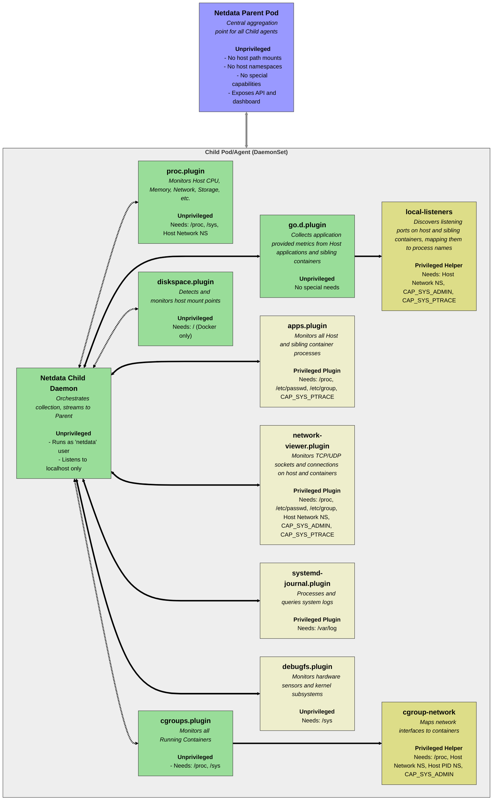

# Netdata Container Security Considerations

Netdata provides powerful, real-time performance monitoring and health visibility, offering deep insights essential for managing modern infrastructure, particularly dynamic containerized environments like Kubernetes. Its high-granularity metrics and comprehensive system overview help teams troubleshoot issues quickly and optimize performance effectively.

To deliver observability that extends beyond the agent's own container to encompass the entire host system and other running containers, the Netdata agent ('child' pods in a typical Kubernetes deployment) requires specific access to host resources. This access typically involves mounting certain host paths (usually read-only), utilizing host namespaces (like the PID and Network namespaces), and leveraging specific Linux capabilities (such as `SYS_PTRACE` or `SYS_ADMIN` for certain advanced features).

Granting such permissions inherently involves security considerations. This document aims to provide transparency regarding the permissions Netdata might request for full functionality. We will detail these permissions, explain the rationale behind them, and discuss Netdata's security design features – including its privilege separation model and constrained network architecture – which are intended to mitigate potential risks.

The goal is to enable organizations to tailor their Netdata deployment, striking an appropriate balance between achieving deep, actionable observability and adhering to their specific security policies and risk tolerance. Understanding these configurations and their trade-offs is key to deploying Netdata effectively and securely within your containerized environment.

## Security Architecture: The Privilege Separation Model

Netdata is architected with security as a core consideration, employing a robust privilege separation model designed to minimize attack surfaces and isolate operations that require elevated permissions. This model applies both to the overall deployment architecture and the internal workings of the Netdata agent itself.

### Parent / Child Deployment Architecture

In typical Kubernetes deployments, Netdata utilizes a hierarchical structure with two main roles:

- **`Parent` Pods:** These act as central aggregation points. They receive data streams from multiple child pods. Crucially, `Parent` pods are designed to run as **completely unprivileged containers**. They do not require access to host paths, host namespaces, or any special Linux capabilities. Their primary role is data aggregation, storage, and exposing Netdata's API and dashboard or connecting to Netdata Cloud for servicing the dashboard.
- **`Child` Pods (Agents):** A `child` pod runs as a DaemonSet on each monitored node. Its responsibility is to collect detailed metrics, query logs, and other information directly from the node it resides on. To achieve comprehensive host and container monitoring, the `child` pod is the component that may require specific host resource access (mounts, namespaces) and potentially elevated Linux capabilities.

This architecture ensures that the components responsible for broader network exposure and data storage (Parents) run with minimal privileges, while the necessary host access is confined to the node-local `child` agents.

### Internal Privilege Separation within `Child` Agents

Even within the `child` agent container, which might be granted elevated permissions by Kubernetes (e.g., host mounts, capabilities), Netdata enforces strict internal privilege separation:

- **Unprivileged Core Daemon:** The main `netdata` daemon process, which orchestrates data collection, communicates with the parent, and handles basic tasks, runs as a **non-root user** (typically the `netdata` user). Key internal plugins responsible for collecting core metrics, such as `proc.plugin` (for `/proc` based metrics) and `cgroups.plugin` (for container metrics via `/sys/fs/cgroup`), also run as threads within this unprivileged daemon process.
- **Dedicated Privileged Helpers/Plugins:** Operations that require elevated privileges or specific capabilities to access protected host resources (e.g., detailed process information via `apps.plugin`, certain network operations via `network-viewer.plugin` or `cgroup-network`, logs querying via `journal-viewer-plugin`) are delegated to **dedicated external plugins or helper processes**.
- **Isolation via `setuid`:** These external plugins/helpers run as separate, isolated processes spawned by the main daemon. Within the container, the specific helper executables requiring elevated rights are configured with the **`setuid` root** permission bit. This standard Linux mechanism allows only these designated programs to execute specific, pre-defined tasks with root privileges _within the container's environment_.
- **Contained Capabilities:** Consequently, even if the _container_ is granted capabilities like `SYS_ADMIN` or `SYS_PTRACE`, the unprivileged main `netdata` daemon and its non-`setuid` plugins **cannot** directly utilize these capabilities. Only the specific `setuid` root helpers designed for tasks needing those privileges can effectively leverage them.
- **Narrowly Scoped Tasks:** Each privileged helper is designed to perform a narrow, hard-coded task – typically reading specific system information and passing it back to the main daemon.
- **Text-Based Communication:** Communication between the main daemon and its external plugins occurs over a simple, text-based protocol, further reducing the risk associated with potentially malicious binary data exchange.

### Security Benefit

This multi-layered privilege separation model significantly minimizes the attack surface. The vast majority of the Netdata agent's code, including the core daemon and primary metric collectors, runs without root privileges. Elevated permissions are isolated to specific, purpose-built helper processes with limited scope. This design helps contain the risk even when the Netdata `child` container requires privileged access to the host system for comprehensive monitoring. Compromising the main unprivileged daemon does not automatically grant an attacker root access or the ability to use the container's granted capabilities.

## Network Exposure and Access Control

Beyond internal process separation within the agent, Netdata's deployment architecture incorporates several features designed to limit network exposure and manage data access securely, particularly in the recommended parent/child configuration.

### Child Agent Network Limitations

Netdata `child` agents (running on each monitored node) are designed with minimal required network interaction to reduce their direct attack surface:

- **Outbound-Only to Parent:** Their primary network function is to stream collected data **outbound** exclusively to their designated `parent` pod(s) within the cluster. This connection can be further secured using transport layer security (TLS) and optional mutual TLS (mTLS) for certificate-based authentication between child and parent.
- **Restricted Inbound Connections:** By default, standard configurations (like the official Helm chart) configure `child` agents to listen **only on the localhost interface (127.0.0.1)**. This prevents them from accepting incoming network connections from other pods, nodes, or external sources.
- **No Direct Cloud Connectivity Needed:** `Child` agents **do not require** direct internet connectivity to the Netdata Cloud service. All communication is proxied through the parent(s).

### Parent Agent Role and Centralized Access via Netdata Cloud

`Parent` pods act as the aggregation points and data access gateways:

- **Central Aggregation:** They receive data streams from multiple child agents.
- **Optional Direct Access:** Parents expose the Netdata API and dashboard. While direct access is possible, it requires careful network policy configuration within the cluster.
- **Recommended Cloud Integration:** The typical and recommended approach, especially for managing multiple nodes or clusters, involves securely connecting the `parent` pods **outbound** to Netdata Cloud.
- **Centralized RBAC via Cloud:** Netdata Cloud serves as the primary user interface and provides essential access control mechanisms. This includes **Role-Based Access Control (RBAC)**, allowing administrators to:
    - Manage users and team memberships.
    - Segment the infrastructure into "rooms" (by service, component type, location, etc)
    - Assign roles with differing permission levels.
    - Associate users with infrastructure, by granting users access to specific "rooms".

### Security Benefits

This layered network architecture significantly enhances security:

- It drastically limits the direct network exposure of the potentially privileged `child` agents.
- It centralizes data egress and user access points at the `parent` level.
- It leverages Netdata Cloud for robust, centralized authentication and Role-Based Access Control, moving access management off the individual nodes.
- It supports encrypted and mutually authenticated communication channels between agents and parents.

## Permissions for Complete Host and Container Monitoring

The following sections describe all the possible mounts, capabilities and host namespaces Netdata children may use:

### Container Mounts

Mounting specific host directories into the Netdata container provides essential data access for various collection plugins.

|             Mount              |   Type   |        Role        |        Component         | Why                                                                                                                                                                           |
|:------------------------------:|:--------:|:------------------:|:------------------------:|:------------------------------------------------------------------------------------------------------------------------------------------------------------------------------|
|              `/`               | hostPath |       child        |    `diskspace.plugin`    | Detect host mount points (only in Docker deployments, not in Kubernetes deployments).                                                                                         |
|       `/etc/os-release`        | hostPath |       child        |        `netdata`         | Collect host labels.                                                                                                                                                          |
| `/etc/passwd` `/etc/group` | hostPath |       child        |      `apps.plugin`       | Resolve numeric users and groups to names.                                                                                                                                    |
| `/etc/passwd` `/etc/group` | hostPath |       child        | `network-viewer.plugin`  | Resolve numeric users and groups to names.                                                                                                                                    |
|            `/proc`             | hostPath |       child        |      `proc.plugin`       | Monitor host system resources (CPU, Memory, Network, uptime, etc).                                                                                                            |
|            `/proc`             | hostPath |       child        |      `apps.plugin`       | Monitor all running processes.                                                                                                                                                |
|            `/proc`             | hostPath |       child        |     `cgroups.plugin`     | Detect available memory to calculate container memory limits. Detect paused containers in k8s to improve discovery performance.                                               |
|            `/proc`             | hostPath |       child        |     `cgroup-network`     | Discover container virtual network interfaces and associates them with running containers.                                                                                    |
|            `/proc`             | hostPath |       child        | `network-viewer.plugin`  | Monitor all TCP/UDP sockets of running processes, including the ones outside containers, or inside sibling containers.                                                        |
|            `/proc`             | hostPath | child k8sState |        `netdata`         | Collect system information and detect various system characteristics like number of CPU cores, total and available memory protection, and more.                               |
|             `/sys`             | hostPath |       child        |     `cgroups.plugin`     | Monitor containers.                                                                                                                                                           |
|             `/sys`             | hostPath | child k8sState |        `netdata`         | Detect `netdata` container limits. Detect host hardware (part of system info).                                                                                                |
|             `/sys`             | hostPath |       child        |      `proc.plugin`       | Detect network interface types. Monitor software RAID block devices. Detect ZRAM, GPUs, Numa Nodes, Infiniband, BTRFS, PCI AEC, EDAC MC, KSM, BCACHE, CPU thermal throttling. |
|             `/sys`             | hostPath |       child        |     `debugfs.plugin`     | Monitor hardware sensors, ZSWAP, Numa Memory Fragmentation, PowerCap.                                                                                                         |
|           `/var/log`           | hostPath |       child        | `systemd-journal.plugin` | Enable the Logs pipeline of Netdata to process and query system logs.                                                                                                         |
|      `/var/lib/netdata`*       | hostPath |       child        |        `netdata`         | Persist of Netdata's private data.                                                                                                                                            |

Notes:

- **Persistence Note:** The `/var/lib/netdata` host path mount (configurable via `{{ .Values.child.persistence.hostPath }}/var/lib/netdata` in Helm charts) is critical for maintaining node identity across restarts. This directory stores metadata, _not_ the time-series database, and is relatively small. Without this persistence, each pod restart registers as a new node.
- **Read-Only Mounts**: All the mounts described above, except `/var/lib/netdata`, are mounted read-only.

### Host Namespaces

Utilizing host namespaces allows Netdata to observe network activity and processes as they appear on the host, rather than being confined to the container's isolated view.

|       Namespace        | Role  |        Component        |      Type       | Why                                                                                                                                                                                                                                                                                                                                                                              |
|:----------------------:|:-----:|:-----------------------:|:---------------:|:---------------------------------------------------------------------------------------------------------------------------------------------------------------------------------------------------------------------------------------------------------------------------------------------------------------------------------------------------------------------------------|
| Host Network Namespace | child |      `proc.plugin`      | Internal Plugin | Monitor host's networking stack (the IPv4 and IPv6 Networking Stack).  `proc.plugin` runs unprivileged. &nbsp; Without this, Netdata will monitor the networking stack of the container it runs, not the one of the host.                                                                                                                                            |
| Host Network Namespace | child |    `cgroup-network`     | External Helper | Used by `cgroups.plugin` to map virtual network interfaces to the containers they belong. The helper requires also special capabilities.  `cgroups.plugin` runs unprivileged. &nbsp; Without this, Netdata will monitor only the network interfaces of the container it runs, not the network interfaces of its sibling containers (or the host).                    |
| Host Network Namespace | child |    `local-listeners`    | External Helper | Used by `go.d.plugin` to discover applications running at the host (including sibling containers). It requires also special capabilities.  `go.d.plugin` runs unprivileged. &nbsp; Without this, Netdata will not be able to auto-detect and monitor applications running at the host or its sibling containers. Kubernetes based service discovery is not affected. |
| Host Network Namespace | child | `network-viewer.plugin` | External Plugin | Discover and continuously monitor the host's network connections (including the ones of sibling containers). It requires also special capabilities.  `network-viewer.plugin` runs with escalated privileges. &nbsp; Without this, Netdata will monitor only the connections of the container it runs, not the connections of the host or its sibling containers.     |
|   Host PID Namespace   | child |    `cgroup-network`     | External Helper | Used by `cgroups.plugin` to detect containers' network interfaces. `cgroups.plugin` runs unprivileged. &nbsp; Without this, Netdata will not be able to associate virtual network interfaces to the containers they belong.                                                                                                                                          |

### Linux Capabilities

Specific Linux capabilities grant elevated privileges necessary for certain monitoring functions, particularly those involving process inspection and namespace manipulation.

| Capability | Role  |        Component        |      Type       | Why                                                                                                                                                                                                                                                                 |
|:----------:|:-----:|:-----------------------:|:---------------:|:--------------------------------------------------------------------------------------------------------------------------------------------------------------------------------------------------------------------------------------------------------------------|
| SYS_ADMIN  | child |    `cgroup-network`     | External Helper | Used by `cgroups.plugin` to associate virtual network interfaces to the containers the belong. &nbsp; Without this, virtual network interfaces will not be associated to their respective containers, so they will be monitored as host network interfaces. |
| SYS_ADMIN  | child | `network-viewer.plugin` | External Plugin | Discover containers' network connections (it does so by switching Network Namespaces). &nbsp; Without this, Netdata will not be able to associate Network connections with processes.                                                                       |
| SYS_ADMIN  | child |    `local-listeners`    | External Helper | Helper used by `go.d.plugin` to discover listening applications running at the host. &nbsp; Without this, localhost service discovery (not the kubernetes one) will not work.                                                                               |
| SYS_PTRACE | child |      `apps.plugin`      | External Plugin | Collect the I/O per running process at the host (including the ones in containers). &nbsp; Without this, processes will be monitored excluding their physical or logical disk I/O.                                                                          |
| SYS_PTRACE | child |    `local-listeners`    | External Helper | Helper used by `go.d.plugin` to discover listening applications running at the host. &nbsp; Without this, localhost service discovery (not the kubernetes one) will be based only on port number, without the process name.                                 |
| SYS_PTRACE | child | `network-viewer.plugin` | External Plugin | Discover host's network connections per application. Without it all host network connections will still be monitored, but Netdata will not be able to associate them with processes.                                                                                |

IMPORTANT: All the plugins or helpers that utilize these capabilities are isolated from the rest of Netdata. This means that all the other plugins of Netdata and the main Netdata daemon cannot utilize these capabilities, even when the capabilities have been given to the whole container Netdata is installed.

### Overview

An overview of the structure, related to permissions:

1. The Netdata Child Agent and its internal plugins (`proc.plugin`, `diskspace.plugin`, `cgroups.plugin`) run unprivileged.
2. External Plugins are requiring access to resources depending on their job.
3. Helpers (`local-listeners`, `cgroup-network`) are command line tools that unprivileged plugins call to enrich the information they collect.

Netdata allows configuring the available capabilities, namespaces and mounts, but also allows disabling specific plugins or features.

Netdata's design incorporates specific strategies aimed at mitigating practical attack vectors:

#### Multiple Layers of Validation

Any malicious request must pass rigorous input sanitization at multiple points, initially by the unprivileged parent and subsequently by the unprivileged child agent. This redundancy ensures a robust defense against attempts to exploit vulnerabilities via malformed inputs.

#### Limited Plugin Interaction

Privileged helpers (`local-listeners` and `cgroup-network`) execute predefined operations at specific events (startup and container creation respectively), not in response to dynamic external inputs. Consequently, these components cannot be externally manipulated by an attacker.

Privileged plugins (`apps.plugin`, `network-viewer.plugin`, `systemd-journal.plugin`, and `debugfs.plugin`) perform strictly defined, hardcoded tasks, insulated from dynamic external influence. They merely respond to straightforward data-fetch requests.

#### Functional Isolation

Privileged plugins are structurally isolated, interacting with the broader system through highly controlled interfaces, thereby substantially reducing their susceptibility to injection or remote execution exploits.

## Configuration Strategies and Monitoring Scope

Administrators can configure Netdata `child` agents with varying levels of host access, directly impacting both the depth of observability achieved and the security posture of the deployment. Understanding the trade-offs associated with different configurations is essential for aligning Netdata with organizational security policies and monitoring requirements. We outline three primary approaches below:

### Full Monitoring Configuration

This configuration grants the Netdata `child` agent **all** the permissions detailed in the preceding section. This includes all listed host path mounts (read-only where specified), both Host PID and Host Network namespaces, and the `SYS_ADMIN` and `SYS_PTRACE` capabilities.

**Monitoring Scope (Benefit):** Provides the **maximum possible observability** offered by Netdata. This includes deep insights into the host system's performance, detailed metrics for all running containers, comprehensive process monitoring (including I/O), full network connection visibility and attribution, host system log integration, and accurate mapping of all resources.

**Security Risk Profile:** **Highest.** While Netdata's internal privilege separation and network exposure controls mitigate certain threats, this configuration grants the container extensive access to host resources and powerful capabilities.

**Use Case:** Environments where absolute maximum visibility is the top priority, and the organization understands, formally accepts, and has potentially implemented compensating controls (e.g., advanced runtime security, strict network policies) to manage the associated risks.

### Minimal Privileges / Isolated Configuration

This configuration runs the Netdata `child` agent with **minimal privileges**, mirroring a standard, non-privileged container workload. It **excludes all specific host path mounts** (like `/proc`, `/sys`, `/var/log`, `/`), **host namespaces** (PID and Network), and **elevated capabilities** (`SYS_ADMIN`, `SYS_PTRACE`). Persistence via `/var/lib/netdata` might be optionally retained but only benefits the isolated container's identity.

**Monitoring Scope (Limitation):** **Severely limited.** Netdata primarily monitors **only its own container's resource consumption** (CPU, memory, its own processes, network traffic within its isolated namespace). It gains **no visibility** into the host's overall performance, other containers, host processes, host network stack, or host system logs.

_Note:_ If Kubernetes RBAC permissions are granted, Netdata can still collect **Kubernetes state metrics** (node/pod counts, status, etc.) via the K8s API. Application metrics might be collected if exposed by other pods and reachable via standard K8s networking, but without host-level correlation.

**Security Risk Profile:** **Lowest.** This configuration offers the best security isolation for the Netdata agent, posing minimal direct risk to the host or other containers from the agent itself.

**Use Case:** Netdata is used _only_ for Kubernetes API-level state metrics.

### Balanced Approach Configuration

This configuration aims for substantial observability while mitigating the highest risks, assuming Netdata is the primary observability platform and acknowledging its security practices.

- **Permissions Included:** Host path mounts `/proc` (ro), `/sys` (ro), `/etc/os-release` (ro), `/etc/passwd` (ro), `/etc/group` (ro), `/var/log` (ro), `/var/lib/netdata` (rw); Host PID and Network Namespace.

- **Permissions Excluded (by Default):** Linux capabilities `SYS_ADMIN` and `SYS_PTRACE`; Host path mount `/` (for K8s).

**Monitoring Scope (Benefit):** Provides **comprehensive core monitoring** capabilities: host system performance (CPU, Mem, Disk, Basic Net I/O via `/proc`), container discovery and resource usage (via cgroups in `/sys`), host-wide process listing (via Host PID and `/proc`), and integrated host system log analysis (via `/var/log` mount). Agent persistence is maintained.

**Security Risk Profile:** **Medium.** This configuration still requires significant host access via read-only mounts and the Host PID and Network namespaces, carrying inherent risks of information disclosure (sensitive host system logs, process lists, system configuration) and reduced process isolation. However, it avoids the most dangerous capabilities (`SYS_ADMIN`, `SYS_PTRACE`), significantly reducing the potential for direct system compromise or interference compared to the Full Monitoring setup. The risk associated with `/var/log` access is explicitly included but limited to read-only information disclosure.

**Key Trade-offs (Limitations vs. Full Monitoring):** Excludes advanced features requiring the omitted capabilities, such as per-process disk I/O metrics, precise container `veth` interface attribution, direct monitoring of other containers' network connections, process name association for network activity, and certain host application discovery methods.

**Use Case:** A **sensible default baseline** for organizations deploying Netdata as their primary observability platform in security-conscious environments. It offers a strong balance of visibility and risk reduction. Enabling the excluded higher-risk permissions should be a conscious decision, requiring justification and formal risk acceptance if specific advanced features are deemed essential.

## Conclusion

Netdata offers extensive real-time visibility into containerized environments like Kubernetes, providing invaluable data for performance optimization, troubleshooting, and understanding system health. Achieving this deep level of insight, however, inherently requires granting the Netdata agent specific permissions to access host resources, including file system mounts, host namespaces, and potentially powerful Linux capabilities.

This document has detailed the permissions utilized by Netdata for comprehensive monitoring, explained the rationale behind them, and outlined Netdata's security architecture features – such as its privilege separation model and constrained network exposure – designed to mitigate the associated risks. We have also explored different configuration strategies, ranging from maximum observability with corresponding higher risk ("Full Monitoring") to maximum isolation with limited visibility ("Minimal Privileges").

The optimal configuration depends heavily on each organization's specific security posture, risk tolerance, compliance requirements, and observability needs. Administrators are strongly encouraged to carefully review the trade-offs detailed for each approach and select the configuration that best aligns with their environment's specific context.

Effective infrastructure management requires continuous attention. Regularly reviewing Netdata's configuration and permissions, alongside evolving security best practices and organizational requirements, is essential for maintaining a secure and effectively monitored system.
