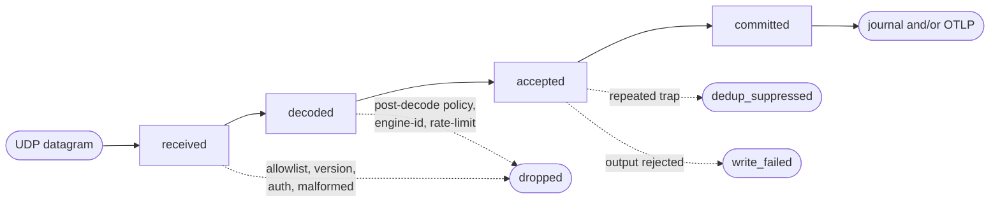

<!--startmeta
custom_edit_url: "https://github.com/netdata/netdata/edit/master/docs/snmp-traps/metrics.md"
sidebar_label: "Metrics"
learn_status: "Published"
learn_rel_path: "SNMP Traps"
keywords: ['snmp traps', 'metrics', 'health', 'deduplication', 'receiver pipeline']
endmeta-->

<!-- markdownlint-disable-file -->

# SNMP Trap Metrics

Use this page to read the SNMP trap receiver metrics: whether the receiver is healthy, whether traps are flowing, and what the receiver is dropping or suppressing. For the default health alerts that ship for these metrics, see [Alerts](/docs/snmp-traps/alerts.md).

SNMP trap metrics describe the receiver and the traps that reached it. They do not prove the complete state of a device. Absence of traps is not proof of absence of events, because a device may be quiet, misconfigured, blocked by the network, or sending to another destination.

For setup and related operator workflows, see:

- [Configuration](/docs/snmp-traps/configuration.md)
- [Usage and Output](/docs/snmp-traps/usage-and-output.md)
- [Alerts](/docs/snmp-traps/alerts.md)
- [Validation and Data Quality](/docs/snmp-traps/validation-and-data-quality.md)
- [Troubleshooting](/docs/snmp-traps/troubleshooting.md)

## Receiver pipeline

The **SNMP trap receiver pipeline** chart shows per-job event rates for the receiver path. Use it first when deciding whether the listener is receiving packets and whether accepted traps are reaching the configured output backend.

Every packet walks the same funnel; the branches are where traps are lost or held:

| Dimension | What it means | Operator use |
|---|---|---|
| `received` | A UDP packet entered the trap handler. | Confirms traffic reached the listener process. This counts *after* the kernel UDP buffer, so datagrams the kernel drops are invisible here — watch `ipv4.udperrors` (`RcvbufErrors`) for kernel drops and see [Sizing and Capacity](/docs/snmp-traps/sizing-and-capacity.md#kernel-udp-buffer-drops) for buffer tuning. |
| `decoded` | The packet parsed as an SNMP trap or INFORM PDU. | Compare with `received` to find packets rejected before or during decode, such as source allowlist drops, unsupported sniffed versions, authentication failures, or malformed packets. |
| `accepted` | The trap became a normal trap entry after source checks, profile lookup, template rendering, and source attribution. | Compare with `decoded` to find post-decode policy or source-identity checks that stopped a decoded trap before acceptance. |
| `committed` | The trap was accepted by the configured output (journal or OTLP). | This is the strongest receiver-side signal that the receiver accepted the trap for local storage or export. Backend failures are exposed by write and export error metrics. |
| `dedup_suppressed` | A repeated trap matched deduplication and was counted in a periodic summary instead of stored as its own row. | Expected during repeated events when deduplication is enabled. |
| `dropped` | A packet entered the handler but did not become a committed trap, a dedup summary, or a write failure. Decode-error rows can also increment it alongside their error dimension. | Compare with the processing-error dimensions and decode-error rows to separate decode failures, policy drops, and rate limits. |
| `write_failed` | The authoritative output (journal, or OTLP when journal is disabled) could not keep the trap. | Which counters rise depends on the backend mode — see the table below. |

### Which counters rise on a backend failure {#backend-write-failures}

| Job backend mode | On a journal write failure | On an OTLP export failure |
|---|---|---|
| Journal only | `write_failed` + `journal_write_failed` | — (no OTLP) |
| Journal + OTLP | `write_failed` + `journal_write_failed` | `otlp_export_failed` only — the journal copy is unaffected, so `write_failed` does **not** rise |
| OTLP only | — (no journal) | `write_failed` + `otlp_export_failed` — terminal; the trap is lost |

Interpret gaps in order:

- `received` rising while `decoded` is flat usually points to source allowlist, unsupported sniffed version, authentication, or malformed packet problems before a parsed trap exists.
- `decoded` rising while `accepted` is flat usually points to post-decode policy checks: version or community allowlist drops, engine ID checks, or rate limits. Profile lookup problems and template issues are data-quality signals on traps that can still become accepted entries. Dedup suppression does not keep `accepted` flat; it is tracked separately.
- `received` rising while `committed` is flat means traps are reaching the receiver but are not being accepted by the configured output writer. Check `dropped`, `dedup_suppressed`, `write_failed`, and the error dimensions.
- `write_failed` rising means the authoritative backend could not keep traps. See [Which counters rise on a backend failure](#backend-write-failures) for which counter maps to which backend mode.
- `dedup_suppressed` rising means repeated rows were intentionally collapsed. Confirm the deduplication policy before treating this as loss.

## Categories and severities

Category and severity charts count traps after receiver commit. They classify trap rows accepted by the configured writer; they are not polling metrics and do not prove current device state.

The **SNMP trap events** chart uses this fixed category set:

| Category | Typical meaning |
|---|---|
| `state_change` | A device, interface, service, sensor, peer, or component changed state. |
| `config_change` | Configuration changed on the sender. |
| `security` | Security-related event. |
| `auth` | Authentication or authorization event. |
| `license` | License state or entitlement event. |
| `mobility` | Wireless or roaming event. |
| `diagnostic` | Diagnostic, test, or health-reporting event. |
| `unknown` | Netdata could not classify the trap with a loaded profile or override. |

The **SNMP trap events by severity** chart uses this fixed severity set:

| Severity | Operator meaning |
|---|---|
| `emerg` | System unusable. Treat as immediate device-side emergency. |
| `alert` | Immediate action required. |
| `crit` | Critical condition. |
| `err` | Error condition. |
| `warning` | Warning condition. |
| `notice` | Normal but significant condition. |
| `info` | Informational event. |
| `debug` | Debug-level event. |

Severity and category come from trap profiles or local overrides. If `unknown` grows, check profile coverage and any custom profile load errors.

## Processing errors

The **SNMP trap processing errors** chart shows per-job error rates. Some errors can still produce a `decode_error` row if the receiver can write one; other drops happen before a row exists and are visible only as metrics.

| Dimension | What to check |
|---|---|
| `unknown_oid` | The trap was decoded, but no loaded profile matched its trap OID. Add or fix profile coverage if the trap should be classified. |
| `decode_failed` | The packet could not be decoded and did not match a more specific decode error class. Check sender version and packet validity. |
| `template_unresolved` | A profile template referenced a missing varbind or field. Check custom profile templates and the trap payload. |
| `malformed_pdu` | The PDU was structurally invalid, too large, missing required trap fields, or otherwise malformed. Check sender firmware and packet capture. |
| `dropped_allowlist` | The sender, SNMP version, or community was outside the allowed configuration. Check `allowlist.source_cidrs`, `versions`, and `communities`. |
| `rate_limited` | A sender exceeded the configured per-source rate limit. Check `rate_limit` settings and sender storm behavior. |
| `auth_failures` | Authentication or decryption failed. Check SNMP community or SNMPv3 auth/privacy settings. |
| `usm_failures` | SNMPv3 USM processing failed. Check users, protocols, keys, and sender engine state. |
| `unknown_engine_id` | SNMPv3 engine ID was not accepted or could not be resolved according to the job configuration. When `dynamic_engine_id_discovery` is enabled, first-time accepted `(engineID, username)` registrations also increment this counter once per job lifetime as a visibility signal. Check engine ID whitelist, dynamic discovery settings, cap exhaustion, invalid sender state, or unauthorized senders. |
| `inform_response_failed` | The receiver failed to send an INFORM acknowledgement. This is non-blocking: the trap can still continue through the receiver. Check the local socket and network path back to the sender. |
| `binary_encoded` | Structured fields were written with binary journal encoding for CWE-117 log-injection protection. Applies to the direct-journal path; OTLP-only jobs keep this counter at zero. A low background rate can be normal with known binary varbinds, but the default `snmp_trap_binary_encoded_fields` alert warns on any sustained non-zero rate over 10 minutes. Tune or silence that alert for known steady-state binary sources; investigate new or rising rates by checking profile labels, rendered varbind values with control characters, invalid UTF-8, or binary payload values. |
| `profile_load_failed` | Trap profile loading or lookup failed. Check custom profile YAML and profile directories. |
| `journal_write_failed` | Direct journal write failed. Check disk space, permissions, and the per-job journal directory. |
| `otlp_export_failed` | OTLP export failed. Check endpoint, credentials, TLS, queue pressure, and network path. |
| `listener_read_failed` | The listener failed to read from a bound UDP socket. Check operating-system socket errors and listener lifecycle logs. |

For configuration details, see the [rate limiting, deduplication, and output backend sections](/docs/snmp-traps/configuration.md).

## Deduplication suppression

The **SNMP trap dedup suppressed events** chart appears when deduplication is enabled. Its dimension is `suppressed`, and it counts repeated matching traps that were intentionally suppressed during the deduplication window. The receiver pipeline chart tracks the same suppressed traps as `dedup_suppressed`, so both dimensions rise and fall together.

Deduplication protects storage and downstream systems from repeated identical rows. A suppressed trap is not committed as a normal trap row and does not update profile-defined metrics. It is represented by deduplication metrics and summary rows instead, so the suppression remains auditable.

Use this chart with the pipeline:

- `dedup_suppressed` rising with stable `committed` means repeated events are being collapsed as configured.
- `dedup_suppressed` rising at very high rate can indicate a device-side trap storm.
- If distinct resources are being collapsed together, review `dedup.key_varbinds` in [Configuration](/docs/snmp-traps/configuration.md).

## Sources and attribution

Source metrics help answer which senders are active and which senders are affected by drops or backend failures.

| Chart | Dimensions | How to use it |
|---|---|---|
| **SNMP trap active sources** | `active` | Number of source identities currently tracked for the job. |
| **SNMP trap source attribution** | `vnode`, `fallback`, `ambiguous`, `failed`, `overflow_dropped`, `source_transitions` | Shows how the receiver assigned trap activity to source identities and whether attribution was ambiguous, failed, exceeded the source-metric cap, or changed route. |
| **SNMP trap source pipeline** | `accepted`, `committed`, `dedup_suppressed`, `write_failed` | Per-source view of normal trap handling after attribution. |
| **SNMP trap source-attributed errors** | `unknown_oid`, `template_unresolved`, `profile_load_failed`, `journal_write_failed`, `otlp_export_failed` | Per-source view of errors that can be attributed to a trap entry. |
| **SNMP trap source last seen** | `seconds_ago` | Time since the receiver last saw activity for that source identity. |

Per-source charts are labeled by `job_name`, `source_id`, and `source_kind`. When a trap can be tied to a Netdata vnode, the source identity uses that vnode. Otherwise the receiver falls back to the selected trap source, such as the enriched source or the UDP peer. Fallback source IDs are privacy-preserving hashes by default; use trap rows in [Usage and Output](/docs/snmp-traps/usage-and-output.md) when you need readable source fields.

Source-attributed receiver metrics are bounded to 2000 active sources per job, so plan source cardinality around that cap. Inactive sources age out automatically. Accepted traps can still be committed if source metric attribution fails or the source cap is full; in that case, per-job pipeline totals can be higher than the sum of per-source charts.

This source-metric cap applies to the built-in source receiver charts: `snmp.trap.source_pipeline`, `snmp.trap.source_errors`, and `snmp.trap.source_last_seen`. Profile-defined metrics have separate cardinality limits; see [Profile-defined metrics](#profile-defined-metrics).

Interpret source charts carefully:

- A high `active` count can be normal on large networks, but sudden growth can also mean unexpected senders or relay behavior.
- `ambiguous` means the receiver saw conflicting or rejected source evidence. Check source attribution fields in trap rows.
- `failed` means the receiver could not create a source metric identity for an entry.
- `overflow_dropped` means source metric tracking hit its cap. Accepted traps can still be committed, but per-source metric visibility is bounded.
- `source_transitions` means the same raw source route changed to a different metric identity. Check relay, vnode, and source attribution configuration.

## Profile-defined metrics

Profile-defined metrics convert selected committed traps into time-series. They are disabled by default and must be enabled with `profile_metrics` in [Configuration](/docs/snmp-traps/configuration.md).

Important behavior:

- Only committed traps update profile metrics. A later journal or OTLP failure does not roll back a metric that was already updated, so a metric and its downstream export can briefly diverge.
- Dedup-suppressed traps do not update profile metrics.
- Traps that fail to write (journal write failures or dropped OTLP records) do not update profile metrics.
- Cardinality limits protect the node by bounding enabled rules, sources, resources per source, and total metric instances per job.
- Over-cap profile metric instances are skipped and counted by diagnostics; the accepted trap can still be committed.

Selection modes decide which loaded profile metric rules run:

- `none`: no rules are evaluated.
- `auto`: runs only rules marked safe for automatic use.
- `exact`: runs only rule names listed in `profile_metrics.include`.
- `combined`: runs automatic rules plus rule names listed in `profile_metrics.include`.

When at least one profile metric rule is selected, Netdata also emits the dynamic **SNMP trap profile metric diagnostics** chart, context `snmp.trap.profile_metric_diagnostics`, for the listener job.

| Dimension | What it means | Operator use |
|---|---|---|
| `rule_missed` | A selected rule did not match the trap, or a missing value used `missing: drop`. | Expected when a rule applies only to some traps. Sudden changes can mean the trap payload or profile predicates changed. |
| `extraction_failed` | A selected rule matched but could not extract a required runtime value. | Check the profile rule, varbind type, and trap payload. |
| `attribution_failed` | Netdata could not derive or accept a source identity for the metric instance. | Check source attribution and profile metric identity settings. |
| `overflow_dropped` | A new metric instance exceeded source, resource, chart, or job cardinality caps. | Tighten rule identity, reduce selected rules, or adjust reviewed cardinality limits. |
| `source_transitions` | The same source route changed between fallback and vnode or device attribution. | Check enrichment, vnode matching, relays, and whether sender identity is stable. |

Enable only rules with bounded identity and labels. For trap row fields and deduplication summary rows, see [Usage and Output](/docs/snmp-traps/usage-and-output.md). For validation workflow and data-quality checks, see [Validation and Data Quality](/docs/snmp-traps/validation-and-data-quality.md) and [Troubleshooting](/docs/snmp-traps/troubleshooting.md).
