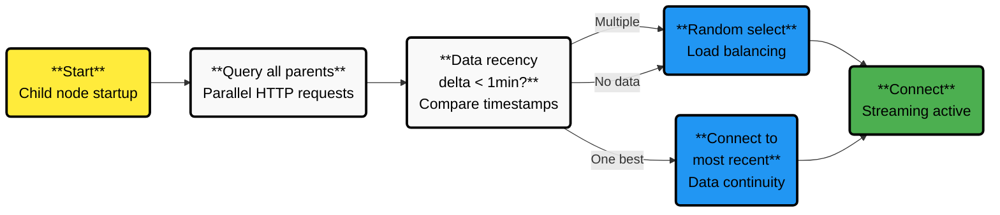
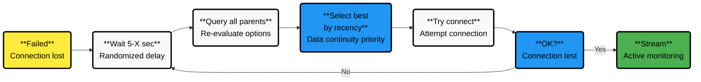

# Netdata Streaming Routing

Streaming routing controls how Netdata child nodes connect to parent nodes when multiple parents are available. It handles three key operations: initial parent selection, connection management, and failover.

:::info

This feature requires configuring streaming in `netdata.conf`. See [Streaming Configuration](/src/streaming/README.md) for setup instructions.

:::

## How Streaming Routing Works

### 1. Initial Parent Selection

When a child node starts, it queries all configured parents simultaneously to determine the best connection:



**How it works:**

1. Child sends HTTP requests to all parents in parallel
2. Each parent responds with:
    - Last timestamp of this child's data (if any)
    - Random seed for load balancing
3. Child calculates time delta for each parent
4. Selection based on data recency (not data amount)

**Example:**

```ini
# In child's stream.conf
[stream]
    enabled = yes
    destination = parent-a:19999 parent-b:19999 parent-c:19999
    api key = YOUR_API_KEY
```

With this configuration:

```
Child Node startup:
    │
    ├─→ Parent A (has historical data) ✓ Selected (random between A & B)
    ├─→ Parent B (has historical data) 
    └─→ Parent C (no historical data)   ← Lower priority
```

### 2. Connection Management

Once connected, the child maintains a persistent connection:

- **Connection timeout**: 60 seconds (default)
- **Keepalive**: Continuous streaming maintains connection
- **No automatic rebalancing**: Child stays connected until failure
- **Data integrity**: Historical metrics are replicated automatically after reconnection

:::info

Netdata automatically replicates missing historical data when reconnection occurs. Data is only lost if:

- Child restarts during disconnection AND
- Child uses `memory mode = ram` (metrics stored in memory) AND
- Disconnection exceeds retention period (default: 1 hour for RAM mode)

For persistent data, use `memory mode = dbengine`.

:::

:::warning

Children do not automatically reconnect to their original parent after failover. This prevents connection flapping but requires manual intervention for load redistribution.

:::

### 3. Failover and Reconnection

When the active connection fails, the child repeats the parent selection process:



:::note

Unlike traditional round-robin failover, Netdata re-evaluates all parents on each attempt. This means a child might connect to a different parent than expected if data states have changed.

:::

**Failover Example:**

```
Normal:     Child → Parent A
            
Failure:    Child ✗ Parent A (connection lost)
            Child → Parent B (immediate failover)
            
Recovery:   Parent A comes back online
            Child → Parent B (stays connected - no automatic switch)
```

## Key Routing Behaviors

| Behavior                   | Description                                               | Impact                                                      |
|----------------------------|-----------------------------------------------------------|-------------------------------------------------------------|
| **Data Recency Priority**  | Selects parent with most recent data (lowest time delta)  | Minimizes gap in historical data                            |
| **Parallel Parent Query**  | Queries all parents simultaneously via HTTP               | Fast parent selection, no sequential delays                 |
| **Sticky Connections**     | No automatic rebalancing after failover                   | Requires manual intervention to redistribute load           |
| **Smart Failover**         | Re-evaluates all parents on each connection attempt       | May connect to different parent based on current data state |
| **Connection Persistence** | Maintains connection until failure occurs                 | Prevents unnecessary reconnections and data gaps            |
| **No Health Checks**       | Doesn't proactively test parent availability              | Discovers failures only when connection breaks              |
| **Randomized Delays**      | Reconnection waits random time (5s to configured maximum) | Prevents thundering herd during mass reconnections          |

## Configuration Reference

### Essential Parameters

```ini
[stream]
    # Streaming targets (space-separated list)
    # Order doesn't matter - selection is based on data recency
    destination = parent1:19999 parent2:19999 parent3:19999
    
    # Reconnection delay - randomized between 5 and this value (seconds)
    # Default: 5, Minimum: 5
    reconnect delay seconds = 5
    
    # Initial connection timeout
    timeout seconds = 60
```

### Multi-Tier Setup

For larger deployments:

```
Child Nodes ──→ Parent Proxies ──→ Ultimate Parents
                 (forward only)      (store & analyze)
```

Configure intermediate parents as proxies to distribute load without storage overhead.

## Monitoring Streaming Status

### Check Connection Status

#### Using the UI

The **Netdata Streaming** function (under the "Functions" tab) provides:

- Comprehensive overview of all streaming connections
- Status, replication completion time, and connection details
- Works on both parent and child nodes:
    - **On child**: Shows outgoing connections
    - **On parent**: Shows incoming connections (InHops = 1 for direct children, >1 for proxied connections)

#### Viewing Logs

```bash
# Check journal for streaming-related messages
journalctl _SYSTEMD_INVOCATION_ID="$(systemctl show --value --property=InvocationID netdata)" --namespace=netdata --grep stream
```

### Verify Parent Connectivity

```bash
# Test each parent
nc -zv parent-a 19999
nc -zv parent-b 19999
```

:::note Troubleshooting

If a child connects to an unexpected parent, check the data retention on all parents. The child prefers parents that already have its historical data.

:::

## Common Scenarios

| Scenario          | What Happens                            | Why                      |
|-------------------|-----------------------------------------|--------------------------|
| Parent A fails    | Child switches to Parent B              | Automatic failover       |
| All parents fail  | Child cycles through list every second  | Continuous retry         |
| Parent A recovers | Child stays on Parent B                 | No automatic rebalancing |
| New child starts  | Randomly selects from parents with data | Load distribution        |

:::caution Maintenance Planning

When taking a parent offline for maintenance, its children will fail over to other parents and won't automatically return. Plan capacity accordingly.

:::

## Best Practices

1. **List parents in priority order** - First parent is preferred if all equal
2. **Configure at least 3 parents** - Ensures availability during maintenance
3. **Monitor parent data completeness** - Affects routing decisions
4. **Plan maintenance carefully** - Children won't automatically return
