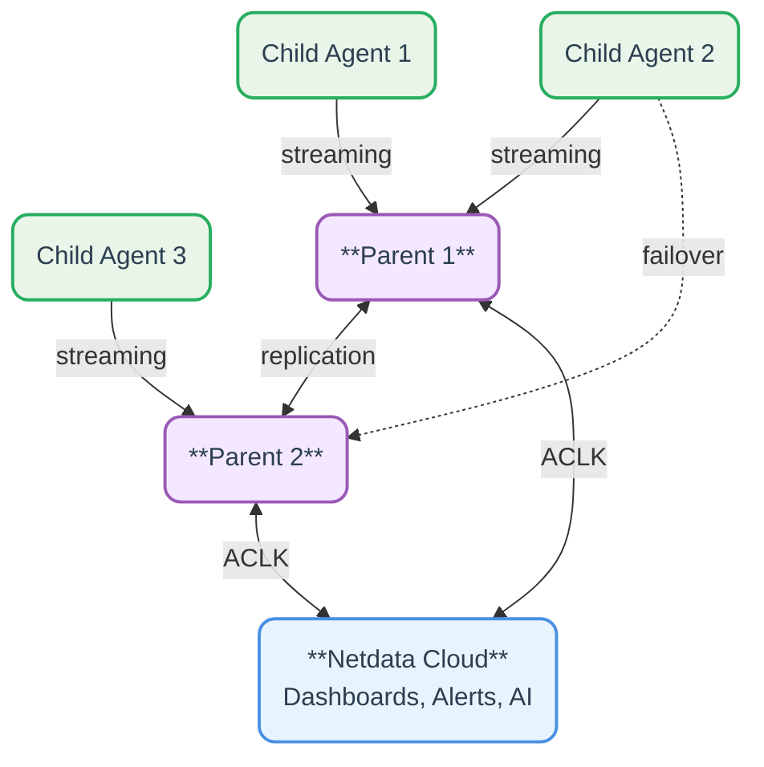

# Welcome to Netdata

## Who we are

Netdata is a distributed, real-time observability platform for metrics and logs, with a foundation designed to extend to distributed tracing. It collects data at per-second granularity, stores it at (or close to) the edge where it's generated, and provides automated dashboards, ML anomaly detection, and AI-powered analysis with zero configuration.

Instead of centralizing data, Netdata **distributes the monitoring code** to each system, **keeping data local** while providing **unified access**. This enables **linear scaling** to millions of metrics per second, **automated root cause analysis**, and a significantly **lower total cost of ownership**.

Built for operations teams, sysadmins, DevOps engineers, and SREs who need real-time, low-latency infrastructure visibility, Netdata is opinionated: it collects and visualizes everything, and runs ML anomaly detection on everything, without requiring specialized skills.

The system consists of three components:

- [**Netdata Agent**](/docs/deployment-guides/standalone-deployment.md): Monitoring software installed on each system
- [**Netdata Parents**](/docs/deployment-guides/deployment-with-centralization-points.md): Optional centralization points for aggregating data from multiple agents (Netdata Parents are the same software component as Netdata Agents, configured as Parents)
- [**Netdata Cloud**](/docs/netdata-cloud/README.md): A smart control plane for unifying multiple independent Netdata Agents and Parents, providing horizontal scalability, role based access control, access from anywhere, centralized alerts notifications, team collaboration, AI insights, and more.

The following diagram shows how Netdata components connect:

## Performance at a Glance

|                      Aspect |                 Netdata                  |     Industry Standard     |
|----------------------------:|:----------------------------------------:|:-------------------------:|
|    **Real-Time Monitoring** |                                          |                           |
|            Data granularity |                 1 second                 |       10-60 seconds       |
| Collection to visualization |                 1 second                 |        30+ seconds        |
|     Time to first dashboard |                10 seconds                |       Hours to days       |
|              **Automation** |                                          |                           |
|      Configuration required |             Minimal to none              |         Extensive         |
|        ML anomaly detection |        All metrics automatically         | Selected metrics manually |
|       Pre-configured alerts |           400+ out of the box            |    Build from scratch     |
|              **Efficiency** |                                          |                           |
|          Storage per metric |             0.6 bytes/sample             |     2-16 bytes/sample     |
|             Agent CPU usage |              5% single core              |    10-30% single core     |
|                 Scalability |            Linear, unlimited             |  Exponential complexity   |
|                **Coverage** |                                          |                           |
|           Metrics collected |           Everything available           |     Manually selected     |
|         Built-in collectors |            800+ integrations             |   Basic system metrics    |
|         Hardware monitoring |              Comprehensive               |      Limited or none      |
|             Live monitoring | processes, network connections, and more |      Limited or none      |

## Design Philosophy and Implementation

### Data at the Edge

:::note

Netdata keeps the observability data at the edge (Netdata Agents), or as close to the edge as possible (Netdata Parents).

:::

:::tip

Keeping data at the edge eliminates egress charges, ensures compliance by default, and transforms observability from an unpredictable cost center into a fixed operational expense while delivering sub-second query performance.

:::

**Implementation**: Each Netdata Agent is a complete monitoring system: collection, storage, query engine, visualization, ML, and alerting, not just an agent that ships data elsewhere. This provides:

- **Data sovereignty**: Data stays on-premises and only leaves when viewed, supporting GDPR, HIPAA, and data-residency requirements.
- **Linear scalability**: Adding Agents and Parents doesn't affect existing ones.
- **Isolated operation**: Monitoring keeps working even without internet connectivity.
- **Universal capture**: All observability data exposed by systems and applications is collected.
- **High-fidelity insights**: Per-second data captures cascading effects other resolutions miss.

### Complete Coverage

:::note

Most observability solutions are selective to control cost and setup complexity, which creates two problems: one uncollected metric can hide the root cause during a crisis, and observability quality ends up reflecting the skill of whoever chose what to collect.

:::

Netdata captures everything exposed by systems and applications: every metric, every log entry, every piece of telemetry available.

- **No blind spots**: The metric you didn't know to monitor is already collected and visualized.
- **Skill-independent quality**: Junior and senior engineers get the same comprehensive visibility.
- **Crisis-ready coverage**: When incidents occur, all relevant data is available.
- **Full context for AI**: Machine learning and AI assistants have complete data to identify patterns and correlations.

### Real-Time, Low-Latency Visibility

:::note

Most observability solutions collect data every 10-60 seconds with additional pipeline delays of seconds to minutes, making them statistical analysis tools rather than real-time monitoring. This forces engineers to SSH into servers for accurate, timely data during incidents.

:::

See [Real-Time Monitoring: The Netdata Standard](/docs/realtime-monitoring.md) for the full latency breakdown and how Netdata compares to other monitoring solutions.

Netdata collects everything per-second with a fixed one-second collection-to-visualization latency. Every sample must be collected on time; a delay means the monitored component is under stress, and Netdata shows a gap on the chart rather than hiding it. This delivers:

- **True real-time visibility**: See what's happening now, not what happened 30 seconds ago.
- **Console-quality precision**: No need to SSH into servers for real-time data during incidents.
- **Stress detection**: Gaps in charts immediately reveal when systems and applications are under stress.
- **Accurate sequencing**: Understand the exact order of cascading failures across systems.
- **Live troubleshooting**: Watch the immediate impact of your changes as you make them.
- **Tools consolidation**: Use a single uniform and universal dashboard for all systems and applications.

### Data Accessibility

:::note

Most observability solutions require users to learn query languages, manually build dashboards, and understand metric types before they can visualize data. This prerequisite knowledge and configuration work becomes the biggest barrier to effective monitoring.

:::

Netdata dashboards are generated by an algorithm, not built by hand. Each chart is a full analytical tool offering a 360° view of its data, navigable by point-and-click. Netdata automatically provides single-node, multi-node, and infrastructure-level dashboards, with all metrics organized in a table of contents that adapts to the data available. This delivers:

- **Zero learning curve**: No query languages, no manual dashboard building, no configuration.
- **Instant time to value**: Complete visibility from the moment of installation.
- **Universal navigation**: The same logical structure across all organizations and infrastructures.
- **Interactive exploration**: Point-and-click analysis without knowing metric names or data types.
- **Skill democratization**: Everyone from junior to senior engineers gets the same powerful tools.

### Efficient Storage

Netdata is optimized for lightweight storage. Three tiers (per-second, per-minute, per-hour) update in parallel; the high-resolution tier needs 0.6 bytes per sample on disk (Gorilla + ZSTD compression), while the lower-resolution tiers (6 and 18 bytes/sample) still preserve min, max, average, and anomaly rate. Data is append-only (Write Once Read Many) and writes are spread evenly over time. Agents write at 5 KiB/s, and Parents aggregating 1M metrics/s write at 1MiB/s across all tiers.

This custom time-series database is optimized for the specific patterns of system metrics:

- **Write-once design**: Append-only architecture for maximum performance
- **Multi-tier storage**: Three storage tiers of different resolution, updated in parallel
- **Zero maintenance**: No recompaction or database maintenance windows

This efficient storage architecture delivers years of data in gigabytes rather than terabytes, with predictable I/O patterns and linear scaling of storage requirements with infrastructure size.

### Logs Management

:::info

Log management is one of the largest cost drivers in observability. Many organizations resort to aggressive filtering and sampling to control costs, losing critical information when they need it most.

:::

Netdata instead leverages the systemd journal format, Linux's native log format, for enterprise-grade capabilities without the enterprise costs:

- **Direct file access**: No query servers needed; clients open journal files directly, leveraging OS disk cache for fast performance
- **Comprehensive indexing**: Every field in every log entry is automatically indexed, enabling instant queries across millions of entries
- **Flexible schema**: Each log entry can have its own unique set of fields and values, all fully indexed and searchable
- **Efficient storage**: Journal files typically match uncompressed text log sizes while providing full indexing, balancing space efficiency and query performance
- **Native tooling**: Built-in support for centralization, filtering, exporting, and integration with existing pipelines
- **Security built-in**: Write Once Read Many (WORM) and Forward Secure Sealing (FSS) ensures log integrity and tamper detection
- **Logs transformation**: The platform includes `log2journal` for converting any text, JSON, or logfmt logs into structured journal entries

Where traditional solutions sample 5,000 log entries for dashboard field statistics, Netdata samples 1 million, 200x more accurate, while keeping logs at the edge and eliminating centralized log infrastructure costs.

:::note

On Windows Netdata queries Windows Event Logs (WEL), Event Tracing for Windows (ETW) and TraceLogging (TL) via the Event Log.

:::

### AI and Machine Learning

ML is the simplest way to model system and application behavior. Done well, it detects anomalies, surfaces correlations, and identifies blast radius independently of configured alerts.

Netdata makes ML automatic and universal, requiring no configuration. It trains 18 k-means models per metric across different rolling time windows and requires unanimous agreement across all of them before flagging an anomaly, significantly reducing false positives versus a single model while staying sensitive to real issues:

- **Continuous training**: Models train automatically as data arrives
- **Real-time detection**: Anomaly detection runs instantly, not in batches
- **Efficient storage**: Results store in just 1 bit per metric per second
- **Correlation analysis**: Engine identifies related anomalies across metrics
- **Unbiased detection**: Anomaly detection is not influenced by future events

Note: Netdata's ML focuses on detecting behavioral anomalies in metrics using their last 2 days of data. It is optimized for reliability rather than sensitivity and may miss slow (over days/weeks) infrastructure degradation or certain types of long-term anomalies (weekly, monthly, etc.). However, it typically detects most types of abnormal behavior that break services.

For more information see [Netdata's ML Accuracy, Reliability and Sensitivity](/docs/ml-ai/ml-anomaly-detection/ml-anomaly-detection.md).

### Troubleshooting

Netdata's unsupervised, real-time anomaly detection powers the "Anomaly Advisor," which transforms troubleshooting:

- **Automatic scoring**: Ranks all metrics by anomaly severity within any time window
- **Root cause prioritization**: Surfaces the most likely culprits in the first 30-50 metrics
- **Sequence analysis**: Reveals the order of cascading failures across systems
- **Blast radius mapping**: Determines the full impact scope of incidents
- **AI-ready insights**: Provides structured data that AI assistants use to narrow investigations

This still requires interpretation skills, but dramatically simplifies investigation; the "aha!" moment is usually within the first 30-50 results.

### Alerts

:::note

Most monitoring solutions focus on aggregate, business-level alerts, missing component failures until they cascade into outages and causing alert fatigue from the false positives and gaps that follow.

:::

Netdata instead uses templated alerts that watch individual component and application instances, giving every component its own watchdog. This ensures:

- **Complete coverage**: Every database, web server, container, and service instance has dedicated monitoring
- **Early detection**: Component failures are caught before they cascade into service-wide issues
- **Clear accountability**: Alerts identify exactly which instance is failing, not just that "something is wrong"
- **Scalable alerting**: Templates automatically apply to new instances as infrastructure grows
- **Synthetic checks**: Lightweight integration tests that validate connectivity and behavior between applications complement component monitoring

:::tip

Netdata ships with hundreds of pre-configured alerts. Many are intentionally silent by default, monitoring important but non-critical conditions worth reviewing without waking engineers at 3am.

:::

### Scalability

See [Scalability: Monitoring at Any Scale](/docs/scalability.md) for the full architecture breakdown, Parent sizing guidelines, and benchmark data. In summary, for Netdata, scalability is inherent to the architecture, not an add-on. Designed to be fully distributed, Netdata achieves linear scalability through:

- **Independent operation**: Each Agent and Parent operates autonomously without affecting others.
- **Horizontal scaling**: Add more Parents to handle more Agents without redesigning architecture.
- **Consistent performance**: Query response times remain the same whether you have 10 or 10,000 nodes.
- **Resource predictability**: Resource usage scales linearly with infrastructure size.
- **High availability**: Streaming and replication provide high-availability to Netdata deployments.
- **Clustering**: Netdata Parents can be clustered to replicate all their data locally, or cross region for disaster recovery.
- **Fail-over**: Netdata Cloud dynamically routes queries to Netdata Parents and Agents based on their availability.

### Open Ecosystem

Netdata thrives as part of a vibrant open-source community with 1.5 million downloads per day, integrating with existing tools and standards:

- **Metrics collection**: Ingests metrics via all open standards, including OpenTelemetry
- **Metrics export**: Exports metrics to all open standards and commonly used time-series databases (Prometheus, Graphite, InfluxDB, OpenTSDB, and more)
- **Logs**: Uses battle tested systemd journal files for storing logs, providing maximum interoperability
- **Alert routing**: Delivers notifications to PagerDuty, Slack, email, webhooks, and 20+ platforms
- **AI integration**: Supports AI assistants via Model Context Protocol (MCP), available via Netdata Cloud (infrastructure-wide) and on every Agent/Parent (local access)
- **Visualization**: Works with Grafana through native datasource plugin
- **Container orchestration**: Integrates with Kubernetes, Docker Swarm, and Nomad

Netdata can operate independently or alongside your existing stack (Prometheus, Grafana, OpenTelemetry, or centralized log aggregators) without disrupting existing workflows.

## Working with Netdata

Typically, organizations deploying Netdata need to:

1. **Install Netdata Agents** on all Linux, Windows, FreeBSD and macOS physical servers and VMs
2. Optionally: dedicate resources (VMs, storage) for Netdata Parents, providing high-availability and longer retention to observability data
3. Optionally: configure logs transformation with `log2journal` and centralization using typical systemd-journald methodologies
4. **Configure collectors** that need credentials to access protected applications (databases, message brokers, etc.), data collection for custom applications, enable SNMP discovery and data collection, install Netdata with auto-discovery in Kubernetes clusters. See [Fleet Deployment and Configuration Management](/docs/fleet-configuration-management.md) for auto-discovery and configuration management approaches at scale
5. **Review alerts** (Netdata ships with preconfigured alerts) and set up alert **notification channels**
6. **Invite colleagues** (enterprise SSO via IODC, Okta and SCIMv2 supported), assign roles and permissions

Netdata will automatically provide:

1. **Complete coverage** of hardware, operating system and application metrics
2. Real-time, low-latency **Metrics and Logs Dashboards**
3. Live and interactive exploration of running **processes**, **network connections**, **systemd units**, **systemd services**, **IMPI sensors**, and more
4. Unsupervised **machine-learning based anomaly detection** for all metrics
5. Hundreds of **pre-configured alerts** for systems and applications
6. **AI insights** (reports) and **AI-assistant** (chat) connections via MCP (Cloud MCP for infrastructure-wide access, Agent/Parent MCP for local access)

:::tip

Custom dashboards are supported but are optional. Netdata provides single-node, multi-node and **infrastructure level dashboards** automatically.

:::

Netdata configurations are infrastructure-as-code friendly and can be automated with provisioning systems for large infrastructures. A complete deployment is usually achieved within a few days.

## Resource Requirements

Netdata is committed to best-in-class resource utilization; wasted resources are treated as bugs. Based on real-world deployments and independent academic validation, Netdata maintains a minimal footprint:

| Resource               | Standalone 5k metrics/s | Child 5k metrics/s  | Parent 1M metrics/s |
|------------------------|:-----------------------:|:-------------------:|:-------------------:|
| **CPU**                |   5% of a single core   | 3% of a single core |   ~10 cores total   |
| **Memory**             |         200 MB          |       150 MB        |       ~40 GB        |
| **Network**            |          None           | \<1 Mbps to Parent  |  ~100 Mbps inbound  |
| **Storage Capacity**   |  3 GiB (configurable)   |        None         |      as needed      |
| **Storage Throughput** |      5 KiB/s write      |        None         |    1 MiB/s write    |
| **Retention**          |  1 year (configurable)  |        None         |      as needed      |

:::note

- Parent resources include both ingestion and query workload
- Storage rates are for all tiers combined; actual disk usage depends on retention configuration
- The recommended topology is having a cluster of Netdata Parents every 500 monitored nodes (2M metrics/s). See [Parent Sizing Guidelines](/docs/scalability.md#parent-sizing-guidelines) for the full breakdown
- For default-settings sizing guidance per Agent (CPU, RAM, disk, and bandwidth), see [Resource utilization](/docs/netdata-agent/sizing-netdata-agents/README.md)

:::

:::info

The [University of Amsterdam study](https://twitter.com/IMalavolta/status/1734208439096676680) found Netdata to be the most energy-efficient monitoring solution, with the lowest CPU overhead, memory usage, and execution time impact among compared tools.

For more information, see [Netdata's impact on resources](/docs/netdata-agent/sizing-netdata-agents/README.md).

:::

## Practical Implications

Please also see [Netdata Enterprise Evaluation Guide](/docs/netdata-enterprise-evaluation.md) and [Netdata's Security and Privacy Design](/docs/security-and-privacy-design/README.md).

### For Small Teams

Without dedicated monitoring staff, teams need systems that work without constant attention. Netdata's automatic operation enables teams to:

- Eliminate configuration maintenance as infrastructure changes
- Access instant dashboards during incidents without building them
- Remove the guesswork of threshold tuning as patterns evolve
- Achieve complete visibility with zero learning curve

### For Large Organizations

At scale, traditional monitoring becomes expensive and complex. Netdata's architecture enables organizations to:

- Gain predictable costs based on node count, not data volume
- Ensure consistent performance from 10 to 10,000 systems
- Match monitoring architecture to organizational structure
- Satisfy data locality requirements (GDPR, HIPAA) by design

### For Dynamic Environments

Modern infrastructure changes constantly. Netdata enables teams to:

- See new containers in dashboards immediately upon creation
- Maintain clean views as resources are deleted automatically
- Track relationships that update dynamically as services scale
- Benefit from ML models that continuously adapt to new patterns

## Frequently Asked Questions on Design Philosophy

Doesn't edge architecture create a management nightmare?

**The opposite is true: edge architecture eliminates most management overhead.**

Traditional centralized systems require:

- Database administration (backups, compaction, tuning)
- Capacity planning for central storage
- Pipeline management and scaling
- Schema migration coordination
- Downtime windows for maintenance

Netdata's edge approach provides:

- **Zero maintenance**: Agents and Parents run autonomously without administration
- **Automatic updates**: Built-in update mechanisms or integration with provisioning tools
- **Strong compatibility**: Backwards compatibility ensures upgrades don't break things
- **Forward compatibility**: Can often downgrade without data loss (we implement forward-read capability before activating new schemas)
- **No coordination needed**: Each agent updates independently, with no "big bang" migrations
- **Fixed relationships**: Parent-Child connections are one-time configuration with alerts for disconnections
- **Cardinality protection**: Automated protections prevent runaway metrics from affecting the entire system
- **Built-in high availability**: Streaming and replication provide data redundancy without complex setup

The architecture also delivers:

- **Minimal disk I/O**: Data commits only every 17 minutes per metric (spread over time), while real-time streaming maintains data safety
- **No backup complexity**: Observability data is ephemeral (rotated) and write-once-read-many (WORM), eliminating traditional backup via replication instead
- **Isolated failures**: Issues affect only part of the ecosystem (e.g., a single parent), not the entire monitoring foundation

**Why not use existing databases?** Existing time-series databases couldn't meet the requirements for edge deployment:

- **Process independence**: No separate database processes to manage
- **Write-once-read-many (WORM)**: Corruption-resistant with graceful degradation
- **Zero maintenance**: No tuning, compaction, or optimization required
- **Minimal footprint**: Small memory usage with extreme compression (0.6 bytes/sample)
- **Optimized I/O**: Low disk writes spread over time to minimize impact
- **Embedded ML**: Anomaly detection without additional storage overhead
- **Partial resilience**: Continues operating even with partial disk corruption

The "thousands of databases" concern misunderstands the architecture: these are autonomous, self-managing components, not databases you manage, much like syslog handles thousands of log files without anyone managing them individually. In practice, organizations routinely run multi-million-sample/second, highly-available Netdata infrastructure without noticing this complexity, because it's eliminated by design rather than moved elsewhere.

Isn't collecting 'everything' fundamentally wasteful?

**The opposite is true: Netdata is the most energy-efficient monitoring solution available.** The University of Amsterdam study confirmed Netdata uses significantly fewer resources than selective solutions, despite collecting everything per-second, thanks to its optimized design.

The real question is: **what's the business impact when critical troubleshooting data isn't available during a crisis?** Crises happen when things break unexpectedly. If the failure mode were predictable, you'd already have mitigations, and engineers can't predict what data they'll need for a problem they didn't anticipate.

The business case for complete coverage:

- **Reduced MTTD/MTTR**: All data is available immediately when investigating issues
- **No blind spots**: The metric you didn't think to collect often holds the key
- **ML/AI effectiveness**: Algorithms can find correlations in "insignificant" metrics that humans miss
- **Lower environmental impact**: More efficient than selective solutions despite broader coverage

Selective monitoring creates a paradox: you must predict what will break to know what to monitor, but if you could predict it, you'd prevent it. Complete coverage eliminates the guessing game while reducing resource consumption through better engineering.

Does complete coverage create analysis paralysis?

**Structure prevents paralysis: Netdata organizes data hierarchically, not as an unstructured pool.** Unlike solutions that present metrics as a flat list, Netdata groups them logically:

- 50 disk metrics stay within the disk section
- 100 container metrics remain in the container view
- Database metrics don't interfere with network analysis

This means:

- **No performance impact**: Finding database issues isn't slower because you have more network metrics
- **No confusion**: Each subsystem's metrics are logically grouped and accessible
- **Negligible cost**: One more metric adds just 18KB memory and 0.6 bytes/sample on disk

**Comprehensive data empowers different engineering approaches**: some engineers thrive with complete visibility to trace cascading failures; others prefer simpler "is it working?" dashboards. Netdata supports both:

- **For troubleshooters**: Full depth to understand root causes and prevent recurrence
- **For quick fixes**: High-level dashboards and clear alerts for immediate action
- **For everyone**: ML-driven Anomaly Advisor surfaces what matters without manual searching

The philosophy isn't "more data is better"; it's "the right data should always be available." Hierarchical organization lets engineers work at their preferred depth without being overwhelmed by data they don't currently need.

Is per-second granularity actually useful or just marketing?

**Per-second is for engineers, not business metrics: it matches the speed at which systems actually operate.** A single second contains enough time for an entire cascading failure, and a minute can hold millions of requests, multiple garbage collections, or intermittent network issues.

**Per-second is the standard for engineering tools.** When engineers debug with console tools, they never use 10-second or minute averages, because averaging hides the details that matter: stress spikes, microbursts that overwhelm queues, and brief stalls that compound into user-facing latency.

**Netdata was designed as a unified console replacement**, the evolution of `top`, `iostat`, `netstat`, and hundreds of other console tools, but with:

- The same per-second granularity engineers expect
- Complete coverage across all subsystems
- Historical data to trace issues backward
- Visual representation of complex relationships
- Machine Learning analyzing everything

This is true tools consolidation: instead of jumping between dozens of console commands during an incident, engineers get one unified view at the resolution that matters: the exact second a service started degrading, not a minute-average that obscures the trigger.

**Immediate feedback is crucial for effective operations.** When engineers make infrastructure changes, they need to see the impact immediately:

- **During crisis**: Every second counts, and you can't wait for minute-averages to confirm if your fix is working
- **Configuration changes**: See instantly whether that parameter helped or made things worse
- **Scaling operations**: Watch resource utilization respond in real-time as you add capacity
- **Performance tuning**: Observe the immediate effect of cache size adjustments or thread pool changes

This instant feedback loop accelerates problem resolution, letting engineers iterate through fixes in seconds instead of waiting for averaged data to confirm whether an intervention helped. Minute or hourly aggregations make sense for business metrics, but for infrastructure monitoring and tuning, per-second granularity is the foundation of effective troubleshooting.

What about the observer effect? How do you guarantee per-second collection isn't impacting application performance?

**Netdata's default collection frequencies are carefully configured to avoid impacting monitored applications.** The goal: collect every metric at the maximum frequency that doesn't affect performance.

**Thoughtfully configured defaults:**

- **Most metrics**: Collected per-second when source data updates frequently
- **Slower metrics**: Collected every 5-10 seconds when source data changes less frequently
- **Expensive metrics**: Disabled by default with optional configuration flags for specialized use cases

**Performance-first defaults:**

- Collection frequency is tuned based on the cost of data gathering
- "Expensive" metrics (those affecting performance) have lower default frequencies
- Some specialized metrics are completely disabled by default but can be enabled when their value justifies the overhead

**User control:**

- All frequencies are configurable, so users can increase collection frequency if they need higher resolution for specific metrics
- Can disable any collector that proves problematic in their specific environment
- Can enable expensive collectors when their specialized value outweighs the performance cost

This isn't blind per-second collection regardless of impact. It's collecting each metric at the optimal frequency for its source, defaulting to configurations proven safe across thousands of production deployments. The University of Amsterdam study confirmed the result: despite comprehensive collection, Netdata has the lowest performance impact among monitoring solutions tested.

Why systemd-journal instead of industry standards like Elasticsearch/Splunk?

**systemd-journal IS the industry standard: it's already installed and running on every Linux system.** The question misframes the choice: systemd-journal isn't competing with Elasticsearch/Splunk, it's the native log format they read from. The real question is why move data when you can query it directly.

**Understanding the trade-offs:**

| Approach                 | Storage Footprint              | Query Performance                                | Indexing Strategy                    |
|--------------------------|--------------------------------|--------------------------------------------------|--------------------------------------|
| **Loki**                 | 1/4 to 1/2 of original logs    | Slow (brute force scan after metadata filtering) | Limited metadata indexing            |
| **Elasticsearch/Splunk** | 2-5x larger than original logs | Fast full-text search                            | Word-level reverse indexing          |
| **systemd-journal**      | ~Equal to original logs        | Fast field-value queries                         | Forward indexing of all field values |

**systemd-journal provides a balanced approach:**

- **Open schema**: Each log entry can have unique fields, all automatically indexed
- **Storage efficient**: Roughly the same size as original logs
- **Query optimized**: Fast lookups for any field value as a whole
- **Universal compatibility**: Already the source for all other log systems

**But systemd-journal is actually superior in critical ways:**

- **Security features**: Forward Secure Sealing (FSS) for tamper detection, not even available in most commercial solutions
- **Native access control**: Uses filesystem permissions for isolation, with no additional security layer to breach
- **Extreme performance**: Outperforms everything else in single-node ingestion throughput while being lightweight
- **No query server**: All queries run in parallel, lockless, directly on files, for infinitely scalable read performance
- **OS-level optimization**: Naturally cached by the kernel, providing blazing-fast repeated queries
- **Built-in distribution**: Native tools for log centralization within infrastructure, no additional software needed
- **Edge-native**: Distributed by design, perfectly aligned with Netdata's architecture

Direct file access is a security advantage, not a risk: access control is enforced by the OS through native filesystem permissions, with no query server to hack and no extra authentication layer or database permissions to manage.

**What Netdata adds:** systemd-journal is powerful but lacks a visualization and analysis layer. Netdata provides:

- Rich query interface and dashboards
- Field statistics and histograms
- Integration with metrics and anomaly detection
- Web-based exploration tools

Instead of copying logs to expensive centralized systems, Netdata builds better tools on the foundation already present in every Linux system, eliminating data movement, reducing costs, and delivering faster queries through native file access.

## Summary

Netdata represents a fundamental rethink of monitoring architecture. By processing data at the edge, automating configuration, maintaining real-time resolution, applying ML universally, and making data accessible to everyone, it solves core monitoring challenges that have persisted for decades.

The result is a monitoring system that deploys in minutes, scales to any size, adapts automatically to change, and delivers insights traditional tools can’t, all while staying open source and community-driven.

Whether you're monitoring a single server or a global infrastructure, Netdata's design philosophy creates a monitoring system that works with you rather than demanding constant attention.
