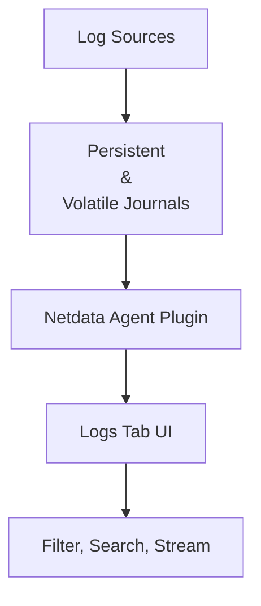

<!--startmeta
custom_edit_url: "https://github.com/netdata/netdata/edit/master/integrations/logs/integrations/systemd_journal_logs.md"
meta_yaml: "https://github.com/netdata/netdata/edit/master/integrations/logs/metadata.yaml"
sidebar_label: "Systemd Journal Logs"
learn_status: "Published"
learn_rel_path: "Logs"
message: "DO NOT EDIT THIS FILE DIRECTLY, IT IS GENERATED BY THE LOGS' metadata.yaml FILE"
endmeta-->

# Systemd Journal Logs

The `systemd` journal plugin by Netdata makes viewing, exploring, and analyzing `systemd` journal logs simple and efficient.

It automatically discovers **available journal sources**, allows **advanced filtering**, offers **interactive visual representations**, and supports **exploring logs from both individual servers and centralization servers**.

The plugin detects available journal sources based on journal files in `/var/log/journal` (persistent logs) and `/run/log/journal` (volatile logs).

---

## Visualization

You can begin exploring `systemd` journal logs through the **Logs** tab in the Netdata UI.

:::tip

This diagram shows how systemd logs flow from the source to your Netdata dashboard, enabling real-time filtering and analysis.

:::

---

## Key features

- Works on both **individual servers** and **journal centralization servers**
- Supports **persistent** and **volatile** journals
- Supports **system, user, namespaces, and remote** journals
- Filter logs by any journal field or field value over any timeframe
- Full-text search (`grep`) support across all journal fields
- Histogram of log entries over time, grouped by any field
- **Operates directly on journal files** (no third-party components required)
- Colors log entries as `journalctl` does
- In **PLAY** mode, mimics `journalctl -f`, showing log entries in **real time**

---

## Setup

### Prerequisites

| Requirement            | Details                      |
|------------------------|-------------------------------|
| Netdata Cloud account | Needed to access the Logs tab |

---

## Configuration

No configuration is required. The plugin works out of the box.

:::tip

Make sure your Agent has permission to access journal files. If using persistent logs, ensure `systemd-journald` is configured accordingly.

:::

:::important

Ensure the Netdata Agent user is part of the `systemd-journal` group for proper access to journal files.

:::

---

## Usage Examples

Here are some ways to make the most out of Netdata’s systemd journal integration:

| Scenario                             | How to do it                                                                                   |
|--------------------------------------|-----------------------------------------------------------------------------------------------|
| Filter logs for a specific service   | Use the field filter to select `_SYSTEMD_UNIT=nginx.service`                                  |
| Search for failed messages           | Use the search box to enter `failed` and set the time range to "Last 1 hour"                 |
| Explore a user's session logs        | Filter by `_UID=1000` or use `_SYSTEMD_USER_SLICE` depending on the journal configuration     |
| View logs in real time (debug mode)  | Enable PLAY mode to stream logs live, similar to `journalctl -f`                              |
| Inspect logs on a central collector  | Use the central node view to explore logs across multiple servers with field grouping         |

:::tip

Combine field filters and search terms to refine log investigations. For example, filter `_SYSTEMD_UNIT=sshd.service` and search for `disconnect`.

:::

---

## Quick Troubleshooting Tips

:::tip

If logs aren’t showing up:
- Check that the Netdata Agent has read access to `/var/log/journal/` and `/run/log/journal/`
- Ensure the Netdata Agent user belongs to the `systemd-journal` group
- Verify that persistent journaling is enabled (`/etc/systemd/journald.conf` → `Storage=persistent`)
- Confirm log availability directly on the node using `journalctl -xe`
- Restart the Netdata Agent after making permission or journaling configuration changes

:::

---

## Related Guides

- [Logs Tab Overview](/docs/dashboards-and-charts/logs-tab.md)
- [Agent Permissions Guide](/docs/agent/agent-permissions.md)
- [Alerts and Notifications](/docs/alerts-and-notifications/README.md)

---

## Next Steps

Explore journal entries, **identify critical patterns over time**, and **link logs to the metrics that matter most** using other tabs like Metrics, Alerts, and Anomaly Advisor.