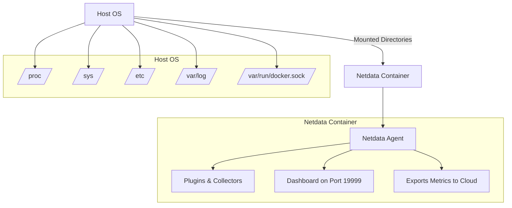

# Install Netdata with Docker

Easily run Netdata in a containerized environment with Docker or Docker Compose.

---

## Before you start 🚨

### Limitations when using Docker

Netdata’s Agent runs well in Docker, but there are a few limitations:

- We don’t officially support using Docker’s `--user` flag or `user:` in Compose.
- On POWER8+ images, the FreeIPMI collector is not available (FreeIPMI limitation).
- Running as root is required for full monitoring, but Netdata internally drops privileges.

---

## Quick Start

Run a Netdata container with:

```bash
docker run -d --name=netdata \
  --cap-add SYS_PTRACE --cap-add SYS_ADMIN \
  --security-opt apparmor=unconfined \
  --network=host --pid=host \
  -v netdataconfig:/etc/netdata \
  -v netdatalib:/var/lib/netdata \
  -v netdatacache:/var/cache/netdata \
  -v /:/host/root:ro,rslave \
  netdata/netdata
```

Then access Netdata at:

```
http://NODE_IP:19999
```

> :bookmark_tabs: Tip  
> Want to connect this node to Netdata Cloud?  
> Go to your Space → Nodes → Add Nodes for an auto-generated command with your claim token.

---

## Required Privileges & Mounts

Here’s what Netdata needs in Docker — and why:

| Required For              | Docker Option Used             | Purpose                                      |
|--------------------------|--------------------------------|----------------------------------------------|
| Full system monitoring   | `--pid=host`                   | Access host processes                       |
| Network monitoring       | `--network=host`               | Access host network interfaces              |
| Hardware monitoring      | Mount `/proc`, `/sys`, `/etc`  | Access host hardware data                  |
| Docker monitoring        | Mount `/var/run/docker.sock`   | Monitor Docker containers                  |

## Netdata Container Architecture (Docker)


---

## Run with Docker Compose

Create a `docker-compose.yml` like:

```yaml
version: '3'
services:
  netdata:
    image: netdata/netdata
    container_name: netdata
    pid: host
    network_mode: host
    restart: unless-stopped
    cap_add:
      - SYS_PTRACE
      - SYS_ADMIN
    security_opt:
      - apparmor:unconfined
    volumes:
      - netdataconfig:/etc/netdata
      - netdatalib:/var/lib/netdata
      - netdatacache:/var/cache/netdata
      - /:/host/root:ro,rslave
      - /var/run/docker.sock:/var/run/docker.sock:ro

volumes:
  netdataconfig:
  netdatalib:
  netdatacache:
```

Then run:

```bash
docker-compose up -d
```

---

## Customize Configuration

To edit Netdata configs inside the container:

```bash
docker exec -it netdata bash
cd /etc/netdata
./edit-config netdata.conf
exit
docker restart netdata
```

> :camera: Suggested Visual:  
> Screenshot of editing config via `docker exec`.

---

## Optional: Host-editable Config

Want to edit Netdata configs from your host?

Create a local directory:

```bash
mkdir ~/netdataconfig
```

Then mount it:

```bash
-v ~/netdataconfig:/etc/netdata
```
---

## Monitoring NVIDIA GPUs

Add:

```bash
--gpus 'all,capabilities=utility'
```

or in Compose:

```yaml
deploy:
  resources:
    reservations:
      devices:
        - driver: nvidia
          count: all
          capabilities: [gpu]
```

---

## Using a Reverse Proxy with SSL

We recommend Caddy for easy automatic SSL.

> See full reverse proxy guide:  
> `/docs/netdata-agent/configuration/running-the-netdata-agent-behind-a-reverse-proxy/`

---

## Security: Docker Socket Proxy (Optional)

To avoid exposing the Docker socket directly:

- Use `tecnativa/docker-socket-proxy` or `cetusguard`.
- Restricts API access to containers info only.

---

## Rootless Docker Support

Netdata supports rootless Docker, but:

- Limited monitoring (no network interfaces, no `apps.plugin`, no disk I/O monitoring).
- For full details see:  
  `/docs/netdata-agent/configuration/limitations-of-running-rootless.md`

---

## Available Docker Tags

| Tag     | Purpose                                        |
|---------|------------------------------------------------|
| stable  | Latest stable version                         |
| edge    | Latest nightly build                          |
| latest  | Latest build (stable or edge)                 |
| vX.Y.Z  | Specific release version (example: v1.42.0)  |

> See full list at: https://hub.docker.com/r/netdata/netdata/tags

---

## Next Steps

- Configure your Agent → `/docs/netdata-agent/configuration/`
- Connect to Netdata Cloud → `/docs/netdata-cloud/claim-a-node/`
- Set up Notifications → `/docs/alerts-and-notifications/`