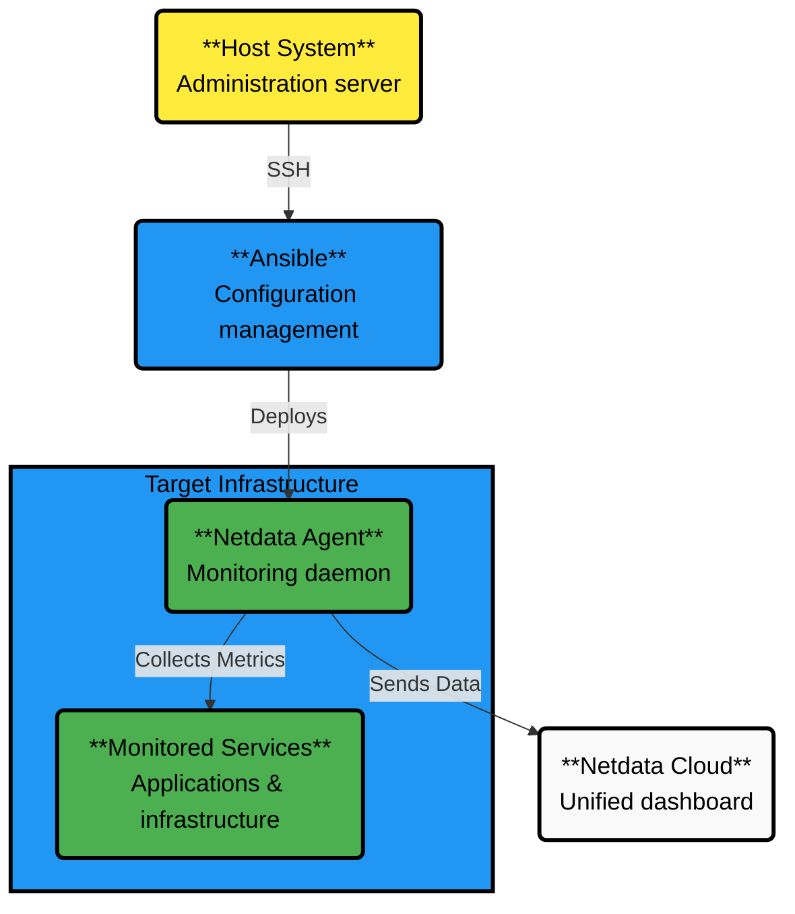

# Deploy Netdata with Ansible

Meet [Ansible](https://ansible.com), a popular tool for provisioning, configuration management, and infrastructure as code (IaC).

This guide walks you through deploying the **Netdata Agent** across multiple nodes using an [Ansible playbook](https://github.com/netdata/community/tree/main/configuration-management/ansible-quickstart/), managing configurations, and connecting to **Netdata Cloud**—all in minutes.

:::note

With Ansible, you can deploy Netdata repeatedly without disrupting your infrastructure—ensuring monitoring as code.

:::

## Prerequisites

- Netdata Cloud account. [Sign in and create one](https://app.netdata.cloud) if you don't have one already.
- An administration system with [Ansible](https://www.ansible.com/) installed.
- One or more nodes that your administration system can access via [SSH public keys](https://git-scm.com/book/en/v2/Git-on-the-Server-Generating-Your-SSH-Public-Key) (preferably password-less).

## Deployment Architecture

Below is a visual representation of the deployment architecture, illustrating the relationship between the host system, Docker, the Netdata container, and key mounts/privileges.



## Download and Configure the Playbook

First, download the [playbook](https://github.com/netdata/community/tree/main/configuration-management/ansible-quickstart/), move it to the current directory, and remove the rest of the cloned repository, as it's not required for using the Ansible playbook.

```bash
git clone https://github.com/netdata/community.git
mv community/configuration-management/ansible-quickstart .
rm -rf community
```

Or if you don't want to clone the entire repository, use the [gitzip browser extension](https://gitzip.org/) to get the `netdata-agent-deployment` directory as a zip file.

Next, navigate into the Ansible directory.

```bash
cd ansible-quickstart
```

### Edit the `hosts` File

The `hosts` file contains a list of IP addresses or hostnames that Ansible will target. Replace the example IP addresses with those of your nodes.

```text
203.0.113.0  hostname=node-01
203.0.113.1  hostname=node-02
```

You can also set the `hostname` variable, which appears both on the local Agent dashboard and Netdata Cloud, or omit the `hostname=` string entirely to use the system's default hostname.

#### Set the Login User (Optional)

If you SSH into your nodes as a user other than `root`, configure `hosts` accordingly using the `ansible_user` variable. For example:

```text
203.0.113.0  hostname=ansible-01  ansible_user=example
```

#### Set Your SSH Key (Optional)

If you use an SSH key other than `~/.ssh/id_rsa` for logging into your nodes, specify it per node in the `hosts` file with the `ansible_ssh_private_key_file` variable. For example:

```text
203.0.113.0  hostname=ansible-01  ansible_ssh_private_key_file=~/.ssh/LightsailDefaultKey-us-west-2.pem
203.0.113.1  hostname=ansible-02  ansible_ssh_private_key_file=~/.ssh/LightsailDefaultKey-us-east-1.pem
```

### Edit the `vars/main.yml` File

To connect your node(s) to your Space in Netdata Cloud and see all their metrics in real-time, set the `claim_token` and `claim_rooms` variables.

To find your `claim_token` and `claim_rooms`, go to Netdata Cloud, click on your Space's name in the top navigation, then click on **Manage your Space**. Click on the **Nodes** tab in the panel that appears, which displays a script with `token` and `room` strings.

Copy those strings into the `claim_token` and `claim_rooms` variables.

```yml
claim_token: YOUR_CLAIM_TOKEN
claim_rooms: YOUR_CLAIM_ROOMS
```

Adjust the `dbengine_multihost_disk_space` variable to change the metrics retention policy by allocating more or less disk space for storing metrics. The default is 2048 MiB (2 GiB).

Since this node connects to Netdata Cloud, we'll view its dashboards there instead of using its IP or hostname. The playbook disables the local dashboard by setting `web_mode` to `none`, adding a small security boost by preventing unwanted access.

You can read more about this decision, or other ways to lock down the local dashboard, in our [node security documentation](https://learn.netdata.cloud/docs/netdata-agent/security/overview).

:::tip

Curious about why Netdata's dashboard is open by default? Read our [blog post](https://www.netdata.cloud/blog/netdata-agent-dashboard/) on that zero-configuration design decision.

:::

## Run the Playbook

Execute the playbook from your administration system:

```bash
ansible-playbook -i hosts tasks/main.yml
```

Ansible connects to your node(s) via SSH, collects [facts](https://docs.ansible.com/ansible/latest/user_guide/playbooks_vars_facts.html#ansible-facts) about the system, and then applies the defined tasks.

The task to install Netdata may take a few minutes per node. Once the playbook reaches the "connect to Cloud" task, your nodes will start appearing in your Space in Netdata Cloud.