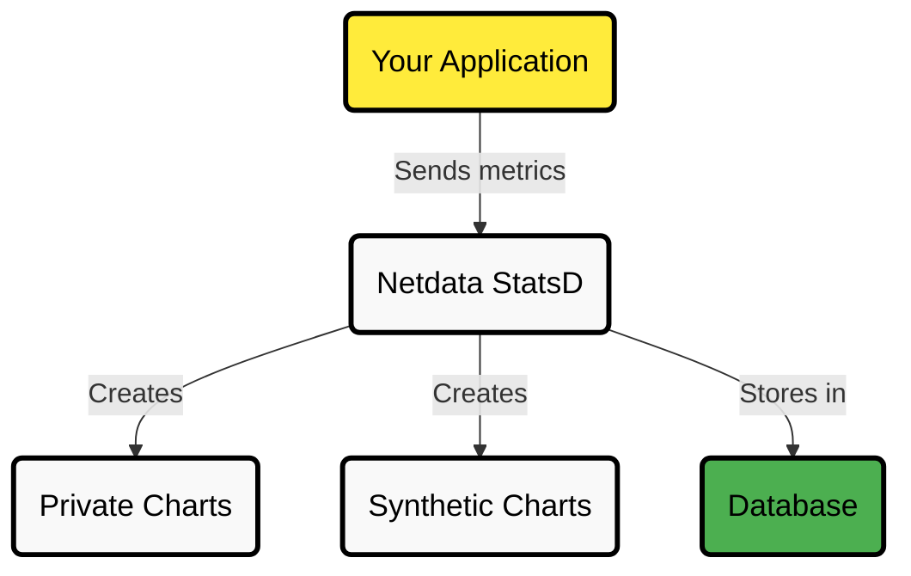
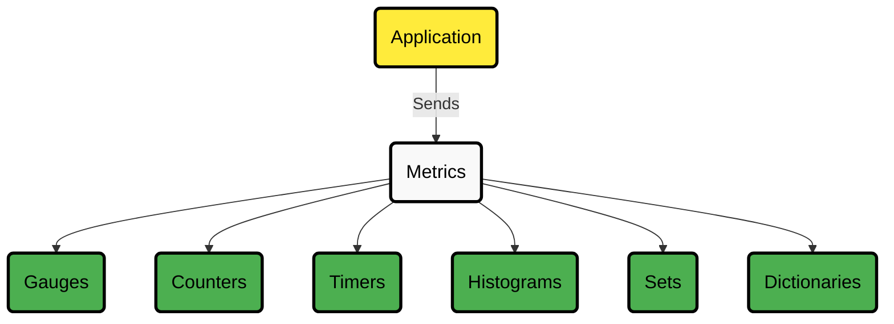
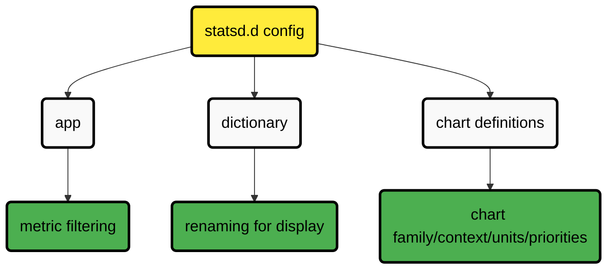
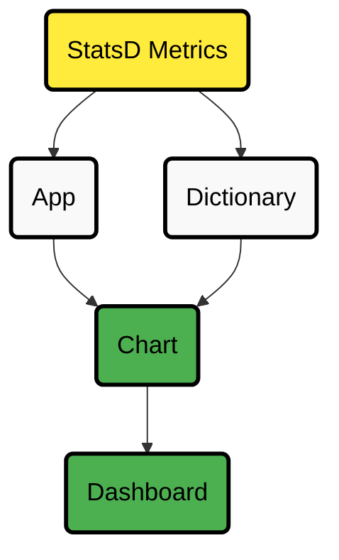

# StatsD Collector

## What is StatsD?

[StatsD](https://github.com/statsd/statsd) is a system for collecting metrics from applications. Your applications send metrics to StatsD, usually via non-blocking UDP communication, and StatsD servers collect these metrics, perform simple calculations, and push them to time-series databases.

Learn more about the [StatsD protocol.](https://blog.netdata.cloud/introduction-to-statsd/)

## Overview

| Feature                    | Description                                                                |
|----------------------------|----------------------------------------------------------------------------|
| **Metric Collection**      | Collect real-time metrics from any application supporting StatsD protocol  |
| **Visualization**          | View metrics as private charts (one per metric) or custom synthetic charts |
| **Supported Metric Types** | Gauges, Counters, Meters, Timers, Histograms, Sets, Dictionaries           |
| **Transport**              | Both UDP (low-overhead) and TCP (reliable, higher volume) supported        |
| **Performance**            | Can collect millions of metrics per second using just 1 CPU core           |
| **Integration**            | Built directly into Netdata - no extra installation needed                 |
| **Language Support**       | Use with Python, Node.js, Java, Go, Ruby, Shell scripts, and more          |

:::tip

Want a hands-on example? [Jump to the K6 StatsD Walkthrough](#step-by-step-guide-monitoring-k6-with-statsd)

:::

## Supported Metric Types Summary

| Metric Type  | Purpose                                       | Format              | LLM Summary                                                                                     |
|--------------|-----------------------------------------------|---------------------|-------------------------------------------------------------------------------------------------|
| Gauges       | Report current values                         | `name:value\|g`     | Report latest value; can increment/decrement; supports sampling & tags.                         |
| Counters     | Count events                                  | `name:value\|c/C/m` | Report rate & event count; `:value` optional (default 1); supports sampling & tags.             |
| Meters       | Count events (rate-focused)                   | `name:value\|m`     | Report rate & event count; `:value` optional (default 1); supports sampling & tags.             |
| Timers       | Statistical analysis of values (duration)     | `name:value\|ms`    | Report min, max, avg, percentiles, median, stddev, count; supports sampling & tags.             |
| Histograms   | Statistical analysis of values (distribution) | `name:value\|h`     | Report min, max, avg, percentiles, median, stddev, count; supports sampling & tags.             |
| Sets         | Count unique occurrences                      | `name:value\|s`     | Report unique count & event count; sampling NOT supported; values as text; supports tags.       |
| Dictionaries | Count occurrences of distinct values          | `name:value\|d`     | Report counts per value & total updates; sampling NOT supported; values as text; supports tags. |

### How StatsD Works with Netdata



## Netdata as a StatsD Server

Netdata comes with a **fully-featured StatsD server built in**. You can:

- Collect StatsD-formatted metrics
- Visualize them on the Netdata dashboard
- Store them in Netdata's database for long-term retention

Since StatsD is embedded in Netdata, **you effectively have a StatsD server on every system where Netdata is installed.**

:::note

**Netdata's StatsD implementation is incredibly fast.** It can collect **several million metrics per second** on modern hardware using just one CPU core. The implementation uses two threads: one collects metrics, and the other updates the charts.

:::

## Pre-configured StatsD Applications

Netdata includes **synthetic chart definitions** to automatically present application metrics consistently. These are defined in configuration files that you can use as-is or customize.

For synthetic charts, you can set up alerts just like with any other metric or chart.

Currently available applications:

- [K6 load testing tool](https://k6.io)
    - **Description:** k6 is a developer-centric, free, and open-source load testing tool for performance testing
    - [Documentation](https://github.com/netdata/netdata/blob/master/src/collectors/statsd.plugin/k6.md)
    - [Configuration](https://github.com/netdata/netdata/blob/master/src/collectors/statsd.plugin/k6.conf)
- [Asterisk](https://www.asterisk.org/)
    - **Description:** Asterisk is an Open Source PBX and telephony toolkit
    - [Documentation](https://github.com/netdata/netdata/blob/master/src/collectors/statsd.plugin/asterisk.md)
    - [Configuration](https://github.com/netdata/netdata/blob/master/src/collectors/statsd.plugin/asterisk.conf)

## Supported Metric Types

Netdata fully supports the StatsD protocol and extends it for more advanced use cases. All StatsD client libraries are compatible with Netdata.



<details>
<summary><strong>Gauges</strong></summary>
<br/> 

<strong>Purpose:</strong> Report current values (e.g., cache memory used by an application server)

**Format:** `name:value|g`

- `value` can be any decimal/fractional number
- StatsD reports the latest value and the number of updates (events)
- You can increment/decrement previous values by prefixing with `+` or `-`
- Sampling rate is supported
- Tags can change chart units, family, and [dimension](https://learn.netdata.cloud/docs/developer-and-contributor-corner/glossary#d) name
- When not collected, the last value will be shown if "show gaps" is disabled (default)

</details>

<details>
<summary><strong>Counters and Meters</strong></summary>
<br/> 

<strong>Purpose:</strong> Count events (e.g., number of file downloads)

**Format:** `name:value|c`, `name:value|C`, or `name:value|m`

- `value` must be an integer (positive or negative)
- StatsD reports the rate and update count (events)
- `:value` can be omitted (defaults to 1)
- `|c`, `|C` and `|m` can be omitted (defaults to `|m`)
- Counters use `|c` (etsy/StatsD compatible) or `|C` (brubeck compatible)
- Meters use `|m`
- Sampling rate is supported
- Tags can change chart units, family, and dimension name
- When not collected, StatsD shows zero until a new value arrives

</details>

<details>
<summary><strong>Timers and Histograms</strong></summary>
<br/> 

<strong>Purpose:</strong> Statistical analysis of values (e.g., request duration, file sizes)

**Format:** `name:value|ms` or `name:value|h`

- `value` can be any decimal/fractional number
- StatsD reports min, max, average, 95th percentile, median, standard deviation, and update count
- Timers use `|ms` and report in milliseconds
- Histograms use `|h`
- Sampling rate is supported
- Tags can change chart units and family
- When not collected, StatsD shows zero until a new value arrives

</details>

<details>
<summary><strong>Sets</strong></summary>
<br/> 

<strong>Purpose:</strong> Count unique occurrences (e.g., unique users, unique filenames)

**Format:** `name:value|s`

- `value` can be any string or number (leading/trailing spaces are removed)
- StatsD reports the count of unique values and update count
- Sampling rate is NOT supported
- Values are always treated as text (so `01` and `1` are different)
- Tags can change chart units and family
- When not collected, StatsD shows zero until a new value arrives

</details>

<details>
<summary><strong>Dictionaries</strong></summary>
<br/> 

<strong>Purpose:</strong> Count occurrences of distinct values

**Format:** `name:value|d`

- `value` can be any string or number (leading/trailing spaces are removed)
- StatsD reports the count of events for each `value` and total updates
- Sampling rate is NOT supported
- Values are always treated as text (so `01` and `1` are different)
- Tags can change chart units and family
- When not collected, StatsD shows zero until a new value arrives

</details>

## Advanced Features

<details>
<summary><strong>Sampling Rates</strong></summary>
<br/> 

You can append `|@sampling_rate` to metrics, where `sampling_rate` is between 0.0 and 1.0. This tells StatsD to extrapolate the value for the entire period.

Example: If your application reports data for only 1/10th of events, append `|@0.1` to have StatsD calculate the total.
</details>

<details>
<summary><strong>Tags</strong></summary>
<br/> 

You can append `|#tag1:value1,tag2:value2,tag3:value3` to metrics. Netdata currently uses these tags:

- `units=string` - Sets the units of the automatically generated chart
- `family=string` - Sets the family (dashboard submenu) of the chart
- `name=string` - Sets the [dimension](https://learn.netdata.cloud/docs/developer-and-contributor-corner/glossary#d) name (for counters, meters, gauges only)

:::tip

For consistency, either send tags with every event or use the special `zinit` value to initialize charts. For example, send `my.metric:zinit|c|#units=bytes,name=size` at the beginning, then just `my.metric:VALUE|c` afterward.

:::

</details>

<details>
<summary><strong>Sending Multiple Metrics</strong></summary>
<br/> 

You can send multiple metrics in a single packet by separating them with newlines (`\n`).

#### TCP Packets

Netdata listens for both TCP and UDP packets. With TCP, always append `\n` to each metric so Netdata can detect metrics split across multiple TCP packets.

#### UDP Packets

When sending multiple metrics in a UDP message, keep the total size under the network MTU (usually 1500 bytes).

:::important

Netdata will accept UDP packets up to 9000 bytes, but your network equipment may fragment any packets exceeding the MTU.

:::

</details>

## Configuration

You can find the StatsD configuration in `/etc/netdata/netdata.conf`:

```
[statsd]
	# enabled = yes
	# decimal detail = 1000
	# update every (flushInterval) = 1s
	# udp messages to process at once = 10
	# create private charts for metrics matching = *
	# max private charts hard limit = 1000
	# cleanup obsolete charts after = 0
	# private charts memory mode = save
	# private charts history = 3996
	# histograms and timers percentile (percentThreshold) = 95.00000
	# add dimension for number of events received = no
	# gaps on gauges (deleteGauges) = no
	# gaps on counters (deleteCounters) = no
	# gaps on meters (deleteMeters) = no
	# gaps on sets (deleteSets) = no
	# gaps on histograms (deleteHistograms) = no
	# gaps on timers (deleteTimers) = no
	# listen backlog = 4096
	# default port = 8125
	# bind to = udp:localhost:8125 tcp:localhost:8125
```

## Configuration Architecture

### How the StatsD Configuration Works

Netdata's StatsD chart system uses three key sections in its configuration:



The diagram shows how the configuration flows:

1. The central `statsd.d config` connects to **three main components**:
    - The **application** configuration
    - The **dictionary** system
    - **Chart definitions**

2. Each of these components serves a specific purpose:
    - The **app** component handles **metric filtering**
    - The **dictionary** manages **renaming metrics** for display
    - **Chart definitions determine properties** like family, context, units, and priorities

This structure allows for flexible and powerful metric configuration within Netdata's StatsD implementation.

### Key Configuration Options

- **`enabled = yes|no`** - Controls whether StatsD is enabled
- **`default port = 8125`** - The default port if not specified in binding
- **`bind to = udp:localhost tcp:localhost`** - Space-separated list of IPs and ports to listen on
- **`update every (flushInterval) = 1s`** - How often StatsD updates Netdata charts
- **`decimal detail = 1000`** - Controls decimal precision in gauges and histograms

## StatsD Charts

Netdata can visualize StatsD collected metrics in two ways:

1. **Private charts** - Each metric gets its own chart (default, no configuration needed)
2. **Synthetic charts** - Combine multiple metrics into custom charts (requires configuration)

### Private Metric Charts

Private charts are controlled with `create private charts for metrics matching = *`. This setting accepts a space-separated list of [simple patterns](https://github.com/netdata/netdata/blob/master/src/libnetdata/simple_pattern/README.md). By default, Netdata creates private charts for all metrics.

Example: To create charts for all `myapp.*` metrics except `myapp.*.badmetric`:

```
create private charts for metrics matching = !myapp.*.badmetric myapp.*
```

You can configure a different memory mode specifically for StatsD charts:

- `private charts memory mode`
- `private charts history`

<details>
<summary><strong>Private Chart Examples</strong></summary>
<br/> 

Example of a gauge metric chart:


Example of a histogram metric chart:


Histogram chart with "sum" unselected:


Example of a counter metric chart:


Example of a meter metric chart:


Example of a set metric chart:


Example of a timer metric chart:


</details>

#### Storage Optimization

For performance reasons, Netdata limits private charts. The `max private charts hard limit` (default: 1000) controls this. Metrics above this limit can still be used in synthetic charts.

For ephemeral metrics, use `set charts as obsolete after` and `cleanup obsolete charts after` to automatically clean up charts that haven't received data recently.

### Synthetic StatsD Charts

Use synthetic charts to create dedicated sections on the dashboard to render your StatsD charts.



Synthetic charts are organized in:

- **Application** - Section in Netdata Dashboard
- **Charts for each application** - Family/submenu in the Dashboard
- **StatsD metrics for each chart** - Charts and context in the Dashboard

#### Basic Configuration Structure

For example, to monitor the application `myapp` using StatsD and Netdata, create the file `/etc/netdata/statsd.d/myapp.conf`:

```
[app]
	name = myapp
	metrics = myapp.*
	private charts = no
	gaps when not collected = no
	history = 60

[dictionary]
    m1 = metric1
    m2 = metric2

# Chart definition with ID 'mychart'
# The chart will be named: myapp.mychart
[mychart]
	name = mychart
	title = my chart title
	family = my family
	context = chart.context
	units = tests/s
	priority = 91000
	type = area
	dimension = myapp.metric1 m1
	dimension = myapp.metric2 m2
```

Using this configuration, `myapp` gets its own dashboard section with one chart containing two [dimensions](https://learn.netdata.cloud/docs/developer-and-contributor-corner/glossary#d).

When you send metrics like `foo:10|g` and `bar:20|g`, you'll see both private charts and your synthetic chart.

<details>
<summary><strong>Synthetic Chart Example</strong></summary>
<br/> 

Example of a synthetic chart combining multiple metrics:


</details>

#### Application Section Options

The `[app]` section defines the application and has these options:

:::note

- **name** - Defines the application name
- **metrics** - [Simple pattern](https://github.com/netdata/netdata/blob/master/src/libnetdata/simple_pattern/README.md) matching all metrics for this app
- **private charts** - Enable/disable private charts for matched metrics (yes|no)
- **gaps when not collected** - Show gaps when no metrics are collected (yes|no)
- **memory mode** - Sets memory mode for application charts (optional, default is global Netdata setting)
- **history** - Size of round-robin database (optional, only relevant with `memory mode = save`)

:::

#### Dictionary Section

`[dictionary]` defines name-value pairs for renaming metrics in synthetic charts. This allows you to:

- Define dimension names globally for the whole app
- Rename dimensions when using patterns
- Create more human-readable names for technical metrics

The dictionary can be empty or omitted if not needed.

#### Chart Definitions

Each chart starts with `[id]` and will be named `app_name.id`. Key settings for charts:

:::note

- **family** - Controls dashboard submenu placement
- **context** - Controls alert templates
- **priority** - Controls chart ordering
- **type** - Chart visualization type (line, area, stacked)
- **units** - Chart measurement units

:::

#### [Dimension](https://learn.netdata.cloud/docs/developer-and-contributor-corner/glossary#d) Format

Add metrics to charts using `dimension` lines with this format:

```
dimension = [pattern] METRIC NAME TYPE MULTIPLIER DIVIDER OPTIONS
```

Where:

1. **METRIC** - The metric name as collected (must match the `metrics` pattern)
2. **NAME** - The dimension name to display (can use dictionary for renaming)
3. **TYPE** - (Optional) Value selector like `events`, `last`, `min`, `max`, etc.
4. **MULTIPLIER** - (Optional) Value to multiply the metric by
5. **DIVIDER** - (Optional) Value to divide the metric by
6. **OPTIONS** - (Optional) Flags like `hidden` to include but not display a dimension

<details>
<summary><strong>Renaming StatsD Synthetic Charts' Metrics</strong></summary>
<br/> 

You can define a dictionary to rename metrics sent by StatsD clients. This allows you to transmit the response code `200` while Netdata displays it as `successful connection`.

The `[dictionary]` section accepts any number of `name = value` pairs.

Netdata uses this dictionary as follows:

1. When a `dimension` has a non-empty `NAME`, that name is looked up in the dictionary
2. If the above lookup finds nothing, the original StatsD metric name is looked up
3. If any lookup succeeds, Netdata uses the dictionary's `value` for the dimension name

The dimensions will have the original StatsD metric name as ID and the dictionary value as name.

You can use the dictionary in two ways:

1. Set `dimension = myapp.metric1 ''` and have in the dictionary `myapp.metric1 = metric1 name`
2. Set `dimension = myapp.metric1 'm1'` and have in the dictionary `m1 = metric1 name`

In both cases, the dimension will be added with ID `myapp.metric1` and named `metric1 name`. In alerts, you can reference it as either `${myapp.metric1}` or `${metric1 name}`.

:::note

If you add the same StatsD metric multiple times to a chart, Netdata will append `TYPE` to the dimension ID, so `myapp.metric1` will become `myapp.metric1_last` or `myapp.metric1_events`. If you add the same metric with the same `TYPE` multiple times, Netdata will also append an incremental counter, e.g., `myapp.metric1_last1`, `myapp.metric1_last2`, etc.

:::

</details>

<details>
<summary><strong>Dimension Patterns</strong></summary>
<br/> 

Netdata allows adding multiple dimensions to a chart by matching StatsD metrics with a **pattern**.

For example, if you have an API that provides StatsD metrics for each response code per method:

```
myapp.api.get.200
myapp.api.get.400
myapp.api.get.500
myapp.api.del.200
myapp.api.del.400
myapp.api.del.500
myapp.api.post.200
myapp.api.post.400
myapp.api.post.500
myapp.api.all.200
myapp.api.all.400
myapp.api.all.500
```

To add all response codes of `myapp.api.get` to a chart:

```
[api_get_responses]
   ...
   dimension = pattern 'myapp.api.get.* '' last 1 1
```

This adds dimensions named `200`, `400`, and `500`. Netdata extracts the wildcard part of the metric name.

You can rename these dimensions with the dictionary:

```
[dictionary]
    get.200 = 200 ok
    get.400 = 400 bad request
    get.500 = 500 cannot connect to db
    
[api_get_responses]
   ...
   dimension = pattern 'myapp.api.get.* 'get.' last 1 1
```

The `NAME` prefix `get.` is combined with the wildcarded part to look up in the dictionary. So `500` becomes `get.500`, which is looked up to find `500 cannot connect to db`.

### More Pattern Examples

To add all 200s across all API methods to a chart:

```
[ok_by_method]
   ...
   dimension = pattern 'myapp.api.*.200 '' last 1 1
```

This adds `get`, `post`, `del`, and `all` to the chart.

To exclude the `all` method:

```
[ok_by_method]
   ...
   dimension = pattern '!myapp.api.all.* myapp.api.*.200 '' last 1 1
```

To rename methods automatically:

```
[dictionary]
    method.get = GET
    method.post = ADD
    method.del = DELETE
    
[ok_by_method]
   ...
   dimension = pattern '!myapp.api.all.* myapp.api.*.200 'method.' last 1 1
```

This adds dimensions named `GET`, `ADD`, and `DELETE`.
</details>

## Using StatsD with Different Languages

<details>
<summary><strong>Python</strong></summary>
<br/> 

Using [jsocol/pystatsd](https://github.com/jsocol/pystatsd):

```python
import statsd

c = statsd.StatsClient('localhost', 8125)
c.incr('foo')  # Increment the 'foo' counter.
for i in range(100000000):
    c.incr('bar')
    c.incr('foo')
    if i % 3:
        c.decr('bar')
        c.timing('stats.timed', 320)  # Record a 320ms 'stats.timed'.
```

See the [full documentation](https://statsd.readthedocs.io/en/v3.3/) for more details.
</details>

<details>
<summary><strong>JavaScript and Node.js</strong></summary>
<br/> 

Using [sivy/node-statsd](https://github.com/sivy/node-statsd):

```javascript
  var StatsD = require('node-statsd'),
    client = new StatsD();

// Timing: sends a timing command with the specified milliseconds
client.timing('response_time', 42);

// Increment: Increments a stat by a value (default is 1)
client.increment('my_counter');

// Decrement: Decrements a stat by a value (default is -1)
client.decrement('my_counter');

// Using the callback
client.set(['foo', 'bar'], 42, function (error, bytes) {
    //this only gets called once after all messages have been sent
    if (error) {
        console.error('Oh noes! There was an error:', error);
    } else {
        console.log('Successfully sent', bytes, 'bytes');
    }
});

// Sampling, tags and callback are optional and could be used in any combination
client.histogram('my_histogram', 42, 0.25); // 25% Sample Rate
client.histogram('my_histogram', 42, ['tag']); // User-defined tag
client.histogram('my_histogram', 42, next); // Callback
client.histogram('my_histogram', 42, 0.25, ['tag']);
client.histogram('my_histogram', 42, 0.25, next);
client.histogram('my_histogram', 42, ['tag'], next);
client.histogram('my_histogram', 42, 0.25, ['tag'], next);
```

</details>

<details>
<summary><strong>Other Languages</strong></summary>
<br/> 

StatsD clients are available for many languages:

- Golang: [alexcesaro/statsd](https://github.com/alexcesaro/statsd)
- Ruby: [reinh/statsd](https://github.com/reinh/statsd)
- Java: [DataDog/java-dogstatsd-client](https://github.com/DataDog/java-dogstatsd-client)

</details>

<details>
<summary><strong>Shell Script</strong></summary>
<br/> 

You can use the Unix shell with `nc` to send StatsD metrics from any script.

:::important

You'll need the `netcat` package with the `nc` command. Different versions have different parameters, so experiment to find what works on your system. The examples below assume `openbsd-netcat` is installed.

:::

#### Using UDP (for sporadic events)

```sh
echo "APPLICATION.METRIC:VALUE|TYPE" | nc -u -w 0 localhost 8125
```

- `-u` enables UDP
- `-w 0` tells `nc` not to wait for a response

Examples:

```sh
# Set a gauge value
echo "myapp.used_memory:123456|g|#units:bytes" | nc -u -w 0 localhost 8125

# Increment a counter
echo "myapp.files_sent:10|c|#units:files" | nc -u -w 0 localhost 8125

# Send multiple metrics
printf "myapp.used_memory:123456|g|#units:bytes\nmyapp.files_sent:10|c|#units:files\n" | nc -u -w 0 localhost 8125
```

#### Using TCP (for many metrics at once)

```sh
# send multiple metrics via TCP
cat /tmp/statsd.metrics.txt | nc -N -w 120 localhost 8125
```

#### Helper Function for Shell Scripts

This function handles both UDP and TCP automatically:

```sh
#!/usr/bin/env bash

# we assume nc is from the openbsd-netcat package

STATSD_HOST="localhost"
STATSD_PORT="8125"
statsd() {
        local options="-u -w 0" all="${*}"
        
        # replace all spaces with newlines
        all="${all// /\\n}"

        # if the string length of all parameters given is above 1000, use TCP
        [ "${#all}" -gt 1000 ] && options="-N -w 0"

        # send the metrics to statsd
        printf "${all}\n" | nc ${options} ${STATSD_HOST} ${STATSD_PORT} || return 1

        return 0
}

if [ ! -z "${*}" ]
then
  statsd "${@}"
fi
```

Usage:

```sh
# source it in your script
source statsd.sh

# then use it anywhere
statsd "myapp.used_memory:123456|g|#units:bytes" "myapp.files_sent:10|c|#units:files" ...

# or at command line
./statsd.sh "myapp.used_memory:123456|g|#units:bytes" "myapp.files_sent:10|c|#units:files" ...
```

The function automatically switches to TCP if the metrics exceed 1000 bytes.
</details>

## Step-by-Step Guide: Monitoring K6 with StatsD

This guide demonstrates how to use Netdata's StatsD to visualize metrics from [k6](https://k6.io), an open-source load testing tool.

<details>
<summary><strong>Prerequisites</strong></summary>
<br/> 

- A node with [Netdata](https://github.com/netdata/netdata/blob/master/packaging/installer/README.md) installed
- [k6](https://k6.io/docs/getting-started/installation) installed

</details>

<details>
<summary><strong>The Process in Brief</strong></summary>
<br/> 

1. **Run an experiment** sending StatsD metrics to Netdata without configuration
    - This creates a private chart per metric
    - Reload the dashboard after starting to send data

2. **Create a configuration file** for your app:
   ```
   sudo ./edit-config statsd.d/myapp.conf
   ```
    - This organizes metrics into meaningful sections

</details>

<details>
<summary><strong>Understanding Your Metrics</strong></summary>
<br/> 

First, understand what metrics your application provides. For k6, check their [metrics documentation](https://k6.io/docs/using-k6/metrics/).

When instrumenting your own code, you'll need to decide:

- What to measure
- Which StatsD metric type is appropriate for each measurement

</details>

<details>
<summary><strong>Exploring Available Metrics with Private Charts</strong></summary>
<br/> 

Every StatsD metric initially gets its own "private chart." While you'll likely disable this in production, it's helpful during setup to see all available metrics.

Private charts clearly show the metric type (gauge, timer, etc.) and available operations for complex types like histograms.
</details>

<details>
<summary><strong>Creating a StatsD Configuration File</strong></summary>
<br/> 

Use Netdata's [`edit-config`](https://github.com/netdata/netdata/blob/master/docs/netdata-agent/configuration/README.md#edit-a-configuration-file-using-edit-config) to create a new file:

```bash
sudo ./edit-config statsd.d/k6.conf
```

Start with this basic configuration:

```
[app]
    name = k6
    metrics = k6*
    private charts = yes
    gaps when not collected = no
    memory mode = dbengine
```

</details>

<details>
<summary><strong>Organizing Metrics</strong></summary>
<br/> 

Next, decide how to organize metrics in the Netdata dashboard:

1. **Dictionary** - Create human-readable names for technical metrics
   ```
   [dictionary]
       http_req_blocked = Blocked HTTP Requests 
       http_req_connecting = Connecting HTTP Requests
       http_req_receiving = Receiving HTTP Requests
       http_reqs = Total HTTP requests
   ```

2. **Families** - Group charts into dashboard submenus. For k6, we'll use `k6 native metrics` and `http metrics` families.

3. **[Dimensions](https://learn.netdata.cloud/docs/developer-and-contributor-corner/glossary#d)** - Choose which metrics to show and how to group them in charts

</details>

<details>
<summary><strong>Complete Configuration Example</strong></summary>
<br/> 

Here's a complete configuration for k6:

```
[app]
    name = k6
    metrics = k6*
    private charts = yes
    gaps when not collected = no
    memory mode = dbengine

[dictionary]
    http_req_blocked = Blocked HTTP Requests 
    http_req_connecting = Connecting HTTP Requests
    http_req_receiving = Receiving HTTP Requests
    http_reqs = Total HTTP requests

[http_req_total]
    name = http_req_total
    title = Total HTTP Requests
    family = http requests
    context = k6.http_requests
    dimension = k6.http_reqs http_reqs last 1 1 sum
    type = line
    units = requests/s
	
[vus]
    name = vus
    title = Virtual Active Users
    family = k6_metrics
    dimension = k6.vus vus last 1 1 
    dimension = k6.vus_max vus_max last 1 1 
    type = line
    unit = vus
	
[iteration_duration]
    name = iteration_duration_2
    title = Iteration duration
    family = k6_metrics
    dimension = k6.iteration_duration iteration_duration last 1 1 
    dimension = k6.iteration_duration iteration_duration_max max 1 1 
    dimension = k6.iteration_duration iteration_duration_min min 1 1 
    dimension = k6.iteration_duration iteration_duration_avg avg 1 1 
    type = line
    unit = s

[dropped_iterations]
    name = dropped_iterations
    title = Dropped Iterations
    family = k6_metrics
    dimension = k6.dropped_iterations dropped_iterations last 1 1 
    units = iterations
    type = line

[data]
    name = data
    title = K6 Data
    family = k6_metrics
    dimension = k6.data_received data_received last 1 1
    dimension = k6.data_sent data_sent last -1 1
    units = kb/s
    type = area 

[http_req_status]
    name = http_req_status
    title = HTTP Requests Status
    family = http requests
    dimension = k6.http_req_blocked http_req_blocked last 1 1 
    dimension = k6.http_req_connecting http_req_connecting last 1 1
    units = ms
    type = line
    
[http_req_duration]
    name = http_req_duration
    title = HTTP requests duration
    family = http requests
    dimension = k6.http_req_sending http_req_sending last 1 1
    dimension = k6.http_req_waiting http_req_waiting last 1 1
    dimension = k6.http_req_receiving http_req_receiving last 1 1
    units = ms
    type = stacked
```

:::note

Netdata will report the rate for metrics and counters even if your application sends absolute numbers. For example, k6 sends absolute HTTP requests with `http_reqs`, but Netdata visualizes that as `requests/second`.

:::

Restart Netdata to enable this configuration.
</details>

<details>
<summary><strong>Adding Custom Icons and Descriptions</strong></summary>
<br/> 

You can customize the section icon and add helpful chart descriptions.

Create a custom dashboard info file:

```javascript
netdataDashboard.menu = {
    'k6': {
        title: 'K6 Load Testing',
        icon: '<i class="fas fa-cogs"></i>',
        info: 'k6 is an open-source load testing tool and cloud service providing the best developer experience for API performance testing.'
    },
};

netdataDashboard.context = {
    'k6.http_req_duration': {
        info: "Total time for the request. It's equal to http_req_sending + http_req_waiting + http_req_receiving (i.e. how long did the remote server take to process the request and respond, without the initial DNS lookup/connection times)"
    },
};
```

These descriptions help users monitor your application, especially during incidents. The `info` field supports HTML, allowing you to embed links and instructions.
</details>

<details>
<summary><strong>Contributing Your Collector</strong></summary>
<br/> 

Once you've created a working configuration, consider sharing it with the Netdata community:

1. Follow the [contributing guide](https://github.com/netdata/.github/blob/main/CONTRIBUTING.md)
2. Fork the netdata/netdata repository
3. Place your configuration file in `netdata/collectors/statsd.plugin`
4. Add a reference in `netdata/collectors/statsd.plugin/Makefile.am`

</details>
