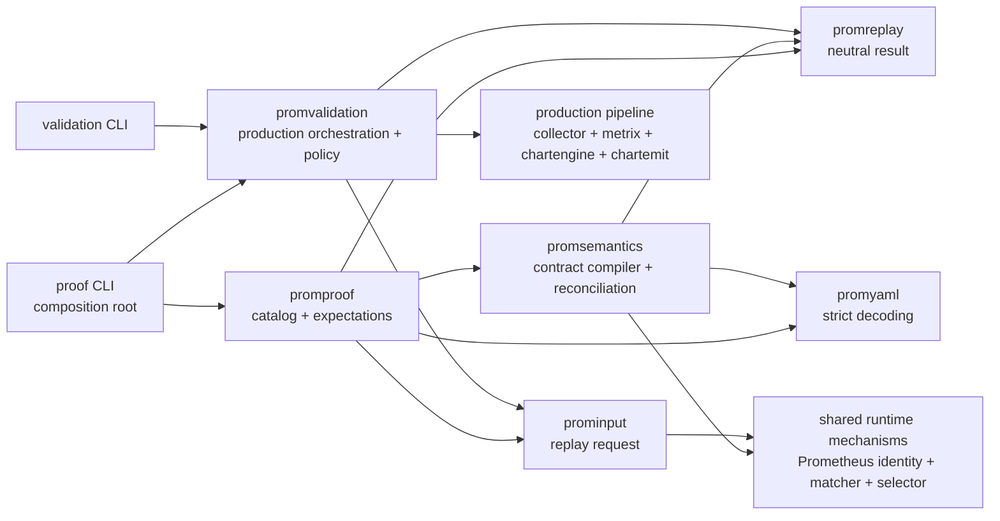

<!-- markdownlint-disable MD013 -->

# Prometheus profile validation and semantic proofs

This document is the canonical architecture for the developer framework that validates and proves Netdata Prometheus
profiles. The framework is intentionally split between the
[`netdata/netdata`](https://github.com/netdata/netdata) and
[`netdata/testdata`](https://github.com/netdata/testdata) repositories.

Field-level schemas, production behavior, and command syntax remain with their executable owners. This document owns the
system boundary, authority model, dependency direction, and extension rules that connect those owners.

## Contents

- [Purpose and non-goals](#purpose-and-non-goals)
- [System boundary](#system-boundary)
- [Authority model](#authority-model)
- [Package architecture](#package-architecture)
- [Compile and replay flow](#compile-and-replay-flow)
- [Production diagnostics boundary](#production-diagnostics-boundary)
- [Support composition](#support-composition)
- [Schema and repository compatibility](#schema-and-repository-compatibility)
- [Verification ownership](#verification-ownership)
- [Extension rules](#extension-rules)
- [Scoped documentation](#scoped-documentation)

## Purpose and non-goals

The framework has two related entry points:

- **Standalone validation** runs one candidate, any explicitly supplied supporting profiles, and one exposition dump through
  the production collector, writer, chart planner, and emitter. It detects objective runtime failures and reports bounded
  contributor-policy advisories for the composed profile set.
- **Stock semantic proof** joins independently authored source semantics, operator design, replay cases, and production
  output. It proves that a stock profile implements its declared source and dashboard contract across the declared
  environments.

The framework is pre-merge developer tooling. Production collection does not load proof descriptors, source contracts,
fixtures, or the testdata repository.

The framework does not:

- treat one observed scrape as a complete exporter contract;
- derive source semantics or expected chart identities from the candidate profile;
- duplicate collector, relabeling, chartengine, or wire-normalization behavior in validator policy;
- pin a `netdata/testdata` revision inside Netdata;
- make generated registry groups into semantic dashboard groups; or
- turn human operator rationale into a second machine-readable schema.

## System boundary

### Repository ownership

| Repository | Owns | Does not own |
|---|---|---|
| `netdata/netdata` | Production runtime behavior; stock profiles; operator rationale; profile design; replay descriptors; strict schema loaders, compilers, reconciliation, and coverage; standalone validator policy; developer CLIs; cross-repository consumer verification | Bulky fixture corpora; generated exporter registration ledgers; source-registry generator runtimes |
| `netdata/testdata` | Sanitized source-derived fixtures; source-semantic contracts; optional generated source registries and their manifests/generators; registry reproduction workflow | Netdata profile design; expected Netdata output; collector policy; chart routing; proof reconciliation |

The split keeps reviewable intent beside the stock profile while avoiding large source-complete fixture and registration
corpora in the main repository.

### Artifact layout

Compact Netdata-side artifacts live under
`src/go/plugin/go.d/collector/prometheus/profile-proofs/<profile>/`:

```text
OPERATOR-MODEL.md
PROFILE-DESIGN.yaml
proof.yaml
```

Source-side artifacts live under `prometheus/profiles/<profile>/` in `netdata/testdata`:

```text
SOURCE-SEMANTICS.yaml
fixtures/*.prom
SOURCE-REGISTRY.yaml                 # optional
SOURCE-REGISTRY.generator.yaml       # required with SOURCE-REGISTRY.yaml
generator/*.py                       # required with the registry pair
```

The proof compiler enforces exact directory layouts. Unexpected, unreferenced, or half-present registry artifacts fail
verification instead of being ignored.

## Authority model

No single YAML file is a complete proof. The framework obtains independence by assigning each kind of claim to one owner
and compiling disagreements into failures.

| Claim | Authority | Enforcement |
|---|---|---|
| Exporter registrations, types, components, label domains, lifecycle, availability, units, and source relationships | `SOURCE-SEMANTICS.yaml`, plus the optional mechanical source registry and its pinned public upstream evidence | Strict semantic load and static compilation |
| Profile documentation, internal operator questions, entity grain, identity, label treatment, reductions, exclusions, units, and presentation intent | `PROFILE-DESIGN.yaml` | Strict semantic load, static compilation, production reconciliation, and integration-documentation projection of the public subset |
| Human rationale for the design | `OPERATOR-MODEL.md` | Human review; exact machine claims belong in the YAML contracts |
| Realizable input environments, fixtures, lifecycle sequences, expected verdicts/findings, and coverage participation | `proof.yaml` | Strict proof descriptor load and replay verification |
| Profile parsing, selection, relabeling, assembly, writer behavior, chart routing, and public wire identities | Production Prometheus, metrix, chartengine, and chartemit packages | Real production execution with opt-in structured facts |
| Contributor validation policy, evidence obligations, severities, and report wording | `internal/promprofile/validation` | Standalone validation report |
| Cross-artifact consistency, semantic output reconciliation, observations, and declaration-bounded coverage | `internal/promprofile/semantics` and `internal/promprofile/proof` | Catalog compilation and proof verification |

Important boundaries:

- A fixture proves that a declared producer state is realizable; it does not define universal source semantics by itself.
- A source registry is mechanical registration truth. Its generator groupings are extraction conveniences, not semantic
  signal or chart ownership.
- `PROFILE-DESIGN.yaml` is research-backed design input, not a serialization of the resulting profile. Its `documentation`
  block owns the operator-facing profile title and summary used by generated integration documentation.
- A view's `question` is internal authoring rationale. Generated integration documentation MUST NOT publish it. Public
  coverage is rendered as ordinary tables grouped by each profile's top-level family. Every metric-to-chart row contains
  the Prometheus metric, full Netdata family and chart title, dimension, unit, and entity scope.
- `proof.yaml` contains independent expectations, not generated snapshots, counts, or content digests.
- Production code is authoritative for behavior. Semantic contracts state what that behavior must mean for the profile.

## Package architecture

`src/go/internal/promprofile/` is a namespace of focused packages, not an umbrella Go package:

| Package | Responsibility |
|---|---|
| `input` (`prominput`) | Typed execution inputs shared by proof compilation and validation replay, including fixture sequences, supporting profiles, metadata examples, and future probes |
| `replay` (`promreplay`) | Detached neutral result and semantic-snapshot types between production replay and proof reconciliation |
| `yaml` (`promyaml`) | Strict YAML decoding helpers, including duplicate/unknown-key rejection used by proof and semantic schemas |
| `semantics` (`promsemantics`) | Source/design/registry schemas, strict validation, semantic compilation, environment evaluation, production reconciliation, observations, and coverage |
| `proof` (`promproof`) | Proof discovery, exact layout checks, support-closure compilation, case compilation, expected-result verification, and catalog-wide coverage orchestration |
| `validation` (`promvalidation`) | Standalone contributor policy, isolated production execution, bounded analysis, deterministic reporting, and proof replay snapshots |
| `testutil` (`promtestutil`) | Test-only discovery and required/optional handling of the external testdata checkout |

The dependency shape deliberately prevents proof semantics from entering production packages and prevents validation from
becoming a second semantic compiler:



`promproof` accepts replay as a callback. The proof CLI injects `promvalidation.ReplayProofCase`; `promproof` therefore does
not import `promvalidation`, and `promvalidation` does not import the semantic compiler. This composition-root wiring keeps
the two authorities independent and avoids an import cycle. Shared input and semantic code reuse production identity,
matcher, and selector primitives where those primitives are the behavior being described; they do not run or duplicate the
collector pipeline.

## Compile and replay flow

### 1. Discover the proof catalog

`promproof.Discover` loads each `proof.yaml` directly below the stock proof root. There is no separate handwritten proof
registry. A profile name determines its stock profile path and stable testdata directory.

### 2. Join and compile independent contracts

`promproof.LoadCompiledCatalog`:

1. verifies the exact local and external layouts;
2. loads local `PROFILE-DESIGN.yaml` and external `SOURCE-SEMANTICS.yaml`;
3. loads the optional source-registry pair as one indivisible input;
4. recursively compiles every declared support profile, rejecting missing supports and composition cycles;
5. compiles source registrations, environments, signals, normalizations, views, relationships, exclusions, limitations,
   units, identities, and reductions into one immutable semantic program per profile; and
6. compiles proof cases against that program, including environment and observation obligations.

The complete catalog is compiled even for targeted verification because support closure and cross-profile composition must
be known. Only the requested candidate profiles are replayed and charged with coverage in a targeted run.

### 3. Resolve one replay case

For each case, `promproof` derives:

- the candidate profile path;
- environment-active supporting profile paths;
- canonical external fixture paths;
- the minimal or metadata-derived safe job policy;
- future raw inputs; and
- independently declared expected outcomes and persistent observations.

Supporting profiles are passed into the isolated catalog, but the production collector still selects profiles through its
normal matching behavior. The job does not force the candidate or copy support composition into `profiles:`.

### 4. Execute the real production path

`promvalidation.ReplayProofCase` creates one isolated validation session for the case and processes fixtures in order.
Multi-step cases retain collector/chart lifecycle state; standalone cases do not borrow state from other cases.

Each usable step executes the same profile selection, job/profile relabeling, Prometheus assembly and writer, metrix store,
chartengine plan, and chartemit preparation used by the collector. Structured diagnostics are projected into a detached
`promreplay.Result` containing the validator findings and, when available, a neutral semantic snapshot.

Current fixture evidence and synthetic future probes use separate production collector/store/plan sequences. Future probes
therefore cannot satisfy current source coverage or hide missing current charts.
Contributor and future requirements are built for the candidate and every supplied support profile. Shared job policy is
analyzed once against the composed namespace; one future collector/planner run carries all declared and safely derived
probes. Each `profiles.candidate` or `profiles.supports[]` report entry records its first owned raw probe when one exists.
Ownership is established from the open probe that actually covers a profile-owned wildcard scope or relabel rule; declared
input order alone does not assign ownership. Current physical sample names and logical typed-family base names are excluded
before any future input is accepted or derived.

### 5. Reconcile semantics and coverage

`promproof` consumes each result immediately and asks `promsemantics` to reconcile:

- selected profiles and effective policy;
- raw source occurrences and assembled components;
- normalization and relabel provenance;
- terminal writer/autogen dispositions;
- source-to-template routes and reductions;
- chart/dimension lifecycle plan actions;
- effective labels, algorithms, units, scale, presentation, and public wire identities; and
- declared persistent observations and limitations.

Expected standalone failures are compared by finding code. Successful steps require a semantic snapshot. Participating
cases contribute to declaration-bounded coverage, which is verified after the candidate profile's final case. Full replay
snapshots are not retained for the complete catalog.

## Production diagnostics boundary

The validator must observe production decisions without making production depend on validation:

- Production owners expose small structured diagnostics or bounded analysis mechanisms beside the behavior they describe.
- Diagnostics are opt-in constructor/runtime options, not user configuration or process-global hooks.
- Disabled production paths must not allocate or retain diagnostic records.
- Enabled validation may bypass caches when a complete per-attempt trace is required, but it reuses the same production
  planning and emission code.
- The validator owns contributor policy, severity, evidence requirements, and user-facing wording.
- The semantic layer owns source/design meaning and exact reconciliation; production diagnostic types remain neutral.

When a new proof needs a runtime fact that is not observable, add the fact at the production semantic owner first. Do not
infer it from names, duplicate the production algorithm in `promvalidation`, or add proof-only behavior to the collector.

## Support composition

Support composition exists for metrics that are exported with the candidate but belong to another reusable stock profile,
such as language/runtime process metrics.

- `PROFILE-DESIGN.yaml` is the single declaration owner through `composition.supports`.
- A support entry includes the environment in which that profile is available and an operator-facing `activation`
  explanation for generated integration documentation.
- The catalog compiler resolves the complete closure and rejects missing bundles or cycles.
- Each proof case declares environments for the candidate and every active support; the compiler derives the active set.
- The production collector selects all active profiles automatically and applies them in normal profile order.
- The candidate design references supported source views instead of duplicating their chart definitions.
- Each support profile has its own proof bundle and coverage. Verifying a candidate does not silently make the candidate
  the semantic owner of support charts.

Do not repeat support lists in `proof.yaml`, job configuration, or source semantics.

## Schema and repository compatibility

### Artifact schema versions

`proof.yaml`, `PROFILE-DESIGN.yaml`, `SOURCE-SEMANTICS.yaml`, and the optional source-registry pair each declare their own
strict schema version. The current versions are defined beside their Go loaders and validators.

A schema version identifies syntax and meaning. Bump it only when a reader cannot interpret old and new artifacts under one
unambiguous contract. Adding a compatible optional field does not automatically require a new version; changing the meaning
of an existing field does.

Schema loaders fail closed on unknown fields, duplicate keys, invalid closed values, broken references, and unused policy
objects. Do not add permissive compatibility shims for unmerged artifacts; update the two repositories together.

### Latest-testdata model

Netdata verification intentionally consumes the latest `netdata/testdata` `master`:

- Netdata stores no testdata commit, content digest, or lock file.
- Git provides transport integrity for the checked-out files.
- `SOURCE-SEMANTICS.yaml` and source-registry generator manifests pin full public exporter/source commits as evidence
  provenance. Those pins describe exporter truth; they are not a pin of the testdata repository.
- Exact schema compilation, fixture replay, semantic reconciliation, and coverage form the compatibility boundary.
- Historical Netdata revisions are not guaranteed to validate against later testdata `master` content.

For a coordinated change, use the ignored `src/go/testdata` directory as a checkout of the contributor's testdata fork and
work on paired feature branches in both repositories. Open paired pull requests, merge testdata first, update the local
checkout to the merged testdata `master`, and rerun the complete Netdata proof before merging the Netdata pull request.
Because the repositories cannot merge atomically, this ordering does not eliminate the latest-testdata compatibility window;
it verifies the consumer against the source state it will consume, and the Netdata merge should follow promptly.

## Verification ownership

### Testdata producer checks

The [`Prometheus source registries`](https://github.com/netdata/testdata/blob/master/.github/workflows/prometheus-source-registries.yml)
workflow runs the shared generator tests and reproduces every generated registry byte-for-byte from its declared upstream
closure. It proves registry reproducibility and sandbox behavior. It does not prove a Netdata dashboard.

### Netdata consumer checks

Netdata's [Prometheus profile workflow](../../../../.github/workflows/prometheus-profile-tests.yml):

1. discovers required external directories from the local proof catalog;
2. sparse-clones their latest testdata `master` content;
3. compiles and verifies the complete cross-repository proof catalog;
4. verifies stock profile/proof consistency;
5. tests the authoring launcher; and
6. runs the validator, CLI, and collector test surfaces.

The workflow is the end-to-end consumer check. The testdata producer workflow and Netdata consumer workflow are
complementary, not interchangeable.

Local authoring and command details live in the scoped documents below. Tests remain offline after a checkout exists;
required mode converts missing external evidence from a skip into a failure.

## Extension rules

Use these ownership rules when extending the framework:

1. **Production behavior or observable fact**
   - Change the production owner.
   - Expose the smallest opt-in structured fact or bounded mechanism needed for validation.
   - Keep policy and proof semantics out of the production API.
2. **Contributor validation rule**
   - Add orchestration, evidence obligations, finding codes, severity, and report wording in `promvalidation`.
   - Reuse production parsing/matching/planning; do not reconstruct it.
3. **Source or design semantic field**
   - Add the strict type and validation in `promsemantics`.
   - Compile it into one canonical representation and reconcile it against production output.
   - Update authoring guidance and every affected artifact in both repositories.
4. **Replay input or expectation**
   - Add strict descriptor handling in `promproof` and shared request/result data in `prominput` or `promreplay` only when
     both sides need it.
   - Keep expected behavior independent from the candidate profile.
5. **Large source evidence or registration extraction**
   - Store it in `netdata/testdata`.
   - Use a generated registry only when a bounded reviewed generator can reproduce a mechanical source surface.
   - Keep semantic ownership in `SOURCE-SEMANTICS.yaml` at registration/signal granularity.
6. **New stock profile or support profile**
   - Add exactly one stable local proof directory and one stable external evidence directory.
   - Declare support composition once in profile design.
   - Verify the targeted profile and then the complete catalog against latest testdata `master`.

Do not introduce another registry, digest, copied support list, output snapshot, or architecture authority unless the
existing owner cannot express the required invariant and that limitation is demonstrated first.

## Scoped documentation

- [Stock proof artifact and checkout contract](../../plugin/go.d/collector/prometheus/profile-proofs/README.md)
- [Proof CLI behavior](../../tools/prometheus-profile-proof/README.md)
- [Standalone validator behavior and findings](../../tools/prometheus-profile-validation/README.md)
- [Profile and proof authoring workflow](../../../../.agents/skills/project-prometheus-profiles/SKILL.md)
- [Strict proof authoring reference](../../../../.agents/skills/project-prometheus-profiles/proof-authoring.md)
- [Testdata-side artifact and generator operation](https://github.com/netdata/testdata/blob/master/prometheus/README.md)

Executable field authorities are the strict types and validators in `proof`, `semantics`, and `validation`, plus the
production packages those validators exercise. If prose and executable behavior disagree, fix the prose or code at its
owning boundary rather than adding a second interpretation here.
