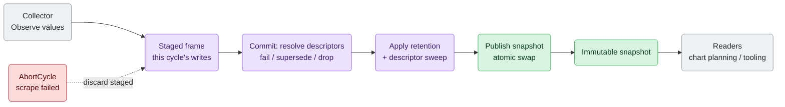
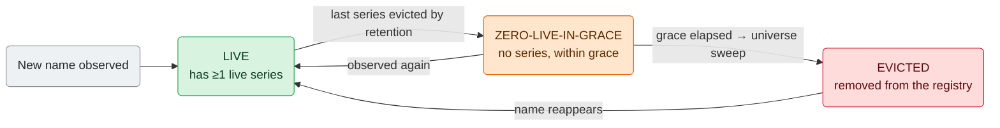

# metrix

`metrix` is the metrics storage and read API used by go.d `ModuleV2` collectors
and runtime/internal components. A collector writes metrics into a store each
collect cycle; readers (chart planning, tooling) see a consistent, immutable
snapshot of the last successful cycle.

This document is human-oriented. Read it top to bottom as a journey: the
plain-language model first, then the collect cycle, then the part that makes
metrix safe for unbounded metric streams — **descriptor identity and
retention** — and finally the precise API reference, contracts, and pitfalls.

**Audience**: `ModuleV2` collector authors and framework contributors.

**See also**: [charttpl](/src/go/plugin/framework/charttpl/README.md) (template DSL),
[chartengine](/src/go/plugin/framework/chartengine/README.md) (compile + plan),
[how-to-write-a-collector.md](/src/go/plugin/go.d/docs/how-to-write-a-collector.md)
(end-to-end integration).

## What metrix Does

A collector does not build charts or hold metric state itself. It **observes
values into a store**, and the store owns everything else: series identity,
per-name descriptors, snapshot publication, and lifecycle.

The central rule is simple:

> One metric **name** has exactly one **descriptor**. The store resolves and
> publishes that descriptor atomically at commit, keeps it while the name is in
> use, and **evicts it after the name goes idle** — so an unbounded stream of
> metric names (statsd, push, client-driven names) cannot grow the store without
> bound.

Two store flavors exist for two kinds of producer:

| Consumer                         | Store type       | Typical usage                                              |
|----------------------------------|------------------|------------------------------------------------------------|
| Collector jobs (`ModuleV2`)      | `CollectorStore` | Cycle-scoped writes, snapshot reads, chart planning input  |
| Internal/runtime instrumentation | `RuntimeStore`   | Stateful immediate-commit writes, runtime metrics planning |

The rest of this document is mostly about `CollectorStore` (the cycle model and
the descriptor lifecycle). `RuntimeStore` differences are called out where they
matter.

## Source Map

`metrix` intentionally keeps its public API and implementation in one Go package.
The public import path is `github.com/netdata/netdata/go/plugins/pkg/metrix`;
`metrix/selector` is the only subpackage and imports the root package. The root
package must not import `selector`, or it would create a cycle.

This single-package shape preserves root-defined public type identity and avoids
facade/wrapper overhead on write, commit, read, and Vec hot paths. Use file
ownership, tests, and docs to keep the package navigable; introduce a new
subpackage only when a future concern has a proven one-way dependency boundary.

Current ownership map:

| Concern | Files |
| --- | --- |
| Public API contracts | `interfaces.go`, `types.go`, `options.go`, `read_options.go`, `errors.go`, `host_scope.go` |
| Shared store model and series helpers | `store_model.go`, `descriptor_model.go`, `series_helpers.go`, `identity.go`, `retention.go` |
| Collector store facade, cycle commit, descriptor lifecycle | `collector_store.go`, `collector_cycle.go`, `collector_retention.go`, `descriptor_resolution.go`, `descriptor_registry.go`, `descriptor_schema.go` |
| Runtime store, immediate writes, overlay snapshots | `runtime_store.go`, `runtime_model.go`, `runtime_write.go`, `runtime_commit.go` |
| Write API, meters, Vec, instruments | `backend.go`, `meter.go`, `vec.go`, `vec_cache.go`, `vec_factory.go`, `vec_handles.go`, `gauge.go`, `counter.go`, `histogram.go`, `summary.go`, `summary_sketch.go`, `stateset.go`, `measureset.go`, `measureset_normalize.go`, `measureset_store.go`, `seeded.go` |
| Labels, label sets, metadata, validation | `labels.go`, `labelset.go`, `meta.go`, `value_validation.go` |
| Snapshot reads and flattening | `reader.go`, `reader_flatten.go` |
| Public-contract tests | `public_contract_test.go` (`package metrix_test`); white-box implementation tests remain in `package metrix` |
| Selector expressions | `selector/` |

## The Big Picture

A few words carry the whole model. This table is the vocabulary the rest of the
document uses; later sections make each part precise.

| Term | Plain meaning |
| --- | --- |
| **Series** | One time series: a metric **name** plus a canonical **label set**. |
| **Descriptor** | The per-**name** contract: kind (gauge/counter/…), mode, freshness, window, type schema (histogram bounds / summary quantiles), and metadata. One per name. |
| **Cycle** | One collect round. Collector writes are **staged**, then published all-at-once on success. |
| **Snapshot** | The immutable published view readers see. Swapped atomically at commit. |
| **Freshness** | Whether a not-recently-observed series is still visible to normal reads. |
| **Window** | Whether a stateful histogram/summary accumulates across cycles or resets each cycle. |
| **Retention** | How long an idle series, then its descriptor, are kept before eviction. |

The flow from a collector write to a reader read:



Key properties that fall out of this shape:

- **Reads are lock-free.** A reader holds an immutable snapshot; commits swap in
  a new one. Any number of goroutines read concurrently.
- **Writes are invisible until commit.** A half-collected or failed cycle never
  leaks partial data to readers.
- **Commit is transactional.** Either the whole cycle publishes, or (on
  `AbortCycle` / an unresolvable conflict) nothing changes.

## The Collect Cycle

A `CollectorStore` write only exists inside a cycle. The job runtime drives the
cycle around the collector's `Collect`; `ModuleV2` collectors just write.

| Phase   | Action                                                                                         |
|---------|------------------------------------------------------------------------------------------------|
| Begin   | Open a staged frame (`BeginCycle`).                                                             |
| Collect | Collector writes via `Write().SnapshotMeter(...)` or `Write().StatefulMeter(...)`.             |
| Success | `CommitCycleSuccess` resolves descriptors, applies retention, and publishes a new snapshot.     |
| Failure | `AbortCycle` discards all staged writes and staged registrations — the committed state is untouched. |

`RuntimeStore` has **no cycle API**: writes commit immediately, each producing a
new overlay snapshot, and it is **stateful-only** (snapshot-mode registration
returns an error; calling snapshot record methods panics).

## Metric Identity: Names, Series, and Descriptors

Every write resolves to a **series** — the metric name plus a canonical key
built from its sorted labels. Many series can share one name (same metric,
different label values).

All series of a name share **one descriptor**. The descriptor is the name's
contract and is the thing whose growth metrix bounds:

- **Authority** — kind, mode, freshness, window, and the type schema (histogram
  bounds / summary quantiles). Two writes with different authority for one name
  are a conflict.
- **Declaration** — metadata (description, unit, chart family/priority, float).
  Compatible declarations for one authority are **merged** into a single
  canonical descriptor; a genuine conflict (e.g. two different units) fails.

At commit the store computes exactly **one canonical descriptor per accepted
name** and stamps every surviving series of that name with it, so readers,
the registry, and every series agree regardless of write or label order.

## Descriptor Lifecycle and Retention

This is the core of why metrix is safe for push-style, client-driven metric
names. It applies to `CollectorStore` (`RuntimeStore` has its own bounded
retention path).

### Two coupled retentions

Two things age out, on the **successful-commit clock** (only successful commits
advance it; aborted cycles do not):

1. **Series retention** — a series not observed for `expireAfterSuccessCycles`
   successful commits is evicted. `maxSeries` optionally caps the total series
   count, evicting the oldest first.
2. **Descriptor grace** — after a name's *last* series is gone, its descriptor is
   kept for `descriptorGraceCycles` more successful commits (in case the name
   returns), then swept from the registry.

So a fully idle name's descriptor lives `expire + grace` successful commits past
its last observation. Defaults: `expire = 10`, `maxSeries = 0` (disabled),
`grace = expire` (so grace ≥ expire holds by construction).

### The descriptor state machine



- **LIVE** — at least one series exists. The descriptor is authoritative; a
  conflicting re-registration of a truly-live name fails loud.
- **ZERO-LIVE-IN-GRACE** — the series aged out but the descriptor lingers, so a
  briefly-absent name resumes without re-registration churn.
- **EVICTED** — swept from the registry. The name is a clean slate: it may
  reappear with the **same or a changed** contract and re-register without error.

The sweep runs at commit, after retention, over the whole descriptor universe
(the names in the registry) in one pass — bounded work, no per-series refcounts.

### Conflict resolution at commit

Because registration is staged and resolved at commit (never a mid-cycle panic
for collector code), a name observed with an incompatible authority is resolved
by state:

| Situation | Outcome |
| --- | --- |
| New name, one authority | **Accept**. |
| Incompatible kind, old kind **not** observed this cycle (idle/in-grace) | **Supersede** — drop the old series + descriptor, install the new. |
| Incompatible kinds both observed this cycle (a truly-live conflict) | **Fail** the whole commit (loud; transactional — nothing published). |
| Multiple incompatible kinds, none established | **Drop** this name for the cycle; other names still commit. |

### Consumers that cache per-name state

A consumer that caches handles keyed off a metric name (the prometheus writer)
must keep its cache alive at least as long as metrix keeps the descriptor, or it
would re-register a name metrix still holds. The store exposes this via an
**optional** interface (type assertion; not part of `CollectorStore`, so
existing implementations and fakes keep compiling):

```go
type DescriptorRetention interface {
    DescriptorRetentionWindow() uint64 // expire+grace; DescriptorRetentionUnbounded if expiry is disabled
    SuccessfulCommits() uint64         // the successful-commit clock the window is measured in
}
```

`DescriptorRetentionWindow()` returns `DescriptorRetentionUnbounded`
(`math.MaxUint64`) when series expiry is disabled (`WithExpireAfterSuccessCycles(0)`),
meaning descriptors can live indefinitely — a consumer must then never age out
its cached state for that name.

## Reading

`Read(...)` returns an immutable `Reader` over the latest published snapshot.
Two independent axes control what and how it reads:

- **Raw** (`ReadRaw()`) — bypass freshness filtering; return all committed series
  regardless of when last observed.
- **Flatten** (`ReadFlatten()`) — project complex types (Histogram, Summary,
  StateSet, MeasureSet) into individual scalar series.

| Read options                     | Visibility           | Shape                    |
|----------------------------------|----------------------|--------------------------|
| `Read()`                         | Freshness-filtered   | Canonical typed families |
| `Read(ReadRaw())`                | All committed series | Canonical typed families |
| `Read(ReadFlatten())`            | Freshness-filtered   | Flattened scalar view    |
| `Read(ReadRaw(), ReadFlatten())` | All committed series | Flattened scalar view    |

**Freshness** decides visibility for non-raw reads:

- `FreshnessCycle` — the series must have been observed in the latest successful
  cycle to be visible.
- `FreshnessCommitted` — the series stays visible as long as it is committed,
  even if not re-observed this cycle.

**Window** decides how stateful histogram/summary instruments accumulate:

- `WindowCumulative` — observations accumulate across cycles.
- `WindowCycle` — observations reset each cycle.

The `Reader` interface exposes typed getters
(`Value/Delta/Histogram/Summary/StateSet/MeasureSet`), metadata
(`SeriesMeta/MetricMeta/CollectMeta`), host scopes, and iteration helpers
(`ForEachByName/ForEachSeries/ForEachMatch`).

## Instruments

An instrument is declared on a meter and identified by its name; observing
through it writes a series.

| Mode     | Meter                | Freshness default    | Window default     |
|----------|----------------------|----------------------|--------------------|
| Snapshot | `SnapshotMeter(...)` | `FreshnessCycle`     | `WindowCumulative` |
| Stateful | `StatefulMeter(...)` | `FreshnessCommitted` | `WindowCumulative` |

Kinds: **Gauge**, **Counter**, **Histogram**, **Summary**, **StateSet**, and
**MeasureSet** (below). Instruments accept options:

| Option                                                                            | Scope                                                                                          |
|-----------------------------------------------------------------------------------|------------------------------------------------------------------------------------------------|
| `WithFreshness(...)`                                                              | Freshness policy override (subject to mode constraints)                                        |
| `WithWindow(...)`                                                                 | Stateful histogram/summary window mode                                                         |
| `WithHistogramBounds(...)`                                                        | Histogram bucket boundaries                                                                    |
| `WithSummaryQuantiles(...)`                                                       | Summary quantile output (required for quantile series in flattened view)                       |
| `WithSummaryReservoirSize(...)`                                                   | Stateful summary estimator size                                                                |
| `WithStateSetStates(...)`                                                         | StateSet allowed states                                                                        |
| `WithStateSetMode(...)`                                                           | `ModeBitSet` (multiple simultaneous active states) or `ModeEnum` (exactly one active state)    |
| `WithMeasureSetFields(...)`                                                       | MeasureSet fixed ordered field schema (required for MeasureSet instruments)                    |
| `WithDescription(...)`, `WithChartFamily(...)`, `WithChartPriority(...)`, `WithUnit(...)`, `WithFloat(...)` | Metadata hints for downstream consumers (chart identity, units, float SET mode) |

## MeasureSet

`MeasureSet` stores one logical metric family with a fixed ordered list of named
numeric fields — a structured family, similar to `StateSet` for chart autogen.

- **Family-level semantics** — a family is either gauge-like or counter-like;
  never mixed per field.
- **Family-level metadata** — `Description`, `ChartFamily`, and `Unit` apply to
  the whole family.
- **Field-level schema** — `MeasureFieldSpec` declares per-field `Name` and
  `Float`.

### Writers

| Mode     | Gauge-like family                                                                                                           | Counter-like family                                                                    |
|----------|-----------------------------------------------------------------------------------------------------------------------------|----------------------------------------------------------------------------------------|
| Snapshot | `MeasureSetGauge(...).ObservePoint(...)` or preferred `ObserveFields(...)`                                                  | `MeasureSetCounter(...).ObserveTotalPoint(...)` or preferred `ObserveTotalFields(...)` |
| Stateful | `MeasureSetGauge(...).SetPoint(...)`, `AddPoint(...)`, `SetFields(...)`, `AddFields(...)`, `SetField(...)`, `AddField(...)` | `MeasureSetCounter(...).AddPoint(...)`, `AddFields(...)`, `AddField(...)`              |

### Write contract

- **Prefer named write helpers** over raw positional `MeasureSetPoint` values.
- **Snapshot handles** support full-family positional and named writes.
- **Stateful handles** additionally support singular field writes
  (`SetField`/`AddField`), which update only the addressed field on top of the
  committed/staged family.
- **Snapshot singular field writes do not exist** (phase 1): snapshot mode models
  one sampled family point per cycle; partial field visibility is deferred.
- **Named full-family writes require the exact declared field set** — missing or
  unknown fields panic.

### Schema example

```go
store := metrix.NewCollectorStore()
meter := store.Write().SnapshotMeter("svc")
latency := meter.MeasureSetGauge(
	"latency",
	metrix.WithMeasureSetFields(
		metrix.MeasureFieldSpec{Name: "value"},
		metrix.MeasureFieldSpec{Name: "ratio", Float: true},
	),
	metrix.WithUnit("seconds"),
)
latency.ObserveFields(map[string]metrix.SampleValue{
	"value": 1.5,
	"ratio": 0.5,
})
```

### Stateful singular-write example

```go
store := metrix.NewRuntimeStore()
meter := store.Write().StatefulMeter("svc")
usage := meter.MeasureSetGauge(
	"usage",
	metrix.WithMeasureSetFields(
		metrix.MeasureFieldSpec{Name: "value"},
		metrix.MeasureFieldSpec{Name: "limit"},
	),
)

usage.SetFields(map[string]metrix.SampleValue{"value": 10, "limit": 20})
usage.SetField("value", 15)
usage.AddField("limit", 3)
// committed point == metrix.MeasureSetPoint{Values: []metrix.SampleValue{15, 23}}
```

## Flattened View Mapping

`Read(ReadFlatten())` projects non-scalar families into scalar series:

| Source kind | Flattened outputs                                                                                                |
|-------------|------------------------------------------------------------------------------------------------------------------|
| Histogram   | `<name>_bucket{le=...}`, `<name>_count`, `<name>_sum`                                                            |
| Summary     | `<name>_count`, `<name>_sum` (always); `<name>{quantile=...}` (only when `WithSummaryQuantiles()` is configured) |
| StateSet    | `<name>{<name>=state}` with scalar 0/1 values                                                                    |
| MeasureSet  | `<name>_<field>{measure_field=field}`; flattened kind follows family semantics (`Gauge` or `Counter`)            |

Histogram bucket flattening emits non-overlapping range bucket totals while
keeping the `le` label as the bucket upper bound: the first finite bucket is
`<= le[0]`; each later finite bucket is `(previous le, current le]`; `+Inf` is
`count - last finite cumulative bucket`. Typed `Histogram()` reads stay canonical
cumulative points.

Flatten metadata is exposed via `SeriesMeta.Kind`, `SeriesMeta.SourceKind`, and
`SeriesMeta.FlattenRole`. `MeasureSet` flattening keeps per-field metric names
for `MetricMeta(name)` compatibility and adds a synthetic `measure_field=<field>`
label for explicit field identity.

## Configuration

`NewCollectorStore(opts ...CollectorStoreOption)` is variadic and additive;
existing callers keep working. The options tune the retention model above:

| Option | Default | Effect |
| --- | --- | --- |
| `WithExpireAfterSuccessCycles(n)` | `10` | Successful commits an unobserved series is kept (`0` disables series expiry → unbounded descriptor window). |
| `WithMaxSeries(n)` | `0` (off) | Hard cap on total committed series; oldest evicted past the cap. |
| `WithDescriptorGraceCycles(n)` | `= expire` | Successful commits a descriptor is kept after its last series is gone, before the sweep removes it. |

Eviction and drop activity is exposed as cumulative counters on the per-snapshot
`CollectMeta` (read via `Reader.CollectMeta()`); metrix itself never logs:

| Field | Meaning |
| --- | --- |
| `EvictedDescriptors` | Descriptors removed by the universe sweep (idle past grace). |
| `DroppedNames` | Names dropped for a cycle as ambiguous multi-kind conflicts. |
| `LastAttemptSeq` / `LastAttemptStatus` / `LastSuccessSeq` | Last cycle attempt sequence, status, and last success. |

## Usage Snippets

### Collector write path

```go
store := metrix.NewCollectorStore()
meter := store.Write().SnapshotMeter("mysql")
qps := meter.Counter("queries_total")
qps.ObserveTotal(42)
```

### Read path for planning

```go
reader := store.Read(metrix.ReadRaw(), metrix.ReadFlatten())
value, ok := reader.Value("mysql.queries_total", nil)
_ = value
_ = ok
```

### Direct MeasureSet read

```go
reader := store.Read()
point, ok := reader.MeasureSet("svc.latency", nil)
_ = point
_ = ok
```

For a complete collector integration pattern (cycle management, error handling),
see [how-to-write-a-collector.md](/src/go/plugin/go.d/docs/how-to-write-a-collector.md).

## Contracts and Pitfalls

- **Descriptor lifetime is not permanent.** A fully idle name evicts after
  `expire + grace` successful commits and can then be re-registered with a
  changed contract. Consumers that cache per-name handles must read
  `DescriptorRetention` and not outlive the window.
- **Aborted cycles freeze the clocks.** Retention, grace, and the sweep advance
  only on successful commits, so endpoint downtime does not age anything out.
- **Label sets** — `LabelSet` is store-owned; do not share between stores.
- **Counter deltas** — `Delta()` requires a contiguous sequence (N, N+1). In
  `CollectorStore` this is per-cycle (a missed successful cycle breaks the delta);
  in `RuntimeStore` it is per-series per-write (skipping a write does not break it).
- **Snapshot freshness** — snapshot-mode instruments cannot use
  `FreshnessCommitted`.
- **Runtime writes** — `RuntimeStore` rejects snapshot-mode registration with an
  error; calling snapshot record methods (`ObserveTotal`, `ObservePoint`) panics.
  MeasureSet families work only through `StatefulMeter(...)`.
- **MeasureSet named writes** require the exact declared field set; snapshot
  singular field writes are absent in phase 1.
- **MeasureSet counter semantics** — stateful counter-like families reject
  negative `AddPoint(...)` deltas, like scalar counters.
- **Window/freshness coupling** — stateful histogram/summary with `WindowCycle`
  requires (and silently forces) `FreshnessCycle`; an explicit non-Cycle freshness
  with `WindowCycle` is an error.
- **Truly-live schema conflicts fail the commit.** Re-registering an
  actively-observed name with a different kind/mode/schema fails loud (transactional);
  an idle name is superseded instead. Init-time registration keeps a synchronous panic.
- **Summary NaN quantiles** — a summary point may carry NaN quantile *values*
  (e.g. an empty window); they are stored (only Inf is rejected) and render as a
  chart gap downstream. Count and Sum must be finite.

## Internal Architecture Notes

| Area | Implementation pattern |
|------|------------------------|
| Snapshot publish | Read snapshots are immutable and atomically swapped. |
| Collector commit | Staged frame → descriptor resolution → retention → single canonical pass → publish, all success-path; abort discards staged state. |
| Descriptor resolution | Observed authorities per name are grouped in a fingerprint-indexed map (no cap); one canonical descriptor per accepted name. |
| Descriptor eviction | One O(descriptor-universe) sweep at commit, after retention; `instrumentZeroSince` tracks idle-since on the successful-commit clock. |
| Runtime commit | Overlay/compaction strategy with its own retention pruning. |
| Iteration | Name-indexed deterministic iteration for reader traversal. |
| Identity | Canonical metric+labels key with a stable `SeriesIdentity` hash. |
