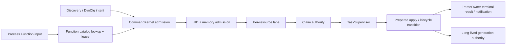

# Job Manager architecture

## Purpose

Job Manager is the production orchestration boundary for Go data-collection
plugins. It turns Function input, discovery changes, dynamic configuration, and
process control into ordered lifecycle commands.

Job Manager owns orchestration. Collector internals remain opaque:

- V1 and V2 jobs are created through framework factories.
- Function and collection callbacks are collector contracts.
- Job Manager invokes `Cleanup(context.Context)` and waits for the declared
  lifecycle result.
- Collector-internal goroutines, locks, caches, and profile watchers are not
  Job Manager authorities.

## Construction and lifetimes

Production has one construction chain:

```text
godplugin / ibmdplugin / scriptsdplugin
    -> agent.New
        -> composition.NewProcess
            -> one process authority
                -> one active run generation
                    -> one CommandKernel + one KernelLoop
```

The process lifetime owns:

- the Function `InputCapsule` and process ingress;
- the output `FrameOwner`;
- admission and UID ledgers;
- frozen module, discovery-provider, and SecretStore-creator catalogs;
- the atomic secret resolver;
- the runtime output service.

Each run generation owns:

- `RunSupervisor` and `TaskSupervisor`;
- `CommandKernel` and `KernelLoop`;
- Function catalog, handler generations, and publications;
- dynamic-configuration graph and controllers;
- Job, discovery-pipeline, vnode, and SecretStore generations;
- the secret dependency index;
- the `jobmgr.runtime` metrics projection.

A restart rotates the complete run generation. It does not construct a second
process ingress, output owner, mutable registry, or resolver.

## Package boundaries

| Package | Responsibility |
| --- | --- |
| `jobmgr` | Command ports, lanes, claims, planning, KernelLoop, composite child commands |
| `jobmgr/lifecycle` | Neutral admission, UID, operation, task, resource, run, and frame authorities |
| `jobmgr/functions` | Function ingress adapter, catalog, handler generations, publication |
| `jobmgr/joboutput` | Collector construction, Job generations, output, vnode snapshots, DynCfg jobs |
| `jobmgr/secrets` | Secret commands, dependency index, restart transaction |
| `jobmgr/discovery` | Discovery decisions and configured vnode state |
| `jobmgr/composition` | The only production assembler; process and run rotation |
| `framework/functions` | Passive Function values, registry contracts, and process input capsule |
| `secrets/resolver` | Atomic config clone, reference compilation, scoped resolution |
| `secrets/secretstore` | Frozen creator catalog and per-run Store generation authority |

`lifecycle` is neutral and does not import Agent or adapter packages. Adapter
packages may import the root command ports and `lifecycle`, but not sibling
adapters. `composition` is the only package allowed to join adapters.

## Command flow



The main stages are:

1. The process-fixed input capsule parses an immutable call.
2. The active Function catalog resolves the route and acquires its handler
   generation lease.
3. Kernel admission validates the request, reserves UID and memory ownership,
   derives the lane, and installs the operation.
4. Claim acquisition orders conflicts before blocking work starts.
5. `TaskSupervisor` executes the typed work outside KernelLoop.
6. KernelLoop applies the completion and advances the lifecycle state.
7. `FrameOwner` commits the terminal response and later protocol
   notifications.
8. Every lease, claim, admission reservation, task, and prepared value is
   released or transferred to an explicit long-lived generation.

## Ownership and synchronization

KernelLoop is the sole mutator of command lanes, command operations, deadlines,
and claim transitions. Adapters do not reach into kernel state.

Other authorities own their state behind explicit APIs:

- `TaskSupervisor` owns task requests, active children, and class queues.
- `FrameOwner` serializes every stdout protocol frame.
- `RunSupervisor` owns admission state, shutdown budget, and dirty/fail-stop
  state.
- Function catalog owns publication and handler-generation leases.
- Job factory owns constructed Job generations.
- SecretStore owns immutable published provider generations and lexical reader
  scopes.
- Discovery pipeline and vnode authorities own their long-lived generations.

No external callback runs while KernelLoop is holding mutable adapter state.
Blocking collector, provider, validation, stop, and cleanup work runs as a
supervised task.

## Ordering

### Lanes

Commands addressing the same resource use one FIFO lane. Different lanes may
make progress independently.

Function invocations without a resource identity receive independent
invocation-scoped lanes, so calls to the same Function may run concurrently.
Resource-bound Functions and DynCfg routes use the addressed resource identity,
so unrelated resources do not serialize behind one another.

### Claims

Claims order cross-resource conflicts:

- write claims exclude readers and writers;
- read claims may coexist;
- acquisition uses a stable global key order;
- waiters are FIFO at each contested key;
- a parent composite command may transfer its claim scope to acknowledged
  child commands.

Claims are released only after the operation settles. A timed-out task that has
not returned cannot silently surrender ownership that its late return could
still mutate.

### Task classes

`TaskSupervisor` has separate queues for:

- framework-control work, including resource and DynCfg lifecycle commands;
- generic Function work.

Ready work alternates between non-empty classes. One class cannot block service
of the other, and there is no framework-wide fixed limit such as “four active
Functions.” The scheduler's service quanta bound loop work per turn; they are
not execution-concurrency limits.

Concurrent calls to the same collector Function are allowed by the framework.
A collector that requires serialization owns that mutex internally.

## Results and output

Every admitted Function UID has one terminal owner. Duplicate active or
recently completed UIDs are rejected before a second operation is installed.

Results are sealed values. KernelLoop decides the terminal disposition and
`FrameOwner` performs the wire commit. Post-result notifications are prepared
separately and committed after the terminal frame.

All protocol output, including keepalive and runtime output, passes through
`FrameOwner`. Netdata is expected to consume stdout promptly; output
serialization still prevents interleaved frames.

## Secrets

Secret resolution is atomic:

1. clone and validate the whole input shape;
2. compile all references and distinct Store keys;
3. acquire one lexical `ResolutionScope`;
4. resolve against the pinned Store generations;
5. release the scope;
6. return either the complete postimage or no result.

SecretStore mutations prepare a provider outside publication, then commit by
generation compare-and-swap. Replacement or removal retires the prior
generation only after its readers drain. Dependent Job restarts execute as one
composite command under the parent Store mutation's ordering scope.

The dependency index performs deterministic lookup and replacement. Discovery
publication work is proportional to frozen providers plus changed source
records; no provider-count ceiling is imposed.

## Jobs and collectors

Job Manager distinguishes orchestration contracts, not collector
implementations:

- V1 runtime adapts `Check`, `Charts`, `Collect`, and cleanup.
- V2 runtime adapts collector-store, host/vnode scope, chart engine, and
  cleanup.
- Function methods and static Functions publish through the Function catalog.
- Job output is fenced by its acknowledged Job generation.

The chart engine, chart templates, SNMP profiles, and other collector framework
internals are outside the kernel design. Their only relevance here is the
public factory/runtime contract they implement.

## Restart and shutdown

Run rotation is an acknowledged sequence:

1. seal process ingress returns;
2. stop active run admission;
3. begin the one run shutdown budget;
4. drain or contain the current input payload;
5. cancel and join supervised work;
6. withdraw Function publications and long-lived resources;
7. require exact-zero authority censuses;
8. finish the run and reopen the drained process ledgers for the next
   generation;
9. construct, start, and adopt the next complete run.

Termination follows the same retirement path without constructing a successor.
Construction failure, release failure, retained ownership, or an invalid
lifecycle transition marks the run dirty and makes shutdown fail closed.

Collector work that remains blocked at process exit is considered safe enough
because process termination removes it; Job Manager does not add a second
unbounded shutdown mechanism around that assumption.

## Runtime metrics

One component, `jobmgr.runtime`, projects current production concepts:

- active/admitted/rejected operations;
- active Function invocations;
- claim keys, waiters, and oldest wait;
- active/queued tasks and oldest wait;
- active Jobs;
- frame commits and failures;
- timeouts, disposal, panics, and dirty runs.

Mutation owners write metrics-owned atomics. The runtime producer snapshots
those projections into the metrics store; it never reads or mutates
KernelLoop-private state. Registration occurs before external admission;
terminal run acknowledgement unregisters the cadence producer, refreshes and
synchronously emits the final projection, then removes the component behind
an output barrier. No predecessor-generation sample can cross a successful
HUP handoff.

## Static and behavioral proof

`architecture_test.go` enforces:

- the exact root package and six adapter subpackages;
- no build-ignored production bridge;
- neutral lifecycle dependencies and adapter direction;
- concrete declarations for every authority;
- one production construction chain and one authority set;
- absence of retired Manager, Service/Snapshot, recursive Resolver, and
  file-persister lifecycle declarations;
- no experimental identities in production Go source.

Behavioral tests cover admission, cancellation, deadlines, claims, fairness,
composite rollback, task panic containment, Function publication, Job and
SecretStore generations, discovery rotation, output framing, restart, and
shutdown.
