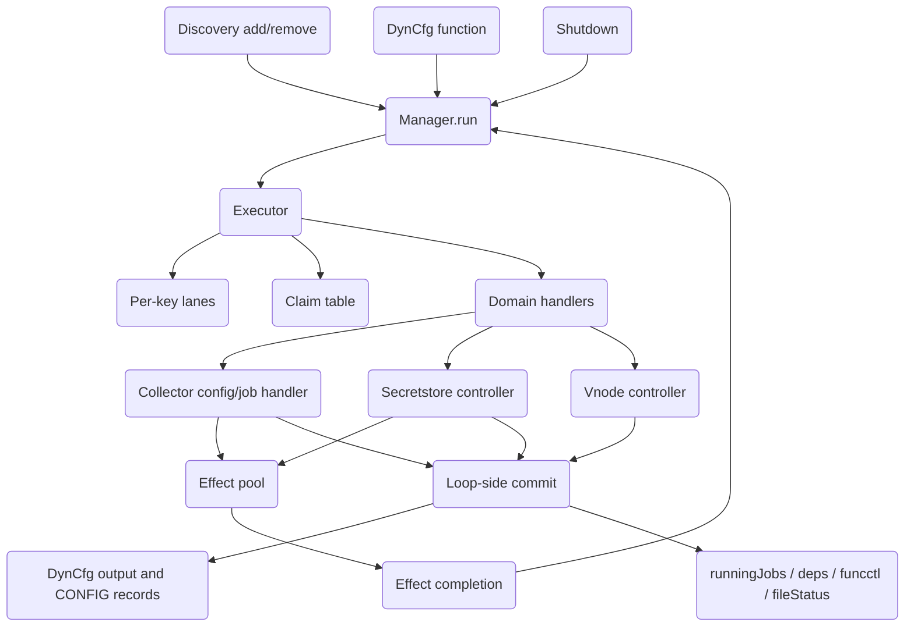
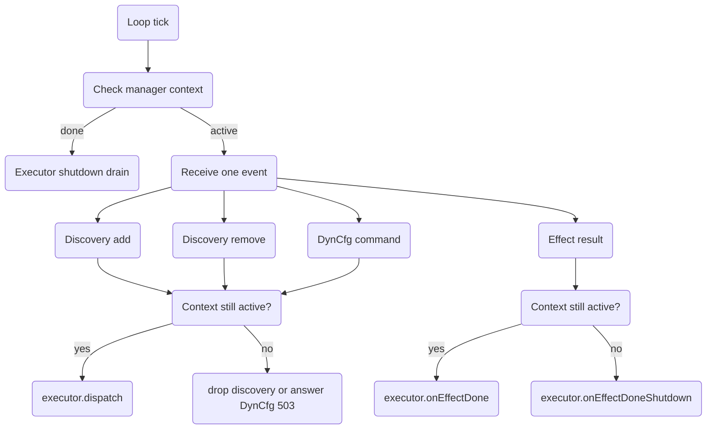
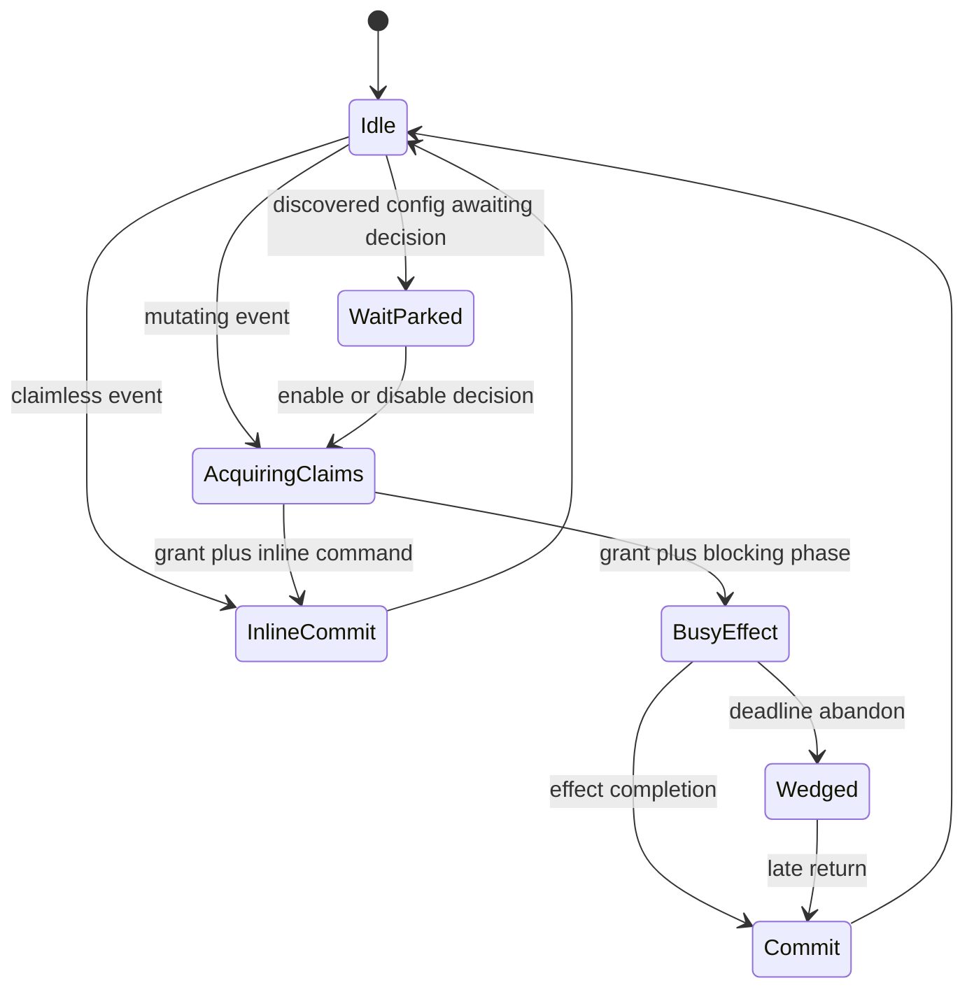
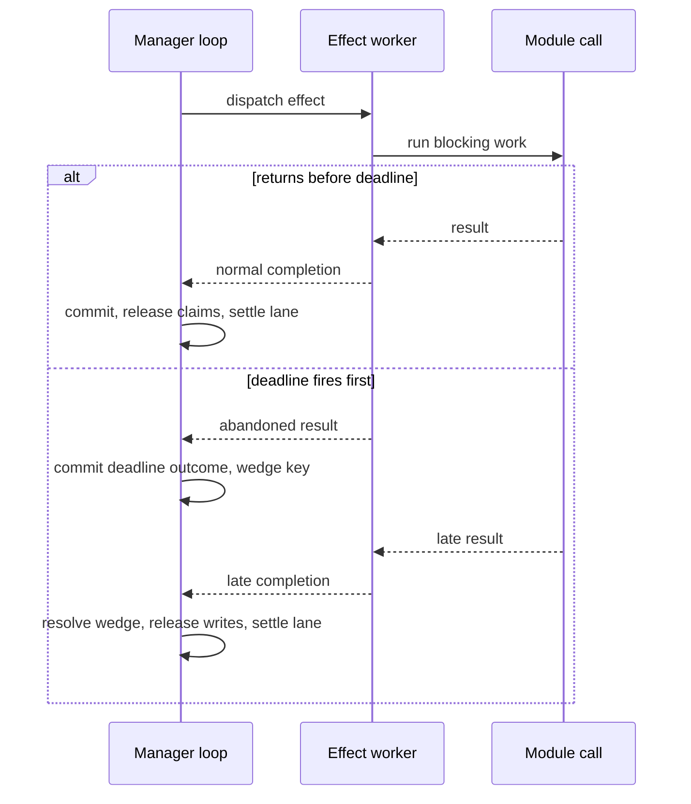

# Job Manager Architecture

This document describes the current `jobmgr` architecture for maintainers.
It is intentionally human-oriented: it explains the moving parts, command
flows, state ownership, and test model without requiring the reader to
reconstruct the system from individual review notes.

## Mental Model

`jobmgr` owns collector jobs at runtime. It accepts configuration changes
from discovery and Dynamic Configuration (DynCfg), starts and stops jobs,
coordinates secret stores and virtual nodes, and publishes Function routes.

The central rule is simple:

> The manager loop owns orchestration state. Blocking module work runs
> outside the loop, then returns to the loop to commit.

The architecture has four layers:

1. Inputs:
   discovery add/remove, DynCfg functions, effect completions, shutdown.
2. Manager loop:
   the single goroutine that owns executor state, claim state, and commits.
3. Executor:
   per-key lanes plus a multi-key claim table.
4. Effects:
   blocking work on a bounded worker pool, with deadline abandon and late
   return handling.

## Main Objects

| Object | Owner | Purpose |
| --- | --- | --- |
| `Manager.run` | One goroutine | Routes every accepted event and executes commits. |
| `executor` | Manager loop | Serializes same-key work, manages effects, shutdown drain, and wedged keys. |
| `keyState` | Manager loop | State for one domain key: FIFO, wait park, busy phase, grant, wedge. |
| `claimTable` | Manager loop | Reserves cross-key dependencies before work can run. |
| `dyncfg.Handler` | Manager loop plus callbacks | Generic collector config state machine. |
| `secretsctl.Controller` | Manager loop plus effects | Secret store CRUD, validation, and dependent restarts. |
| `vnodectl.Controller` | Manager loop | Vnode CRUD and validation. |
| `runningJobs` | Locked helper | Registered runtime jobs. |
| `secretStoreDeps` | Locked helper | Mapping from stores to dependent collector configs. |
| `funcctl.Controller` | Locked helper plus reconciler | Function route publication. |
| `emissionGates` | Locked helper | Output gate used to quarantine stopping or dropped jobs. |
| `fileStatus` | Locked helper | File status persistence for dyncfg-managed jobs. |

The loop owns orchestration decisions, but several helpers are locked
because effects and auxiliary goroutines also need safe access.

## Event Domains And Keys

Every executor event has:

- kind: discovery add, discovery remove, or DynCfg command;
- domain: collector, secretstore, vnode, or unknown;
- key: the object identity inside the domain.

The lane key is domain-namespaced as `<domain>|<key>`, so collector job
keys, store keys, and vnode names cannot collide.

| Domain | Key | Examples |
| --- | --- | --- |
| Collector | Exposed config key | `mysql_local`, `go.d_job` |
| Secretstore | Store key | `vault:vault_prod` |
| Vnode | Vnode name | `db-primary` |
| Unknown | none | Rejected immediately. |

Underivable commands keep a domain fallback key and execute the existing
handler rejection path. They are rejection-only by construction and do not
claim dependencies.

## Manager Loop

`Manager.run` is the only consumer of:

- discovery add/remove channels;
- DynCfg command channel;
- effect completion channel.

It checks shutdown before every normal receive and again after the select
chooses a work item. That bounds the shutdown race to the single event
already being handled.

The loop must not block on module code, external I/O, or unbounded channel
sends. Blocking work must go through a `StepRunner` and return to the loop
for commit.

## Executor Lanes

Each key has a lane. A lane may be:

- idle;
- occupied by claim acquisition;
- occupied by an effect;
- occupied by a held claim after inline work;
- wait-parked awaiting an enable/disable decision;
- wedged after a deadline abandon.

Same-key events never overtake each other. Different keys can run
concurrently unless the claim table finds a dependency conflict.

Wait-park is special: it applies to discovery events for a config awaiting
the user's enable/disable decision. DynCfg commands against the same key do
not wait-park; they execute and answer the state machine's current outcome.

## Claim Table

Claims reserve cross-key dependencies before work runs.

| Command class | Claims |
| --- | --- |
| Collector mutation | Own collector key as write; referenced stores as read; referenced vnode as read. |
| Collector update/replace | Union of old and new store/vnode references. |
| Collector disable/remove | Old store/vnode references from the exposed config. |
| Secretstore mutation | Store key as write; restartable dependent jobs as write. |
| Secretstore test | Store key as read. |
| Vnode mutation | Vnode name as write. |
| Rejection-only command | No claims. |

Claim rules:

- reads share;
- writes exclude;
- acquisition walks one global lexicographic order, including the primary;
- a request holds the acquired prefix and parks at the first blocked key;
- per-key waiter FIFO prevents barging;
- claim sets recompute at every restage;
- if the recomputed set changes, the old prefix is released and the new set
  is acquired from the start;
- claim waiters are pumped before lane release hooks can settle parked lane
  events.

This is the deadlock-avoidance core: no command waits for a later key while
holding keys in an order that another command can invert.

## Rejection-Only Commands

A rejection-only command is one that answers before its first
claim-protected access. It should not claim anything and should not park
behind a foreign write hold.

Examples:

- invalid identity;
- unknown command;
- missing object;
- missing payload;
- unsupported command;
- most source/type gates;
- parse gates that happen before state access.

Status-derived collector gates are the exception. Enable, restart, and
disable can answer from `Entry.Status`, and that status is mutated by
secretstore dependent restart plans. When the collector key is
foreign-write-held, these commands park and answer after the hold resolves.

The predicates that decide this are colocated with the command gates:

- collector: `dyncfg.Handler.CommandActs` and
  `RejectionDependsOnStatus`;
- secretstore: `secretsctl.Controller.CommandActs`;
- vnode: `vnodectl.Controller.CommandActs`.

## Domain Flows

### Collector Configs And Jobs

Collector commands use the generic DynCfg handler plus jobmgr callbacks.

| Command | Main flow |
| --- | --- |
| `add` | Validate payload, expose config, optionally replace old job, publish create/status. |
| `enable` | Start an accepted/failed/disabled config and publish running or failed. |
| `disable` | Stage stop, wait in effect, publish disabled. |
| `remove` | Stage stop if needed, remove exposed/seen state, publish delete. |
| `update` | For same-source update: stop old job, start replacement. For conversion: activate dyncfg config over file/user config. |
| `restart` | Stop then start the same config. |
| `get` / `schema` / `userconfig` | Read-only or cheap response paths. |
| `test` | Keyless interactive validation on its own bounded pool. |

Collector mutations claim their own key and referenced store/vnode keys.
Update-shaped commands claim both old and new references.

Function routing follows committed state:

- stop withdrawal happens at stage time, before the stop effect reaches a
  worker;
- start publication happens at commit time, when the config is running.

### Discovery

Discovery does not mutate manager state directly. It sends add/remove
intents to the loop.

Discovery add:

1. Validate identity.
2. Remember the discovered config.
3. If replacing an exposed config, stage the old stop.
4. Publish create/status.
5. If auto-enable applies, chain an enable command through the lane.
6. Otherwise wait-park the key for an enable/disable decision.

Discovery remove:

1. Stage stop if a matching exposed job exists.
2. Remove active job state and exposed config at commit.
3. Publish delete.

Discovery replace/remove stops are final-phase staged stops. Their stop wait
claims completion before disarming the deadline fence, so a completed stop
cannot be misclassified as an unfenced timeout.

### Secretstores

Secretstore commands run through `secretsctl.Controller.StepExec`.

| Command | Main flow |
| --- | --- |
| `add` | Validate/activate store in effect, publish store config, restart dependents if needed. |
| `update` | Validate/activate replacement, restart dependents. |
| file/user conversion `update` | Activate dyncfg override in place, then restart dependents. |
| `remove` | Reject if referenced; otherwise remove store. |
| `test` | Validate candidate or stored config; read claim only. |
| `get` / `schema` / `userconfig` | Cheap response paths. |

Dependent restarts are one multi-key effect:

1. The loop snapshots the restart plan after the store command has its
   grant.
2. The effect restarts dependents sequentially.
3. Each completed dependent restart buffers a loop-side CONFIG STATUS replay.
4. The store command flushes completed replay work before its terminal
   response at normal commit or deadline-abandon commit.
5. Restarts that finish only after a deadline abandon are replayed at the
   late return, before the remaining write claims release.
6. Wedged dependents are excluded from the claim set and reported as
   skipped.

The terminal message belongs to the command's own effect context, so
overlapping store commands cannot cross-attribute messages.

### Vnodes

Vnode commands are loop-synchronous stage+commit operations under a vnode
write claim.

| Command | Main flow |
| --- | --- |
| `add` | Validate name, payload, GUID, and uniqueness; add vnode. |
| `update` | Validate payload/GUID/uniqueness; update vnode and notify running jobs. |
| `remove` | Reject if missing, non-dyncfg, or referenced; otherwise remove and publish delete. |
| `test` | Validate candidate inline, no claim. |
| `get` / `schema` / `userconfig` | Cheap response paths. |

Collector commands that reference a vnode hold a read claim on the vnode.
That prevents vnode removal/update from racing a collector stop/start window.

Every job registration reconciles the job's vnode baseline before `Start`.
This covers dependent restarts and warm resumes that were created before a
vnode update but registered after it.

## Effects, Deadlines, And Wedges

Blocking work runs as an effect with the manager context plus a flat
deadline. Blocking work includes:

- collector validation and detection;
- job stop waits;
- secretstore backend validation and activation;
- dependent restarts.

If an effect returns before the deadline, the result is committed on the
loop. If the deadline fires first, the worker commits the deadline outcome
and the leaked call keeps running in the background. The key is then wedged
until the leaked call returns.

While wedged:

- the lane remains busy;
- same-key events park;
- read claims release at the abandon commit;
- write claims remain held until late return;
- claim waiters at the wedged key are re-attempted so commands that can
  skip wedged keys do not wait for an unbounded leaked call.

At late return:

- late replay work runs before remaining write claims release;
- a warm start resumes only if the config is still current, no stop intent
  is queued, the manager is not shutting down, and referenced stores are
  unchanged/not write-held;
- dropped warm starts dispose silently behind a closed emission gate;
- shutdown late returns only release state and publish nothing.

## Shutdown

Shutdown has one rule:

> Every non-terminal DynCfg command answers 503, publishes nothing, and
> disposes everything.

Shutdown drain handles all places work can be stuck:

- commands still in `dyncfgCh`;
- pending effects that were not picked by a worker;
- effect tasks sitting in the worker channel;
- claim-parked commands;
- in-flight effects that finish inside the bounded drain window;
- still-busy keys after the drain window expires;
- lane FIFO and wait FIFO entries.

Late completions after the drain window are dropped through `lateDrop`.
They must not publish state.

## Function Publication

Function publication is separate from job start/stop mechanics.

- Stop withdrawal happens when a stop stages.
- Start publication happens when a running status commits.
- A reconciler goroutine performs publication work outside the manager loop.
- The manager loop may request reconciliation, but it must not publish
  directly.

This keeps Function routing aligned to committed state while preventing the
manager loop from blocking on publication work.

## Output Ordering Rules

Important ordering contracts:

- Collector shared-handler commands emit the terminal result before their
  same-command CONFIG records.
- Secretstore dependent restart CONFIG STATUS records that completed by the
  command commit are replayed before the store command terminal. Restarts
  completing after deadline abandon are replayed at the late return, before
  the remaining write claims release.
- Vnode remove emits CONFIG delete before its terminal.
- Shutdown publishes no CONFIG records for non-terminal work.
- Deadline abandon keeps the permanent deadline classification, not the
  shutdown one-rule.

These contracts are pinned by characterization and flow tests.

## Testing Model

The test suite should be read as a set of matrices, not as isolated tests.

### Matrix Axes

| Axis | Values to cover |
| --- | --- |
| Domain | collector, secretstore, vnode |
| Object state | missing, accepted, running, failed, disabled, dyncfg, file/user, stock/internal |
| Command class | read-only, rejection-only, stage+commit, effect, chained effect, keyless test |
| Dependencies | no refs, store refs, vnode refs, dependent jobs, busy dependent, wedged dependent |
| Ordering | same-key FIFO, wait-parked discovery, foreign write hold, read/read sharing, read/write conflict |
| Failure boundary | validation failure, start failure, stop timeout, effect deadline, late return, shutdown |
| Expected result | terminal code, CONFIG records, claim behavior, publication timing, retry behavior |

Do not try to test the full Cartesian product. The useful target is
equivalence-class coverage: one test per behavior boundary, plus parity
tests that fail when a command gate moves without updating the scheduler
predicate.

### Existing Coverage Anchors

| Area | Primary tests |
| --- | --- |
| Claim table ordering and fairness | `claims_test.go` |
| Per-key dispatch, derivation, keyless collector test | `executor_test.go` |
| Generic DynCfg command state machine | `plugin/framework/dyncfg/handler_test.go` |
| Collector callbacks and command basics | `dyncfg_collector_test.go`, `manager_test.go` |
| Discovery wait parking and wire order | `characterization_test.go` |
| Secretstore flow and conversion | `secretstore_flow_test.go` |
| Secretstore effects and dependent restart edge cases | `secretstore_effect_test.go`, `effect_deadline_test.go` |
| Vnode and cross-domain claim interactions | `vnode_claims_test.go`, `dyncfg_vnode_test.go` |
| Deadline, wedge, shutdown one-rule | `effect_deadline_test.go`, `effect_test.go`, `executor_test.go` |
| Function publication timing | `manager_process_test.go`, `funcdispatch_test.go`, `funcctl/*_test.go` |
| CommandActs parity | `handler_test.go`, `secretsctl/commandacts_test.go`, `vnodectl/commandacts_test.go` |

### Known Test-Gap Classes

These are not known runtime defects. They are places where future test
hardening should focus.

| Gap class | Current state | Suggested next test shape |
| --- | --- | --- |
| Human-readable matrix | Coverage exists but is spread across many files. | Keep this section current when adding a command or state. |
| Integrated hold-aware status commands | End-to-end pin covers enable during a dependent restart; handler unit tests classify enable/restart/disable. | Add table-driven end-to-end rows for restart and disable under a foreign dependent write hold if more pre-PR hardening is requested. |
| Unsupported/inline command parity | End-to-end rejection pins exist for representative unsupported store/vnode commands; per-domain parity tables are not a full unsupported-command census. | Extend parity tables when command support changes, especially for unsupported commands that should remain claimless. |
| Pairwise cross-domain interleavings | Representative read/write conflicts are pinned; every command pair is not enumerated. | Add pairwise tests only when a new claim mode or new cross-key writer is introduced. |
| Shutdown matrix by every command | Shutdown one-rule is pinned at the main chokepoints and representative commands. | Add command-specific shutdown rows only when a command adds a new effect phase or publication path. |

When adding tests, prefer:

- table-driven gate parity tests for deterministic command predicates;
- property tests for claim-table ordering rules;
- end-to-end choreography only for cross-domain ordering or publication
  outcomes that cannot be proven at the predicate/unit layer.
