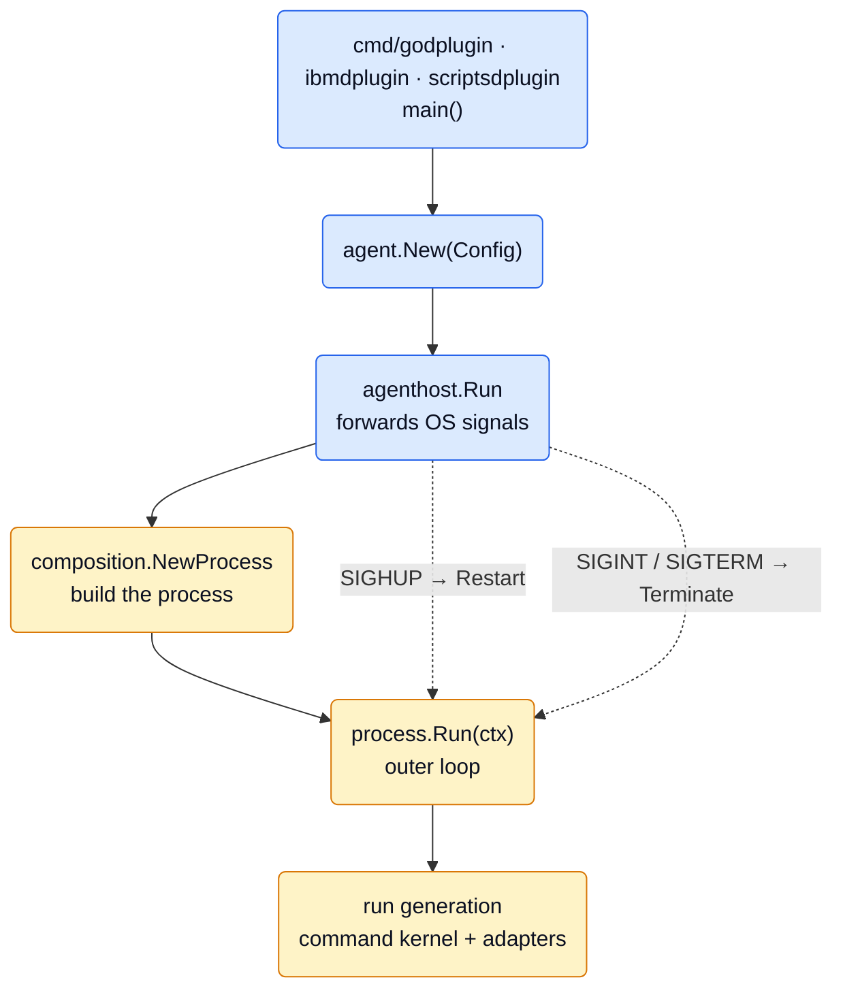
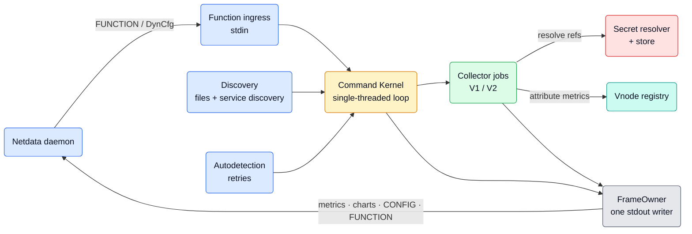
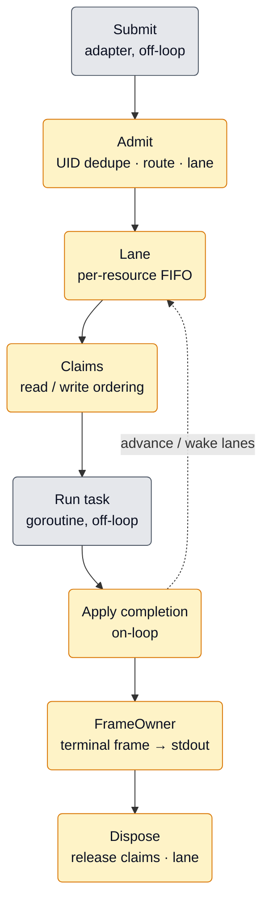
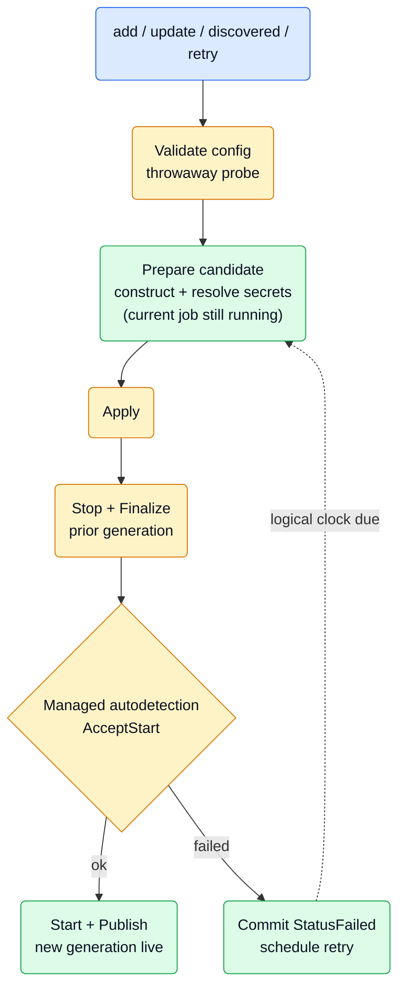
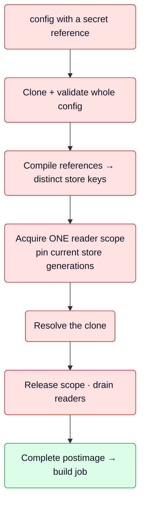
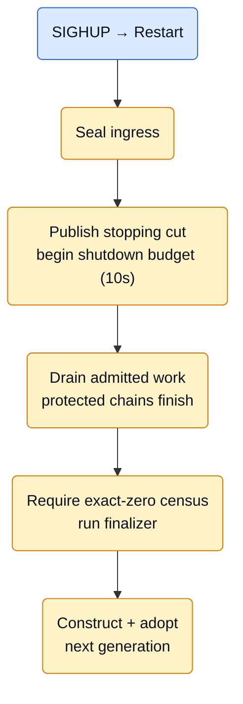

# Job Manager Architecture

This is a maintainer-oriented map of the Job Manager (`jobmgr`). It explains the
main runtime path and package boundaries as a top-to-bottom journey: the big
picture first, then the concurrency model, then how jobs, secrets, and vnodes
are handled, and finally the package layout and the deep invariants.

It intentionally leaves collector internals opaque. How a specific collector
walks SNMP, scrapes Prometheus, or renders charts lives in that collector and
the framework packages it uses; Job Manager only orchestrates their lifecycle.

## Short Version

Job Manager is the orchestration boundary for a Go data-collection plugin
process (`go.d`, `ibm.d`, `scripts.d`). It takes everything that wants to
start, stop, reconfigure, or query a collector job and turns it into an
ordered, safe stream of lifecycle commands run by **one single-threaded command
kernel**.

Three things can drive it:

- **Function calls** arriving on the plugin's stdin from the Netdata daemon —
  including dynamic configuration (DynCfg) commands to add / edit / enable /
  disable / test / remove jobs.
- **Discovery** — file configs and service discovery proposing jobs to run.
- **Autodetection retries** — jobs that failed to detect their target, retried
  later.

Everything a plugin writes back — metrics, charts, Function registrations,
config state, keepalives — leaves through **one serialized stdout writer**.

The whole process runs **one active "run generation"** at a time. A reload
(SIGHUP) rotates that generation cleanly without rebuilding the process itself.

## Where Job Manager Sits

Every plugin binary follows the same startup path.



- `cmd/*plugin/main.go` builds a `RunModePolicy`, registers discovery
  providers, and calls `agent.New`.
- `cmd/internal/agenthost/host.go` hosts one process-lifetime Agent and maps OS
  signals to acknowledged controls: **SIGHUP → `Restart`**, **SIGINT/SIGTERM →
  `Terminate`** (each bounded to 10s).
- `plugin/agent/agent.go` loads config and modules, then calls
  `composition.NewProcess` and `process.Run(ctx)`.

**Run modes** (`plugin/agent/policy/runmode.go`) flip a few gates:

- **Long-lived agent** (production, not a terminal): service discovery on,
  runtime charts on, discovered jobs wait for the daemon's enable command.
- **Terminal / debug** (attached to a TTY): service discovery off, runtime
  charts off, discovered jobs auto-enable so a developer sees output
  immediately.

## The Big Picture

Once running, Job Manager is a funnel: several sources of intent on the left,
one ordered kernel in the middle, one stdout stream on the right.



A useful mental split for the rest of this document:

- The **kernel** decides *what happens and in what order*.
- **Adapters** (`functions`, `joboutput`, `secrets`, `discovery`) know *how* to
  do the collector-specific work, behind narrow ports.
- **`lifecycle`** provides the neutral machinery the kernel delegates to
  (UID ownership, tasks, framing, and run control).
- **`composition`** wires them all together.

## The Concurrency Model

This is the core idea. Job Manager does almost no locking in its business
logic. Instead, **one goroutine — the `CommandKernel` run loop — owns all mutable
orchestration state** and is the only thing allowed to change it. Everything
else either hands work in over a channel or does blocking work off to the side
and reports back.

Think of an **air-traffic control tower with a single controller**:

- Aircraft (commands) queue on **runways** (lanes); one moves per runway at a
  time, in arrival order (FIFO).
- Before taxiing, a flight reserves **airspace corridors** (claims), always
  requested in the same order so two flights never deadlock waiting on each
  other.
- The controller never leaves the tower. **Pilots** (off-loop task goroutines)
  fly the actual missions and radio back completions. The controller only reads
  radios and updates the board.

### The command lifecycle



1. **Submit** (off-loop): an adapter validates a `Request`, attaches a prepared
   Job Manager plan or submits an unresolved Function request, pushes it onto a
   submission queue, and wakes the loop. `command_ports.go`,
   `kernel_ingress.go`.
2. **Admit** (on-loop): the loop dedupes the command's UID, resolves the route,
   derives the lane key, and installs the operation. Duplicate UIDs and invalid
   routes are rejected here. `kernel_admission.go`, `lifecycle/uid.go`.
3. **Lane**: same-resource commands share one FIFO lane; only the lane head
   runs while the lane is active. Different lanes advance independently.
4. **Claims**: cross-lane exclusion. Every claim is exclusive. Claims are
   acquired in a stable global key order and waiters are FIFO per key, so the
   design is deadlock-free and starvation-free.
   `claim_authority.go`.
5. **Run task** (off-loop): the actual blocking work — construct a collector,
   run autodetection, call a Function handler, stop a job — runs on a
   `TaskSupervisor` goroutine, never on the loop. `lifecycle/task.go`.
6. **Apply completion** (on-loop): the task radios its result back; the loop
   seals it and advances the lifecycle.
7. **Frame**: the terminal response is committed to stdout through `FrameOwner`.
8. **Dispose**: claims and the lane slot are released, waking any blocked lanes.

### Who owns what

- **On-loop (exclusive to the `CommandKernel` run loop):** every lane, operation, deadline, claim
  transition, and counter. The loop is the sole mutator. A test
  (`architecture_test.go`) even pins that on-loop actions are dispatched through
  the sanctioned kernel ownership funnel.
- **Off-loop:** the actual collector / Function / stop / cleanup work, run by
  `TaskSupervisor`. The loop and tasks talk only over channels.

### Two fairness rules worth knowing

- **`TaskSupervisor` runs two independent classes** — framework-control work
  (lifecycle/DynCfg commands) and generic Function work — in strict round-robin.
  One class can never starve the other, and there is **no fixed "N active
  Functions" cap**. `lifecycle/task.go`.
- **A timed-out task keeps its ownership.** If blocking work overruns its
  deadline, the kernel only *cooperatively* cancels it; its claims, lane, and
  resource authority stay held until it actually returns, because a late return
  could still mutate that resource. Repeated overruns escalate to a fail-stop.
  `kernel_disposal.go` and `kernel_runloop.go`.

Two more facts that catch newcomers:

- Lanes give per-resource *ordering*; **claims** give cross-resource *mutual
  exclusion*. Two independent lanes still serialize if they declare the same
  claim key.
- A resource-less Function call gets a **unique lane per invocation**, so
  concurrent calls to the same Function run in parallel — unless the resolved
  plan declares claims.
- DynCfg `config` prefix routes are **private catalog routes**, not Function
  publications. Netdata owns the global `config` Function that serves the tree
  and delegates per-config operations; go.d emits `CONFIG` object frames but
  never `FUNCTION GLOBAL "config"` or its withdrawal.

## How the Job Manager Manages Jobs

A **job** is one running collector instance: a module plus a resolved config.
Jobs are created from stock/user config files at startup, from discovery, or
from DynCfg commands, and are retried after a failed autodetection.

The central guarantee is that **reconfiguring a job never disrupts the running
one until the replacement is proven ready**. Think of a stage crew swapping
actors mid-play: the understudy is fully costumed and rehearsed offstage while
the current actor keeps performing; only on cue does the current actor exit,
and only then does the understudy audition live.



1. **Validate** — the config is checked with a short-lived throwaway module
   probe, so a bad config is rejected without touching the live job.
   `joboutput/config_factory.go`.
2. **Prepare (non-disruptive)** — the `Factory` looks up the module creator,
   resolves the config's secrets, builds a V1 or V2 collector, and hands back a
   *candidate* holding a long-lived resource permit. The current job keeps
   running.
   `joboutput/factory.go`, `joboutput/generation.go`.
3. **Apply** — the kernel stops and finalizes the prior generation, then calls
   `AcceptStart` on the candidate. `joboutput/transaction.go`.
4. **Managed autodetection** — the candidate runs its `Check`/autodetect *after*
   the old generation is gone. On success the job starts, publishes its
   Functions, and begins emitting. On a clean failure the graph is committed
   truthfully as `StatusFailed` (never a fake success) and a retry is scheduled.
5. **Emitting** — the collector writes protocol frames through a `FrameWriter`,
   which commits whole frames through the one `FrameOwner`.

### Job generations and fencing

Every job carries a monotonic **generation** number. A prepared candidate is
consumed only if its generation matches the accepting transaction, and output
flows only from the generation that has been accepted and started. This is how a
slow stop of an old job can never interleave its frames with a new one.

### V1 vs V2

Job Manager orchestrates both collector contracts identically; only the runtime
adapter differs (`joboutput/runtime_adapter.go`, `framework/jobruntime`):

- **V1** declares `Charts()` and returns `Collect() map[string]int64`.
- **V2** writes to a `metrix.CollectorStore`, supplies `ChartTemplateYAML()`
  (rendered by the chart engine), and is wired to the runtime service. Each V2
  scope owns its last successful host definition; the shared vnode registry
  only diagnoses conflicting metadata after successful output.

### Autodetection retries

Retries are deliberately cheap. There is **no timer or goroutine per job**.
Instead, one per-run map + heap + dispatcher owns all pending retries
(`joboutput/autodetection_retry.go`, `joboutput/scheduler.go`):

- The process's 1-second tick advances a **logical clock**.
- When an entry is due, the single run-owned dispatcher resubmits it as a
  restart through the ordinary command port — fire-and-forget — and keeps
  authority over that config/retry token until the resulting transaction
  settles.
- Success, replacement, disable, removal, or shutdown invalidates the token.

## Secrets

Secrets keep credentials out of collector configs. A config value can carry a
**reference** instead of a literal:

- `${store:kind:name:key}` — looked up in a SecretStore (Vault, AWS Secrets
  Manager, Azure Key Vault, GCP Secret Manager).
- `${env:...}`, `${file:...}`, `${cmd:...}` — resolved from the plugin
  process's own environment variables, files, or command output.

Resolution happens only in memory, only when a job is built. The key property
is that it is **atomic — all references resolve, or none do**. Picture a notary:
photocopy the whole document, list every blank, check out the referenced files
under one pass, fill every blank on the copy, check the files back in, and hand
back a fully-filled copy or nothing at all.



The resolver lives in `plugin/agent/secrets/resolver`; it never mutates the
input config and returns `nil` on any error, so a half-resolved config can never
reach a collector.

### Changing a store restarts its jobs

Backing stores are managed live over DynCfg (`add` / `update` / `remove`). The
store (`plugin/agent/secrets/secretstore`) keeps **numbered, immutable
generations** per `kind:name`:

1. A new generation is prepared *outside* publication, then committed by
   compare-and-swap against the expected generation.
2. If any running jobs depend on that store key, they are restarted as **one
   composite command** — stop dependents → commit the new generation → start
   dependents — all under the store's ordering/claim scope
   (`dyncfg:secretstores`), so nothing else mutates those jobs in between.
   `secrets/restart.go`, `secrets/transaction.go`.
3. The superseded generation is retired only after its last reader scope drains,
   so an in-flight resolution never sees credentials vanish mid-read.

## Vnodes (Virtual Nodes)

A single job often monitors many *remote* things — one job scraping 50
switches, or one cloud collector pulling hundreds of resources. Netdata wants
each to appear as its own **node** in the UI, with its own hostname and charts,
not collapsed under the agent's host. A **vnode** is a lightweight,
agent-declared "virtual host" (name, hostname, GUID, labels) that a job can
attribute its metrics to.

Think of **name badges at a conference**: the agent prints a batch up front and
can print more on demand. When a job reports a metric it wears a badge, so the
dashboard files it under that identity instead of "the agent."

- **Configured vnodes** are loaded from `vnodes/` config files at startup and
  passed once as `InitialVnodes` (`agent/setup.go` → `agent/agent.go` →
  `composition`). At startup they are published to the daemon as DynCfg config
  entries.
- **Runtime vnodes** can be added, edited, or removed live through a DynCfg
  vnode Function (`composition/vnodes.go`).
- The vnode authority (`discovery/vnode.go`) is **revision-versioned and
  live-merged**: a job's `vnode:` name is resolved against the current set of
  file-configured *and* runtime vnodes, not a frozen startup snapshot. The
  resolved snapshot is attached to the job so its runtime emits under that
  virtual host.
- A vnode cannot be removed while a job references it (`409`), and only
  runtime (DynCfg-sourced) vnodes are removable (`405`).

## Restart and Shutdown

Job Manager separates two lifetimes:

- **The process is the building.** Built once by `composition.NewProcess`, it
  survives every reload: the stdin reader, the one `FrameOwner`, the UID ledger,
  the frozen module registry, the secret resolver, the vnode registry, and the
  runtime metrics service.
- **The run generation is the current tenant.** A complete, self-contained
  occupant built by `composition/run.go`: the kernel and its loop, the task
  supervisor, the run supervisor, the DynCfg graph, the per-generation secret
  store, the Function catalog and publications, the job factory, the
  autodetection scheduler, and the `jobmgr.runtime` metrics.

A **SIGHUP reload evicts the whole tenant and moves a fresh one in without
touching the building.**



The rotation is an acknowledged sequence (`composition/process.go` `rotate`):

1. Seal stdin ingress so no new external command enters.
2. Publish the generation-bound **stopping cut**, close external command
   ingress, and start the single shutdown budget (default 10s).
3. Drain every ownership action admitted before the cut; work whose
   ownership-changing phase already started (accept/apply/stop chains) is
   allowed to finish to a provable disposition.
4. Withdraw Function publications, close the catalog, cancel and join inherited
   work, stop long-lived resources, and run the finalizer — all executed inside
   the kernel loop.
5. Require an **exact-zero authority census** (no active tasks, claims, permits,
   or retained frame bytes). Any leftover marks the run **dirty** and fails the
   handoff closed rather than silently proceeding.
6. Construct, start, and adopt the next generation.

**Termination** (SIGINT/SIGTERM) follows the same retirement path with no
successor. Collector work still blocked at process exit is considered safe
because process termination removes it; Job Manager does not add a second
unbounded shutdown mechanism around that.

## Runtime Metrics

In long-lived agent mode, one component — `jobmgr.runtime` — projects live
orchestration counts: admitted / active / rejected operations, active Function
invocations, claim keys and waiters, active and queued tasks, active jobs, frame
commits and failures, timeouts, panics, and dirty runs
(`composition/runtime_metrics.go`).

Mutation owners write metric-owned atomics; the producer only snapshots them —
it never reads kernel-private state. The component is registered before external
admission opens and unregistered (with a final projection) when its generation
retires, strictly before the successor re-registers, so no predecessor sample
crosses a reload.

## Package Map

| Package | Responsibility |
| --- | --- |
| `jobmgr` (root) | Command ports, the `CommandKernel` run loop, lanes, claims, composite child commands |
| `jobmgr/lifecycle` | Neutral authorities: UID, operation, task, frame, run, resource, transaction |
| `jobmgr/functions` | Function stdin ingress, routing catalog, handler generations, publication to Netdata |
| `jobmgr/joboutput` | Collector construction, job generations, output frames, DynCfg jobs, autodetection retries, vnode snapshots |
| `jobmgr/secrets` | Secret dependency index, store command adapter, dependent-restart transaction |
| `jobmgr/discovery` | Discovery add/remove decisions and the configured-vnode authority |
| `jobmgr/composition` | The only assembler; process construction and run-generation rotation |
| `framework/functions` | Passive Function values and the stdin input capsule |
| `framework/dyncfg` | The dynamic-configuration `Graph` |
| `framework/jobruntime` | V1 / V2 job runtime and host/vnode scope |
| `framework/vnoderegistry` | Post-success vnode owner/conflict registry |
| `agent/secrets/resolver` | Atomic config clone, reference compilation, scoped resolution |
| `agent/secrets/secretstore` | Frozen creator catalog and per-run store generations |
| `agent/discovery` | Provider catalog and the discovery pipeline generation |

### Dependency rules

The layering is enforced by `architecture_test.go`, not just convention:

- **`lifecycle` is neutral.** It imports no sibling, no adapter, and no Agent or
  collector package — only the standard library. Domain policy (which frame is
  a keepalive, when to go dirty) is supplied by the caller.
- **Adapters do not import each other.** `functions`, `joboutput`, `secrets`,
  and `discovery` may import the root command ports and `lifecycle`, but never a
  sibling adapter.
- **`composition` is the only assembler.** It is the single package allowed to
  join adapters, break construction cycles, and own the process/run-generation
  split.

`architecture_test.go` additionally checks the shipped-root/composition
construction boundary and that on-loop actions are dispatched only through the
sanctioned kernel funnel. Behavioral ownership guarantees belong in focused or
black-box tests rather than an exact private-type or source-file manifest.

## Where To Change Things

- Add or change a Function surface, routing, or publication:
  - `functions/` (catalog, controller, publication, protocol).
- Change how a collector job is built, started, stopped, or retried:
  - `joboutput/` (factory, generation, transaction, scheduler,
    autodetection_retry).
- Change secret reference syntax or resolution:
  - `agent/secrets/resolver`.
- Change how a secret store commits or restarts dependents:
  - `agent/secrets/secretstore` and `secrets/` (restart, transaction,
    dependency).
- Change discovery add/remove decisions or configured vnodes:
  - `discovery/` (decision, vnode) and `composition/{discovery,vnodes}.go`.
- Change the ordering model (lanes, claims, command acceptance, deadlines):
  - `kernel*.go`, `claim_authority.go`, and `lifecycle/`.
- Change how the process is assembled, reloaded, or shut down:
  - `composition/` (process, run, public).
- Change a package dependency or production construction boundary:
  - update the durable checks in `architecture_test.go` in the same change.

## Validation

Useful focused checks after changes:

```text
cd src/go
env GOCACHE=/tmp/netdata-go-build-cache go test -count=1 ./plugin/agent/jobmgr/...
env GOCACHE=/tmp/netdata-go-build-cache go test -race -count=1 ./plugin/agent/jobmgr/...
env GOCACHE=/tmp/netdata-go-build-cache go vet ./plugin/agent/jobmgr/...
```

Job Manager is concurrency-sensitive: the `-race` run is not optional for
changes to the kernel, claims, tasks, or the run/shutdown paths.

When a change touches shared framework code that Job Manager consumes
(`framework/jobruntime`, `metrix`, the chart engine), also build and test a
couple of representative real collectors so the change is proven against real
users, not only against Job Manager's own tests.
