# Job Manager Architecture

This is a maintainer-oriented guide to the Job Manager (`jobmgr`), written to be read top to bottom. It builds up in
four passes: where Job Manager sits, the machine that orders all work, the things that machine orchestrates, and how
the process restarts and shuts down. The reference tables at the end are for coming back later.

It intentionally leaves collector internals opaque. How a specific collector walks SNMP, scrapes Prometheus, or
renders charts lives in that collector and the framework packages it uses; Job Manager only orchestrates their
lifecycle.

**Path convention.** Code references are relative to `src/go/plugin/agent/jobmgr/`, except those starting with
`plugin/`, `cmd/`, or `pkg/`, which are relative to `src/go/`.

## Contents

**Orientation** — [Short Version](#short-version) | [Where Job Manager Sits](#where-job-manager-sits) |
[The Big Picture](#the-big-picture)

**The machine** — [The Concurrency Model](#the-concurrency-model) | [Process Containment](#process-containment)

**What it orchestrates** — [Jobs](#jobs) | [Secrets](#secrets) | [Vnodes](#vnodes-virtual-nodes) |
[Jobs With Dependencies](#jobs-with-dependencies) | [Service Discovery](#service-discovery) | [Functions](#functions)

**Process lifetime** — [Restart and Shutdown](#restart-and-shutdown) | [Runtime Metrics](#runtime-metrics)

**Reference** — [Package Map](#package-map) | [Where To Change Things](#where-to-change-things) |
[Validation](#validation)

## Short Version

Job Manager is the orchestration boundary for a Go data-collection plugin process (`go.d`, `ibm.d`, `scripts.d`). It
takes everything that wants to start, stop, reconfigure, or query a collector job and turns it into an ordered, safe
stream of lifecycle commands run by **one single-threaded command kernel**.

Three things can drive it:

- **Function calls** arriving on the plugin's stdin from the Netdata daemon — including dynamic configuration (DynCfg)
  commands to add / edit / enable / disable / test / remove jobs.
- **Discovery** — file configs and service discovery proposing jobs to run.
- **Autodetection retries** — jobs that failed to detect their target, retried later.

Everything a plugin writes back — metrics, charts, Function registrations, config state, keepalives — leaves through
**one serialized stdout writer**.

The whole process runs **one active "run generation"** at a time. A reload (SIGHUP) rotates that generation without
rebuilding the process when the rotation completes cleanly. If rotation cannot complete safely within its deadline,
the plugin exits successfully so the daemon starts a fresh process.

## Where Job Manager Sits

Every plugin binary follows the same startup path.

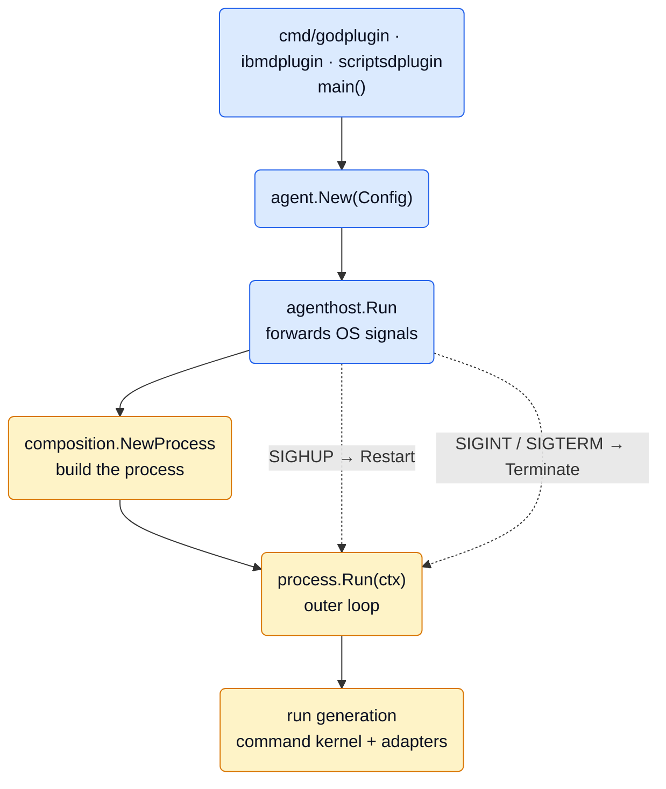
```mermaid
flowchart TD
    Plugin("cmd/godplugin · ibmdplugin · scriptsdplugin<br/>main()")
    New("agent.New(Config)")
    Host("agenthost.Run<br/>forwards OS signals")
    Proc("composition.NewProcess<br/>build the process")
    Run("process.Run(ctx)<br/>outer loop")
    Gen("run generation<br/>command kernel + adapters")

    Plugin --> New --> Host --> Proc --> Run --> Gen
    Host -. "SIGHUP → Restart" .-> Run
    Host -. "SIGINT / SIGTERM → Terminate" .-> Run

    classDef entry fill:#dbeafe,stroke:#2563eb,color:#0b1021;
    classDef core fill:#fef3c7,stroke:#d97706,color:#0b1021;
    class Plugin,New,Host entry;
    class Proc,Run,Gen core;
```

- `cmd/*plugin/main.go` builds a `RunModePolicy`, registers discovery providers, and calls `agent.New`.
- `cmd/internal/agenthost/host.go` hosts one process-lifetime Agent and maps OS signals to acknowledged controls:
  **SIGHUP → `Restart`** (30s), **SIGINT/SIGTERM → `Terminate`** (10s).
- `plugin/agent/agent.go` loads config and modules, then calls `composition.NewProcess` and `process.Run(ctx)`.

**Run modes** (`plugin/agent/policy/runmode.go`) flip a few gates:

- **Long-lived agent** (production, not a terminal): service discovery on, runtime charts on, discovered jobs wait for
  the daemon's enable command.
- **Terminal / debug** (attached to a TTY): service discovery off, runtime charts off, discovered jobs auto-enable so
  a developer sees output immediately.

## The Big Picture

Once running, Job Manager is a funnel: several sources of intent on the left, one ordered kernel in the middle, one
stdout stream on the right.

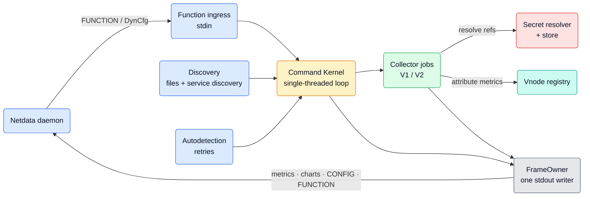
```mermaid
flowchart LR
    Daemon("Netdata daemon")
    Fn("Function ingress<br/>stdin")
    Disc("Discovery<br/>files + service discovery")
    Retry("Autodetection<br/>retries")
    Kernel("Command Kernel<br/>single-threaded loop")
    Jobs("Collector jobs<br/>V1 / V2")
    Secrets("Secret resolver<br/>+ store")
    Vnodes("Vnode registry")
    Frame("FrameOwner<br/>one stdout writer")

    Daemon -->|"FUNCTION / DynCfg"| Fn --> Kernel
    Disc --> Kernel
    Retry --> Kernel
    Kernel --> Jobs
    Jobs -->|"resolve refs"| Secrets
    Jobs -->|"attribute metrics"| Vnodes
    Jobs --> Frame
    Kernel --> Frame
    Frame -->|"metrics · charts · CONFIG · FUNCTION"| Daemon

    classDef ext fill:#dbeafe,stroke:#2563eb,color:#0b1021;
    classDef core fill:#fef3c7,stroke:#d97706,color:#0b1021;
    classDef job fill:#dcfce7,stroke:#16a34a,color:#0b1021;
    classDef sec fill:#fee2e2,stroke:#dc2626,color:#0b1021;
    classDef vn fill:#ccfbf1,stroke:#0d9488,color:#0b1021;
    classDef out fill:#e5e7eb,stroke:#4b5563,color:#0b1021;
    class Daemon,Fn,Disc,Retry ext;
    class Kernel core;
    class Jobs job;
    class Secrets sec;
    class Vnodes vn;
    class Frame out;
```

A useful mental split for the rest of this document:

- The **kernel** decides *what happens and in what order*.
- **Adapters** (`functions`, `joboutput`, `secrets`, `discovery`) know *how* to do the collector-specific work, behind
  narrow ports.
- **`lifecycle`** provides the neutral machinery the kernel delegates to (UID ownership, tasks, permits, framing, run
  control, and the shutdown budget).
- **`containment`** owns collector-derived work that may outlive a run because it does not cooperate with
  cancellation.
- **`composition`** wires them all together.

## The Concurrency Model

This is the core idea. Job Manager does almost no locking in its business logic. Instead, **one goroutine — the
`CommandKernel` run loop — owns all mutable orchestration state** and is the only thing allowed to change it.
Everything else either hands work in over a channel or does blocking work off to the side and reports back.

Think of an **air-traffic control tower with a single controller**:

- Aircraft (commands) queue on **runways** (lanes); one moves per runway at a time, in arrival order (FIFO).
- Before taxiing, a flight reserves **airspace corridors** (claims), always requested in the same order so two flights
  never deadlock waiting on each other.
- The controller never leaves the tower. **Pilots** (off-loop task goroutines) fly the actual missions and radio back
  completions. The controller only reads radios and updates the board.

### The command lifecycle

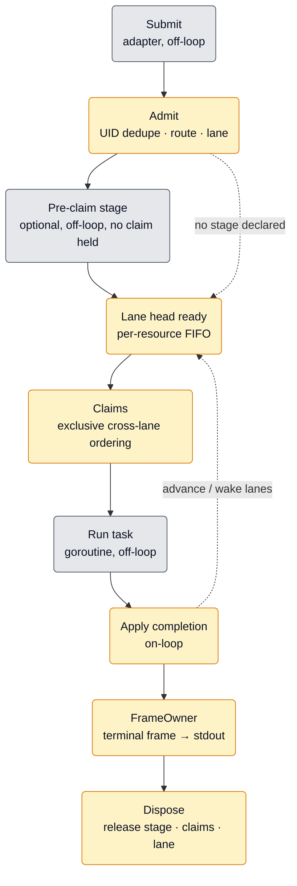
```mermaid
flowchart TD
    Submit("Submit<br/>adapter, off-loop")
    Admit("Admit<br/>UID dedupe · route · lane")
    Stage("Pre-claim stage<br/>optional, off-loop, no claim held")
    Lane("Lane head ready<br/>per-resource FIFO")
    Claim("Claims<br/>exclusive cross-lane ordering")
    Task("Run task<br/>goroutine, off-loop")
    Complete("Apply completion<br/>on-loop")
    Frame("FrameOwner<br/>terminal frame → stdout")
    Dispose("Dispose<br/>release stage · claims · lane")

    Submit --> Admit --> Stage --> Lane --> Claim --> Task --> Complete --> Frame --> Dispose
    Admit -. "no stage declared" .-> Lane
    Complete -. "advance / wake lanes" .-> Lane

    classDef offloop fill:#e5e7eb,stroke:#4b5563,color:#0b1021;
    classDef onloop fill:#fef3c7,stroke:#d97706,color:#0b1021;
    class Submit,Stage,Task offloop;
    class Admit,Lane,Claim,Complete,Frame,Dispose onloop;
```

1. **Submit** (off-loop) — an adapter validates a `Request`, attaches a prepared Job Manager plan or submits an
   unresolved Function request, pushes it onto a submission queue, and wakes the loop. `command_ports.go`,
   `kernel_ingress.go`.
2. **Admit** (on-loop) — the loop dedupes the command's UID, resolves the route, derives the lane key, and installs
   the operation on its lane. Duplicate UIDs and invalid routes are rejected here. `kernel_admission.go`,
   `lifecycle/uid.go`.
3. **Pre-claim stage** (off-loop, optional) — see [below](#pre-claim-staging). The operation sits queued on its lane
   and holds **no claim** while process-owned preparation runs.
4. **Lane** — same-resource commands share one FIFO lane; only the lane head runs while the lane is active. Different
   lanes advance independently.
5. **Claims** — cross-lane exclusion; see [below](#lanes-versus-claims).
6. **Run task** (off-loop) — cooperative run-owned work executes through `TaskSupervisor`; collector-derived work that
   may ignore cancellation executes through the process containment authority. Neither executes on the kernel loop.
   `lifecycle/task.go`, `containment/authority.go`.
7. **Apply completion** (on-loop) — the task radios its result back; the loop seals it and advances the lifecycle.
8. **Frame** — the terminal response is committed to stdout through `FrameOwner`.
9. **Dispose** — the stage, the claims, and the lane slot are released, waking any blocked lanes.

### Lanes versus claims

The two are easy to confuse, and they solve different problems.

| | Lanes | Claims |
| --- | --- | --- |
| Guarantee | Per-resource **ordering** (FIFO) | Cross-resource **mutual exclusion** |
| Granularity | One lane per resource identity | One key per shared authority, e.g. `dyncfg:jobs` |
| Effect | Same-resource commands never interleave | Two independent lanes still serialize if they declare the same key |

Claim rules:

- Every claim is exclusive; there are no shared/read modes.
- Claims are acquired in a **stable global key order**, so the design is deadlock-free.
- Waiters are **FIFO per key**, so the design is starvation-free.
- `claim_authority.go`.

Two consequences worth remembering:

- A resource-less Function call gets a **unique lane per invocation**, so concurrent calls to the same Function run in
  parallel — unless the resolved plan declares claims. `command_ports.go`.
- Declaring a claim is how an adapter opts into serialization it cannot express with a lane.

### Pre-claim staging

Some preparation is slow, and some of it is collector-authored code that may ignore cancellation. Running it while
holding `dyncfg:jobs` would stall unrelated jobs. A plan may therefore declare a `PreClaimStage` (`kernel_plan.go`,
`kernel_stage.go`):

- **When it starts** — at admission, immediately after the operation is queued on its lane.
- **What it holds** — nothing. No claim has been acquired yet.
- **How the kernel waits** — the lane head is not marked ready while the stage is pending; `Ready()` closing wakes it.
- **Who owns the work** — the process containment authority, not the run, so a non-cooperative worker cannot pin the
  kernel or the run generation.
- **Cleanup** — disposal calls `Release()`; cancellation and deadlines call `Cancel(cause)` first.
  `kernel_disposal.go`.

### Yielding a claim during preparation

Staging solves the problem before claims are taken. The mirror-image mechanism handles preparation that must happen
*inside* a transaction that already holds claims (`claim_yield.go`, `claim_yield_kernel.go`):

- **What is yielded** — only the transaction's *acquisition-suffix* claim, and only while bounded preparation runs. It
  must be reacquired before preparation completes.
- **Why it is still safe** — the transaction's resource lane stays active, so another command for the same resource
  cannot overlap the yielded work.
- **Priority** — reacquisition outranks ordinary waiters on that key.
- **Composite parents** — a composite declares the resource lanes its children may use. If one conflicts with an
  active yielder, the parent is parked *before* it acquires any claim; an already-waiting parent releases its prefix
  claims but retains its original ticket. Unrelated work stays serviceable on the otherwise-free claim, which prevents
  both child/lane cycles and head-of-line blocking.
- **Children of a running composite** — when such a child yields, only the matching admission-fence claim is
  suspended; the parent's other claims remain held.

Which mechanism each command surface uses:

| Command surface | Mechanism | Declared in |
| --- | --- | --- |
| SecretStore DynCfg `add` / `update` / `test` / `remove` | Pre-claim stage | `composition/secret_adapter.go` |
| Retained pending SecretStore retry | Pre-claim stage | `secrets/pending.go` |
| Collector job DynCfg `add` / `update` / `enable` / `restart` / `disable` / `remove` | Claim yield on `dyncfg:jobs` | `composition/dyncfg.go` |
| Discovered job reconciliation and autodetection retry | Claim yield on `dyncfg:jobs` | `joboutput/discovery.go` |
| Dependent-restart children of a Store change | Claim yield on `dyncfg:jobs` | `joboutput/secret_restart.go` |

### Who owns what

- **On-loop (exclusive to the `CommandKernel` run loop)** — every lane, operation, deadline, claim transition, and
  counter. The loop is the sole mutator. `architecture_test.go` pins that on-loop actions are dispatched through the
  sanctioned kernel ownership funnel.
- **Run-owned off-loop** — cooperative tasks and permits belong to one run generation and must drain before that run
  can quiesce.
- **Process-owned off-loop** — contained attempts own their physical worker, per-identity exclusion, and final cleanup
  across run rotation.

### Fairness and timeout rules

- **`TaskSupervisor` runs two independent classes** — framework-control work (lifecycle/DynCfg commands) and generic
  Function work — in strict round-robin. One class can never starve the other, and there is **no fixed "N active
  Functions" cap**. `lifecycle/task.go`.
- **An ordinary timed-out run task keeps run ownership.** The kernel only cooperatively cancels it; its claims, lane,
  and resource authority stay held until it returns, and repeated overruns can escalate to fail-stop.
- **A contained attempt keeps process ownership instead.** Its caller, claims, and run may settle after the
  containment cut because late output and mutation cannot escape the process-owned attempt boundary. The physical
  worker may still finish state private to that attempt; the boundary prevents publication, re-entry, or reuse until
  physical release.

## Process Containment

Go cannot forcibly stop a goroutine. A collector's `Check` can block forever on a socket; a provider's `Init` can
ignore its context. Job Manager therefore separates **logical settlement** (the caller stops waiting) from **physical
release** (the goroutine actually returns).

`process_attempt.go` declares the contract; `containment/authority.go` implements it.

- `StartProcessAttempt` checks caller cancellation while holding the identity-registry mutex. A successful claim
  linearizes at that snapshot: later cancellation follows the caller's normal post-start lifecycle. The caller context
  gates admission only; the worker receives an independent process-owned context.
- `SupersedeProcessAttempt` targets the owner observed during its locked registry snapshot. Its success confirms that
  owner released; it does not reserve the identity against a later successor, so the subsequent start remains
  authoritative.

### The attempt state machine

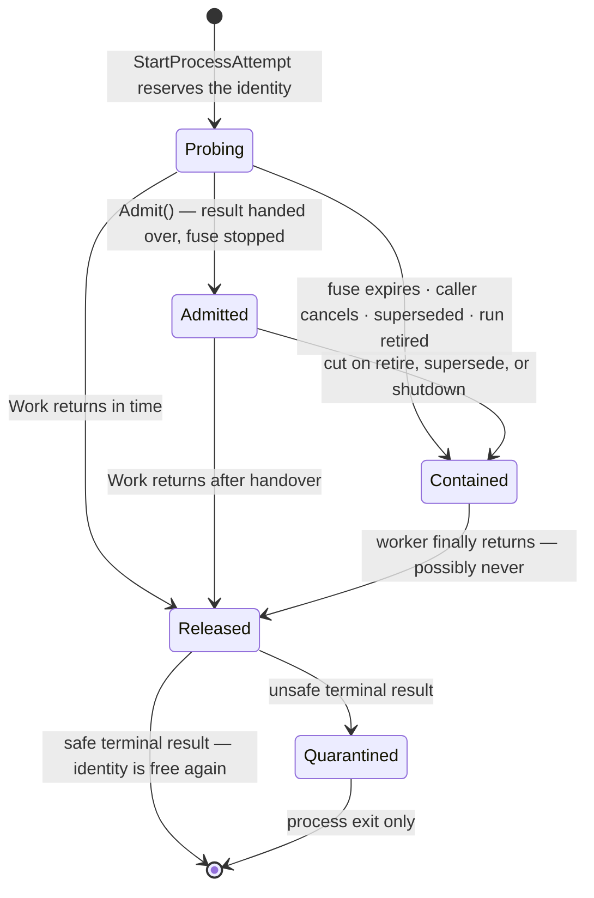
```mermaid
stateDiagram-v2
    [*] --> Probing: StartProcessAttempt reserves the identity
    Probing --> Admitted: Admit() — result handed over, fuse stopped
    Probing --> Released: Work returns in time
    Admitted --> Released: Work returns after handover
    Probing --> Contained: fuse expires · caller cancels · superseded · run retired
    Admitted --> Contained: cut on retire, supersede, or shutdown
    Contained --> Released: worker finally returns — possibly never
    Released --> [*]: safe terminal result — identity is free again
    Released --> Quarantined: unsafe terminal result
    Quarantined --> [*]: process exit only
```

- **Probing** — the attempt is producing a result and is bounded by the fuse.
- **Admitted** — the attempt has handed its result to the caller and now *holds* something (a running collector loop,
  a prepared Store mutation, a built Function bundle) until the caller decides.
- **Contained** — logically settled and cancelled; late effects cannot escape the attempt boundary. The worker may
  still finish private state and remains physically running.
- **Released** — `Work` and its cleanup returned. Only now is the identity admissible again.
- **Quarantined** — the physical work returned, but its terminal outcome made the identity unsafe to reuse. The
  quarantine is process-lifetime state, not an active attempt, and only process exit clears it.

`Census` reports these counts exactly (`Active`, `Probing`, `Admitted`, `Contained`, `Quarantined`). Containment is
loud and success is quiet: entering `Contained`, releasing a contained worker, quarantining an identity, and a worker
panic each emit a diagnostic event, while an attempt that admits or returns in time emits none. In long-lived mode,
`jobmgr.runtime` also projects the current census as aggregate process-attempt gauges.

Containment fences execute synchronously before settlement becomes visible. They stay under the authority lock to
preserve that ordering, but cross a panic boundary: a panic is redacted as `ErrProcessAttemptFencePanic`, joined with
the original cut cause, and cannot strand the authority mutex.

Terminal outcomes quarantine an identity when an admitted worker fails, ownership remains retained, the worker
panics, or the containment fence panics. Ordinary pre-admission validation failures release the identity normally.

### What the fuse actually bounds

This is the subtlety that catches everyone:

- `DefaultFuse` (**2 minutes**) bounds **producing** a result, not **holding** one.
- `Admit()` atomically stops that fuse while keeping the identity occupied, so long-lived contained work is
  deliberately unbounded. An installed collector runtime that runs for weeks is a normal *admitted* attempt.
- `DefaultSupersessionGrace` (**2 seconds**) is how long a replacement waits for the previous owner of the same
  identity to release before it reports busy.

Who admits, and who does not:

| Attempt | Admits when | Effect |
| --- | --- | --- |
| Job candidate | Construction, `Init`, and `Check` succeeded | Holds the staged candidate until install or reject |
| Installed job runtime | Immediately | The managed collector loop is the held resource |
| Module Function bundle | Bundle built and containment-bound | Holds the plan until the transfer decision |
| SecretStore operation | Validation or mutation prepared | Holds the mutation until commit or abort |
| Service-discovery Function | Opaque callback returned, before result publication | Keeps the callback fuse-bounded; terminal failures quarantine the binding |
| Function availability poll | Never | Stays fuse-bounded |
| Function invocation | Never | Stays fuse-bounded |

`joboutput/candidate_stage.go`, `functions/module_stage.go`, `secrets/store_stage.go`, `functions/bundle.go`,
`composition/service_discovery.go`.

### What the caller sees

- Caller cancellation is propagated first; crossing the fuse or the supersession grace settles the caller and fences
  late results.
- The authority retains the worker and everything it owns until its complete cleanup returns, or until the plugin
  process exits.
- **Persistent** file/discovery state keeps only its latest desired replacement and retries after identity release.
- SecretStore add/update requests, including DynCfg, retain only their latest desired config after retryable
  contention and apply it after the identity releases.
- Other **synchronous** DynCfg requests are not retained or retried after a busy/contained response. Cancellation
  prevents queued service-discovery mutations from starting; it does not roll back work that already began while its
  request context was live.

### No process-wide slot limit

There is intentionally no cap on concurrent attempts: one permanently stuck identity must not block an unrelated job.
The trade-off is explicit — distinct permanently stuck identities can accumulate retained workers, and diagnostics
report that state (including a bounded sample of retained identities at shutdown).

### Namespaces

An identity is a namespace plus a key; at most one physical attempt exists per identity, and unrelated identities
remain independently admissible.

| Namespace | Owns | Key shape |
| --- | --- | --- |
| `job` | Candidate preparation: clone, secret resolution, construction, `Init`, `Check` | digest of canonical job `FullName` |
| `job-runtime` | The installed collector's managed loop, `Stop`, and cleanup | same job-name digest in its own namespace |
| `job-test` | One DynCfg `test` of a raw job config | digest of operation + name + config hash |
| `store` | SecretStore validation and generation preparation | digest of epoch + `kind:name` |
| `store-test` | One DynCfg `test` of a SecretStore config | digest of epoch + `kind:name` + config hash |
| `function-bundle` | An agent-level module's Function handler bundle plan | digest of agent scope + module |
| `function-poll` | One Function availability poll | bundle key |
| `function-invocation` | One Function invocation | bundle key + invocation id |
| `service-discovery` | One service-discovery Function binding invocation | digest of epoch + plugin |

Test identities are derived from the raw config and exist only in memory, so an identical repeated `test` returns busy
instead of multiplying workers.

Attempt keys are built so a long or hostile name cannot exceed containment's internal identity bounds:

- Every variable component passes through domain-separated, length-framed fields and a fixed-size digest. Function
  invocations append only a bounded counter to that digest.
- Public job, Store, module, and service-discovery names are therefore preserved without bound risk.
- Diagnostics keep safe short names, and fall back to bounded generic labels for oversized, invalid-UTF-8, or
  control-bearing values.
- Graph IDs, lane keys, config IDs, and wire-visible names are **unchanged** by this hashing.

## Jobs

A **job** is one running collector instance: a module plus a resolved config. Jobs are created from stock/user config
files at startup, from discovery, or from DynCfg commands, and are retried after a failed autodetection.

### The config validation boundary

External configuration is untrusted batch input. Production producers validate successfully decoded entries against
the exact downstream contracts **before** process construction or WorkPlan submission:

- the vnode file loader and DynCfg vnode adapter validate CONFIG identity and source fields, host-emission metadata,
  daemon-compatible UUID syntax, and semantic hostname/GUID uniqueness;
- the secret-store file loader validates each fully stamped config, including kind type and provider support, before
  passing accepted entries to a run generation;
- discovered collector proposals validate their final CONFIG job name and source metadata before graph mutation.

Failure granularity is deliberate:

| Input problem | Consequence |
| --- | --- |
| Invalid decoded file entry | Reported and skipped |
| YAML structural/type error | May reject its containing file, without stopping Job Manager |
| Invalid dynamic proposal | Typed proposal rejection quarantines that exact config revision; lower-priority and sibling proposals continue |

Strict constructor/controller checks remain as defensive invariant enforcement: programmatic state that bypasses a
production producer is still rejected rather than silently normalized or recovered after admission.

### Configuration source ownership

Go plugin configurations use one source order: **DynCfg > user > discovered > stock > internal/unknown**.

The order is shared, but there is no single generic "configuration manager." Each domain applies the order at the
boundary that owns its lifecycle:

| Configuration domain | Identity | Where the winner is enforced |
| --- | --- | --- |
| Collector job | canonical `FullName` (module + job name) | discovery selection, then again before the collector graph changes |
| SecretStore | exposed `kind:name` | initial/pending selection and the Store generation transaction |
| Service discovery | exposed config key | before materialization and pipeline start |
| Configured vnode | vnode name | startup files seed the live registry; a DynCfg upsert replaces that name |

This distinction matters. Collector-job retries and fallback rules do not implicitly apply to SecretStores,
service-discovery pipelines, or vnodes. Configured vnodes do not keep a stack of competing candidates: file config
seeds the registry, a DynCfg upsert replaces that name, and removing the DynCfg vnode does not reveal the old file
value.

A plugin-side DynCfg `add` is replay/upsert-capable because the daemon uses it to restore persisted configurations.
Ordinary user duplicate adds remain create-only at the daemon boundary. Removal targets only the current DynCfg
override and does not immediately reactivate a masked lower-priority source.

### Collector source-priority event flow

One collector-job identity has one selected desired configuration. A lower source may remain known to discovery while
a higher source owns the graph, but it is not allowed to probe or run.

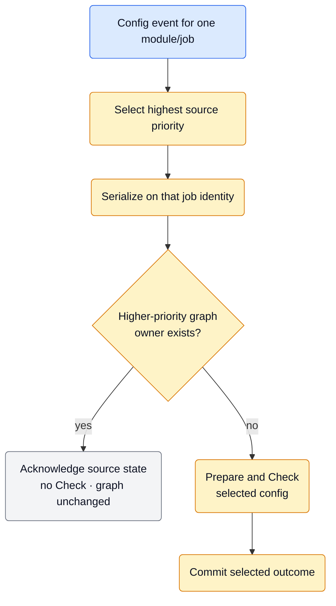
```mermaid
flowchart TD
    Event("Config event for one module/job")
    Select("Select highest source priority")
    Lane("Serialize on that job identity")
    Recheck{"Higher-priority graph<br/>owner exists?"}
    Noop("Acknowledge source state<br/>no Check · graph unchanged")
    Probe("Prepare and Check<br/>selected config")
    Commit("Commit selected outcome")

    Event --> Select --> Lane --> Recheck
    Recheck -->|"yes"| Noop
    Recheck -->|"no"| Probe --> Commit

    classDef ext fill:#dbeafe,stroke:#2563eb,color:#0b1021;
    classDef core fill:#fef3c7,stroke:#d97706,color:#0b1021;
    classDef quiet fill:#f3f4f6,stroke:#6b7280,color:#0b1021;
    class Event ext;
    class Select,Lane,Recheck,Probe,Commit core;
    class Noop quiet;
```

Common event sequences:

| Event | Outcome |
| --- | --- |
| DynCfg config is checking; a lower source arrives | Work for that job identity is serialized. If DynCfg establishes graph ownership, the lower reconciliation becomes a no-op before `Check`. |
| Higher source is `Accepted`, `Running`, `Failed`, or `Disabled` | Its graph record still owns the identity. A lower source cannot replace it merely because it is not running. |
| Higher proposal is invalid or rejected before graph mutation | It never becomes the owner. That exact source revision is skipped until its record changes, and the selected valid lower source may proceed in the same reconciliation. |
| An acknowledged source publishes a rejected replacement | The incumbent remains the graph owner against same/lower sources while that authoritative source still has a record. A strictly higher valid source may replace it; a real removal of the incumbent source may remove it. |
| A stale pending attempt or retry becomes runnable | It revalidates the source winner, desired config, token, and graph state. If any changed, it becomes a no-op. |
| DynCfg `test` runs | It uses a separate, memory-only attempt identity. It never owns the graph and never masks another source. |
| DynCfg override is removed | The override and its runtime, if running, are removed. A masked lower source is **not** activated automatically; it needs a later source-state transition that produces a new reconciliation. An unchanged masked candidate is not installed merely because DynCfg disappeared. |

Here, "no-op" means **do not execute the collector**. Discovery may still remember the lower candidate as source
state.

`plugin/framework/confgroup/config.go`, `discovery/decision.go`, `joboutput/discovery.go`, `joboutput/pending_job.go`.

### Candidate lifecycle

Two different guarantees apply during replacement:

- **While the candidate is preparing and probing, the incumbent keeps running.**
- **After a valid selected candidate settles, the selected desired state wins.** Success installs it; a transient
  construction failure or probe failure retires the incumbent and commits the source-specific `Failed` or removed
  outcome.

A proposal rejected before it establishes desired state, or an attempt that cannot start because its physical identity
is still busy, leaves the incumbent unchanged. Persistent sources retain only their latest desired retry; a
synchronous DynCfg command reports busy and is not applied later.

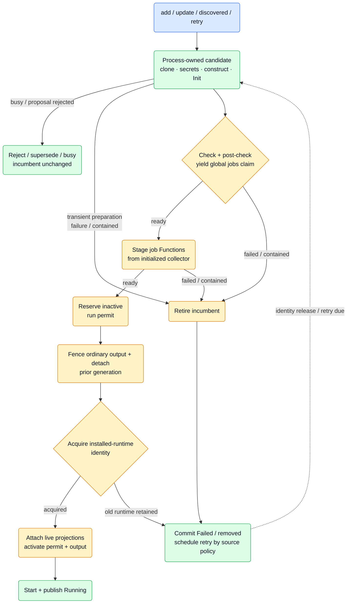
```mermaid
flowchart TD
    Cmd("add / update / discovered / retry")
    Stage("Process-owned candidate<br/>clone · secrets · construct · Init")
    AutoD{"Check + post-check<br/>yield global jobs claim"}
    Functions("Stage job Functions<br/>from initialized collector")
    Keep("Reject / supersede / busy<br/>incumbent unchanged")
    Reserve("Reserve inactive<br/>run permit")
    Retire("Fence ordinary output + detach<br/>prior generation")
    Promote{"Acquire installed-runtime<br/>identity"}
    Attach("Attach live projections<br/>activate permit + output")
    Live("Start + publish Running")
    RetireFailed("Retire incumbent")
    Fail("Commit Failed / removed<br/>schedule retry by source policy")

    Cmd --> Stage
    Stage -->|"busy / proposal rejected"| Keep
    Stage -->|"transient preparation<br/>failure / contained"| RetireFailed
    Stage --> AutoD
    AutoD -->|"ready"| Functions
    Functions -->|"ready"| Reserve --> Retire --> Promote
    Functions -->|"failed / contained"| RetireFailed
    Promote -->|"acquired"| Attach --> Live
    AutoD -->|"failed / contained"| RetireFailed --> Fail
    Promote -->|"old runtime retained"| Fail
    Fail -. "identity release / retry due" .-> Stage

    classDef ext fill:#dbeafe,stroke:#2563eb,color:#0b1021;
    classDef core fill:#fef3c7,stroke:#d97706,color:#0b1021;
    classDef job fill:#dcfce7,stroke:#16a34a,color:#0b1021;
    class Cmd ext;
    class AutoD,Functions,Reserve,Retire,RetireFailed,Promote,Attach core;
    class Stage,Keep,Live,Fail job;
```

1. **Stage config** — validation, DynCfg `test`, and configuration rendering run as contained operations. A same-job
   validation supersedes the prior candidate; an identical DynCfg test has its own raw-config-derived, memory-only
   identity and returns busy rather than multiplying workers. `joboutput/config_stage.go`.
2. **Prepare candidate (non-disruptive)** — the process authority reserves the canonical `job` identity before cloning
   and secret resolution, then owns collector construction, configuration application, `Init`, `Check`, post-check
   validation, Function staging, and rejection cleanup. Function staging runs only after `Init` and `Check` succeed,
   because instance handlers may be initialized by those callbacks. The candidate has inactive output and private V2
   runtime/vnode staging, but no run permit and no live run service. **The incumbent keeps running.**
   `joboutput/candidate_stage.go`, `joboutput/runtime_staging.go`.
3. **Settle autodetection** — caller cancellation is propagated and the transaction temporarily yields the global
   `dyncfg:jobs` claim.
   - The process-owned fuse bounds logical waiting even if the collector never returns, and late success cannot be
     admitted after a cut.
   - A normal detection failure commits `StatusFailed`. A busy/contained persistent source retains only its latest
     desired retry; synchronous DynCfg returns a retryable error instead.
   - **One bad collector cannot dirty Job Manager.** A normal `Init`, `Check`, validation, or Function-staging failure
     is isolated to that candidate once rejection cleanup completes. Only a *failed or unprovable* cleanup retains
     process ownership and fails the run closed.
4. **Reserve and retire** — only a timely successful candidate is wrapped in an inactive run permit. Replacement then
   fences the incumbent's ordinary output and detaches its run projections immediately; its physical managed loop,
   `Stop`, Function drain, and collector cleanup remain process-owned until they return.
5. **Promote, attach, and start** — the candidate acquires the separate `job-runtime` identity only after logical
   retirement. Candidate `Init`/`Check` may overlap the incumbent, but two installed runtimes for one job cannot.
   - After promotion the staged runtime/vnode/Function projections attach, the permit and output gate activate, and
     the managed loop starts.
   - The resource transaction owns this successor until installation acknowledgement. An apply failure aborts it when
     possible, or returns the still-live retained generation to the kernel for fail-closed ownership.
   - If the old runtime does not release within the supersession grace, the candidate is rejected and the
     source-specific busy/pending policy applies.

   Rotation interacts with this step deliberately. Rotation cuts run-target attempts *before* draining the run, so a
   non-cooperative startup cannot consume the reload budget:

   | When the cut arrives | Result |
   | --- | --- |
   | Before installation reservation | The transaction aborts the pending generation and graph mutation, then returns the exact unchanged/removed disposition |
   | After reservation begins | Retirement cannot invalidate the short internal commit; run shutdown retires the installed generation afterward |

   Only a pure target-retired/process-stopped error tree counts as normal cancellation. Any mixed, cleanup, graph,
   panic, or ownership error stays fail-closed.
6. **Emit** — installation activates the generation output gate. Two capabilities exist, and both serialize whole
   frames through the process's one `FrameOwner` (`joboutput/output_gate.go`):
   - **Ordinary collection output** is run-owned. Retirement permanently fences it before detaching projections, so a
     retained old runtime cannot interleave late collection frames with its successor.
   - **Accepted V1/V2 cleanup output** is process-owned, because physical cleanup may outlive a rotation. It emits
     terminal chart-obsoletion frames only after the managed loop and Function handlers physically quiesce.
   - The `job-runtime` identity stays occupied through cleanup, so a same-job successor cannot start before those
     terminal frames complete.

### Job generations and fencing

Every job carries a monotonic **generation** number, and a staged result is consumed only by the matching transaction
and run epoch. Three fences enforce that:

- **The process-owned attempt target** rejects late work from a retired run.
- **The per-generation output gate** allows ordinary frames only after installation, and fences them at logical
  retirement.
- **The accepted-cleanup capability** is process-owned rather than run-owned, because physical cleanup may outlive a
  rotation. Process termination fences it terminally before finalizing the output service, suppressing cleanup that
  arrives after the bounded shutdown budget.

### V1 vs V2

Job Manager orchestrates both collector contracts identically; only the runtime adapter differs
(`joboutput/runtime_adapter.go`, `plugin/framework/jobruntime`):

- **V1** declares `Charts()` and returns `Collect() map[string]int64`.
- **V2** writes to a `metrix.CollectorStore`, supplies `ChartTemplateYAML()` (rendered by the chart engine), and is
  wired to the runtime service. Each V2 scope owns its last successful host definition; the shared vnode registry only
  diagnoses conflicting metadata after successful output.

### Autodetection retries

Retries are deliberately cheap. There is **no timer or goroutine per job**. Instead, one per-run map + heap +
dispatcher owns all pending retries (`joboutput/autodetection_retry.go`, `joboutput/scheduler.go`):

- The process's 1-second tick advances a **logical clock**.
- When an entry is due, the single run-owned dispatcher resubmits it as a restart through the ordinary command port —
  fire-and-forget — and keeps authority over that config/retry token until the resulting transaction settles.
- A busy identity coalesces into one pending retry. Success, replacement, disable, removal, or shutdown invalidates or
  replaces the token.

## Secrets

Secrets keep credentials out of collector configs. A config value can carry a **reference** instead of a literal:

- `${store:kind:name:key}` — looked up in a SecretStore (Vault, AWS Secrets Manager, Azure Key Vault, GCP Secret
  Manager).
- `${env:...}`, `${file:...}`, `${cmd:...}` — resolved from the plugin process's own environment variables, files, or
  command output.

Resolution happens only in memory, only when a job is built. The key property is that it is **atomic — all references
resolve, or none do**. Picture a notary: photocopy the whole document, list every blank, check out the referenced
files under one pass, fill every blank on the copy, check the files back in, and hand back a fully-filled copy or
nothing at all.

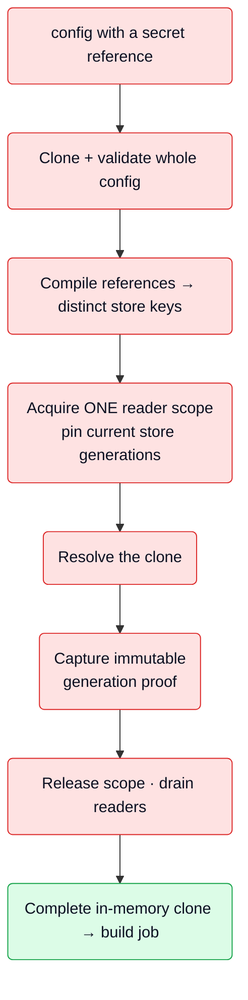
```mermaid
flowchart TD
    Ref("config with a secret reference")
    Clone("Clone + validate whole config")
    Compile("Compile references → distinct store keys")
    Scope("Acquire ONE reader scope<br/>pin current store generations")
    Resolve("Resolve the clone")
    Proof("Capture immutable<br/>generation proof")
    Release("Release scope · drain readers")
    Post("Complete in-memory clone → build job")

    Ref --> Clone --> Compile --> Scope --> Resolve --> Proof --> Release --> Post

    classDef sec fill:#fee2e2,stroke:#dc2626,color:#0b1021;
    classDef job fill:#dcfce7,stroke:#16a34a,color:#0b1021;
    class Ref,Clone,Compile,Scope,Resolve,Proof,Release sec;
    class Post job;
```

The resolver lives in `plugin/agent/secrets/resolver`; it never mutates the input config and returns `nil` on any
error, so a half-resolved config can never reach a collector.

### Redaction after a secret is applied

Once a configuration containing secret references has been applied to a collector, two layers scrub its errors:

- **At the Job Manager boundary** — lifecycle failures are replaced with a generic redacted error before they are
  logged or published.
- **Inside the collector's own logger** — messages and newly attached attributes are sanitized, so an internally
  logged request error cannot bypass the runtime boundary.

What survives redaction: cancellation, DynCfg code/retryability, panic classification, and retained-ownership state.
What does not: the raw collector cause.

### Changing a store restarts its jobs

Backing stores are managed live over DynCfg (`add` / `update` / `remove`). The store
(`plugin/agent/secrets/secretstore`) keeps **numbered, immutable generations** per `kind:name`. Each run receives a
fresh Store epoch, but the process owns that epoch's preparations, generations, and reader scopes
(`composition/secret_epoch.go`).

1. **Prepare outside publication.** Provider construction, configuration, and `Init` always run as a process-owned
   contained attempt, never inside the transaction that publishes the result. Only *where* that attempt is driven
   differs — at startup every initial Store starts its own attempt up front and the controller waits for all of them
   at one aggregate barrier before submitting any publish command (`secrets/initial.go`), while DynCfg commands and
   retained retries drive it as a pre-claim stage so the command holds no claim while it prepares
   (`secrets/store_stage.go`, `secrets/pending.go`). The prepared generation is then committed by compare-and-swap
   against the expected generation.
   - A DynCfg `test` creates the same temporary configured Store but never publishes it. If the Store implements
     `dyncfg.Testable`, its context-aware operational check runs inside the test's config-hash-specific contained
     attempt. The shared Store Test boundary rejects caller cancellation before temporary construction and makes its
     cause take precedence after configuration/`Init` and after the optional provider Test callback. Providers classify
     their configured timeouts but need not repeat caller cancellation checks.
   - A Store without that optional capability remains configuration-valid, and the response explicitly says that the
     result was validation-only. Configuration failures return 400, operational failures return 422, and
     busy/contained attempts return 503.
   - Provider failures retain their private causes. A marked `dyncfg.PublicError` may append only static,
     code-authored detail to Test 400/422 and add/update preparation 400 responses; unmarked failures remain generic,
     and every rendered SecretStore operator message stays within the existing 4 KiB bound.
   - Vault performs one real authenticated `GET /v1/auth/token/lookup-self` through the same token, namespace, client,
     TLS/proxy, timeout, and cancellation path used for secret resolution. HTTP 200 is operational success by status; its
     body is not inspected. An exact permission-only HTTP 403 body returns `dyncfg.ErrTestUnsupported` and becomes explicit
     validation-only success because the response cannot reliably prove token validity across Vault versions and
     authentication restrictions. Invalid-token, ambiguous, malformed, or oversized HTTP 403 bodies fail, as does every
     other status. The Test reads no secret and does not prove secret-path permission, that Vault accepted the token, or
     that an intermediary preserved the namespace header. It buffers at most 1 MiB plus one size-detection byte of a
     classified 403 body. When the request reaches Vault, it creates audit/activity evidence and can consume the final use
     of a limited-use service token. Vault token files use the shared regular-file-only 1 MiB configured-file reader.
   - AWS Secrets Manager Test calls the exact production credential-source dispatcher and discards the credentials. `env`
     performs no network I/O; ECS performs one logical task-metadata GET; IMDS performs token PUT, role GET, and credential
     GET sequentially. Metadata redirects and proxies are disabled. The bodyless GETs preserve Go's transparent retry after
     a qualifying reused-connection failure; Test adds no application retry. Each response is strictly capped at 1 MiB,
     each request uses the configured/default three-second client timeout, and IMDS can approach three sequential timeout
     periods before the outer caller bound. Success proves only non-empty access-key and secret-key acquisition; session
     tokens remain optional. It does not call Secrets Manager, STS, or KMS and therefore does not prove AWS acceptance,
     credential freshness, region correctness, secret access, or KMS permission.
2. **Restart dependents as one composite command.** If any running jobs depend on that store key: stop dependents →
   commit the new generation → start dependents. The parent retains `dyncfg:dependency-graph` throughout, and each
   start child temporarily yields only the `dyncfg:jobs` acquisition suffix while its probe runs, so unrelated
   job-graph work may proceed while dependency mutations remain fenced. `secrets/restart.go`,
   `secrets/transaction.go`.
3. **Retire the old generation last.** The superseded generation is retired only after its last reader scope drains,
   so an in-flight resolution never sees credentials vanish mid-read. A same-key mutation that encounters retirement
   waits on that key's mutation-readiness signal before retrying; it does not poll or use a timer.
4. **Seal on reload.** Reload seals the old epoch before retiring its run. Sealing rejects new scopes and late
   mutation commits, while already-pinned immutable generations remain readable. The old epoch closes after its exact
   retained-state census drains; it does not enter or dirty the retired run's census.

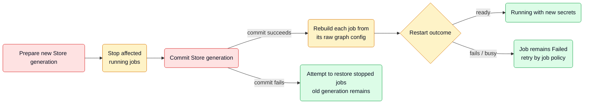
```mermaid
flowchart LR
    Change("Prepare new Store generation")
    Stop("Stop affected<br/>running jobs")
    Store("Commit Store generation")
    Restart("Rebuild each job from<br/>its raw graph config")
    Outcome{"Restart outcome"}
    Running("Running with new secrets")
    Failed("Job remains Failed<br/>retry by job policy")
    Restore("Attempt to restore stopped jobs<br/>old generation remains")

    Change --> Stop --> Store
    Store -->|"commit succeeds"| Restart --> Outcome
    Store -->|"commit fails"| Restore
    Outcome -->|"ready"| Running
    Outcome -->|"fails / busy"| Failed

    classDef sec fill:#fee2e2,stroke:#dc2626,color:#0b1021;
    classDef core fill:#fef3c7,stroke:#d97706,color:#0b1021;
    classDef job fill:#dcfce7,stroke:#16a34a,color:#0b1021;
    class Change,Store sec;
    class Stop,Restart,Outcome core;
    class Running,Failed,Restore job;
```

The Store change remains committed if a later job restart fails, and the graph truthfully shows that job as `Failed`.
A retained busy/contained restart revalidates the Store dependency, source winner, desired config, resource absence,
and run generation. A normal probe failure follows the collector's ordinary autodetection-retry policy.
`secrets/pending.go`.

Two rules that surprise people:

- A Store update restarts only `Running` dependents. Non-running graph configs keep their raw references and resolve
  the current generation when next started.
- Removing a Store is rejected while **any graph config** references it, running or not. Only DynCfg-sourced Stores
  are removable.

## Vnodes (Virtual Nodes)

A single job often monitors many *remote* things — one job scraping 50 switches, or one cloud collector pulling
hundreds of resources. Netdata wants each to appear as its own **node** in the UI, with its own hostname and charts,
not collapsed under the agent's host. A **vnode** is a lightweight, agent-declared "virtual host" (name, hostname,
GUID, labels) that a job can attribute its metrics to.

Think of **name badges at a conference**: the agent prints a batch up front and can print more on demand. When a job
reports a metric it wears a badge, so the dashboard files it under that identity instead of "the agent."

- **Configured vnodes** are loaded from `vnodes/` config files at startup and passed once as `InitialVnodes`
  (`plugin/agent/setup.go` → `plugin/agent/agent.go` → `composition`). At startup they are published to the
  daemon as DynCfg config entries.
- **Runtime vnodes** can be added, edited, or removed live through a DynCfg vnode Function (`composition/vnodes.go`).
- The vnode authority (`discovery/vnode.go`) is **revision-versioned and live-merged**: a job's `vnode:` name is
  resolved against the current set of file-configured *and* runtime vnodes, not a frozen startup snapshot. The
  resolved snapshot is attached to the job so its runtime emits under that virtual host.
- A vnode cannot be removed while a job references it (`409`), and only runtime (DynCfg-sourced) vnodes are removable
  (`405`).

## Jobs With Dependencies

A job may use no external dependency, secrets, a configured vnode, or both. All variants pass through the same source
selection and candidate lifecycle.

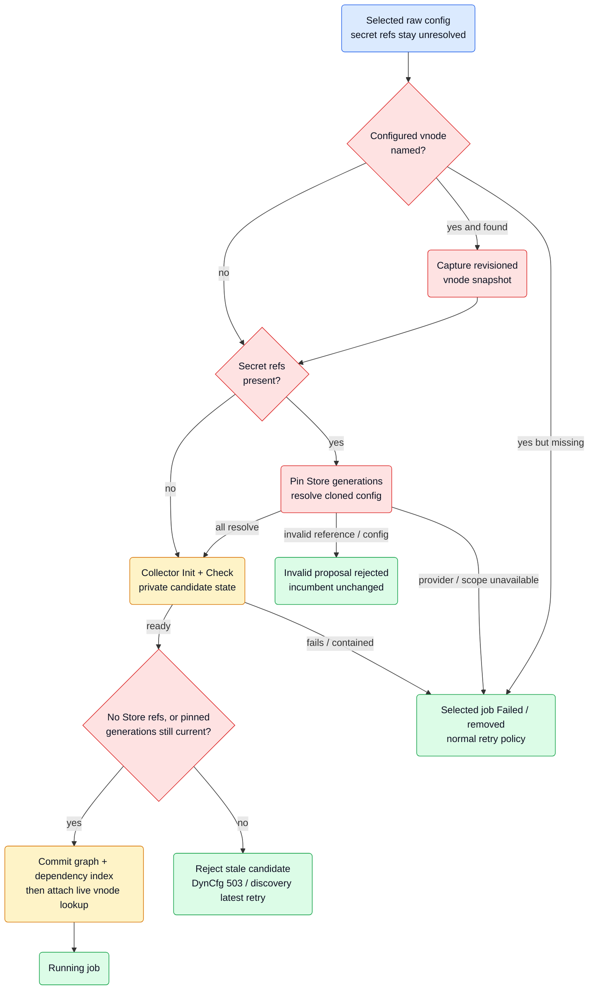
```mermaid
flowchart TD
    Raw("Selected raw config<br/>secret refs stay unresolved")
    Vnode{"Configured vnode<br/>named?"}
    Snapshot("Capture revisioned<br/>vnode snapshot")
    Secrets{"Secret refs<br/>present?"}
    Resolve("Pin Store generations<br/>resolve cloned config")
    Check("Collector Init + Check<br/>private candidate state")
    Fresh{"No Store refs, or pinned<br/>generations still current?"}
    Settle("Commit graph + dependency index<br/>then attach live vnode lookup")
    Run("Running job")
    Transient("Selected job Failed / removed<br/>normal retry policy")
    Retry("Reject stale candidate<br/>DynCfg 503 / discovery latest retry")
    Reject("Invalid proposal rejected<br/>incumbent unchanged")

    Raw --> Vnode
    Vnode -->|"yes and found"| Snapshot --> Secrets
    Vnode -->|"yes but missing"| Transient
    Vnode -->|"no"| Secrets
    Secrets -->|"yes"| Resolve
    Resolve -->|"all resolve"| Check -->|"ready"| Fresh
    Resolve -->|"provider / scope unavailable"| Transient
    Resolve -->|"invalid reference / config"| Reject
    Secrets -->|"no"| Check
    Check -->|"fails / contained"| Transient
    Fresh -->|"yes"| Settle --> Run
    Fresh -->|"no"| Retry

    classDef cfg fill:#dbeafe,stroke:#2563eb,color:#0b1021;
    classDef dep fill:#fee2e2,stroke:#dc2626,color:#0b1021;
    classDef core fill:#fef3c7,stroke:#d97706,color:#0b1021;
    classDef job fill:#dcfce7,stroke:#16a34a,color:#0b1021;
    class Raw cfg;
    class Vnode,Snapshot,Secrets,Resolve,Fresh dep;
    class Check,Settle core;
    class Run,Transient,Retry,Reject job;
```

### Secret-dependent job

- The collector graph stores the **raw config with references**, never resolved credential values.
- Candidate preparation resolves a clone atomically: either every reference is resolved under one pinned Store scope,
  or no resolved config reaches the collector.
- Before releasing that scope, resolution captures the exact numbered Store generations used by the clone. After
  `Init` and `Check` finish and the job-graph claim is reacquired, installation validates all captured generations
  under one Store lock.
- A generation changed or removed during construction makes the candidate stale. It is cleaned without installation;
  synchronous DynCfg returns retryable `503` and preserves the incumbent, while persistent discovery retains only its
  latest desired config for retry.
- An unavailable provider or reader scope is a **transient** activation failure. An invalid reference or invalid
  resolved config is a **proposal rejection** and leaves the incumbent unchanged.
- The raw dependency set and the graph mutation commit together. This prevents a running job from becoming invisible
  to a later Store update.
- The generation check also covers a brand-new job and a replacement that introduces a new Store reference before
  either dependency postimage exists. Store mutation never waits for a non-cooperative candidate `Check`; the stale
  candidate may finish physically later, but it cannot install.
- `${store:...}` dependencies participate in live Store restart orchestration. `${env:...}`, `${file:...}`, and
  `${cmd:...}` are resolved at build time but have no live Store generation to watch.

### Vnode-dependent job

- A named configured vnode must exist when the candidate is built. If it is missing, construction fails transiently
  and the selected job follows its normal retry policy.
- The candidate uses a private, revisioned vnode snapshot during `Init` and `Check`. Only a successfully installed job
  switches that lookup to the live vnode authority.
- Updating a vnode does **not** restart its jobs. Running jobs adopt a newer revision at their runtime refresh point
  and re-emit host metadata when needed.
- Adding a previously missing vnode does not directly push a job restart. Its retained retry or a later config event
  must reconcile the job.
- A collector-supplied vnode takes precedence over a configured vnode. The runtime advances past configured revisions
  without replacing the collector-owned identity.

### Job that uses both secrets and a vnode

The two dependencies are staged independently, then join the same candidate. This matters when a vnode update overlaps
a slow collector `Check`:

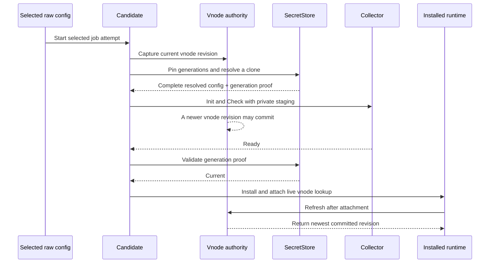
```mermaid
sequenceDiagram
    participant S as Selected raw config
    participant J as Candidate
    participant V as Vnode authority
    participant K as SecretStore
    participant C as Collector
    participant R as Installed runtime

    S->>J: Start selected job attempt
    J->>V: Capture current vnode revision
    J->>K: Pin generations and resolve a clone
    K-->>J: Complete resolved config + generation proof
    J->>C: Init and Check with private staging
    V-->>V: A newer vnode revision may commit
    C-->>J: Ready
    J->>K: Validate generation proof
    K-->>J: Current
    J->>R: Install and attach live vnode lookup
    R->>V: Refresh after attachment
    V-->>R: Return newest committed revision
```

Consequences:

- A Store update restarts the job from its raw graph config. The replacement resolves the new Store generation and
  captures the current vnode snapshot.
- A Store update or removal that overlaps candidate `Init` / `Check` invalidates the generation proof, so the
  candidate is rejected before installation and follows its source-specific retry contract.
- A vnode update alone does not restart the job or re-resolve secrets.
- A vnode update during `Check` is not lost: the candidate sees its staged snapshot while detached, then the installed
  runtime catches up through the live revisioned lookup.
- If either dependency cannot be prepared, no half-resolved or half-attached candidate becomes live.

`joboutput/config_factory.go`, `joboutput/runtime_staging.go`, `secrets/dependency.go`, `secrets/restart.go`,
`discovery/vnode.go`, `plugin/framework/jobruntime`.

## Service Discovery

Service-discovery configuration is **materialized** before a pipeline manager can start it. One contained attempt owns
payload/descriptor parsing, user-config rendering, `ParseJSONConfig`, discoverer construction, and `pipeline.New`; the
manager accepts only an already-prepared pipeline through `StartPrepared`/`RestartPrepared`.

- The controller materializes and applies configurations **serially**, after deterministic source-winner selection.
- Each materialization is individually contained, so a non-cooperative identity cannot occupy the controller loop
  beyond its logical containment deadline.
- DynCfg `test` builds a complete temporary pipeline under a payload-specific test identity and never submits it to the
  pipeline manager. It invokes `dyncfg.Testable.Test(ctx)` sequentially on every discoverer that provides the optional
  capability. After each callback returns, the shared Pipeline Test boundary makes the caller's cancellation cause take
  precedence over the discoverer result. Discoverers classify their configured timeouts but need not repeat caller
  cancellation checks.
- A Testable discoverer can return `dyncfg.ErrTestUnsupported` when the resource type has an operational test but the
  configured instance cannot run it safely. The pipeline continues testing later discoverers and reports the aggregate
  as validation-only; the sentinel does not turn real failures into success.
- Resource-authored parsing, construction, and operational failures retain their causes internally but cross one
  sanitized response/diagnostic boundary. Unmarked failures render only their generic phase. A `dyncfg.PublicError`
  may add static, code-authored detail; its public message must never derive from submitted/resolved values, endpoints,
  credentials, backend errors, or response bodies. Resource callbacks return failures rather than logging raw
  configuration or endpoint material.
- A discoverer without the capability produces an explicit validation-only success. Configuration/construction
  failures return 400, operational failures return 422, and busy/contained attempts return 503.
- Operational guarantees are discoverer-specific. Docker performs a one-item container-list query. `net_listeners`
  executes and parses one production helper snapshot. HTTP performs one production fetch only for empty/default or exact
  `GET`: it uses the configured request/client path, requires HTTP 200, enforces the 10 MiB response limit, and parses all
  targets. Redirect handling permits at most ten actual requests. These tests discard targets without rule rendering,
  cache reconciliation, publication, or installation. A non-empty HTTP method other than exact `GET`, plus Kubernetes
  and SNMP, remains validation-only. Local-listener process count and elapsed time are bounded to one invocation and the
  caller/configured timeout; its work and buffered output still scale with the host socket/process inventory.
- File-backed stock/user state keeps one latest pending retry after a busy/contained result; synchronous DynCfg
  commands do not.
- The complete service-discovery DynCfg Function is also contained, so a non-cooperative command cannot pin the
  Function catalog or the Job Manager run.

`plugin/agent/discovery/sd/materialization.go`, `plugin/agent/discovery/sd/pending.go`,
`composition/service_discovery.go`.

## Functions

### Stable handler bundles

Collector callbacks are not called while rebuilding the shared Function catalog. Instead, each job (and each
agent-level module) stages one stable process-owned handler bundle outside controller locks:

- immutable catalog generations acquire cheap references to an existing bundle;
- replacing one job never reconstructs handlers for its siblings;
- retirement closes route admission first, then cleanup waits for every catalog and in-flight callback reference to
  drain;
- availability polling and handler invocation run as contained attempts outside the controller and process-control
  loops;
- a handler invocation or availability poll that settles while its callback remains physically live quarantines only
  its bundle; new callbacks for that bundle are rejected until every callback covered by quarantine physically
  returns, while unrelated bundles remain available.
- containment runs the bundle fence before logical settlement becomes observable, so admission cannot race ahead of
  quarantine while an `Await` caller is waiting to be scheduled.
- a panic from a handler invocation is recovered at the bundle boundary and permanently closes that bundle. Later
  requests receive an unavailable response without re-entering the handler or accumulating one process-lifetime
  quarantine tombstone per request.

`functions/bundle.go`, `functions/module_stage.go`, `functions/controller.go`, `containment/authority.go`,
`process_attempt.go`.

### DynCfg is not a published Function

- DynCfg `config` prefix routes are **private catalog routes**, not Function publications. Netdata owns the global
  `config` Function that serves the tree and delegates per-config operations; go.d emits `CONFIG` object frames but
  never `FUNCTION GLOBAL "config"` or its withdrawal.
- Go `CONFIG` emission fails closed at the shared `pkg/netdataapi` boundary. Bare protocol identities remain strict;
  single-quoted metadata accepts ordinary internal backslashes (including Windows paths) but rejects controls, the
  quote delimiter, and a trailing escape that would consume the closing quote.

## Restart and Shutdown

Job Manager separates two lifetimes:

- **The process is the building.** Built once by `composition.NewProcess`, it survives every reload: the stdin reader,
  the one `FrameOwner`, the accepted-cleanup output capability, the UID ledger, the frozen module registry, the secret
  resolver, the process-attempt and Store epoch authorities, the vnode registry, and the runtime metrics service.
- **The run generation is the current tenant.** A complete, self-contained occupant built by `composition/run.go`: the
  kernel and its loop, the task supervisor, the run supervisor, the DynCfg graph, the run-owned SecretStore
  controller/dependency projections, Function catalog projections and publications, the job factory, the autodetection
  scheduler, and the `jobmgr.runtime` metrics.

A **SIGHUP reload tries to evict the whole tenant and move a fresh one in without touching the building.** The host
gives the complete rotation one 30-second budget. If it expires, or a quarantined agent-module identity makes an
in-process successor unsafe, the plugin exits with status 0 and the daemon rebuilds the process. Unexpected
construction, cleanup, validation, and invariant failures remain failures and exit nonzero.

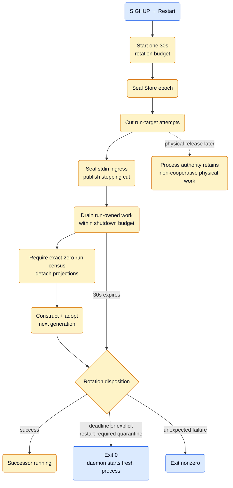
```mermaid
flowchart TD
    HUP("SIGHUP → Restart")
    Budget("Start one 30s<br/>rotation budget")
    Seal("Seal Store epoch")
    Cut("Cut run-target attempts")
    Ingress("Seal stdin ingress<br/>publish stopping cut")
    Drain("Drain run-owned work<br/>within shutdown budget")
    Census("Require exact-zero run census<br/>detach projections")
    Next("Construct + adopt<br/>next generation")
    Retained("Process authority retains<br/>non-cooperative physical work")
    Recover{"Rotation disposition"}
    Fresh("Exit 0<br/>daemon starts fresh process")
    Fail("Exit nonzero")

    HUP --> Budget --> Seal --> Cut --> Ingress --> Drain --> Census --> Next --> Recover
    Drain -->|"30s expires"| Recover
    Recover -->|"success"| NextRun("Successor running")
    Recover -->|"deadline or explicit<br/>restart-required quarantine"| Fresh
    Recover -->|"unexpected failure"| Fail
    Cut -. "physical release later" .-> Retained

    classDef ext fill:#dbeafe,stroke:#2563eb,color:#0b1021;
    classDef core fill:#fef3c7,stroke:#d97706,color:#0b1021;
    class HUP,Fresh,Fail ext;
    class Budget,Seal,Cut,Ingress,Drain,Census,Next,Retained,Recover,NextRun core;
```

The rotation is an acknowledged sequence (`composition/process.go`, `retireForSuccessor`):

1. **Seal the old Store epoch**, so no new old-run mutation can commit.
2. **Cut every process attempt targeting the retiring run.** Their callers settle immediately; their physical workers
   stay process-owned.
3. **Seal stdin ingress** and arm the run shutdown budget from the remaining caller-owned rotation deadline before
   stopping the run.
4. **Drain run-owned work** — tasks, claims, permits, retries, Function publications, and projections — then drain
   paused ingress. A process-owned worker that ignores cancellation remains in the process census, not the retired run
   census.
5. **Require a fully drained run authority census** and finish the run finalizer.
   - Live run-owned leftovers still make the terminal state dirty.
   - Process-owned retained work does not fabricate run ownership.
   - If an ordinary frame write is the only remaining owner, the kernel arms one shutdown-only idle notification
     before sleeping. Frame completion wakes it to recensus, and the terminal decision validates *that same snapshot*
     rather than taking a racy second census.
6. **Construct, start, and adopt the next generation.** Restart acknowledges only after the successor run is running.
   Startup uses the rotation context, but the accepted kernel uses the process context — so cancelling an acknowledged
   restart cannot stop the new run.
7. **Classify an incomplete rotation at the host boundary.** See the table below.

An incomplete rotation is never left half-applied: there is no degraded generation and no second shutdown phase after
the rotation deadline. The host maps the outcome to an exit status:

| Rotation outcome | Exit status | Why |
| --- | --- | --- |
| Successor running | — | Normal reload; the process keeps running |
| Rotation deadline expired | 0 | Recoverable: the daemon starts a fresh process |
| Explicit process-restart-required identity quarantine | 0 | Recoverable the same way; see the note below |
| Mixed or unexpected failure | 1 | Construction, cleanup, validation, or invariant failure stays visible |

Two rules keep that classification honest:

- **Typed causal provenance.** Deadline-generated kernel, terminal-census, and run-non-quiescence errors are
  recoverable *only* when the same complete error tree also contains the rotation deadline. Any independent error leaf
  fails closed.
- **Acknowledge before finalizing.** A known unexpected transition failure is acknowledged before process
  finalization, so a slow finalizer cannot let the deadline relabel a real failure as recovery.

An old installed collector runtime that is still retained leaves its job unavailable/pending in the new run until the
physical identity releases. Agent-level module Function bundles are different: their identity is canonical across
generations. A released-but-quarantined module bundle cannot be reconstructed safely in the same process, so rotation
requests a fresh process instead of bypassing the quarantine with an epoch-specific key.

The process command receiver exists during initial startup and rotation. `Terminate` can cancel an active transition
instead of waiting behind its startup barrier.

**Termination** (SIGINT/SIGTERM) follows the same retirement path with no successor, then begins process-authority
shutdown:

- **One budget, not two.** The host spends a single 10-second budget on both the `Terminate` acknowledgement and the
  wait for the run loop; it never starts a second 10-second wait.
- **Report, don't block.** Retained physical work is reported once the budget expires rather than waited on forever.
  Only actual process exit can reclaim a permanently blocked goroutine.
- **Fence cleanup output last.** After the authority drains or the budget expires, the process terminally fences
  accepted-cleanup output before finalizing the output service. A contained collector that returns later still
  releases its resources, but cannot emit a late terminal frame.

## Runtime Metrics

In long-lived agent mode, one component — `jobmgr.runtime` — projects live orchestration counts
(`composition/runtime_metrics.go`):

- process attempts: active, probing, admitted, contained, and quarantined identities;
- operations: admitted, active, rejected, timed out, duplicate-UID rejected, shutdown-rejected, results disposed;
- claims: keys tracked, waiters, oldest wait age;
- tasks: active, queued, oldest wait age, panics;
- jobs: active jobs, active Function invocations;
- frames: commits and failures;
- runs: dirty runs; plus the oldest live operation age.

Mutation owners write metric-owned atomics; the producer snapshots those atomics and the process authority's exact
attempt census once per update. It never reads kernel-private state.

The component is registered before external admission opens and unregistered (with a final projection) when its
generation retires, strictly before the successor re-registers. Run-owned samples do not cross a reload. Process-attempt
gauges deliberately can: the authority survives reload, so a new run continues to expose an older physically retained
attempt until it releases.

## Package Map

| Package | Responsibility |
| --- | --- |
| `jobmgr` (root) | Command ports, the `CommandKernel` run loop, lanes, claims, pre-claim stages, composite child commands, containment ports |
| `jobmgr/lifecycle` | Neutral authorities: UID, operation, task, long-lived permit, frame, run, shutdown budget, resource, transaction, on-loop ownership funnel |
| `jobmgr/containment` | Process-lifetime attempts, per-identity exclusion, logical cuts, retained-work census |
| `jobmgr/functions` | Function ingress, stable handler bundles, routing catalog, invocation containment, publication |
| `jobmgr/joboutput` | Collector staging, installed runtimes, output fencing, DynCfg jobs, retries, vnodes |
| `jobmgr/secrets` | Secret dependency index, store command adapter, Store materialization, pending retries, dependent-restart transaction |
| `jobmgr/discovery` | Discovery add/remove decisions and the configured-vnode authority |
| `jobmgr/composition` | The only assembler; process construction and run-generation rotation |
| `plugin/framework/functions` | Passive Function values and the stdin input capsule |
| `plugin/framework/dyncfg` | The dynamic-configuration `Graph` |
| `plugin/framework/jobruntime` | V1 / V2 job runtime and host/vnode scope |
| `plugin/framework/vnoderegistry` | Post-success vnode owner/conflict registry |
| `plugin/agent/secrets/resolver` | Atomic config clone, reference compilation, scoped resolution |
| `plugin/agent/secrets/secretstore` | Frozen creator catalog and process-owned Store epoch generations |
| `plugin/agent/discovery` | Provider catalog and the discovery pipeline generation |

### Dependency rules

The layering is enforced by `architecture_test.go`, not just convention:

- **`lifecycle` is neutral.** It imports no sibling, no adapter, and no Agent or collector package — only the standard
  library. Domain policy (which frame is a keepalive, when to go dirty) is supplied by the caller.
- **Adapters do not import each other.** `containment`, `functions`, `joboutput`, `secrets`, and `discovery` may
  import the root command ports and `lifecycle`, but never a sibling adapter.
- **`composition` is the only assembler.** It is the single package allowed to join adapters, break construction
  cycles, and own the process/run-generation split. It is also the only package that imports `containment`.

`architecture_test.go` additionally checks the shipped-root/composition construction boundary and that on-loop actions
are dispatched only through the sanctioned kernel funnel. Behavioral ownership guarantees belong in focused or
black-box tests rather than an exact private-type or source-file manifest.

## Where To Change Things

| Goal | Start here |
| --- | --- |
| Add or change a Function surface, routing, or publication | `functions/` (catalog, controller, publication, protocol) |
| Change how a collector job is built, started, stopped, or retried | `joboutput/` (factory, generation, transaction, scheduler, autodetection_retry) |
| Change secret reference syntax or resolution | `plugin/agent/secrets/resolver` |
| Change how a secret store commits or restarts dependents | `plugin/agent/secrets/secretstore`, `secrets/` (store_stage, restart, transaction, dependency, pending) |
| Change discovery add/remove decisions or configured vnodes | `discovery/` (decision, vnode), `composition/{discovery,vnodes}.go` |
| Change the ordering model (lanes, claims, staging, acceptance, deadlines) | `kernel*.go`, `claim_authority.go`, `lifecycle/` |
| Change process-lifetime containment, same-identity exclusion, or retained-work accounting | `containment/authority.go`, `process_attempt.go` |
| Change how the process is assembled, reloaded, or shut down | `composition/` (process, run, public) |
| Change a package dependency or production construction boundary | Update the durable checks in `architecture_test.go` in the same change |

## Validation

Useful focused checks after changes:

```text
cd src/go
env GOCACHE=/tmp/netdata-go-build-cache go test -count=1 ./plugin/agent/jobmgr/...
env GOCACHE=/tmp/netdata-go-build-cache go test -race -count=1 ./plugin/agent/jobmgr/...
env GOCACHE=/tmp/netdata-go-build-cache go vet ./plugin/agent/jobmgr/...
```

Job Manager is concurrency-sensitive: the `-race` run is not optional for changes to the kernel, claims, staging,
tasks, or the run/shutdown paths.

When a change touches shared framework code that Job Manager consumes (`plugin/framework/jobruntime`, `pkg/metrix`,
the chart engine), also build and test a couple of representative real collectors so the change is proven against real
users, not only against Job Manager's own tests.
