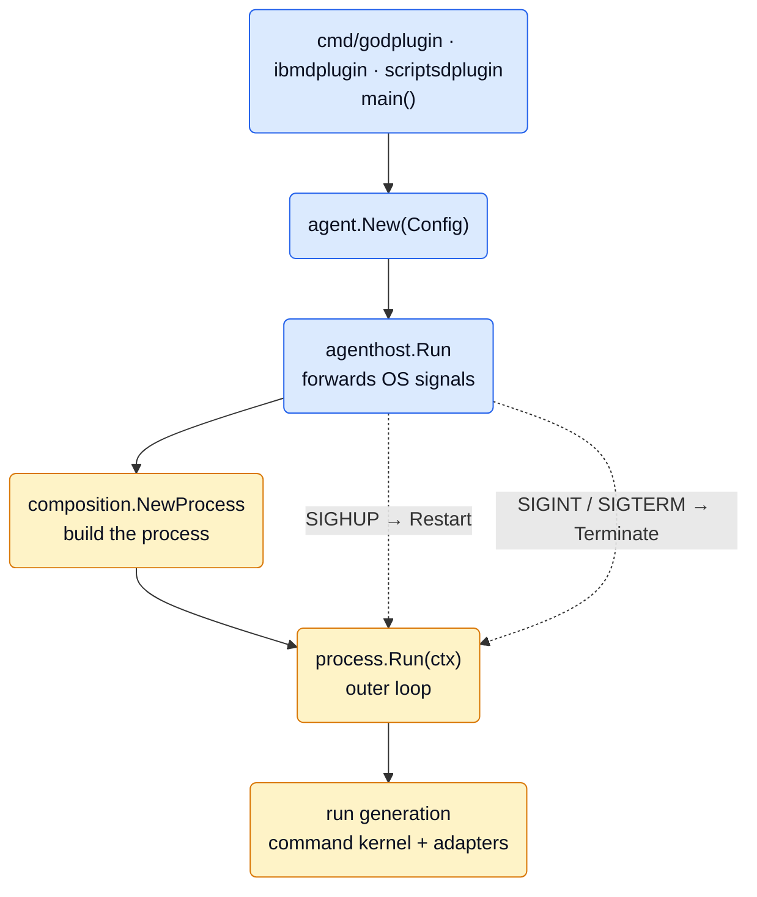
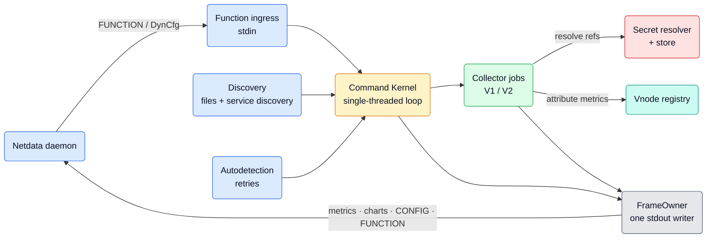
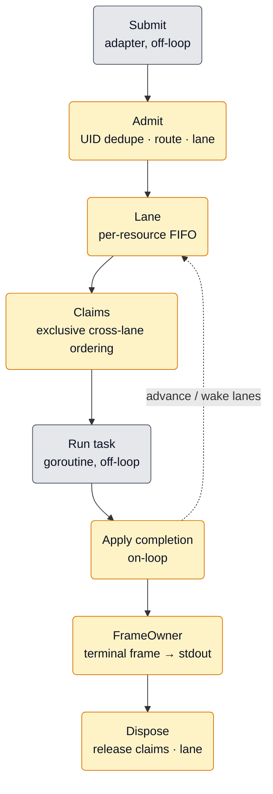
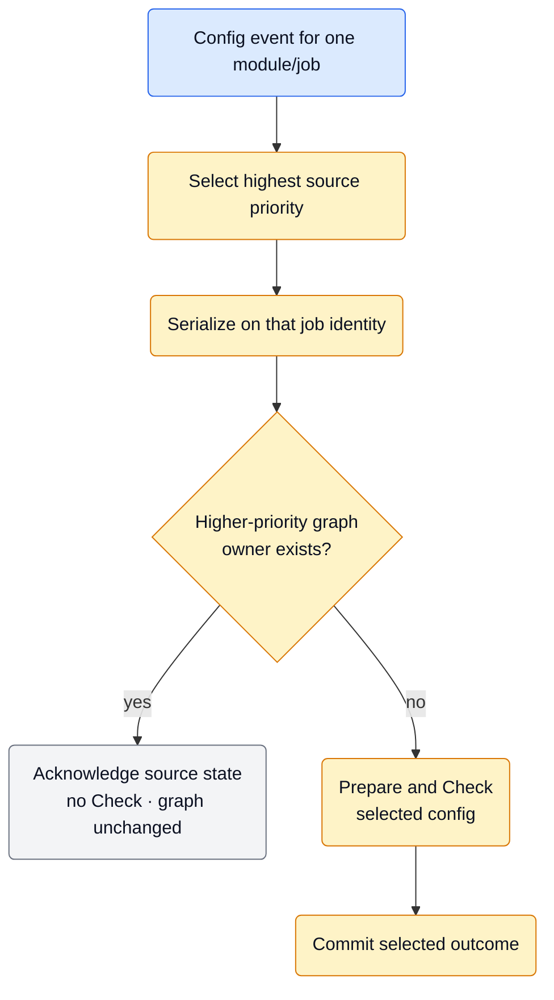
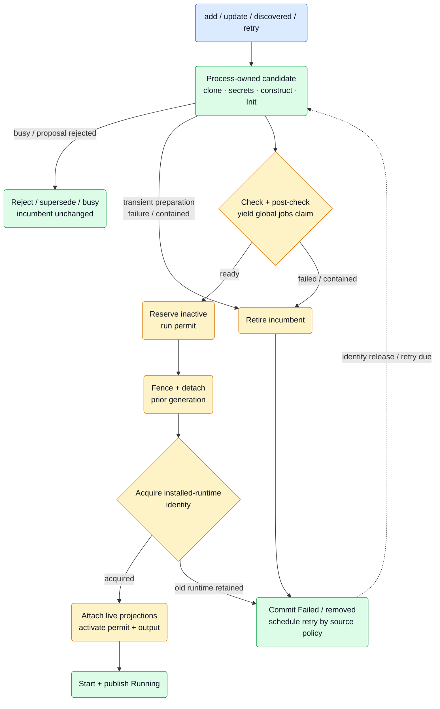
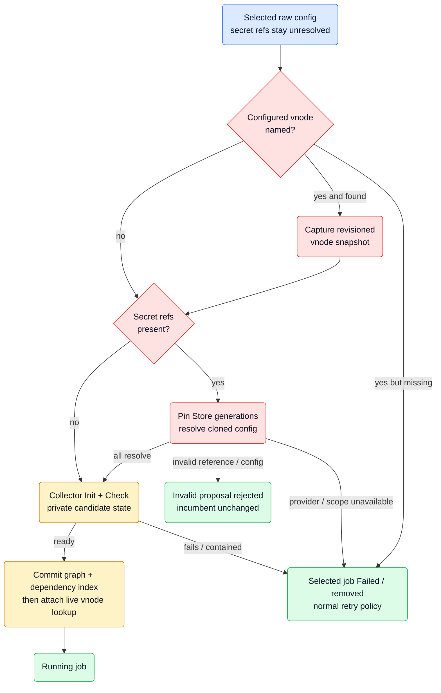
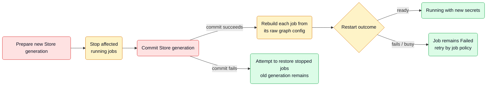
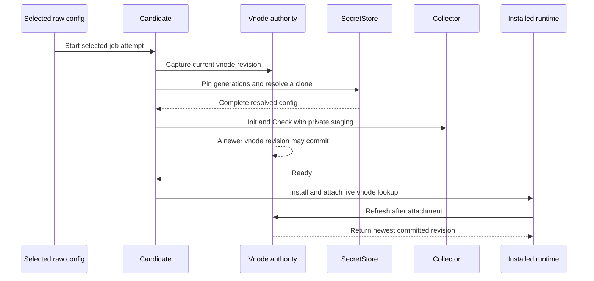
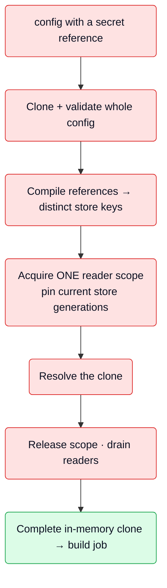
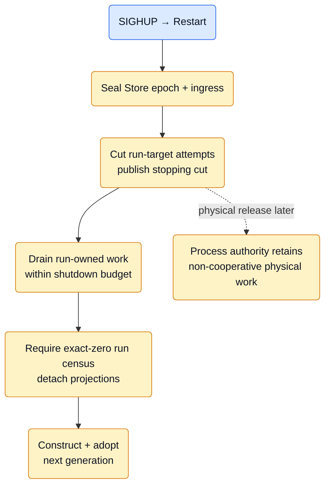

# Job Manager Architecture

This is a maintainer-oriented map of the Job Manager (`jobmgr`). It explains the
main runtime path and package boundaries as a top-to-bottom journey: the big
picture first, then the concurrency model, then how jobs, secrets, and vnodes
are handled, and finally the package layout and the deep invariants.

It intentionally leaves collector internals opaque. How a specific collector
walks SNMP, scrapes Prometheus, or renders charts lives in that collector and
the framework packages it uses; Job Manager only orchestrates their lifecycle.

## Short Version

Job Manager is the orchestration boundary for a Go data-collection plugin
process (`go.d`, `ibm.d`, `scripts.d`). It takes everything that wants to
start, stop, reconfigure, or query a collector job and turns it into an
ordered, safe stream of lifecycle commands run by **one single-threaded command
kernel**.

Three things can drive it:

- **Function calls** arriving on the plugin's stdin from the Netdata daemon —
  including dynamic configuration (DynCfg) commands to add / edit / enable /
  disable / test / remove jobs.
- **Discovery** — file configs and service discovery proposing jobs to run.
- **Autodetection retries** — jobs that failed to detect their target, retried
  later.

Everything a plugin writes back — metrics, charts, Function registrations,
config state, keepalives — leaves through **one serialized stdout writer**.

The whole process runs **one active "run generation"** at a time. A reload
(SIGHUP) rotates that generation cleanly without rebuilding the process itself.

## Where Job Manager Sits

Every plugin binary follows the same startup path.


```mermaid
flowchart TD
    Plugin("cmd/godplugin · ibmdplugin · scriptsdplugin<br/>main()")
    New("agent.New(Config)")
    Host("agenthost.Run<br/>forwards OS signals")
    Proc("composition.NewProcess<br/>build the process")
    Run("process.Run(ctx)<br/>outer loop")
    Gen("run generation<br/>command kernel + adapters")

    Plugin --> New --> Host --> Proc --> Run --> Gen
    Host -. "SIGHUP → Restart" .-> Run
    Host -. "SIGINT / SIGTERM → Terminate" .-> Run

    classDef entry fill:#dbeafe,stroke:#2563eb,color:#0b1021;
    classDef core fill:#fef3c7,stroke:#d97706,color:#0b1021;
    class Plugin,New,Host entry;
    class Proc,Run,Gen core;
```

- `cmd/*plugin/main.go` builds a `RunModePolicy`, registers discovery
  providers, and calls `agent.New`.
- `cmd/internal/agenthost/host.go` hosts one process-lifetime Agent and maps OS
  signals to acknowledged controls: **SIGHUP → `Restart`**, **SIGINT/SIGTERM →
  `Terminate`** (each bounded to 10s).
- `plugin/agent/agent.go` loads config and modules, then calls
  `composition.NewProcess` and `process.Run(ctx)`.

**Run modes** (`plugin/agent/policy/runmode.go`) flip a few gates:

- **Long-lived agent** (production, not a terminal): service discovery on,
  runtime charts on, discovered jobs wait for the daemon's enable command.
- **Terminal / debug** (attached to a TTY): service discovery off, runtime
  charts off, discovered jobs auto-enable so a developer sees output
  immediately.

## The Big Picture

Once running, Job Manager is a funnel: several sources of intent on the left,
one ordered kernel in the middle, one stdout stream on the right.


```mermaid
flowchart LR
    Daemon("Netdata daemon")
    Fn("Function ingress<br/>stdin")
    Disc("Discovery<br/>files + service discovery")
    Retry("Autodetection<br/>retries")
    Kernel("Command Kernel<br/>single-threaded loop")
    Jobs("Collector jobs<br/>V1 / V2")
    Secrets("Secret resolver<br/>+ store")
    Vnodes("Vnode registry")
    Frame("FrameOwner<br/>one stdout writer")

    Daemon -->|"FUNCTION / DynCfg"| Fn --> Kernel
    Disc --> Kernel
    Retry --> Kernel
    Kernel --> Jobs
    Jobs -->|"resolve refs"| Secrets
    Jobs -->|"attribute metrics"| Vnodes
    Jobs --> Frame
    Kernel --> Frame
    Frame -->|"metrics · charts · CONFIG · FUNCTION"| Daemon

    classDef ext fill:#dbeafe,stroke:#2563eb,color:#0b1021;
    classDef core fill:#fef3c7,stroke:#d97706,color:#0b1021;
    classDef job fill:#dcfce7,stroke:#16a34a,color:#0b1021;
    classDef sec fill:#fee2e2,stroke:#dc2626,color:#0b1021;
    classDef vn fill:#ccfbf1,stroke:#0d9488,color:#0b1021;
    classDef out fill:#e5e7eb,stroke:#4b5563,color:#0b1021;
    class Daemon,Fn,Disc,Retry ext;
    class Kernel core;
    class Jobs job;
    class Secrets sec;
    class Vnodes vn;
    class Frame out;
```

A useful mental split for the rest of this document:

- The **kernel** decides *what happens and in what order*.
- **Adapters** (`functions`, `joboutput`, `secrets`, `discovery`) know *how* to
  do the collector-specific work, behind narrow ports.
- **`lifecycle`** provides the neutral machinery the kernel delegates to
  (UID ownership, tasks, framing, and run control).
- **`containment`** owns collector-derived work that may outlive a run because
  it does not cooperate with cancellation.
- **`composition`** wires them all together.

## The Concurrency Model

This is the core idea. Job Manager does almost no locking in its business
logic. Instead, **one goroutine — the `CommandKernel` run loop — owns all mutable
orchestration state** and is the only thing allowed to change it. Everything
else either hands work in over a channel or does blocking work off to the side
and reports back.

Think of an **air-traffic control tower with a single controller**:

- Aircraft (commands) queue on **runways** (lanes); one moves per runway at a
  time, in arrival order (FIFO).
- Before taxiing, a flight reserves **airspace corridors** (claims), always
  requested in the same order so two flights never deadlock waiting on each
  other.
- The controller never leaves the tower. **Pilots** (off-loop task goroutines)
  fly the actual missions and radio back completions. The controller only reads
  radios and updates the board.

### The command lifecycle


```mermaid
flowchart TD
    Submit("Submit<br/>adapter, off-loop")
    Admit("Admit<br/>UID dedupe · route · lane")
    Lane("Lane<br/>per-resource FIFO")
    Claim("Claims<br/>exclusive cross-lane ordering")
    Task("Run task<br/>goroutine, off-loop")
    Complete("Apply completion<br/>on-loop")
    Frame("FrameOwner<br/>terminal frame → stdout")
    Dispose("Dispose<br/>release claims · lane")

    Submit --> Admit --> Lane --> Claim --> Task --> Complete --> Frame --> Dispose
    Complete -. "advance / wake lanes" .-> Lane

    classDef offloop fill:#e5e7eb,stroke:#4b5563,color:#0b1021;
    classDef onloop fill:#fef3c7,stroke:#d97706,color:#0b1021;
    class Submit,Task offloop;
    class Admit,Lane,Claim,Complete,Frame,Dispose onloop;
```

1. **Submit** (off-loop): an adapter validates a `Request`, attaches a prepared
   Job Manager plan or submits an unresolved Function request, pushes it onto a
   submission queue, and wakes the loop. `command_ports.go`,
   `kernel_ingress.go`.
2. **Admit** (on-loop): the loop dedupes the command's UID, resolves the route,
   derives the lane key, and installs the operation. Duplicate UIDs and invalid
   routes are rejected here. `kernel_admission.go`, `lifecycle/uid.go`.
3. **Lane**: same-resource commands share one FIFO lane; only the lane head
   runs while the lane is active. Different lanes advance independently.
4. **Claims**: cross-lane exclusion. Every claim is exclusive. Claims are
   acquired in a stable global key order and waiters are FIFO per key, so the
   design is deadlock-free and starvation-free.
   `claim_authority.go`.
   A transaction may explicitly yield only its acquisition-suffix claim while
   bounded preparation work runs, then must reacquire it before preparation
   completes. Its resource lane remains active, so another command for the same
   resource cannot overlap the yielded work. Reacquisition has priority over
   ordinary waiters. A composite declares the resource lanes its children may
   use. If one conflicts with an active yielder, the parent is parked before it
   acquires any claim; an already-waiting parent releases its prefix claims.
   Its original ticket is retained, while unrelated work remains serviceable on
   the otherwise-free claim. This prevents both child/lane cycles and
   head-of-line blocking. When a child of an already-running composite yields,
   only the matching admission-fence claim is suspended; the parent's other
   claims remain held. `claim_authority.go`, `claim_yield.go`,
   `claim_yield_kernel.go`.
5. **Run task** (off-loop): cooperative run-owned work executes through
   `TaskSupervisor`; collector-derived work that may ignore cancellation
   executes through the process containment authority. Neither executes on the
   kernel loop. `lifecycle/task.go`, `containment/authority.go`.
6. **Apply completion** (on-loop): the task radios its result back; the loop
   seals it and advances the lifecycle.
7. **Frame**: the terminal response is committed to stdout through `FrameOwner`.
8. **Dispose**: claims and the lane slot are released, waking any blocked lanes.

### Who owns what

- **On-loop (exclusive to the `CommandKernel` run loop):** every lane, operation, deadline, claim
  transition, and counter. The loop is the sole mutator. A test
  (`architecture_test.go`) even pins that on-loop actions are dispatched through
  the sanctioned kernel ownership funnel.
- **Run-owned off-loop:** cooperative tasks and permits belong to one run
  generation and must drain before that run can quiesce.
- **Process-owned off-loop:** contained attempts own their physical worker,
  per-identity exclusion, and final cleanup across run rotation.

### Process containment authority

Go cannot forcibly stop a goroutine. Job Manager therefore separates **logical
settlement** from **physical release** for code that may ignore cancellation:

- The process authority reserves a namespace plus an opaque memory-only
  identity before starting work. At most one physical attempt exists for that
  identity; unrelated identities remain independently admissible.
- Caller cancellation is propagated first. Supersession waits up to two seconds
  for cooperative exit; the attempt's default logical fuse is two minutes.
- Crossing either boundary settles the caller and fences late results. The
  authority retains the worker and everything it owns until its complete
  cleanup returns or the plugin process exits.
- Persistent file/discovery state keeps only its latest desired replacement and
  retries after identity release. A synchronous DynCfg request instead returns a
  retryable busy/contained response and is not applied later.
- There is intentionally no process-wide slot limit: one permanently stuck
  identity does not block another job. Distinct permanently stuck identities
  can therefore accumulate retained workers; diagnostics report that state.

The namespaces cover collector candidate preparation, installed collector
runtimes, DynCfg tests, SecretStore preparation/tests, stable Function bundles,
Function availability polls and invocations, and service-discovery
materialization. `process_attempt.go`, `containment/authority.go`.

### Fairness and timeout rules

- **`TaskSupervisor` runs two independent classes** — framework-control work
  (lifecycle/DynCfg commands) and generic Function work — in strict round-robin.
  One class can never starve the other, and there is **no fixed "N active
  Functions" cap**. `lifecycle/task.go`.
- **An ordinary timed-out run task keeps run ownership.** The kernel only
  cooperatively cancels it; its claims, lane, and resource authority stay held
  until it returns, and repeated overruns can escalate to fail-stop.
- **A contained attempt keeps process ownership instead.** Its caller, claims,
  and run may settle after the containment cut because late output and mutation
  are fenced by the process-owned attempt boundary.

Additional facts that catch newcomers:

- Lanes give per-resource *ordering*; **claims** give cross-resource *mutual
  exclusion*. Two independent lanes still serialize if they declare the same
  claim key.
- A resource-less Function call gets a **unique lane per invocation**, so
  concurrent calls to the same Function run in parallel — unless the resolved
  plan declares claims.
- DynCfg `config` prefix routes are **private catalog routes**, not Function
  publications. Netdata owns the global `config` Function that serves the tree
  and delegates per-config operations; go.d emits `CONFIG` object frames but
  never `FUNCTION GLOBAL "config"` or its withdrawal.
- Go `CONFIG` emission fails closed at the shared `netdataapi` boundary. Bare
  protocol identities remain strict; single-quoted metadata accepts ordinary
  internal backslashes (including Windows paths) but rejects controls, the
  quote delimiter, and a trailing escape that would consume the closing quote.

### Config validation boundary

External configuration is untrusted batch input. Production producers validate
successfully decoded entries against the exact downstream contracts before
process construction or WorkPlan submission:

- the vnode file loader and DynCfg vnode adapter validate CONFIG identity and
  source fields, host-emission metadata, daemon-compatible UUID syntax, and
  semantic hostname/GUID uniqueness;
- the secret-store file loader validates each fully stamped config, including
  kind type and provider support, before passing accepted entries to a run
  generation;
- discovered collector proposals validate their final CONFIG job name and
  source metadata before graph mutation.

An invalid decoded file entry is reported and skipped; a YAML structural/type
error may reject its containing file without stopping Job Manager. An invalid
dynamic proposal is a typed proposal rejection and quarantined while sibling
proposals continue.
Strict constructor/controller checks remain as defensive invariant enforcement:
programmatic state that bypasses a production producer is still rejected rather
than silently normalized or recovered after admission.

### Service-discovery materialization

Service-discovery configuration is materialized before a pipeline manager can
start it. One contained attempt owns payload/descriptor parsing, user-config
rendering, `ParseJSONConfig`, discoverer construction, and `pipeline.New`; the
manager accepts only an already-prepared pipeline through
`StartPrepared`/`RestartPrepared`.

The service-discovery controller materializes and applies configurations
serially after deterministic source-winner selection. Each materialization is
individually contained by the process authority, so a non-cooperative identity
cannot occupy the controller loop beyond its logical containment deadline.
File-backed stock/user state keeps one latest pending retry after a
busy/contained result; synchronous DynCfg commands do not. The complete
service-discovery DynCfg Function is also contained, so a non-cooperative
command cannot pin the Function catalog or Job Manager run.
`agent/discovery/sd/materialization.go`, `agent/discovery/sd/pending.go`,
`composition/service_discovery.go`.

## How the Job Manager Manages Jobs

A **job** is one running collector instance: a module plus a resolved config.
Jobs are created from stock/user config files at startup, from discovery, or
from DynCfg commands, and are retried after a failed autodetection.

### Configuration source ownership

Go plugin configurations use one source order: **DynCfg > user > discovered >
stock > internal/unknown**.

The order is shared, but there is no single generic "configuration manager."
Each domain applies the order at the boundary that owns its lifecycle:

| Configuration domain | Identity | Where the winner is enforced |
| --- | --- | --- |
| Collector job | canonical `FullName` (module + job name) | discovery selection, then again before the collector graph changes |
| SecretStore | exposed `kind:name` | initial/pending selection and the Store generation transaction |
| Service discovery | exposed config key | before materialization and pipeline start |
| Configured vnode | vnode name | startup files seed the live registry; a DynCfg upsert replaces that name |

This distinction matters. Collector-job retries and fallback rules do not
implicitly apply to SecretStores, service-discovery pipelines, or vnodes.
Configured vnodes do not keep a stack of competing candidates: file config
seeds the registry, a DynCfg upsert replaces that name, and removing the DynCfg
vnode does not reveal the old file value.

A plugin-side DynCfg `add` is replay/upsert-capable because the daemon uses it
to restore persisted configurations. Ordinary user duplicate adds remain
create-only at the daemon boundary. Removal targets only the current DynCfg
override and does not immediately reactivate a masked lower-priority source.

### Collector source-priority event flow

One collector-job identity has one selected desired configuration. A lower
source may remain known to discovery while a higher source owns the graph, but
it is not allowed to probe or run.


```mermaid
flowchart TD
    Event("Config event for one module/job")
    Select("Select highest source priority")
    Lane("Serialize on that job identity")
    Recheck{"Higher-priority graph<br/>owner exists?"}
    Noop("Acknowledge source state<br/>no Check · graph unchanged")
    Probe("Prepare and Check<br/>selected config")
    Commit("Commit selected outcome")

    Event --> Select --> Lane --> Recheck
    Recheck -->|"yes"| Noop
    Recheck -->|"no"| Probe --> Commit

    classDef ext fill:#dbeafe,stroke:#2563eb,color:#0b1021;
    classDef core fill:#fef3c7,stroke:#d97706,color:#0b1021;
    classDef quiet fill:#f3f4f6,stroke:#6b7280,color:#0b1021;
    class Event ext;
    class Select,Lane,Recheck,Probe,Commit core;
    class Noop quiet;
```

Common event sequences:

| Event | Outcome |
| --- | --- |
| DynCfg config is checking; a lower source arrives | Work for that job identity is serialized. If DynCfg establishes graph ownership, the lower reconciliation becomes a no-op before `Check`. |
| Higher source is `Accepted`, `Running`, `Failed`, or `Disabled` | Its graph record still owns the identity. A lower source cannot replace it merely because it is not running. |
| Higher proposal is invalid or rejected before graph mutation | It never becomes the owner. The selected valid lower source may proceed. |
| A stale pending attempt or retry becomes runnable | It revalidates the source winner, desired config, token, and graph state. If any changed, it becomes a no-op. |
| DynCfg `test` runs | It uses a separate, memory-only attempt identity. It never owns the graph and never masks another source. |
| DynCfg override is removed | The override and its runtime, if running, are removed. A masked lower source is **not** activated automatically; it needs a later source-state transition that produces a new reconciliation. An unchanged masked candidate is not installed merely because DynCfg disappeared. |

Here, "no-op" means **do not execute the collector**. Discovery may still
remember the lower candidate as source state.

`framework/confgroup/config.go`, `discovery/decision.go`,
`joboutput/discovery.go`, `joboutput/pending_job.go`.

### Candidate lifecycle

Two different guarantees apply during replacement:

- **While the candidate is preparing and probing, the incumbent keeps
  running.**
- **After a valid selected candidate settles, the selected desired state wins.**
  Success installs it; a transient construction failure or probe failure
  retires the incumbent and commits the source-specific `Failed` or removed
  outcome.

A proposal rejected before it establishes desired state, or an attempt that
cannot start because its physical identity is still busy, leaves the incumbent
unchanged. Persistent sources retain only their latest desired retry; a
synchronous DynCfg command reports busy and is not applied later.


```mermaid
flowchart TD
    Cmd("add / update / discovered / retry")
    Stage("Process-owned candidate<br/>clone · secrets · construct · Init")
    AutoD{"Check + post-check<br/>yield global jobs claim"}
    Keep("Reject / supersede / busy<br/>incumbent unchanged")
    Reserve("Reserve inactive<br/>run permit")
    Retire("Fence + detach<br/>prior generation")
    Promote{"Acquire installed-runtime<br/>identity"}
    Attach("Attach live projections<br/>activate permit + output")
    Live("Start + publish Running")
    RetireFailed("Retire incumbent")
    Fail("Commit Failed / removed<br/>schedule retry by source policy")

    Cmd --> Stage
    Stage -->|"busy / proposal rejected"| Keep
    Stage -->|"transient preparation<br/>failure / contained"| RetireFailed
    Stage --> AutoD
    AutoD -->|"ready"| Reserve --> Retire --> Promote
    Promote -->|"acquired"| Attach --> Live
    AutoD -->|"failed / contained"| RetireFailed --> Fail
    Promote -->|"old runtime retained"| Fail
    Fail -. "identity release / retry due" .-> Stage

    classDef ext fill:#dbeafe,stroke:#2563eb,color:#0b1021;
    classDef core fill:#fef3c7,stroke:#d97706,color:#0b1021;
    classDef job fill:#dcfce7,stroke:#16a34a,color:#0b1021;
    class Cmd ext;
    class AutoD,Reserve,Retire,RetireFailed,Promote,Attach core;
    class Stage,Keep,Live,Fail job;
```

1. **Stage config** — validation, DynCfg `test`, and configuration rendering
   run as contained operations. A same-job validation supersedes the prior
   candidate; an identical DynCfg test has its own raw-config-derived,
   memory-only identity and returns busy rather than multiplying workers.
   `joboutput/config_stage.go`.
2. **Prepare candidate (non-disruptive)** — process authority reserves the
   canonical job identity before cloning and secret resolution, then owns
   collector construction, configuration application, `Init`, `Check`,
   post-check validation, Function staging, and rejection cleanup. The
   candidate has inactive output and private V2 runtime/vnode staging, but no
   run permit or live run service. The incumbent keeps running.
   `joboutput/candidate_stage.go`, `joboutput/runtime_staging.go`.
3. **Settle autodetection** — caller cancellation is propagated and the
   transaction temporarily yields the global `dyncfg:jobs` claim. The
   process-owned fuse bounds logical waiting even if the collector does not
   return. Late success cannot be admitted after a cut. A normal detection
   failure commits `StatusFailed`; a busy/contained persistent source retains
   only its latest desired retry, while synchronous DynCfg returns a retryable
   error.
4. **Reserve and retire** — only a timely successful candidate is wrapped in an
   inactive run permit. Replacement then fences the incumbent's output and
   detaches its run projections immediately; its physical managed loop, `Stop`,
   Function drain, and collector cleanup remain process-owned until they return.
5. **Promote, attach, and start** — the candidate acquires the separate
   installed-runtime identity only after logical retirement. Candidate
   `Init`/`Check` may overlap the incumbent, but two installed runtimes for one
   job cannot. After promotion, the staged runtime/vnode/Function projections
   attach, the permit and output gate activate, and the managed loop starts. If
   the old runtime does not release within the supersession grace, the candidate
   is rejected and the source-specific busy/pending policy applies.
6. **Emit** — installation activates the generation output gate. Retirement
   fences it before detaching projections, so a retained old runtime cannot
   interleave late frames with its successor. Whole active frames still commit
   through the process's one `FrameOwner`.

### Dependency event flows

A job may use no external dependency, secrets, a configured vnode, or both.
All variants pass through the same source selection and candidate lifecycle.


```mermaid
flowchart TD
    Raw("Selected raw config<br/>secret refs stay unresolved")
    Vnode{"Configured vnode<br/>named?"}
    Snapshot("Capture revisioned<br/>vnode snapshot")
    Secrets{"Secret refs<br/>present?"}
    Resolve("Pin Store generations<br/>resolve cloned config")
    Check("Collector Init + Check<br/>private candidate state")
    Settle("Commit graph + dependency index<br/>then attach live vnode lookup")
    Run("Running job")
    Transient("Selected job Failed / removed<br/>normal retry policy")
    Reject("Invalid proposal rejected<br/>incumbent unchanged")

    Raw --> Vnode
    Vnode -->|"yes and found"| Snapshot --> Secrets
    Vnode -->|"yes but missing"| Transient
    Vnode -->|"no"| Secrets
    Secrets -->|"yes"| Resolve
    Resolve -->|"all resolve"| Check
    Resolve -->|"provider / scope unavailable"| Transient
    Resolve -->|"invalid reference / config"| Reject
    Secrets -->|"no"| Check
    Check -->|"ready"| Settle --> Run
    Check -->|"fails / contained"| Transient

    classDef cfg fill:#dbeafe,stroke:#2563eb,color:#0b1021;
    classDef dep fill:#fee2e2,stroke:#dc2626,color:#0b1021;
    classDef core fill:#fef3c7,stroke:#d97706,color:#0b1021;
    classDef job fill:#dcfce7,stroke:#16a34a,color:#0b1021;
    class Raw cfg;
    class Vnode,Snapshot,Secrets,Resolve dep;
    class Check,Settle core;
    class Run,Transient,Reject job;
```

#### Secret-dependent job

- The collector graph stores the **raw config with references**, never resolved
  credential values.
- Candidate preparation resolves a clone atomically: either every reference is
  resolved under one pinned Store scope, or no resolved config reaches the
  collector.
- An unavailable provider or reader scope is a transient activation failure.
  An invalid reference or invalid resolved config is a proposal rejection and
  leaves the incumbent unchanged.
- The raw dependency set and the graph mutation commit together. This prevents
  a running job from becoming invisible to a later Store update.
- `${store:...}` dependencies participate in live Store restart orchestration.
  `${env:...}`, `${file:...}`, and `${cmd:...}` are resolved at build time but
  have no live Store generation to watch.
- A Store update restarts only `Running` dependents. Non-running graph configs
  keep their raw references and resolve the current generation when next
  started.
- Removing a Store is rejected while **any graph config** references it. Only
  DynCfg-sourced Stores are removable.

When a referenced Store changes, Job Manager performs one composite operation:


```mermaid
flowchart LR
    Change("Prepare new Store generation")
    Stop("Stop affected<br/>running jobs")
    Store("Commit Store generation")
    Restart("Rebuild each job from<br/>its raw graph config")
    Outcome{"Restart outcome"}
    Running("Running with new secrets")
    Failed("Job remains Failed<br/>retry by job policy")
    Restore("Attempt to restore stopped jobs<br/>old generation remains")

    Change --> Stop --> Store
    Store -->|"commit succeeds"| Restart --> Outcome
    Store -->|"commit fails"| Restore
    Outcome -->|"ready"| Running
    Outcome -->|"fails / busy"| Failed

    classDef sec fill:#fee2e2,stroke:#dc2626,color:#0b1021;
    classDef core fill:#fef3c7,stroke:#d97706,color:#0b1021;
    classDef job fill:#dcfce7,stroke:#16a34a,color:#0b1021;
    class Change,Store sec;
    class Stop,Restart,Outcome core;
    class Running,Failed,Restore job;
```

The Store change remains committed if a later job restart fails. The graph
truthfully shows that job as `Failed`. A retained busy/contained restart
revalidates the Store dependency, source winner, desired config, resource
absence, and run generation. A normal probe failure follows the collector's
ordinary autodetection-retry policy.

#### Vnode-dependent job

- A named configured vnode must exist when the candidate is built. If it is
  missing, construction fails transiently and the selected job follows its
  normal retry policy.
- The candidate uses a private, revisioned vnode snapshot during `Init` and
  `Check`. Only a successfully installed job switches that lookup to the live
  vnode authority.
- Updating a vnode does **not** restart its jobs. Running jobs adopt a newer
  revision at their runtime refresh point and re-emit host metadata when needed.
- Adding a previously missing vnode does not directly push a job restart. Its
  retained retry or a later config event must reconcile the job.
- Removing a vnode is rejected while **any graph config** references it, not
  only while a dependent job is currently running. Only DynCfg-sourced vnodes
  are removable.
- A collector-supplied vnode takes precedence over a configured vnode. The
  runtime advances past configured revisions without replacing the
  collector-owned identity.

#### Job that uses both secrets and a vnode

The two dependencies are staged independently, then join the same candidate.
This matters when a vnode update overlaps a slow collector `Check`:


```mermaid
sequenceDiagram
    participant S as Selected raw config
    participant J as Candidate
    participant V as Vnode authority
    participant K as SecretStore
    participant C as Collector
    participant R as Installed runtime

    S->>J: Start selected job attempt
    J->>V: Capture current vnode revision
    J->>K: Pin generations and resolve a clone
    K-->>J: Complete resolved config
    J->>C: Init and Check with private staging
    V-->>V: A newer vnode revision may commit
    C-->>J: Ready
    J->>R: Install and attach live vnode lookup
    R->>V: Refresh after attachment
    V-->>R: Return newest committed revision
```

Consequences:

- A Store update restarts the job from its raw graph config. The replacement
  resolves the new Store generation and captures the current vnode snapshot.
- A vnode update alone does not restart the job or re-resolve secrets.
- A vnode update during `Check` is not lost: the candidate sees its staged
  snapshot while detached, then the installed runtime catches up through the
  live revisioned lookup.
- If either dependency cannot be prepared, no half-resolved or half-attached
  candidate becomes live.

`joboutput/config_factory.go`, `joboutput/runtime_staging.go`,
`secrets/dependency.go`, `secrets/restart.go`, `discovery/vnode.go`,
`framework/jobruntime`.

### Job generations and fencing

Every job carries a monotonic **generation** number. A staged result is consumed
only by the matching transaction and run epoch. The process-owned attempt target
rejects late work from a retired run, while the per-generation output gate
allows frames only after installation and fences them at logical retirement.

### V1 vs V2

Job Manager orchestrates both collector contracts identically; only the runtime
adapter differs (`joboutput/runtime_adapter.go`, `framework/jobruntime`):

- **V1** declares `Charts()` and returns `Collect() map[string]int64`.
- **V2** writes to a `metrix.CollectorStore`, supplies `ChartTemplateYAML()`
  (rendered by the chart engine), and is wired to the runtime service. Each V2
  scope owns its last successful host definition; the shared vnode registry
  only diagnoses conflicting metadata after successful output.

### Autodetection retries

Retries are deliberately cheap. There is **no timer or goroutine per job**.
Instead, one per-run map + heap + dispatcher owns all pending retries
(`joboutput/autodetection_retry.go`, `joboutput/scheduler.go`):

- The process's 1-second tick advances a **logical clock**.
- When an entry is due, the single run-owned dispatcher resubmits it as a
  restart through the ordinary command port — fire-and-forget — and keeps
  authority over that config/retry token until the resulting transaction
  settles.
- A busy identity coalesces into one pending retry. Success, replacement,
  disable, removal, or shutdown invalidates or replaces the token.

### Stable Function bundles

Collector callbacks are not called while rebuilding the shared Function
catalog. Instead, each job (and each agent-level module) stages one stable
process-owned handler bundle outside controller locks:

- immutable catalog generations acquire cheap references to an existing bundle;
- replacing one job never reconstructs handlers for its siblings;
- retirement closes route admission first, then cleanup waits for every catalog
  and in-flight invocation reference to drain;
- availability polling and handler invocation run as contained attempts outside
  the controller and process-control loops;
- a call that crosses its caller deadline has late output fenced and quarantines
  only its bundle until every call already active when quarantine was established
  physically returns; unrelated bundles remain available.

`functions/bundle.go`, `functions/module_stage.go`,
`functions/controller.go`.

## Secrets

Secrets keep credentials out of collector configs. A config value can carry a
**reference** instead of a literal:

- `${store:kind:name:key}` — looked up in a SecretStore (Vault, AWS Secrets
  Manager, Azure Key Vault, GCP Secret Manager).
- `${env:...}`, `${file:...}`, `${cmd:...}` — resolved from the plugin
  process's own environment variables, files, or command output.

Resolution happens only in memory, only when a job is built. The key property
is that it is **atomic — all references resolve, or none do**. Picture a notary:
photocopy the whole document, list every blank, check out the referenced files
under one pass, fill every blank on the copy, check the files back in, and hand
back a fully-filled copy or nothing at all.


```mermaid
flowchart TD
    Ref("config with a secret reference")
    Clone("Clone + validate whole config")
    Compile("Compile references → distinct store keys")
    Scope("Acquire ONE reader scope<br/>pin current store generations")
    Resolve("Resolve the clone")
    Release("Release scope · drain readers")
    Post("Complete in-memory clone → build job")

    Ref --> Clone --> Compile --> Scope --> Resolve --> Release --> Post

    classDef sec fill:#fee2e2,stroke:#dc2626,color:#0b1021;
    classDef job fill:#dcfce7,stroke:#16a34a,color:#0b1021;
    class Ref,Clone,Compile,Scope,Resolve,Release sec;
    class Post job;
```

The resolver lives in `plugin/agent/secrets/resolver`; it never mutates the
input config and returns `nil` on any error, so a half-resolved config can never
reach a collector. Once a configuration containing secret references has been
applied to a collector, Job Manager replaces lifecycle failures with a generic
redacted error before logging or publishing them. The collector's own logger
also sanitizes messages and newly attached attributes, so an internally logged
request error cannot bypass the runtime boundary. Cancellation, DynCfg
code/retryability, panic classification, and retained-ownership state survive;
the raw collector cause does not.

### Changing a store restarts its jobs

Backing stores are managed live over DynCfg (`add` / `update` / `remove`). The
store (`plugin/agent/secrets/secretstore`) keeps **numbered, immutable
generations** per `kind:name`. Each run receives a fresh Store epoch, but the
process owns that epoch's preparations, generations, and reader scopes:

1. A new generation is prepared *outside* publication, then committed by
   compare-and-swap against the expected generation. Provider construction,
   configuration, and `Init` run as a process-owned contained attempt; distinct
   startup identities prepare concurrently under one aggregate startup barrier.
2. If any running jobs depend on that store key, they are restarted as **one
   composite command** — stop dependents → commit the new generation → start
   dependents. The parent retains `dyncfg:dependency-graph` throughout. Each
   start child temporarily yields only the `dyncfg:jobs` acquisition suffix
   while its probe runs, so unrelated job-graph work may proceed while
   dependency mutations remain fenced. A busy or contained replacement after
   the store commit leaves the stopped job truthfully `Failed` and retains one
   latest pending restart. That retry revalidates the store dependency, source
   winner, desired config, resource absence, and run generation after physical
   identity release.
   `secrets/restart.go`, `secrets/transaction.go`.
3. The superseded generation is retired only after its last reader scope drains,
   so an in-flight resolution never sees credentials vanish mid-read.
4. Reload seals the old epoch before retiring its run. Sealing rejects new
   scopes and late mutation commits, while already-pinned immutable generations
   remain readable. The old epoch closes after its exact retained-state census
   drains; it does not enter or dirty the retired run's census.

## Vnodes (Virtual Nodes)

A single job often monitors many *remote* things — one job scraping 50
switches, or one cloud collector pulling hundreds of resources. Netdata wants
each to appear as its own **node** in the UI, with its own hostname and charts,
not collapsed under the agent's host. A **vnode** is a lightweight,
agent-declared "virtual host" (name, hostname, GUID, labels) that a job can
attribute its metrics to.

Think of **name badges at a conference**: the agent prints a batch up front and
can print more on demand. When a job reports a metric it wears a badge, so the
dashboard files it under that identity instead of "the agent."

- **Configured vnodes** are loaded from `vnodes/` config files at startup and
  passed once as `InitialVnodes` (`agent/setup.go` → `agent/agent.go` →
  `composition`). At startup they are published to the daemon as DynCfg config
  entries.
- **Runtime vnodes** can be added, edited, or removed live through a DynCfg
  vnode Function (`composition/vnodes.go`).
- The vnode authority (`discovery/vnode.go`) is **revision-versioned and
  live-merged**: a job's `vnode:` name is resolved against the current set of
  file-configured *and* runtime vnodes, not a frozen startup snapshot. The
  resolved snapshot is attached to the job so its runtime emits under that
  virtual host.
- A vnode cannot be removed while a job references it (`409`), and only
  runtime (DynCfg-sourced) vnodes are removable (`405`).

## Restart and Shutdown

Job Manager separates two lifetimes:

- **The process is the building.** Built once by `composition.NewProcess`, it
  survives every reload: the stdin reader, the one `FrameOwner`, the UID ledger,
  the frozen module registry, the secret resolver, the process-attempt and Store
  epoch authorities, the vnode registry, and the runtime metrics service.
- **The run generation is the current tenant.** A complete, self-contained
  occupant built by `composition/run.go`: the kernel and its loop, the task
  supervisor, the run supervisor, the DynCfg graph, the run-owned SecretStore
  controller/dependency projections, Function catalog projections and
  publications, the job factory, the autodetection scheduler, and the
  `jobmgr.runtime` metrics.

A **SIGHUP reload evicts the whole tenant and moves a fresh one in without
touching the building.**


```mermaid
flowchart TD
    HUP("SIGHUP → Restart")
    Seal("Seal Store epoch + ingress")
    Cut("Cut run-target attempts<br/>publish stopping cut")
    Drain("Drain run-owned work<br/>within shutdown budget")
    Census("Require exact-zero run census<br/>detach projections")
    Next("Construct + adopt<br/>next generation")
    Retained("Process authority retains<br/>non-cooperative physical work")

    HUP --> Seal --> Cut --> Drain --> Census --> Next
    Cut -. "physical release later" .-> Retained

    classDef ext fill:#dbeafe,stroke:#2563eb,color:#0b1021;
    classDef core fill:#fef3c7,stroke:#d97706,color:#0b1021;
    class HUP ext;
    class Seal,Cut,Drain,Census,Next,Retained core;
```

The rotation is an acknowledged sequence (`composition/process.go` `rotate`):

1. Seal the old Store epoch and stdin ingress so no new old-run mutation enters.
2. Cut every process attempt targeting the run, fence generation output, publish
   the run's stopping cut, and start the single shutdown budget.
3. Drain run-owned tasks, claims, permits, retries, Function publications, and
   projections. A process-owned worker that ignores cancellation remains in the
   process census, not the retired run census.
4. Require a fully drained **run authority census** and finish the run
   finalizer. Live run-owned leftovers still make the terminal state dirty;
   process-owned retained work does not fabricate run ownership.
5. Construct, start, and adopt the next generation. Restart acknowledges only
   after the successor run is running. If an old installed collector runtime is
   still retained, its job remains unavailable/pending in the new run until the
   physical identity releases.

The process command receiver exists during initial startup and rotation.
`Terminate` can cancel an active transition instead of waiting behind its
startup barrier.

**Termination** (SIGINT/SIGTERM) follows the same retirement path with no
successor, then begins process-authority shutdown. It reports retained physical
work after the bounded shutdown budget rather than waiting forever; only actual
process exit can reclaim a permanently blocked goroutine.

## Runtime Metrics

In long-lived agent mode, one component — `jobmgr.runtime` — projects live
orchestration counts: admitted / active / rejected operations, active Function
invocations, claim keys and waiters, active and queued tasks, active jobs, frame
commits and failures, timeouts, panics, and dirty runs
(`composition/runtime_metrics.go`).

Mutation owners write metric-owned atomics; the producer only snapshots them —
it never reads kernel-private state. The component is registered before external
admission opens and unregistered (with a final projection) when its generation
retires, strictly before the successor re-registers, so no predecessor sample
crosses a reload.

## Package Map

| Package | Responsibility |
| --- | --- |
| `jobmgr` (root) | Command ports, the `CommandKernel` run loop, lanes, claims, composite child commands |
| `jobmgr/lifecycle` | Neutral authorities: UID, operation, task, frame, run, resource, transaction |
| `jobmgr/containment` | Process-lifetime attempts, per-identity exclusion, logical cuts, retained-work census |
| `jobmgr/functions` | Function ingress, stable handler bundles, routing catalog, invocation containment, publication |
| `jobmgr/joboutput` | Collector staging, installed runtimes, output fencing, DynCfg jobs, retries, vnodes |
| `jobmgr/secrets` | Secret dependency index, store command adapter, dependent-restart transaction |
| `jobmgr/discovery` | Discovery add/remove decisions and the configured-vnode authority |
| `jobmgr/composition` | The only assembler; process construction and run-generation rotation |
| `framework/functions` | Passive Function values and the stdin input capsule |
| `framework/dyncfg` | The dynamic-configuration `Graph` |
| `framework/jobruntime` | V1 / V2 job runtime and host/vnode scope |
| `framework/vnoderegistry` | Post-success vnode owner/conflict registry |
| `agent/secrets/resolver` | Atomic config clone, reference compilation, scoped resolution |
| `agent/secrets/secretstore` | Frozen creator catalog and process-owned Store epoch generations |
| `agent/discovery` | Provider catalog and the discovery pipeline generation |

### Dependency rules

The layering is enforced by `architecture_test.go`, not just convention:

- **`lifecycle` is neutral.** It imports no sibling, no adapter, and no Agent or
  collector package — only the standard library. Domain policy (which frame is
  a keepalive, when to go dirty) is supplied by the caller.
- **Adapters do not import each other.** `functions`, `joboutput`, `secrets`,
  and `discovery` may import the root command ports and `lifecycle`, but never a
  sibling adapter.
- **`composition` is the only assembler.** It is the single package allowed to
  join adapters, break construction cycles, and own the process/run-generation
  split.

`architecture_test.go` additionally checks the shipped-root/composition
construction boundary and that on-loop actions are dispatched only through the
sanctioned kernel funnel. Behavioral ownership guarantees belong in focused or
black-box tests rather than an exact private-type or source-file manifest.

## Where To Change Things

- Add or change a Function surface, routing, or publication:
  - `functions/` (catalog, controller, publication, protocol).
- Change how a collector job is built, started, stopped, or retried:
  - `joboutput/` (factory, generation, transaction, scheduler,
    autodetection_retry).
- Change secret reference syntax or resolution:
  - `agent/secrets/resolver`.
- Change how a secret store commits or restarts dependents:
  - `agent/secrets/secretstore` and `secrets/` (restart, transaction,
    dependency).
- Change discovery add/remove decisions or configured vnodes:
  - `discovery/` (decision, vnode) and `composition/{discovery,vnodes}.go`.
- Change the ordering model (lanes, claims, command acceptance, deadlines):
  - `kernel*.go`, `claim_authority.go`, and `lifecycle/`.
- Change process-lifetime containment, same-identity exclusion, or retained-work
  accounting:
  - `containment/authority.go` and `process_attempt.go`.
- Change how the process is assembled, reloaded, or shut down:
  - `composition/` (process, run, public).
- Change a package dependency or production construction boundary:
  - update the durable checks in `architecture_test.go` in the same change.

## Validation

Useful focused checks after changes:

```text
cd src/go
env GOCACHE=/tmp/netdata-go-build-cache go test -count=1 ./plugin/agent/jobmgr/...
env GOCACHE=/tmp/netdata-go-build-cache go test -race -count=1 ./plugin/agent/jobmgr/...
env GOCACHE=/tmp/netdata-go-build-cache go vet ./plugin/agent/jobmgr/...
```

Job Manager is concurrency-sensitive: the `-race` run is not optional for
changes to the kernel, claims, tasks, or the run/shutdown paths.

When a change touches shared framework code that Job Manager consumes
(`framework/jobruntime`, `metrix`, the chart engine), also build and test a
couple of representative real collectors so the change is proven against real
users, not only against Job Manager's own tests.
