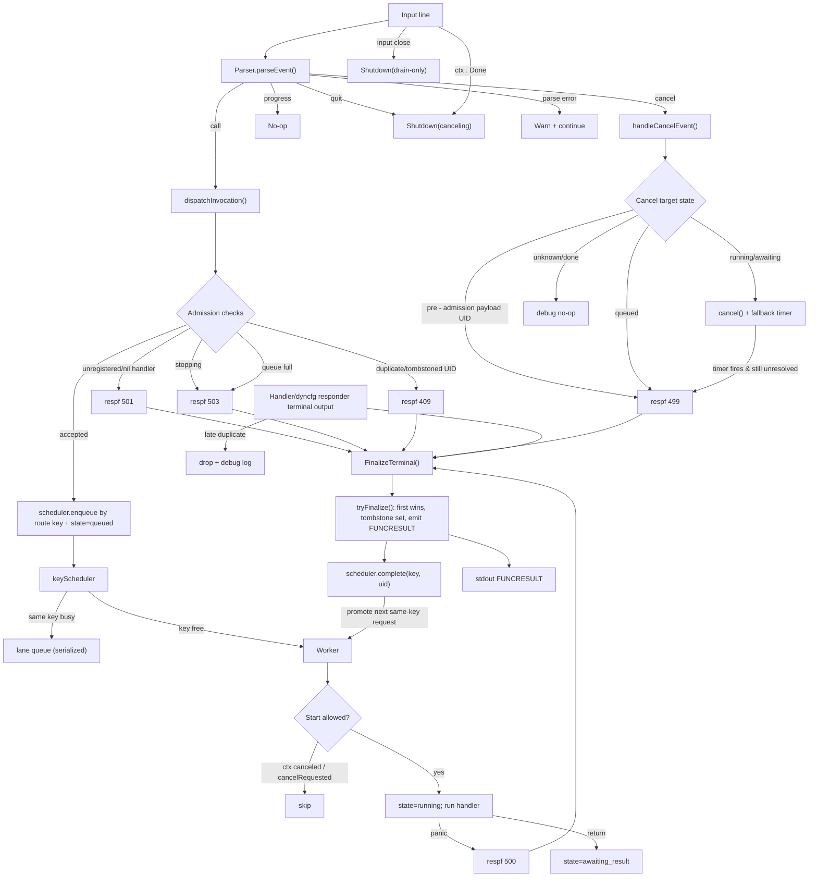

# framework/functions manager

This document describes how the functions manager works **today** (current implementation).

## Scope

- Package: `src/go/plugin/framework/functions`
- Main implementation:
    - `manager.go`
    - `manager_worker.go`
    - `scheduler.go`
    - `parser.go`
    - `finalizer.go`

## Input protocol handled by parser

The parser recognizes these line types:

- `FUNCTION ...`
- `FUNCTION_PAYLOAD ...` + payload body + `FUNCTION_PAYLOAD_END`
- `FUNCTION_CANCEL <transaction_id>`
- `FUNCTION_PROGRESS ...` (recognized/no-op event for manager)
- `QUIT`

Payload-mode control behavior:

- `FUNCTION_CANCEL <same payload uid>`:
    - abort payload frame
    - emit pre-admission cancel event
- `FUNCTION_CANCEL <different uid>`:
    - emit cancel event
    - continue payload accumulation
- `FUNCTION_PROGRESS ...`:
    - emit progress event
    - continue payload accumulation
- Any other `FUNCTION*` control line:
    - abort current payload frame
    - never dispatch partial payload

## Runtime architecture

### Dispatcher

The dispatcher loop:

- reads input lines
- parses events
- handles cancel/quit/progress
- resolves handler + route-aware schedule key
- admits calls into keyed scheduler

Admission checks:

- manager stopping -> reject `503`
- unknown/nil handler -> reject `501`
- duplicate active/tombstoned UID -> reject `409`
- queue full -> reject `503`

### Keyed scheduler + worker pool

- fixed-size worker pool (`defaultWorkerCount = 1`)
- bounded pending budget (`defaultQueueSize = 64`)
- per-key serialization:
    - same schedule key executes sequentially
    - different schedule keys execute concurrently (up to worker count)
- schedule key is route-aware:
    - direct registration: `fn.Name`
    - prefix registration: `fn.Name|<matched-prefix>`
- worker transitions lifecycle:
    - `queued -> running -> awaiting_result`
- worker return is **not** terminal completion
- panic path finalizes terminal `500`

### Tracking and finalization

Active requests are tracked by UID:

- `invState` map (active entries)
- tombstones (`defaultTombstoneTTL = 60s`) to block immediate UID reuse

All terminal outputs go through:

- `FinalizeTerminal(...)` in `finalizer.go`
- hooked during `Run()` to `m.tryFinalize(...)`

`tryFinalize` guarantees:

- first terminal writer wins
- late terminal duplicates are dropped
- fallback timer is stopped on finalization
- UID becomes tombstoned for a short window

## Cancellation semantics

### 1) Queued request

- mark cancel requested
- cancel internal context
- finalize exactly once with `499`
- worker skips execution if it dequeues a canceled request

### 2) Running / awaiting_result request

- mark cancel requested
- call internal cancel func
- start fallback timer (`defaultCancelFallbackDelay = 5s`)
- if no terminal output arrives before timer, manager finalizes with `499`

Important limitation:

- handlers are currently `func(Function)` (no `context.Context` parameter)
- manager cannot force-stop handler code directly
- fallback `499` is the deterministic safety net

### 3) Unknown / already completed request

- no-op
- debug log only

## Shutdown behavior

Two shutdown styles exist:

- canceling shutdown (`ctx.Done()` or `QUIT`):
    - set stopping
    - cancel in-flight
    - stop scheduler admission
    - wait up to `defaultShutdownDrainTimeout = 8s`
    - force-finalize unresolved UIDs with `499`
- drain-only shutdown (input close/EOF):
    - stop scheduler admission
    - drain workers without blanket cancel

## Flow diagram

